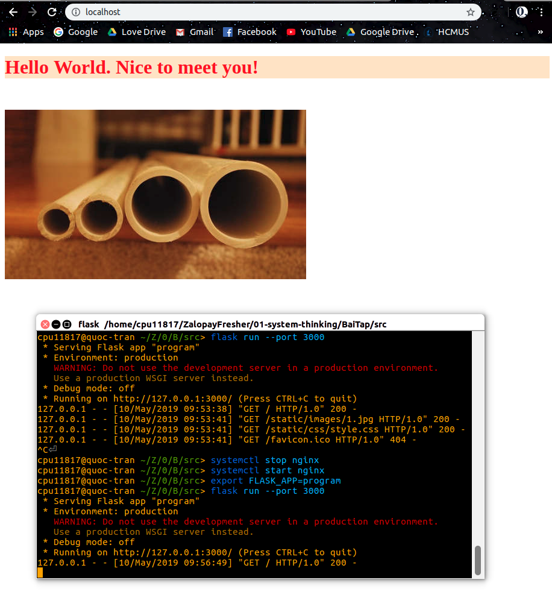
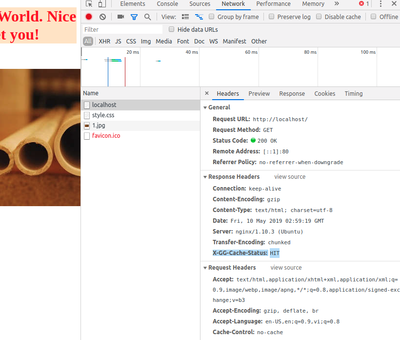
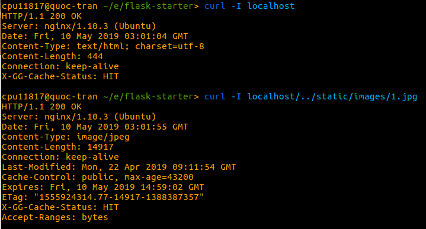

# CACHING (NGINX)

Import thư mục src vào VSCODE.

Mở file config của nginx:
```
sudo gedit /etc/nginx/sites-available/default
```

Sửa config:
```
proxy_cache_path /home/cpu11817/environments/flask-starter/cache
        levels=1:2 keys_zone=my_cache:10m max_size=2g inactive=2h
        use_temp_path=off;

server {
    location / {
        proxy_pass http://quoctk/;
        proxy_cache my_cache;
        proxy_ignore_headers X-Accel-Expires Expires Cache-Control Set-Cookie; 
        proxy_cache_valid any 60m;
        add_header X-GG-Cache-Status $upstream_cache_status;
    }
}
```

Khởi động nginx
```
systemctl start nginx
```

Chỉnh đường dẫn hiện hành (cd) vào trong thư mục src, và chạy chương trình
```
export FLASK_APP=program
flask run --port 3000
```

Mở web và gõ địa chỉ
```
localhost
```

F12 website và bấm "Ctrl+Shift+R" để kiểm tra giá trị header X-GG-Cache-Status hiện tại là gì.

Hoặc gõ lệnh để kiểm tra. 

Nếu nhận được X-GG-Cache-Status là HIT, nghĩa là cache đã được khởi chạy & lưu lại thông tin. MISS là tìm không thấy thông tin trong cache, nếu nhận giá trị MISS thì reload trang & thử lại.
```
Kiểm tra status Cache WEB:
    curl -I localhost

Kiểm tra status Cache IMAGE:
    curl -I localhost/../static/images/1.jpg
```







Để kiểm tra cache, ta tắt terminal (ngưng chạy chương trình), sau đó reload (F5) lại trang localhost. Nếu nội dung được render lên nghĩa là caching thành công.

Kiểm tra status của nginx (nginx đang active hay stop cũng như các thông tin khác ở mục CGroup)
```
systemctl status nginx
```

Dừng nginx:
```
sudo service nginx stop
Hoặc
systemctl stop nginx
```

**Một số lưu ý:**
1. Ứng dụng sử dụng ngôn ngữ python, thư viện flask và nginx, nên bạn cần phải cài đặt các gói tương ứng cho hệ thống của mình (Google có hướng dẫn cách cài đặt)
2. Các thông tin chi tiết về proxy_cache (Công dụng, khái niệm, cách sử dụng) xem [tại đây](https://www.nginx.com/blog/nginx-caching-guide/).
    * Đối với proxy_cache_path:
      * Hãy chọn thư mục mà bạn muốn lưu trữ các nội dung sau khi caching.
      * levels=1:2, nếu không set cái này, nginx sẽ đặt toàn file vào trong một thư mục thay vì chia ra các thư mục khác nhau. Nếu lượng file quá lớn trong cùng 1 thư mục sẽ gây ra việc truy cập chậm.
      * keys_zone=xxx:10m, tạo vùng nhớ cache có tên riêng biệt cũng như thời gian được sử dụng. 1MB có thể lưu khoảng 8,000 keys, nên 10m (= 10MB) có thể lưu 80,000 keys.
      * max-size=2g, kích cỡ tối đa của cache là 2GB, cache "nở" ra đến giới hạn thì *cache manager* sẽ tiến hành xóa file theo LRU. Nếu max-size không được chỉ định là bao nhiêu thì cache cứ "nở" đến hết toàn bộ vùng nhớ trống.
      * inactive=2h, các file trong cache không được truy cập thì sau 2 tiếng, nó sẽ bị xóa.
      * use_temp_path=off, nên tắt để tránh việc sao chép các file không cần thiết ra folder cache khác.
      * add_header X-GG-Cache-Status có tác dụng theo dõi trạng thái cache.
      * proxy_cache: Sử dụng cache dựa trên các thông tin được cấu hình ở proxy_cache_path.
      * proxy_cache_valid any 60m: Điều khiển đối tượng phản hồi trong cache tồn tại trong 60 phút cho bất kì HTTP status code.
      * proxy_ignore_headers: Xem thêm thông tin ở link trên.


