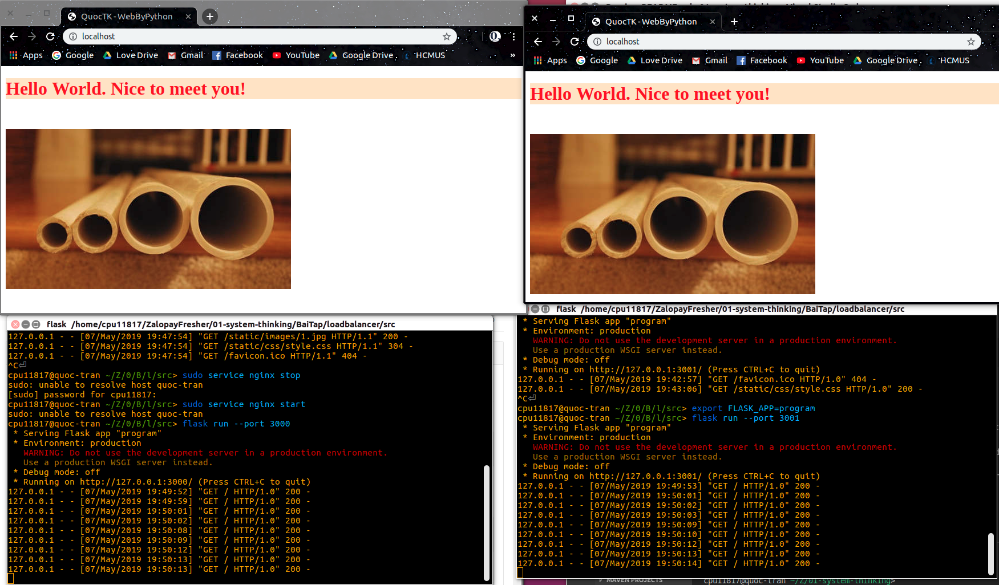

# LOAD BALANCER (NGINX)

Import thư mục src vào VSCODE.

Mở file config của nginx:
```
sudo gedit /etc/nginx/sites-available/default
```

Sửa config:
```
upstream quoctk {
    server localhost:3000;
    server localhost:3001;
    server localhost:3002;
}

server {
    location / {
        proxy_pass http://quoctk/;
    }
}
```

Khởi động nginx (Nhập mật khẩu máy tính của bạn nếu Terminal yêu cầu). Ở đây, mình chọn lệnh đầu tiên để dễ dàng quan sát số port của web được thay đổi trong Terminal khi tải lại (F5) trang.
```
sudo service nginx start
Hoặc
systemctl start nginx
```

Mở 3 terminal rồi cd vào trong thư mục src.

Chạy lần lượt các lệnh bên dưới ở mỗi Terminal để kiểm tra Load balancer của nginx
* Terminal 1 có port 3000
* Terminal 2 có port 3001
* Terminal 3 có port 3002
```
export FLASK_APP=program
flask run --port 3000
```

Mở web và gõ địa chỉ
```
localhost
```

**Giải thích ảnh bên dưới:** Mình mở 2 web có cùng URL là localhost và chạy 2 terminal với số hiệu port lần lượt là 3000 và 3001. Khi mình "F5" ở 1 trang web, web sẽ được Load balancer tùy lúc phân về port 3000 hoặc 3001, terminal đang chạy port tương ứng cũng sẽ hiển thị thông tin để mình quan sát.



Dừng nginx:
```
sudo service nginx stop
Hoặc
systemctl stop nginx
```

Kiểm tra status của nginx (nginx đang active hay stop cũng như các thông tin khác ở mục CGroup)
```
systemctl status nginx
```

**Một số lưu ý:**

1. Ứng dụng sử dụng ngôn ngữ python, thư viện flask và nginx, nên bạn cần phải cài đặt các gói tương ứng cho hệ thống của mình (Google có hướng dẫn cách cài đặt)
2. Số hiệu port ở mỗi Terminal không được trùng nhau.