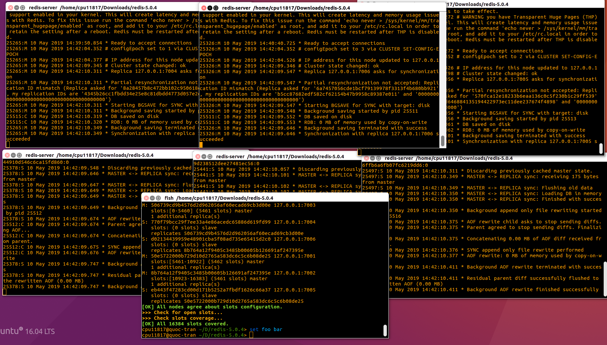

# REDIS - CONFIG CLUSTER REDIS 6 NODES

Cài đặt Redis
```
$ wget http://download.redis.io/releases/redis-5.0.4.tar.gz
$ tar xzf redis-5.0.4.tar.gz
$ cd redis-5.0.4
$ make
```

Kiểm tra version hiện tại của Redis
```
redis-server -v
redis-cli -v
```

Nếu version của Redis server và client chưa phải là 5.0.4 thì cập nhật version
```
sudo mv src/redis-server /usr/local/bin
sudo mv src/redis-cli /usr/local/bin
```

Sao chép thư mục redis-3-nodes vào thư mục redis-5.0.4. Trong thư mục redis-3-nodes chứa 6 thư mục và 6 file nodes.conf, với tên được đặt là số port từ 7001 đến 7006. Đặc biệt, nội dung trong nodes.conf đã được viết sẵn như bên dưới.
```
VÍ DỤ FILE 7001.conf:
    port 7001
    cluster-enabled yes
    cluster-config-file 7001.conf
    cluster-node-timeout 15000
    appendonly yes
```

Mở 6 tab terminal và mỗi terminal sẽ chạy một nodes.conf 
```
redis-server redis-3-nodes/7001/7001.conf
redis-server redis-3-nodes/7002/7002.conf
...
...
redis-server redis-3-nodes/7006/7006.conf
```

Mở một terminal mới (terminal thứ 7) và thực hiện lệnh tạo cluster
```
redis-cli --cluster create 127.0.0.1:7001 127.0.0.1:7002 127.0.0.1:7003 127.0.0.1:7004 127.0.0.1:7005 127.0.0.1:7006 --cluster-replicas 1
```

Sau khi tạo cluster thành công, bạn sẽ nhận thông điệp ***[OK] All 16384 slots covered***


Mở một terminal mới (terminal thứ 8) để test cùng với terminal thứ 7
```
TERMINAL THỨ 7:
    redis-cli -c -p 7001
    set foo bar
    set loop boost

TERMINAL THỨ 8:
    redis-cli -c -p 7002
    get foo
    get loop
```

Để thoát redis-cli, ấn Ctrl+C


<br/><br/><br/>

# REDIS - CHƯƠNG TRÌNH CHAT SỬ DỤNG PUB/SUB

Dịch chuyển đến thư mục create-cluster của redis-5.0.4
```
cd <redis-distribution-path>/utils/create-cluster/
```

Khởi chạy create-cluster với 6 nodes có port lần lượt 30001, 30002, 30003, 30004, 30005 và 30006 theo mặc định.
```
./create-cluster start
```

Mở IntelliJ Idea và import project chat-redis-pubsub theo Maven. Trong quá trình import, chọn bật "Import Maven projects automatically".

Bật Edit Configurations của file Chat.java và chọn "Allow parallel run".

Run file Chat, tạo ít nhất 2 console để thử nghiệm việc chat.

Sau đó:
1. Nhập cùng 1 "channel name" cho các console. 
2. Nhập tên hiển thị của mình để chat cùng mọi người.
3. Tiến hành chat.

Kết thúc console, ngừng chat thì ta cũng phải stop redis.
```
./create-cluster stop
```

**Một số lưu ý:**
1. Dữ liệu chat của mọi người sẽ được lưu lại theo RMapCache và expired trong vòng 1 ngày.
2. Các tin nhắn cũ của các kênh đã được khởi tạo chưa đến thời hạn bị expired thì vẫn hiển thị lại khi user vào kênh chat đó.
3. Source code sử dụng Java, Maven và thư viện Redisson.