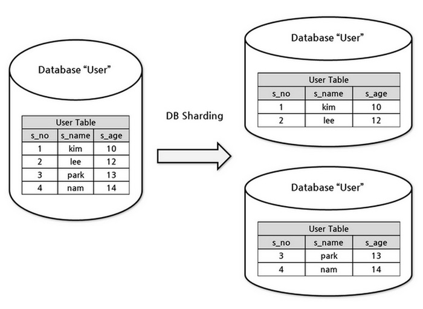
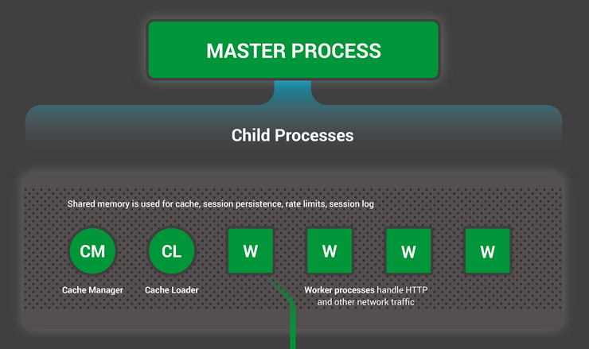
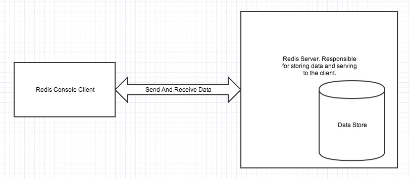
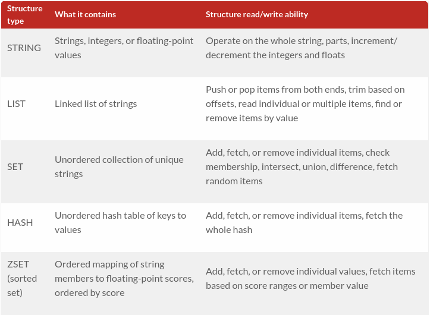

# SYSTEM THINKING

## Người thực hiện

* Họ tên: Trần Kiến Quốc (QuocTk)
* Vị trí: Software Development Fresher

## Mục lục

<ol type="A">
  <a href="A"><li>NỘI DUNG CƠ BẢN</li></a>
  <ul>
    <a href="#1"><li>Định lý CAP và khái niệm eventual consistency</li></a>
      <ol><a href="#1.1">1.1 CAP</a></ol>
      <ol><a href="#1.2">1.2 Eventual consistency</a></ol>
    <a href="#2"><li>Khái niệm throughput và latency</li></a>
      <dd><a href="#2.1">2.1 Throughput</a></dd>
      <dd><a href="#2.2">2.2 Latency</a></dd>
    <a href="#3"><li>Task Queue khác gì Message Queue</li></a>
      <dd><a href="#3.1">3.1 Message Queue</a></dd>
      <dd><a href="#3.2">3.2 Task Queue</a></dd>
    <a href="#4"><li>Các phương pháp để scale database (MySQL)</li></a>
      <dd><a href="#4.1">4.1 Master-Slave Replication</a></dd>
      <dd><a href="#4.2">4.2 Master-Master Replication</a></dd>
      <dd><a href="#4.3">4.3 Federation</a></dd>
      <dd><a href="#4.4">4.4 Sharding</a></dd>
    <a href="#5"><li>Khái niệm về Load balancer và NGINX</li></a>
      <dd><a href="#5.1">5.1 Load balancer</a></dd>
      <dd><a href="#5.2">5.2 NGINX</a></dd>
    <a href="#6"><li>Vai trò của cache, các thuật toán apply cho cache (LRU, LFU)</li></a>
      <dd><a href="#6.1">6.1 Vai trò của cache</a></dd>
      <dd><a href="#6.2">6.2 Các thuật toán dùng cho cache</a></dd>
    <a href="#7"><li>Thông tin cơ bản về Redis</li></a>
      <dd><a href="#7.1">7.1 Khái niệm cơ bản</a></dd>
      <dd><a href="#7.2">7.2 Kiến trúc</a></dd>
      <dd><a href="#7.3">7.3 Cấu trúc lưu trữ thường dùng của Redis</a></dd>
      <dd><a href="#7.4">7.4 Khi nào dùng cấu trúc hyperloglog</a></dd>
  </ul>
  <a href="B"><li>NGUỒN THAM KHẢO</li></a>
</ol>

## Nội dung báo cáo

### 1. Định lý CAP và khái niệm eventual consistency

* **CAP là viết tắt của 3 từ:** Consistency, Availability và Partition Tolerance.
  * **Consistency (Tính nhất quán):** Các sự kiện đọc đều nhận được phiên bản mới nhất của sự kiện ghi gần nhất hoặc lỗi.
  * **Availability (Tính sẵn sàng):** Mọi request đều nhận được response (không nhất thiết phải đảm bảo dữ liệu nhận được là phiên bản mới nhất).
  * **Partition Tolerance (Tính chịu đựng phân mảnh):** Hệ thống vẫn hoạt động khi đường mạng giữa các node bị đứt.
  * **Ví dụ trường hợp có CP nhưng không có A:** Một vài node cuối mạng bị mất kết nối và dữ liệu vẫn phải đảm bảo tính nhất quán, cho nên việc xử lý giữa các node dường như là độc lập nhau, nếu đợi từ node bị phân mảnh thì có thể gây ra timeout error. Ngoài ra, nếu một việc cần hai hoặc nhiều node tham gia cùng xử lý mà vài node trong số đó có vấn đề thì cũng không thể thực hiện được. Chẳng hạn, Website đọc báo đứt kết nối tới CSDL nên những gì người dùng thấy được trên website ngay tại thời điểm đó đều là dữ liệu đã được cache trong RAM.
  * **Ví dụ trường hợp có AP nhưng không có C:** Mạng bị mất và hệ thống vẫn hoạt động, các node vẫn hoạt động thì phải chấp nhận dữ liệu không đồng nhất. Chẳng hạn, có module đơn hàng và module quản lý tài khoản tiền của người dùng. Nếu bị đứt kết nối thì tiền có thể bị trừ mà đơn hàng vẫn chưa được submit thành công. Trong khi đó, các node vẫn hoạt động đều đều và xử lý các nghiệp vụ khác của từng module.

* **Eventual consistency (Nhất quán đến cuối cùng):**
  * **Cách hiểu:** Sau khi một cập nhật được diễn ra, các lần đọc sau đó không đảm bảo sẽ luôn trả về giá trị mới được cập nhật (có thể có lần đọc vẫn trả về dữ liệu cũ). Tuy nhiên sau một khoảng thời gian (đồng bộ giữa các CSDL) thì cuối cùng các lần đọc đều trả về giá trị mới nhất.
  * **Ví dụ:**
    * Mỗi tối thứ 2 Quốc hoàn thành một bài tập và sao chép bài vào USB. Mỗi tối thứ 3 Ngọc qua nhà Quốc lấy USB để sử dụng "ké" kết quả bài tập của Quốc (USB chứa nội dung bài tập mới nhất) và trả USB cho Quốc vào mỗi tối chủ nhật.
    * Vào hôm thứ 5, Quốc mở bài ra kiểm tra lại và thấy bài làm của mình có chỗ sai nên đã sửa lại. Lúc này, nội dung bài tập trong USB của Ngọc đã trở nên "lỗi thời" (thành dữ liệu cũ).
    * Ngọc muốn nhận được nội dung mới (bài tập Q đã cập nhật) lẫn kết quả bài tập tuần kế tiếp thì Ngọc phải trả USB cho Q vào tối chủ nhật. Sau đó, Ngọc phải đợi đến tối thứ 3 tuần tiếp theo để nhận lại USB (USB lần này gồm bài tập Q đã cập nhật và bài tập mới).
  * **Kết luận phương pháp:** Độ trễ để nhận được kết mới nhất cũng không quá cao, kết quả nhận được có thể không phải là mới nhất.

### 2. Khái niệm throughput và latency

* **Throughput (Thông lượng):** Lượng hành động đưa ra (hoặc kết quả nhận được) trong một đơn vị thời gian.

* **Latency (Độ trễ):** Lượng thời gian (chờ) để tạo ra một kết quả nào đó.
* **Ví dụ:**
  * Lượng nước chảy qua các ống có đường kính khác nhau gọi là Thông lượng.
  * Khoảng thời gian cần thiết để lượng nước từ đầu này sang đầu kia hoàn tất gọi là Độ trễ.
   

### 3. Task Queue khác gì Message Queue

* **Message Queue (MQ):** Dùng cơ chế truyền message (message passing) khi nào message tới thì nó nhận, giữ và xử lý.

* **Task Queue (TQ):** Dùng theo cơ chế quản lý Task. Khi có yêu cầu đến thì nó đẩy vào Task Queue nhưng không xử lý liền, mà xác định một thời gian nhằm tạo plan để sắp xếp các task nào cùng nghiệp vụ hoặc có tính chất tuần tự nhau (hoặc giống nhau) rồi mới chạy theo lịch thực thi này. TQ cũng nhận, giữ, xử lý và chuyển đi các kết quả, song song là phù hợp với các công việc đòi hỏi tính toán nặng khó xử lý ngay lập tức.

### 4. Các phương pháp để scale database (MySQL)

* **Master-slave replication:** Server master phục vụ việc đọc và ghi, nhân bản các dữ liệu được ghi ra slave (nơi dữ liệu chỉ đọc) và slave cũng có thể nhân bản ra các slave khác. Nếu master sập, hệ thống sẽ ở trạng thái chỉ đọc cho đến khi một slave nào đó được đưa lên làm master hoặc master được tu sửa.
  * **Ưu:** Master sập thì người dùng vẫn xem được dữ liệu.
  * **Nhược:** Cần cơ chế "khôn khéo" để đưa slave nào lên làm master.

* **Master-master replication:** Có 2 hoặc nhiều master, tất cả đều hỗ trợ đọc ghi, các server là ngang hàng về việc ghi. Nếu một master sập, hệ thống vẫn tiếp tục đọc ghi trên các master khác.
  * **Ưu:** Tất cả đều hỗ trợ đọc và ghi, một master sập thì master khác vẫn hoạt động.
  * **Nhược:**
    * Cần một load balancer để điều phối hoặc cần thay đổi logic để quyết định ghi vào/đọc từ master nào.
    * Nếu thêm master thì độ phức tạp xung đột sẽ tăng lên (Ghi vào đâu, đọc ở đâu, chia như thế nào...)
    * Tính nhất quán giữa các master không cao và việc đồng bộ giữa các master cũng góp phần tăng độ trễ.

* **Federation:** Chia CSDL bằng hàm. Thay vì sử dụng một CSDL đơn (chứa rất nhiều bảng và dữ liệu), thì ta tách nó ra thành các CSDL riêng biệt, như: accounts, orders và products. Nếu như cần đọc ghi gì thì đi đến đúng CSDL đó, giúp giảm tải cho việc chỉ sử dụng một CSDL.
  * **Ưu:**
    * Do chia tách nên các CSDL sẽ nhỏ, ít traffic đọc, ghi.
    * CSDL nhỏ nên tiết kiệm dung lượng bộ nhớ, cải thiện thông lượng cũng như có thể đọc ghi song song.
  * **Nhược:**
    * Các CSDL tách rời nhau nên kết hợp (bảng) lại sẽ phức tạp.
    * Cần cài đặt các logic để xác định việc ghi & đọc ở trên CSDL nào.
    * Nếu một bảng chứa nhiều thuộc tính lẫn chứa dữ liệu quá lớn, lại nằm trên một CSDL nào đó thì phương pháp này trở nên kém hiệu quả khi chính CSDL đó đã trở thành "gánh nặng".

* **Sharding:** Khi kích cỡ của dữ liệu tăng lên, một thiết bị đơn (1 CSDL hay 1 bảng) không thể đủ để lưu giữ dữ liệu. Sharding giải quyết vấn đề này với việc mở rộng phạm vi theo bề ngang (horizontal scaling), nghĩa là lưu giữ các bản ghi dữ liệu qua nhiều thiết bị. Với Sharding, ta bổ sung thêm nhiều thiết bị để hỗ trợ cho việc gia tăng dữ liệu và các yêu cầu của các hoạt động đọc và ghi. Ví dụ, chia nhỏ bảng hoặc CSDL ra thành các phần khác nhau, chúng có cấu trúc dữ liệu & thuộc tính giống nhau nhưng dữ liệu là khác nhau.
  * **Ưu:**
    * Kích cỡ các CSDL gọn nhẹ sau tách, hiệu năng tăng và truy vấn nhanh hơn.
    * Nếu một sharp sập thì vẫn còn sharp khác họat động.
    * Việc đọc và ghi dễ dàng diễn ra song song.
  * **Nhược:**
    * Cần phải có logic để điều phối việc đọc ghi trên sharp nào.
    * Dữ liệu có thể bị "nhồi" ở một sharp nào đó, tức là có sharp sẽ nhận được nhiều request trong khi có sharp "rảnh rỗi".
    * Việc kết hợp các sharp lại với nhau cũng tương đối khó khăn, tốn kém.
     

### 5. Khái niệm về Load balancer và NGINX

* **Load balancer (LB):**
  * **Cách hiểu:** LB có nhiệm vụ phân tán các request đến các tài nguyên tính toán như các server hay CSDL mà chúng đang ổn định và ít "áp lực" hơn so với những server/CSDL còn lại. Về kết quả, LB đều trả về response từ tài nguyên tính toán đã nhận request đến client đã gửi request.
  * **Lợi ích:**
    * Tối đa hóa Uptime: LB giúp dàn trải lưu lượng truy cập và truy xuất giữa 2 hoặc nhiều máy chủ. Trường hợp máy chủ này lỗi thì LB sẽ phát hiện vấn đề và di chuyển lưu lượng truy cập đến các máy chủ online còn lại, nên dịch vụ cho người dùng sẽ không bị gián đoạn.
    * Dễ dàng thêm server/CSDL (Mở rộng hệ thống Datacenter): LB tự động điều phối giữa các máy chủ cũ và mới để tiếp tục xử lý các dịch vụ cũng như giảm tải trọng cho các máy chủ cũ.
    * Tăng cường bảo mật cho hệ thống Datacenter: Vì mọi yêu cầu hay trả lời đều thông qua LB nên ta có thể chặn người dùng giao tiếp trực tiếp với các máy chủ, ẩn đi các thông tin & cấu trúc mạng nội bộ, thậm chí có thể ngăn chặn các cuộc tấn công/truy cập trái phép.
  * **Nhược điểm:**
    * Mọi thứ đều đi qua LB, chỉ cần LB có vấn đề hoặc tài nguyên hoặc cấu hình của nó không tốt thì chẳng khác nào ta đang tự bóp cổ chính mình.
    * LB xử lý nhiều request từ client cũng như response từ máy chủ nên việc xử lý dễ dàng tăng thêm sự phức tạp.
    * Dùng LB đơn lẻ thì không hiện thực. Nếu dùng nhiều LB thì hiệu quả hơn, nhưng sẽ cấu hình phức tạp hơn.
  * **Có nhiều độ đo phổ biến để LB định tuyến traffic, nhưng có thể nói phổ biến nhất là Layer 4 và Layer 7:**
    * **Layer 4:** Chuyển tiếp gói dữ liệu mạng đến và đi từ máy chủ upstream mà không kiểm tra nội dung của các gói dữ liệu. Có thể đưa ra quyết định định tuyến giới hạn bằng cách kiểm tra vài gói đầu tiên trong dòng TCP. Điểm đặc trưng của Layer 4 là xử lý các dữ liệu được tìm thấy trong các giao thức tầng mang và vận chuyển (IP, TCP, FTP, UDP).
    * **Layer 7:** Hoạt động ở các lớp ứng dụng cao cấp, xử lý trực tiếp với nội dung thực tế của mỗi thư. HTTP là giao thức chủ yếu của layer 7 cho việc điều phối lưu lượng truy cập trang web trên Internet. Nó có thể quyết định cân bằng tải dựa trên nội dung của thư (URL, cookie, hoặc message,...). Sau đó tạo mới một kết nối TCP đến máy chủ upstream đã chọn (hoặc tái sử dụng nếu sẵn có bằng phương pháp HTTP keepalives) và tạo ra yêu cầu đến máy chủ.
     

* **NGINX:**
  * **Cách hiểu:** Web server truyền thống tạo một thread cho mỗi yêu cầu (request). Trong khi đó, NGINX lại là một web server mạnh mẽ với cách thức hoạt động khác, cụ thể là sử dụng kiến trúc hướng sự kiện (event-driven), bất đồng bộ (asynchronous) và cho phép mở rộng tới hàng trăm nghìn kết nối đồng thời đến phần cứng/máy chủ. Ngoài ra, NGINX còn cung cấp nhiều tính năng nổi bật như Load balancer, HTTP caching, reverse proxy,...
  * **Kiến trúc:** NGINX có tiến trình cha và các tiến trình con, mà tiến trình con gồm các tiến trình xử lý (worker processes) và các tiến trình trợ giúp (Cache Manager và Cache Loader là 2 thành phần hỗ trợ).
    * **Tiến trình cha Master process:** Có nhiệm vụ là đọc cấu hình, liên kết các cổng với nhau. Sau đó tạo ra tiến trình con để xử lý công việc.
    * **Tiến trình hỗ trợ Cache Loader:** Khi tiến trình con được khởi động thì Cache Loader sẽ chạy để tải "disk-based cache" vào bộ nhớ.
    * **Tiến trình hỗ trợ Cache Manager:** Chạy định kỳ nhằm cắt bớt "entries" ít xài ở "disk cache" để duy trì kích cỡ cache đã được cấu hình.
    * **Tiến trình xử lý Worker Processes:** Làm mọi nhiệm vụ, xử lý mọi thứ, đảm bảo kết nối mạng được duy trì, đọc ghi lên đĩa cũng như giao tiếp với máy chủ. Mặc định thường có là 4 Worker Processes.
     
  * **NGINX dùng đơn luồng:**
    * Khi máy chủ NGINX hoạt động, chỉ các tiến trình xử lý (Worker Process) là bận, mỗi tiến trình xử lý sẽ xử lý nhiều kết nối theo kiểu không chặn (non-blocking) nhằm giảm số lần chuyển đổi ngữ cảnh. Ngoài ra, mỗi tiến trình xử lý là một luồng đơn và chạy độc lập nhau, cứ lấy các kết nối mới & xử lý chúng. Do vậy, điều này giúp hạn chế (hoặc tránh) các vấn đề về blocking hoặc context switching (chuyển đổi ngữ cảnh) mà chúng thường làm cho hệ thống trì trệ.
    * Ngược lại, cách tiếp cận process-per-connect hay thread-per-connection khi không nhận được sự kiện nào để xử lý, chúng sẽ bị block, đợi chờ và dẫn đến lãng phí tài nguyên hệ thống cho việc chuyển đổi ngữ cảnh. Suy ra, tiến trình xử lý (worker process) là luồng đơn, cứ "vào", nó xử lý, phản hồi và làm tiếp cái khác liên tục, không block và hạn chế nhất có thể việc chuyển đổi ngữ cảnh.
    * Giải thích về chuyển đổi ngữ cảnh: Việc điều phối các process sẽ bao gồm, việc ngừng process hiện tại lại, lưu lại trạng thái của process này, lựa chọn process tiếp theo sẽ được chạy, load trạng thái của process tiếp theo đó lên, rồi chạy tiếp process tiếp theo. Qúa trình này được gọi là chuyển đổi ngữ cảnh (context switch). Trong khi đó, có biết bao thứ cần phải được xử lý, mà cứ chuyển đổi ngữ cảnh hoài thì... rất tệ. Bản chất tiến trình xử lý (worker process) sẽ không bao giờ block network traffic hoặc đợi respond từ client cả, cải thiện được tình huống này.

### 6. Vai trò của cache, các thuật toán apply cho cache (LRU, LFU)

* **Vai trò của cache:** Kích thước lưu trữ be bé, thường dùng để lưu trữ những dữ liệu phổ biến được truy xuất nhiều. Từ đó, bộ điều phối sẽ truy cập vào cache đầu tiên để kiểm tra dữ liệu có tồn tại hay không và lấy ra từ nó (Nếu có), chứ không cần phải vào/ra CSDL quá nhiều. Suy ra, cache giúp cải thiện thời gian tải trang, thời gian thực thi, giảm thiểu việc tương tác với CSDL của server và giảm việc mất cân bằng phân phối khi những dữ liệu phổ biến nằm lệch về 1 bên CSDL tại server.

* **Vai trò của các thuật toán apply cho cache:**
  * **LRU (Least recently used):** Lưu nhiều dữ liệu thì cache sẽ không đủ chứa cũng như cồng kềnh, cho nên LRU sẽ loại bỏ các mục ít dùng (nằm cuối cache) và giữ lại các mục thường xuyên được truy xuất gần đây nhất (đầu cache) ở trên RAM.
  * **LFU (Least frequently used):** Mục tiêu tương tự như LRU, nhưng phương pháp thì khác. Mục nào trong cache có SỐ LẦN được truy xuất ít nhất sẽ được xóa đi đầu tiên.
   

### 7. Thông tin cơ bản của Redis

* **Khái niệm cơ bản:** Là hệ thống lưu trữ dữ liệu dưới hình thức key-value ở trong RAM chính. RAM chính có dung lượng không lớn và đắt đỏ nên rất khó để lưu những dữ liệu có kích cỡ lớn. Ngược lại, với những dữ liệu be bé thường được truy cập, sửa đổi và thêm thì tốc độ lúc này lại rất nhanh & hiệu quả.

* **Kiến trúc của Redis:** Là kiến trúc thực thể đơn nên sẽ chứa 2 quy trình chính là "Redis client" (RC) và "Redis Server" (RS). RC và RS có thể nằm trên cùng một máy tính hoặc 2 máy tính khác nhau. RS nhận dữ liệu từ RC, sau đó lưu trữ dữ liệu trên RAM cũng như phục vụ dữ liệu lại cho RC, mà vì lưu trữ trên RAM cho nên những dữ liệu này dễ bị mất mát nếu server hoặc máy tính được khởi động lại. Vì vậy, Redis cung cấp cơ chế RDB, AOF và SAVE Command để lưu trữ lại kho dữ liệu ấy.
 

* **Một vài cấu trúc lưu trữ thường dùng của Redis:** String, Hash, List, Set, Sorted Set và Hyperloglog. Xem thêm tính chất của mỗi cấu trúc [tại đây.](https://redis.io/topics/data-types-intro?fbclid=IwAR28yqWDZfw74DvAJ5ZIRQg2h-fD6SbiqGnv54Jn7F-bfAowx6CMY-Vtv10)
 

* **Khi nào dùng cấu trúc hyperloglog:**
  * HyperLogLog (HLL) dựa trên cấu trúc dữ liệu xác suất được sử dụng để ước lượng lực lượng của một tập hợp (cardinality, hay cách hiểu khác là số phần tử không trùng trong một tập hợp).
  * Ví dụ tập A = {2, 2, 3, 3, 4, 6} có 6 phần tử nhưng số phần tử không trùng hoặc lực lượng của A chỉ bằng 4 mà thôi, gồm {2, 3, 4, 6}; tương tự cho các loại/kiểu dữ liệu khác.
  * Chúng ta có thể sử dụng cấu trúc này để đếm các phần tử unique trong một tập dữ liệu mà chỉ sử dụng một phần nhỏ bộ nhớ. Chẳng hạn, một bài viết có 1 triệu view, ta phải lưu các unique user ID để đánh dấu là các user đó đã xem bài viết đó rồi, mỗi user ID chẳng hạn 8Bytes thì ta sẽ tiêu tốn tầm 8MB để lưu trữ chỉ để đếm lượng xem unique. Trong khi đó, nhờ HLL, ta có thể ước lượng được lượng người xem unique dựa trên xác suất mà tốn ít bộ nhớ lẫn hiệu quả hơn.
  * HLL trong Redis được encode như String. Sử dụng GET để serialize một HLL và SET để deserizlize trở lại.

## Nguồn tham khảo

1. https://github.com/nesso99/system-design-beginner#relational-database-management-system-rdbms
2. https://viblo.asia/p/shard-database-voi-activerecord-turntable-l0rvmx3kGyqA
3. https://kipalog.com/posts/Cau-chuyen-nhung-nha-tham-hiem-va-nguyen-ly-C-A-P-cua-he-phan-tan
4. http://paginaswebpublicidad.com/questions/23227/su-khac-biet-giua-do-tre-bang-thong-va-thong-luong-la-gi
5. https://www.manifold.co/blog/introduction-to-message-queuing-and-rabbitmq-6cb8e6e9b2
6. https://blog.imaginea.com/scale-part-i-task-queues/
7. https://viblo.asia/p/layer-4-vs-layer-7-load-balancing-on-linux-eBYjv40yvxpV
8. https://longvan.net/load-balancing-can-bang-tai-la-gi.html
9. https://dzone.com/articles/inside-nginx-how-we-designed
10. https://www.hostinger.vn/huong-dan/nginx-la-gi-no-hoat-dong-nhu-the-nao/
11. https://kipalog.com/posts/He-dieu-hanh--Process
12. https://tech.vccloud.vn/cache-bo-nho-dem-la-gi-vai-tro-va-phan-loai-cache-20180618111100714.htm
13. http://qnimate.com/overview-of-redis-architecture/#prettyPhoto/1/
14. https://viblo.asia/p/tim-hieu-redis-databace-model-Ljy5Vepolra
15. https://redislabs.com/ebook/part-1-getting-started/chapter-1-getting-to-know-redis/1-2-what-redis-data-structures-look-like/
16. https://viblo.asia/p/redis-co-ban-57rVRq5OR4bP
17. https://viblo.asia/p/tim-hieu-redis-databace-model-Ljy5Vepolra
18. https://en.wikipedia.org/wiki/Cardinality
19. https://en.wikipedia.org/wiki/HyperLogLog
20. https://redislabs.com/redis-best-practices/counting/hyperloglog/
21. https://odino.org/my-favorite-data-structure-hyperloglog/