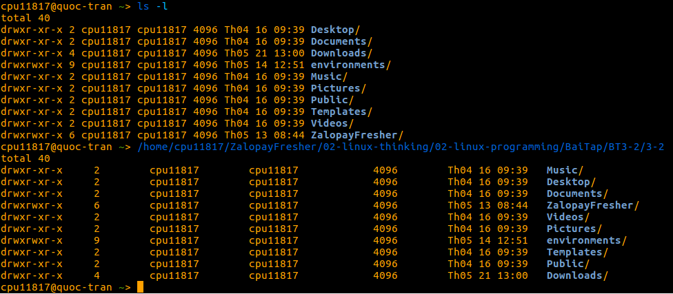
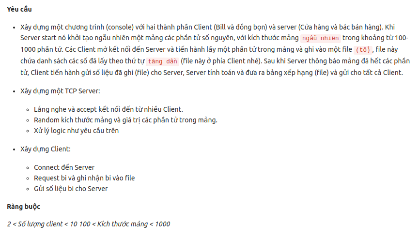

# LINUX PROGRAMMING

## NGƯỜI THỰC HIỆN

* Họ tên: Trần Kiến Quốc (QuocTk)
* Vị trí: Software Development Fresher

<br/>

## BÀI TẬP 3-2

#### 1. MÔ TẢ BÀI TẬP
Viết chương trình C mô phỏng lại lệnh `ls -l` và chạy thử trên Terminal.

#### 2. HƯỚNG DẪN

Tải file `3-2.c` về máy (HĐH Linux) và dịch chuyển (cd) vào trong thư mục chứa file c.

Thực hiện lệnh bên dưới để biên dịch chương trình c
```
gcc -o 3-2 3-2.c
chmod a+x 3-2
```

Sau khi biên dịch, bạn sẽ nhận được file chạy chương trình `3-2`.

Bạn dịch chuyển (cd) đến thư mục bất kì mà bạn muốn test chương trình và sử dụng lệnh bên dưới để chạy chương trình.
```
<Đường dẫn đến thư mục chứa file đã biên dịch>/3-2
```

Ví dụ: **/home/cpu11817/ZalopayFresher/02-linux-thinking/02-linux-programming/BaiTap/BT3-2/**`3-2`


Như vậy, bạn sẽ nhận được kết quả giống như lệnh "ls -l" của hệ thống, có điều cách bố trí và màu sắc của chương trình C sẽ khác tí tẹo so với lệnh hệ thống ^^!



*(Ảnh minh họa demo chương trình)*

***Lưu ý:*** 
* Bạn nhớ kiểm tra máy tính của bạn đã có gcc hay chưa, nếu chưa thì hãy cài đặt nó nhé. 
* Tham khảo cách cài đặt gcc và biên dịch chương trình trên các hệ điều hành (HĐH) khác nhau [Tại đây.](https://www3.ntu.edu.sg/home/ehchua/programming/cpp/gcc_make.html?fbclid=IwAR2rFyspsCxLTxxsgeY2AcsVirWPhE_eXZPUlK_PAbtrQ0bOOmkhlRoOI6o)

<br/><br/>

## BÀI TẬP 3-3

#### 1. MÔ TẢ BÀI TẬP



#### 2. MÔ TẢ Ý TƯỞNG VỀ BÀI TẬP


#### 3. HƯỚNG DẪN

Tải 2 thư mục là `_client` và `_server` về máy (HĐH Linux).

* Biên dịch file client.cpp:
  * Dịch chuyển (cd) vào trong thư mục `_client`.
  * Thực hiện lệnh bên dưới để biên dịch chương trình client.cpp ra file `client`
    ```
    g++ -o client client.cpp -std=c++11 -lpthread
    ```
* Biên dịch file server.cpp:
  * Dịch chuyển (cd) vào trong thư mục `_server`.
  * Thực hiện lệnh bên dưới để biên dịch chương trình server.cpp ra file `server`
    ```
    g++ -o server server.cpp -std=c++11 -lpthread
    ```
* Chú thích:
  * -std=c++11: Biên dịch với phiên bản C++11.
  * -lpthread: Link thư viện pthread vào chương trình bởi Linker. Còn include bên trong file cpp chỉ cho compiler biết là thư viện nào đang cần.

Sau khi biên dịch, bạn sẽ nhận được 2 file chạy chương trình là `client` và `server`.

Mở 4 đến 10 Terminal, trong đó có 1 Terminal làm server, 3 đến 9 Terminal làm Client.

Khởi động server
```
Dịch chuyển (cd) đến thư mục chứa file vừa biên dịch server.cpp
./server
```

Khởi động client
```
Dịch chuyển (cd) đến thư mục chứa file vừa biên dịch client.cpp
./client
```

Phía server, ta phải nhập số client được phép kết nối. 

Phía client, ta phải nhập tên cho mỗi người.

Sau khi các client đã được nhập xong hết tên, trò chơi sẽ được bắt đầu. Sau đó, phía server có kết quả lấy bi của các client cũng như bảng xếp hạng, phía client (mỗi người chơi) sẽ có kết quả lấy bi cũng như bảng xếp hạng cho riêng mình.

Video demo cho 9 client tham gia cùng một lúc:

<video><source alt="Demo-9-Clients" src="./video-demo/video-demo-9-clients.mp4" type="video/mp4"></video>

