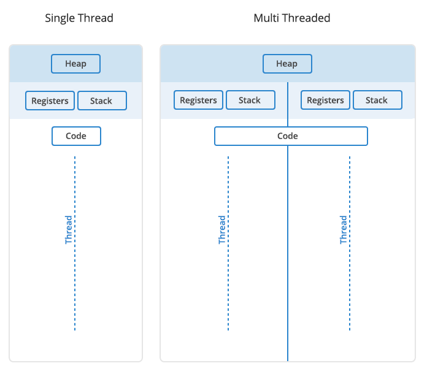

# LINUX PROGRAMMING

## NGƯỜI THỰC HIỆN

* Họ tên: Trần Kiến Quốc (QuocTk)
* Vị trí: Software Development Fresher

## Mục lục

- [File & File System](#A)
  - [File Descriptor](#A1)
  - [Regular File](#A2)
  - [Special File](#A3)
- [Process](#B)
  - [Khái niệm về Process](#B1)
  - [Memory Layout](#B2)
- [Thread](#C)
  - [Khái niệm về Thread](#C1)
  - [Race Condition](#C2)
  - [Deadlock](#C3)
  - [POSIX Thread](#C4)
  - [Multi-Threading](#C5)
  - [Khác biệt giữa Thread và Process](#C6)
- [Synchronization](#D)
  - [Khái niệm Semaphore và so sánh Semaphore với Mutex](#D1)
  - [Vấn đề Reader & Writer](#D2)
- [Networking](#E)
  - [Blocking I/O](#E1)
  - [NonBlocking I/O](#E2)
  - [Socket TCP](#E3)
  - [Socket UDP](#E4)
- [Nguồn tham khảo](#F)

## FILE & FILE SYSTEM

1. **Khái niệm file descriptor:**
   * **Everything is a file** là một trong những triết lý của HĐH Linux, nghĩa là mọi thứ trong hệ thống đều được quy tụ về dạng file, như các thao tác nhập xuất, network socket, library files, file thực thi chương trình, text,... đều là file, và file được hiểu như là một khối thông tin tùy ý hoặc là tài nguyên để lưu trữ thông tin. HĐH Linux có các loại file bên dưới:

        | KÝ HIỆU | LOẠI FILE                   |
        | :-:     | ---                         |
        | -       | File thường (Regular file)  |
        | d       | Đường dẫn (directory)       |
        | c       | Character device file       |
        | b       | Block device file           |
        | s       | Domain socket               |
        | p       | Pipe                        |
        | l       | Symbolic link               |
   * **File descriptor (FD)** 
     * Là một công cụ dùng để quản lý các sự kiện liên quan đến file và chứa các số nguyên dương đại diện cho các file này. 
     * Mỗi một process có một bảng FD riêng do kernel quản lý, kernel sẽ chuyển danh sách này sang ***file table (FT)*** (bất kì process nào cũng có thể truy xuất vào) nhằm xác định chế độ mà file đó đang được sử dụng (Đọc, ghi, chèn). 
     * Sau đó, FT sẽ được mapping qua một bảng thứ 3 là ***inode table (IT)*** để biết đường dẫn,... Bảng này quản lý thật sự các file bên dưới bộ nhớ. 
     * Khi một tiến trình muốn đọc hoặc ghi file, tiến trình này sẽ chuyển request mở file thành công cho kernel xử lý (bằng các lệnh system call) và kernel sẽ truy cập file này thay cho process. Process không thể truy cập trực tiếp các file table hoặc inode table. Kernel trả về một file descriptor trỏ tới đúng entry của file trong file table, mà file table bao gồm các thông tin như inode của file, byte offset và quyền truy cập cho data.
     * Ngoài ra, khi ta mở hoặc tạo một file, kernel sẽ trả về giá trị file descriptor cho process tương ứng. Khi ta đóng file đó lại thì file descriptor này sẽ được giải phóng để cấp phát cho những lần mở file sau.
     * Trên Unix, mặc định 3 file desciptors là STDIN (standard input - 0), STDOUT (standard output - 1) và STDERR (standard error - 2).

        

1. **Khái niệm Regular files:**
   * **RF:** Là loại file được lưu trữ trong hệ thống file và hầu hết các file này được sử dụng trực tiếp bởi chúng ta, chẳng hạn như: .txt, image, exe,... Nếu đọc/ghi dữ liệu từ file thường, kernel sẽ tuân thủ theo quy tắc của hệ thống file mà xử lý, nên đôi khi việc đọc/ghi này có thể bị trì hoãn do các trường hợp đặc-biệt-khác-xen-vào (Chẳng hạn nhường đường cho đọc các file đặc biệt).

2. **Khái niệm Special files:**
   * **SF:** Là loại file được lưu trữ trong hệ thống file và loại này đôi khi được gọi là "device file". Khi ghi dữ liệu vào loại file này, các thao tác dường như diễn ra ngay lập tức mà không tuân theo các quy tắc hệ thống file thông thường. 
   * **Directory:** Là thư mục lưu trữ các file lẫn thư mục con theo kiểu hierarchical (cấp bậc), bắt đầu ở root (/). Và bản chất của thư mục trong Linux chính là file đặc biệt.
   * **Character device file:**
     * Là các device file. Hoạt động bằng cách cung cấp cách giao tiếp với device thông qua truyền dữ liệu.
     * Mỗi lần truyền là một kí tự, sức chứa nhỏ và thực hiện nhiều lần. 
     * Phù hợp khi không biết việc truyền dữ liệu khi nào dừng.
     * Ví dụ: kết nối Internet, ta không biết kích cỡ data stream truyền qua lại là như thế nào.
   * **Block device file:** 
     * Là các device file. Hoạt động bằng cách cung cấp cách giao tiếp với device thông qua truyền dữ liệu.
     * Mỗi lần gửi là một khối kí tự (khối dữ liệu), sức chứa lớn và thực hiện ít lần.
     * Hữu ích khi biết trước kích cỡ của dữ liệu, tiêu biểu là các file trên ổ đĩa.
   * **Socket:** Là các file cho phép các tiến trình khác nhau trên cùng hoặc khác hệ thống giao tiếp với nhau cũng như truyền dữ liệu.
   * **Pipe:** 
     * Là các file có mục đích kết nối đầu ra của file descriptor trên tiến trình này đến đầu vào của tiến trình khác. 
     * Ví dụ: Khi 2 tiến trình được nối với nhau, tiến trình đầu tiên viết, thì những nội dung đó lập tức được đọc vào bởi tiến trình thứ 2.
   * **Symbolic link:** 
     * Là các file chứa tham chiếu đến file khác trên hệ thống. 
     * Để tạo SL, ta sử dụng `ln -s <target_path> <link_path>`.
     * Ví dụ: Tạo file quoc.txt trong thư mục tmp, sau đó gõ "ln -s quoc.txt /home/quoctk/quoc.txt".     

 

## PROCESS

1. **Khái niệm Process trong HĐH:**
   * Là thể hiện của một chương trình đang được thực thi.
   * Một tiến trình cần sử dụng các tài nguyên: CPU, bộ nhớ, tập tin, thiết bị nhập xuất để hoàn tất công việc của nó.
   * Tùy thuộc vào hệ điều hành (HĐH), một tiến trình có thể tạo thành nhiều luồng và thực thi đồng thời các lệnh.
   * Một chương trình có thể có nhiều tiến trình.

        

   * **Chú thích**:
     * New: process mới được tạo.
     * Running: process đang được thực thi.
     * Waiting: process đợi I/O hoặc tín hiệu nào đó.
     * Ready: process sẵn sàng được CPU chạy.
     * Terminated: process hoàn thành việc/kết thúc.

1. **Memory Layout:**
   * **Stack:** 
     * Là một cơ chế tổ chức dữ liệu và là bùng nhớ được các tiến trình sử dụng để lưu trữ các biến cục bộ của hàm và các thông tin khác (các biến truyền đi, địa chỉ nơi hàm được gọi, thanh ghi được sử dụng,...). Các giá trị được thêm vào stack theo nguyên tắc LIFO. Thanh nhớ stack pointer sẽ ghi nhớ lại đỉnh của stack mổi khi có giá trị thêm vào.
     * Ưu nhược điểm của Stack: 
       * Việc cấp phát bộ nhớ trên Stack khá nhanh.
       * Nhìn vào mã nguồn chương trình, chúng ta có thể biết được thời điểm cấp phát và hủy vùng nhớ của biến trên Stack.
       * Kích thước vùng nhớ cấp phát trên phân vùng Stack phải được khai báo rõ ràng trước khi biên dịch.
       * Vùng nhớ trên phân vùng Stack có thể được truy cập trực tiếp thông qua định danh.
       * Kích thước của phân vùng Stack khá hạn chế.
   * **Heap:** 
     * Vùng nhớ được sử dụng cho các hành động cấp phát động (Dynamic memory allocation: new, malloc, free,..), là vùng "mở" cho mọi tiến trình có thể truy xuất vào. Đã đăng kí ô nhớ ở heap thì cần phải xóa nó khi kết thúc công việc (Ví dụ: khởi tạo con trỏ thì phải xóa con trỏ).
     * Ưu nhược điểm của Heap:
       * Việc cấp phát bộ nhớ trên Heap chậm hơn các phân vùng khác.
       * Vùng nhớ đã được cấp phát sẽ vẫn thuộc quyền kiểm soát của chương trình đang chạy cho đến khi chúng được giải phóng, hoặc nhận được tín hiệu kết thúc chương trình.
       * Vùng nhớ được cấp phát phải được quản lý bởi ít nhất 1 con trỏ.
       * Toán tử dereference truy xuất đến vùng nhớ chậm hơn các biến thông thường.
       * Phân vùng Heap có dung lượng lớn nhất, nên chúng ta có thể sử dụng một cách thoải mái hơn các phân vùng khác.
   * **Data Segment:** Nơi lưu trữ tất cả các biến global, static hoặc extern được khởi tạo.
   * **Text/Code Segment:** Vùng nhớ chứa các lệnh máy mà CPU sẽ đọc để thực thi. Code segment chỉ chịu sự chi phối của hệ điều hành, các tác nhân khác không thể can thiệp trực tiếp đến phân vùng này. Việc đưa các mã lệnh đã được biên dịch của chương trình lên phân vùng code segment là công việc đầu tiên mà hệ điều hành cần làm khi chúng ta chạy chương trình.

 

## THREAD

1. **Khái niệm Thread:** Là luồng thực thi công việc trong một tiến trình. Một tiến trình có thể có nhiều luồng thực thi. Ngoài ra, một luồng sẽ duy trì một danh sách thông tin liên quan đến việc thực thi của nó bao gồm lịch chạy, trình xử lý ngoại lệ, các thanh ghi CPU, trạng thái stack trong không gian địa chỉ của tiến trình đang nắm giữ.

2. **Race Condition:**
   * **Khái niệm:** Nhiều tiến trình truy xuất đồng thời một tài nguyên mang bản chất không chia sẻ được, dẫn đến vấn đề tranh đoạt điều khiển (Race Condition).

        

   * **Critical Section (Miền găng):** Là đoạn chương trình có khả năng gây ra hiện tượng Race Condition.

   * **Phương pháp ngăn chặn Race Condition:**
     * Giải pháp tạm thời: Từ hình trên, ta có thể sử dụng 2 biến khác nhau (hits01, hits02), nói chung là *xây cầu nhiều làn đường* để tránh va chạm. Tuy nhiên, phương pháp này sẽ làm tốn kém tài nguyên của hệ thống, dẫn đến không đúng cho mọi trường hợp.
     * Giải pháp tổng quát: Bảo đảm tính `atomicity (nguyên tử)` cho phép tiến trình hoàn tất trọn vẹn quá trình truy xuất tài nguyên chung, trước khi có tiến trình khác can thiệp. Có thể sử dụng Sleep and Wakeup (Semaphore, Mutext,...).

3. **Deadlock:**
   * **Khái niệm:** Là trạng thái xảy ra trong môi trường đa nhiệm (mutithreading) khi hai hoặc nhiều tiến trình đi vào vòng lặp chờ tài nguyên mãi mãi.
   * **Ví dụ:** Luồng 1 và luồng 2 muốn có tài nguyên A và B. Luồng 1 chiếm tài nguyên A, luồng 2 chiếm tài nguyên B. Luồng 1 đợi tài nguyên B được giải phóng trong khi luồng 2 đợi tài nguyên A được giải phóng. Suy ra, cả 2 luồng đều đợi chờ tài nguyên vô tận.
   * **Phương pháp ngăn chặn Deadlock:** Đảm bảo ít nhất 1 trong 4 điều kiện bên dưới không được phép xảy ra.
     * **Mutual Exclusion (ngăn cản lẫn nhau):** Các file phải được phép chia sẻ để các tiến trình không cần phải chờ truy xuất, chẳng hạn như các file chỉ đọc, tiến trình nào cũng có thể vào đọc.
     * **Hold and Wait (giữ và đợi cấp thêm tài nguyên):** Mỗi khi một tiến trình yêu cầu một tài nguyên nào đó thì bản thân nó không được giữ bất kỳ tài nguyên nào khác.
     * **No Preemption (không có ưu tiên):**
       * Nếu một tiến trình đang giữ một số tài nguyên và yêu cầu tài nguyên khác mà không thể được phân phối ngay lập tức cho nó thì tất cả các tài nguyên nó đang giữ sẽ được giải phóng.
       * Các tài nguyên đang được tiến trình khác cầm giữ sẽ được ưu tiên thêm vào danh sách tài nguyên dành cho tiến trình đang chờ đợi.
       * Tiến trình sẽ được khởi động lại chỉ khi nó có thể lấy lại các tài nguyên cũ của nó cũng như các tài nguyên mới mà nó đang yêu cầu.
     * **Circular Wait (Chờ đợi vòng tròn):** 
       * Áp dụng một thứ tự tuyệt đối cho tất cả các loại tài nguyên, nghĩa là mỗi loại tài nguyên được gắn một số nguyên. Sau đó yêu cầu các tiến trình chỉ nhận tài nguyên theo thứ tự tăng (hoặc giảm) một cách nghiêm ngặt.
       * Cách hiểu khác nếu đề cập về nhận tài nguyên theo thứ tự giảm: Tiến trình muốn có tài nguyên j, tiến trình phải giải phóng tất cả các tài nguyên có trọng số i >= j (nếu có).
       * Một thách thức lớn trong phương pháp này là xác định thứ tự tương đối của các tài nguyên khác nhau.

4. **POSIX Thread:**
   * **Khái niệm:** 
     * Thường được gọi là `pthreads`.
     * Được định nghĩa là một mô hình thực thi tồn tại độc lập (song song) với ngôn ngữ lập trình, và cũng có thể hiểu POSIX miêu tả các API (tức là các tên hàm và chức năng của chúng). Hơn hết, nó được triển khai trong file header dưới dòng lệnh `#include <pthread.h>`.
     * *pthread* cho phép một chương trình kiểm soát nhiều luồng công việc khác nhau song song. Việc tạo và quản lý các luồng công việc đạt được bằng cách gọi các API của nó.
   * **Các API trong POSIX:**
     * Thread management: Là các hàm sử dụng để tạo, hủy, detached, join thread cũng như set/get các thuộc tính của thread.
     * Mutexes: Là các hàm sử dụng để tạo, hủy, unlocking, locking mutex (“mutual exclusion” : vùng tranh chấp), cũng như set/get các thuộc tính của mutex.
     * Condition variables: Là các hàm để tạo, hủy, đợi hoặc phát tín hiệu dựa trên giá trị của một biến cụ thể.
     * Synchronization: Là các hàm dùng để quản lý việc read/write lock và barriers.
   * **Chi tiết các API cho việc lập trình:** [Xem thêm tại đây](http://www.cs.wm.edu/wmpthreads.html)

5. **Multi-Threading:**
   * **Khái niệm:**
     * Chia một tiến trình thành nhiều luồng thực thi công việc. Các luồng ấy sẽ hoạt động một cách độc lập nhưng lại sử dụng cùng tài nguyên hệ thống.
     * Ví dụ: MS Word sử dụng nhiều luồng, luồng này để định dạng văn bản, luồng kia xử lý các dữ liệu đầu vào,...

        

   * **Khó khăn:**
     * Quản lý & code đa luồng phức tạp, đòi hỏi sự hiểu biết & tay nghề cao.
     * Khó xử lý đồng thời các luồng trong tiến trình.
     * Xác định lỗi để sửa lỗi không hề dễ dàng khi có nhiều luồng.
     * Kết quả khó đoán khi nhiều luồng chạy cùng lúc, có thể chênh nhau về thứ tự chạy.
     * Lock sẽ giảm hiệu năng xử lý khi phải chờ đợi.

   * **Các vấn đề thường gặp:**
     * Deadlock: Được giải thích ở trên.
     * Race Condition: Được giải thích ở trên.
     * Starvation: Được gây ra bởi *thread scheduler*, một vài luồng sẽ không được chạy và hoàn thành khi gặp phải nhiều luồng có độ ưu tiên cao, do đó nó sẽ bị "đói" CPU, tài nguyên cũng như "đứng yên tại chỗ".
     * Data race: Giả dụ một biến đã được bảo vệ nhằm tránh Race Condition và có nhiều luồng muốn vào thay đổi giá trị của biến đó. Thế nhưng, *thread scheduler* có thể lập lịch chạy cho bất kỳ luồng nên suy ra, ta không biết giá trị cuối cùng của biến là bao nhiêu.

6. **Khác biệt giữa Thread và Process:**
   * Giữa Thread và Process có khái niệm khác nhau và cách sử dụng có thể nói là cũng khác nhau. Vậy chúng khác nhau những gì? Hãy xem hình bên dưới nhé
  
     

 

## SYNCHRONIZATION

1. **Khái niệm Semaphore và so sánh Semaphore với Mutex:**
   * **Khái niệm Semaphore:**
     * Semaphore thuộc nhóm giải pháp `Sleep & Wakeup`, nghĩa là cần sự hỗ trợ về Sleep & Wakeup từ HĐH.
     * Semaphore là một kiểu dữ liệu trừu tượng (hoặc cơ chế báo hiệu) có nhiệm vụ hạn chế việc truy cập cùng một lúc đến miền găng.
     * Semaphore được khởi tạo bằng cách khai báo *Semaphore s* (Một giá trị nguyên dương) và được thao tác bởi 2 hoạt động chính: Down(s) (Wait) và Up(s) (Signal).
       * Down(s): Giảm giá trị của semaphore s đi 1 đơn vị nếu nó >= 0 và nếu giá trị trở nên âm thì tiến trình đó sẽ ngưng hoạt động.
       * Up(s): Tăng giá trị của semaphore s lên 1 đơn vị. Sau đó, hệ thống sẽ chọn một trong các tiến trình bị khóa để tiếp tục thực thi.
     * Thông thường, giá trị Semaphore được khởi tạo bằng số tài nguyên cần được cài đặt điều khiển (Ví dụ: Semaphore s=3).

          

   * **So sánh Semaphore với Mutex:**
     * Mutex có mục đích đồng bộ hóa quyền truy cập vào tài nguyên, nên Mutex là một cơ chế khóa nhằm đảm bảo chỉ một luồng có thể vào được miền găng cũng như có được Mutex tại một thời điểm nhất định. Khi thoát khỏi miền găng, luồng sẽ nhả Mutex.
     * Một Semaphore nhị phân có thể được sử dụng như một Mutex nhưng Mutex không bao giờ có thể được sử dụng như một Semaphore.
     * Ở Semaphore, một luồng đang chờ có thể được báo hiệu bởi một luồng khác. Còn ở Mutex, luồng đã gọi hàm khóa cũng là luồng gọi hàm mở khóa.
     * Giải thích thêm về Semaphore nhị phân: Là semaphore có giá trị bị giới hạn ở 0 và 1 (Semaphore s=1), dùng khi chỉ có một tài nguyên cần bảo vệ.

2. **Reader Writer Problem:**
   * **Mô tả, các tình huống và yêu cầu cần phải thỏa mãn của vấn đề Reader Writer:** Reader Writer Problem liên quan đến việc có những tiến trình chỉ muốn đọc và có những tiến trình chỉ muốn ghi trên một đối tượng được chia sẻ. Để chi tiết hơn, hãy xem qua nội dung hình bên dưới:
  
          

   * **Vấn đề khác:** Khi W này kết thúc cập nhật dữ liệu thì một W khác lại nhảy vào cập nhật, lúc này R có thể starvation, nghĩa là đứng đợi rất lâu, thậm chí là vô hạn nếu có nhiều W được ưu tiên. Ngược lại, các R lần lượt được ưu tiên vào ra nên W có thể bị starvation. 
   * **Kết luận:** Một đối tượng đang được Writer này sử dụng thì tất cả Writer, Reader còn lại không được nhảy vào cho đến khi Writer này xong. Và một đối tượng có thể có nhiều Reader đọc cùng một lúc. Ngoài ra, cần sử dụng Semaphore để kiểm tra truy xuất CSDL của Reader và Writer một cách cẩn trọng, sao cho việc Reader hay Writer nào không được rơi vào tình huống starvation.
   * **Link giải pháp tham khảo (Có chú thích tiếng Anh):** [Tại đây](http://denninginstitute.com/modules/ipc/orange/readsem.html)
   * **Chú thích các từ viết tắt:**
     * ME: Mutual Exclusion (Mutex)
     * R: Lượt đọc
     * Rs: Nhiều lượt đọc
     * W: Lượt ghi
     * Ws: Nhiều lượt ghi
     * CSDL (Database): Cơ sở dữ liệu

 

## NETWORKING

1. **Blocking I/O:**
   * Có thể hiểu là thao tác này được diễn ra khi và chỉ khi thao tác trước đó đã hoàn thành, nghĩa là việc xử lý các dữ liệu đầu vào/đầu ra phải hoàn tất hoặc xảy ra ngoại lệ thì mới tiếp tục xử lý cái khác. Nói cách khác, các dòng lệnh được thực hiện tuần tự, như `Synchonous`.
   * Nếu cần dữ liệu được an toàn, đồng nhất, không bị lỗi thì đây là một phương pháp khá ổn, nhưng sẽ làm hệ thống trì trệ vì phải đợi chờ nhau.
   * **Ví dụ:** Xếp hàng (hàng đợi) mua đồ trong siêu thị.

2. **NonBlocking I/O:**
   * Có thể hiểu là thao tác này diễn ra mà không phụ thuộc hoàn toàn vào thao tác trước, nghĩa là hệ thống thực hiện các thao tác nhập xuất một cách độc lập với những thao tác/hoạt động khác mà các thao tác/hoạt động khác không cần phải rơi vào trạng thái chờ, giúp hệ thống giảm đi sự trì trệ đợi chờ, như `Asynchonous`.
   * **Ví dụ:** HĐH Windows cho phép chạy nhiều chương trình cùng một lúc, cũng như thực hiện nhiều thao tác copy và xóa cho dù thao tác trước đó vẫn chưa hoàn thành.

      

3. **Socket TCP:**
   * Các ứng dụng trên các máy chủ được nối mạng có thể tạo các "kết nối" với nhau, mà qua đó chúng có thể trao đổi dữ liệu hoặc các gói tin.
   * Đảm bảo chuyển dữ liệu tới nơi nhận một cách đáng tin cậy và đúng thứ tự.
   * Phân biệt dữ liệu giữa nhiều ứng dụng. Chẳng hạn, dịch vụ Web và dịch vụ thư điện tử đồng thời chạy trên cùng một máy chủ.

      

4. **Socket UDP:**
   * Chương trình trên mạng máy tính có thể gửi những dữ liệu ngắn được gọi là datagram tới máy khác.
   * UDP không cung cấp sự tin cậy và thứ tự truyền nhận mà TCP làm. Dẫn đến việc các gói dữ liệu có thể đến không đúng thứ tự hoặc bị mất mà không có thông báo.
   * UDP nhanh và hiệu quả hơn đối với các mục tiêu như kích thước nhỏ và yêu cầu khắt khe về thời gian. Chẳng hạn các video livestream, cần phải nhanh & tức thời, sẵn sàng chịu mất vài gói tin.

      

 

## NGUỒN THAM KHẢO

1. <https://cloudcraft.info/huong-dan-cau-hinh-max-file-descriptor/>
2. <https://vimentor.com/vi/lesson/gioi-thieu-ve-file-i-o>
3. <https://www.computerhope.com/jargon/r/regular-file.htm>
4. <https://www.computerhope.com/jargon/s/special-file.htm>
5. <https://forum.gocit.vn/threads/tim-hiu-v-dev-null.424/>
6. <https://stream-hub.com/process-la-gi>
7. <https://techtalk.vn/nodejs-hieu-asynchronous-event-driven-nonblocking-io.html>
8. <https://www.thegeekstuff.com/2012/03/linux-processes-memory-layout/>
9. Slide bài giảng của thầy Phạm Viết Sơn - Giảng viên môn học Hệ Điều Hành, khoa CNTT, ĐH KHTN HCM.
10. <https://www.tutorialspoint.com/mutex-vs-semaphore>
11. <https://study.com/academy/lesson/threads-in-an-operating-systems-definition-examples.html>
12. <https://www.tutorialspoint.com/major-issues-with-multi-threaded-programs>
13. <https://www.quora.com/What-are-the-major-issues-encountered-in-Multithreaded-Programming>
14. <https://www.backblaze.com/blog/whats-the-diff-programs-processes-and-threads/>
15. <http://hedieuhanh.forumvi.com/t4498-topic>
16. <https://www.cs.uic.edu/~jbell/CourseNotes/OperatingSystems/7_Deadlocks.html>
17. <https://computing.llnl.gov/tutorials/pthreads/>
18. <https://unix.stackexchange.com/questions/60034/what-are-character-special-and-block-special-files-in-a-unix-system>
19. <https://cpp.daynhauhoc.com/8/10-phan-loai-cac-vung-nho-stack-va-heap/>
20. <https://giai-ma.blogspot.com/2016/04/so-sanh-2-giao-thuc-tcp-va-udp.html>