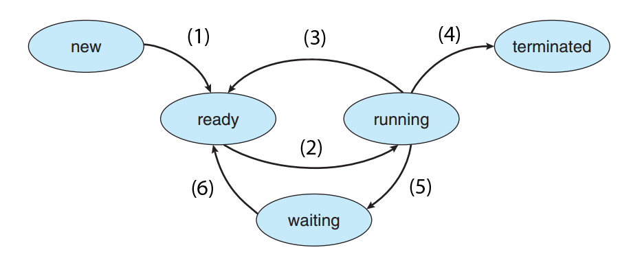

# LINUX SYSTEM PROGRAMMING

## NGƯỜI THỰC HIỆN

* Họ tên: Trần Kiến Quốc (QuocTk)
* Vị trí: Software Development Fresher

## FILE & FILE SYSTEM

1. **Khái niệm file descriptor:**
   * **Everything is a file** là một trong những triết lý của HĐH Linux, nghĩa là mọi thứ trong hệ thống đều được quy tụ về dạng file, như các thao tác nhập xuất, network socket, library files, file thực thi chương trình, .txt,... đều là file, và file được hiểu như là một khối thông tin tùy ý hoặc là tài nguyên để lưu trữ thông tin. HĐH Linux có các loại file bên dưới:

        | KÝ HIỆU | LOẠI FILE                   |
        | :-:     | ---                         |
        | -       | File thường (Regular file)  |
        | d       | Đường dẫn (directory)       |
        | c       | Character device file       |
        | b       | Block device file           |
        | s       | Domain socket               |
        | p       | Pipe                        |
        | l       | Symbolic link               |
   * **File descriptor (FD)** là một công cụ dùng để quản lý các sự kiện liên quan đến file và chứa các số nguyên dương đại diện cho các file này. Mỗi một process có một bảng FD riêng do kernel quản lý, kernel sẽ chuyển danh sách này sang ***file table (FT)*** (bất kì process nào cũng có thể truy vào) nhằm xác định chế độ mà file đó đang được sử dụng (Đọc, ghi, chèn). Sau đó, FT sẽ được mapping qua một bảng thứ 3 là ***inode table (IT)*** , bảng này quản lý thật sự các file bên dưới bộ nhớ. Khi một tiến trình muốn đọc hoặc ghi file, tiến trình này sẽ chuyển file descriptor cho kernel xử lý (bằng các lệnh system call) và kernel sẽ truy cập file này thay cho process. Process không thể truy cập trực tiếp các file hoặc inode table. Ngoài ra, khi ta mở hoặc tạo một file, kernel sẽ trả về giá trị file descriptor cho process tương ứng. Khi ta đóng file đó lại thì file descriptor này sẽ được giải phóng để cấp phát cho những lần mở file sau.

        

2. **Khái niệm Regular files:**
   * **RF:** Là loại file được lưu trữ trong hệ thống file và hầu hết các file này được sử dụng trực tiếp bởi chúng ta, chẳng hạn như: .txt, image, exe,... Nếu đọc/ghi dữ liệu từ file thường, kernel sẽ tuân thủ theo quy tắc của hệ thống file mà xử lý, nên đôi khi việc đọc/ghi này có thể bị trì hoãn do các trường hợp đặc-biệt-khác-xen-vào.

3. **Khái niệm Special files:**
   * **SF:** Là loại file được lưu trữ trong hệ thống file và loại này đôi khi được gọi là "device file". Khi ghi dữ liệu vào file này, các thao tác dường như diễn ra ngay lập tức mà không tuân theo các quy tắc hệ thống file thông thường. Các file này thể hiện giao diện (interface) của các thiết bị driver (trình điều khiển thiết bị) trong hệ thống file như thể đó là file thông thường.
   * Ví dụ như `/dev/null`, đây không phải là file thông thường mà nó là interface. Ta có thể thực hiện nhiều thao tác trên các file kiểu như vậy. File đặc biệt này như một "lỗ đen" của máy tính, thu nhận mọi thứ ta gửi đến nhưng không gửi trả cái gì, ứng dụng rộng rãi cũng như bảo mật (Các gói tin "sai trái" thì firewall có thể chuyển vào đây).
   * Trong Linux có 2 loại SF là "block special files" và "character special files". 
     * Block special files: Bất kì thiết bị nào cũng thể hiện dữ liệu I/O ở đơn vị là *block*.2
     * Character special files:2 Bất kì thiết bị nào cũng thế hiện dữ liệu I/O ở đơn vị là *kí tự* (1 byte mỗi lần).

  

## PROCESS

1. **Khái niệm Process trong HĐH:**
   * Là thể hiện của một chương trình đang được thực thi.
   * Một tiến trình cần sử dụng các tài nguyên: CPU, bộ nhớ, tập tin, thiết bị nhập xuất để hoàn tất công việc của nó.
   * Tùy thuộc vào hệ điều hành (HĐH), một tiến trình có thể được tạo thành từ nhiều luồng và thực thi đồng thời các lệnh.

   
   * CHÚ THÍCH:
        * New: process mới được tạo.
        * Running: process đang được thực thi.
        * Waiting: process đợi I/O hoặc tín hiệu nào đó.
        * Ready: process sẵn sàng được CPU chạy.
        * Terminated: process hoàn thành việc/kết thúc.

2. **Memory Layout:**
   * **Stack:** Vùng nhớ được các tiến trình sử dụng để lưu trữ các biến cục bộ của hàm và các thông tin khác (địa chỉ nơi hàm được gọi, thanh ghi được sử dụng,...).
   * **Heap:** Vùng nhớ được sử dụng cho các hành động cấp phát động, là vùng "mở" cho mọi tiến trình có thể truy xuất vào. Đã đăng kí ô nhớ ở heap thì cần phải xóa nó khi kết thúc công việc (Ví dụ: khởi tạo con trỏ thì phải xóa con trỏ).
   * **Data Segment:** Nơi lưu trữ tất cả các biến toàn cục được khởi tạo.
   * **Text Segment:** Vùng nhớ chứa các lệnh máy mà CPU sẽ đọc để thực thi.

  

## THREAD

1. **Khái niệm:**
   * **Thread:**
   * **POSIX Thread:**
   * **Các API trong POSIX:**
   * **Race condition:** Nhiều tiến trình truy xuất đồng thời một tài nguyên mang bản chất không chia sẻ được, dẫn đến vấn đề tranh đoạt điều khiển (Race Condition).
   
   * **Deadlock:**
   * **Phương pháp ngăn chặn Race Condition:**
        * Giải pháp tạm thời: Như hình trên, ta có thể sử dụng 2 biến khác nhau (hits01, hits02), nói chung là *xây cầu nhiều làn đường* để tránh va chạm. Tuy nhiên, phương pháp này sẽ làm tốn kém tài nguyên của hệ thống, dẫn đến không đúng cho mọi trường hợp.
        * Giải pháp tổng quát: Bảo đảm tính `atomicity (nguyên tử)` cho phép tiến trình hoàn tất trọn vẹn quá trình truy xuất tài nguyên chung, trước khi có tiến trình khác can thiệp.
   * **Phương pháp ngăn chặn Deadlock:**

2. **Multi-Threading:**
   * **Khái niệm:**
   * **Các vấn đề thường gặp:**

  

## SYNCHRONIZATION

1. **Khái niệm Semaphore và so sánh Semaphore với Mutex:**
   * **Khái niệm Semaphore:** 
        * Critical Section (Miền găng) - Là đoạn chương trình có khả năng gây ra hiện tượng Race Condition.
        * Semaphore thuộc nhóm giải pháp `Sleep & Wakeup` - Là một cấu trúc dữ liệu có nhiệm vụ hạn chế việc truy cập cùng một lúc đến miền găng. Semaphore có 1 biến (Semaphore s) và được thao tác bởi 2 hoạt động chính: Down(s) và Up(s).
        
   * **So sánh Semaphore với Mutex:**

#Link drive của thầy Sơn: https://drive.google.com/drive/u/0/folders/1r2_LJG9SFKM6zKm-7YsQpPkFUC3IzVzW

2. **Reader Writer Program:**
   * aaa

  

## NETWORKING

1. **Blocking I/O:**
   * Có thể hiểu là thao tác này được diễn ra khi và chỉ khi thao tác trước đó đã hoàn thành, nghĩa là việc xử lý các dữ liệu đầu vào/đầu ra phải hoàn tất hoặc xảy ra ngoại lệ thì mới tiếp tục xử lý cái khác.
   * Nếu cần dữ liệu được an toàn, đồng nhất, không bị lỗi thì đây là một phương pháp khá ổn, nhưng sẽ làm hệ thống trì trệ.
   * Ví dụ: Xếp hàng (hàng đợi) mua đồ trong siêu thị.

2. **NonBlocking I/O:**
   * Có thể hiểu là thao tác này diễn ra mà không phụ thuộc hoàn toàn vào thao tác trước, nghĩa là hệ thống thực hiện các thao tác nhập xuất một cách độc lập với những thao tác/hoạt động khác mà các thao tác/hoạt động khác không cần phải rơi vào trạng thái chờ, giúp hệ thống giảm đi sự trì trệ đợi chờ.
   * Ví dụ: HĐH Windows cho phép chạy nhiều chương trình cùng một lúc, cũng như thực hiện nhiều thao tác copy và xóa cho dù thao tác trước đó vẫn chưa hoàn thành.

  

## NGUỒN THAM KHẢO

1. <https://cloudcraft.info/huong-dan-cau-hinh-max-file-descriptor/>
2. <https://vimentor.com/vi/lesson/gioi-thieu-ve-file-i-o>
3. <https://www.computerhope.com/jargon/r/regular-file.htm>
4. <https://www.computerhope.com/jargon/s/special-file.htm>
5. <https://forum.gocit.vn/threads/tim-hiu-v-dev-null.424/>
6. <https://stream-hub.com/process-la-gi>
7. <https://techtalk.vn/nodejs-hieu-asynchronous-event-driven-nonblocking-io.html>
8. <https://www.thegeekstuff.com/2012/03/linux-processes-memory-layout/>
9. Slide bài giảng của thầy Phạm Viết Sơn - Giảng viên môn học Hệ Điều Hành, khoa CNTT, ĐH KHTN HCM.