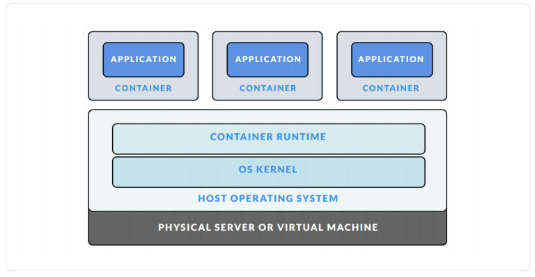
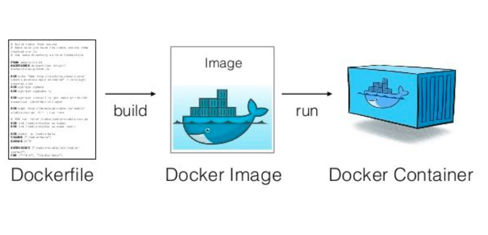

# LINUX PROGRAMMING

## NGƯỜI THỰC HIỆN

* Họ tên: Trần Kiến Quốc (QuocTk)
* Vị trí: Software Development Fresher

<br/><br/>

## CONTAINER 

1. Mô hình máy chủ: 
   * Máy chủ vật lý + hệ điều hành + ứng dụng phần mềm. 
   * Nhược: Một OS, không tận dụng triệt để nặng lực của ổ cứng, ram và các tài nguyên phần cứng khác.

    

2. Công nghệ ảo vật lý virtualization:  
   * Trên một máy chủ vật lý mình có thể tạo được nhiều OS, tận dụng tài nguyên tốt hơn "Mô hình máy chủ". 
   * Các virtualization tiêu biểu: VMWare, VirtualBox,...
   * Nhược: Tốn tài nguyên "cứng" cho Virtual Machine, bật máy ảo lên để đó không làm gì thì máy thật cũng phải phân phát tài nguyên. Đồng thời, việc khởi động và tắt cũng hơi lâu.

    

3. Công nghệ containerlization
   * Trên một máy chủ vật lý, sinh ra nhiều "máy con" (Khá giống virtualization) nhưng lại tốt hơn nữa khi dùng dùng chung duy nhất & chia sẻ tài nguyên cùng phần nhân của Host OS.
   * Khi nào ứng dụng cần tài nguyên bao nhiêu thì cấp bấy nhiêu, và ứng dụng nằm trên cái gọi là "container", tận dụng tài nguyên tốt hơn và tạo nên điểm nổi bật.

    

4. Container:
   * Phần mềm, chương trình được container engine (CE là một công cụ ảo hóa tinh gọn được cài đặt trên Host OS) đóng gói thành các container.
   * Container là một giải pháp để chuyển giao phần mềm một cách đáng tin cậy giữa các môi trường máy tính khác nhau bằng cách:
     * Tạo ra một môi trường chứa những "yêu cầu" mà phần mềm cần để có thể chạy được.
     * Không bị các yếu tố liên quan đến môi trường hệ thống làm ảnh hưởng tới việc phần mềm ứng dụng chạy và ngược lại.
   * Các tiến trình trong một container cô lập với các tiến trình của các container khác trong cùng hệ thống, nhưng các container này cùng chia sẻ/dùng chung kernel của Host OS.
   * Ưu điểm:
     * Linh động: Triển khai ở bất kỳ nơi đâu (không phụ thuộc vào HĐH).
     * Nhanh: Chia sẻ Host OS nên container có thể được tạo gần như một cách tức thì.
     * Nhẹ: Sử dụng chung các images nên cũng không tốn nhiều bộ nhớ.
     * Đồng nhất: Môi trường thống nhất cho nhiều người cùng phát triển trong một dự án.
     * Đóng gói: Dễ dàng đóng gói & đưa (môi trường, app,...) vào trong container, cũng như dễ test, tạo, bỏ container.
   * Nhược điểm:
     * Dùng chung OS, nếu OS có vấn đề, tất cả container đều bị ảnh hưởng.
     * OS là Linux, rủi ro bị chiếm quyền superuser có thể xảy ra, họ có thể làm "bậy" cho tầng OS này và dẫn đến toàn bộ máy host, container trong máy đều bị ảnh hưởng "tiêu cực". 
   * Kết: Container có nhiều lợi ích, nhưng nếu bàn sâu, đòi hỏi người quản trị phải có kiến thức tốt không chỉ về hệ thống, OS mà còn là vấn đề bảo mật để khắc phục (tốt hơn là ngăn chặn) các nhược điểm không hề nhỏ từ container.

<br/><br/>

## CÁCH HOẠT ĐỘNG CỦA DOCKER

* `Docker image` là nền tảng của container, có thể hiểu Docker image như khung xương giúp định hình cho container, nó sẽ tạo ra container khi thực hiện câu lệnh chạy image đó. Nếu nói với phong cách lập trình hướng đối tượng, Docker image là class, còn container là thực thể (instance, thể hiện) của class đó.
* Khái niệm `container`:
  * Khởi chạy image, container sẽ xuất hiện cùng.
  * Tốc độ khởi động container nhanh, có thể mở cùng lúc nhiều container.
  * Các thông tin cài đặt, dữ liệu (files, settings) được gọi là image.
* Khái niệm `image`:
  * Một image bao gồm hệ điều hành (Windows, CentOS, Ubuntu,...) và các môi trường lập trình được cài sẵn (httpd, mysqld, nginx, python, git,...).
  * *Docker hub là nơi lưu giữ và chia sẻ các file images, ta có thể tìm, tải hoặc tự tạo image để sử dụng.

<br/><br/>

## CÁC LỆNH CƠ BẢN

1. Pull một image từ Docker Hub
    ```
    sudo docker pull image_name
    ```

2. Tạo mới container bằng cách chạy image, kèm theo các tùy chọn:
    ```
    sudo docker run -v <forder_in_computer>:<forder_in_container> -p <port_in_computer>:<port_in_container> -it <image_name> /bin/bash
    ```

    Ví dụ:
    ```
    sudo docker pull ubuntu:16.04
    sudo docker run -it ubuntu:16.04 /bin/bash
    ```

3. Một vài câu lệnh tiêu biểu khác:
    ```
    docker images: Liệt kê các images hiện có
    docker rmi {image_id/name}: Xóa một image
    docker ps: Liệt kê các container đang chạy
    docker ps -a: Liệt kê các container đã tắt
    docker rm -f {container_id/name}: Xóa một container
    docker start {new_container_name}: Khởi động một container
    docker exec -it {new_container_name} /bin/bash: Truy cập vào container đang chạy
    ```

<br/><br/>

## HƯỚNG DẪN DEPLOY SERVER "TRÒ CHƠI XẾP BI" LÊN DOCKER

### BƯỚC 1: CÀI ĐẶT DOCKER

* Docker có 2 phiên bản, CE (dành cho nhà phát triển, nhóm nhỏ, coder) và EE (dành cho doanh nghiệp).
* Xem thêm tài liệu cài đặt Docker [Tại đây](https://docs.docker.com/install/linux/docker-ce/ubuntu/).

```
<<I. CẬP NHẬT>>
## Update the apt package index:
$ sudo apt-get update

## Install packages to allow apt to use a repository over HTTPS:
$ sudo apt-get install \
   apt-transport-https \
   ca-certificates \
   curl \
   software-properties-common

## Add Docker’s official GPG key:
$ curl -fsSL https://download.docker.com/linux/ubuntu/gpg | sudo apt-key add -


## Verify that you now have the key with the fingerprint 9DC8 5822 9FC7 DD38 854A E2D8 8D81 803C 0EBF CD88, by searching for the last 8 characters of the fingerprint.
$ sudo apt-key fingerprint 0EBFCD88

pub   4096R/0EBFCD88 2017-02-22
     Key fingerprint = 9DC8 5822 9FC7 DD38 854A  E2D8 8D81 803C 0EBF CD88
uid                  Docker Release (CE deb) <docker@docker.com>
sub   4096R/F273FCD8 2017-02-22

## Use the following command to set up the stable repository. 
## Newest version - BIONIC
$ sudo add-apt-repository "deb [arch=amd64] https://download.docker.com/linux/ubuntu bionic test"

<<II. Cài đặt docker CE>>

## Update the apt package index:
$ sudo apt-get update

## Install the latest version of Docker CE, or go to the next step to install a specific version. Any existing installation of Docker is replaced.
$ sudo apt-get install docker-ce

## Verify that Docker CE is installed correctly by running the hello-world image.
$ sudo docker run hello-world

## If you receive the message "Hello from Docker!", that means you succeeded.
```

### BƯỚC 2: CHUẨN BỊ DOCKERFILE

* `Dockerfile` là một file dạng text không có đuôi, giúp thiết lập cấu trúc cho docker image nhờ chứa một tập hợp các câu lệnh.
* Từ những câu lệnh đó, Docker có thể thực hiện đóng gói một docker image theo yêu cầu tùy biến của riêng bạn.

    

Nội dung của `marbledockerserver/dockerfile`:
```
FROM amytabb/docker_ubuntu16_essentials
MAINTAINER quoctk<quoctk@vng.com.vn>
WORKDIR /marbleserverdocker
COPY ./_server .
RUN chmod +x ./start.sh
`ENTRYPOINT` ["./start.sh"]
```

Giải thích:
* `FROM`: Khởi nguồn (có image gốc) từ ***amytabb/docker_ubuntu16_essentials***, image hỗ trợ G++ (Phát triển C/C++ trên Ubuntu). Xem thêm [tại đây](https://amytabb.com/ts/2018_07_28/).
* `MAINTAINER`: Đặt tên tác giả
* `WORKDIR`: Xác định thư mục thực thi, ở đây là /marbleserverdocker
* `COPY`: Sao chép các file trong thư mục _server vào thư mục thực thi hiện hành (Vì đang ở thư mục /marbleserverdocker nên ta dùng dấu '.').
* `RUN`: Trong quá trình build image, thực thi câu lệnh đổi quyền truy cập (Ở đây là +x, role nào cũng có thể chạy).
* `ENTRYPOINT`: 2 câu lệnh được viết trong file bash ./start.sh là lệnh biên dịch (g++) và lệnh thực thi chương trình. Ngoài ra, trong quá trình start container, file bash sẽ được khởi chạy.

### BƯỚC 3: KHỞI CHẠY

Bạn tải thư mục `marbledockerserver` và thư mục `_client_` về máy của mình.

Dịch chuyển (cd) vào trong thư mục `marbledockerserver`.

Thực hiện lệnh tạo image
```
sudo docker build -t dockerfile .
(Đừng quên dấu chấm phía cuối dòng nhé, dấu chấm là đại diện cho thư mục làm việc hiện hành)
```

Khởi chạy server, từ image build ra container và chạy nó. Thêm `--net=host` nữa nhé.
```
sudo docker run -it --net=host dockerfile .
```

Giải thích `--net=host`: 
* Cho phép container xem port của máy chủ như thể máy chủ đó đang tồn tại trên chính container đó. 
* Ví dụ: Giả sử có CSDL đang chạy trên port 5000 của máy A (Không có trong container của docker). Nhưng nhờ `host`, phía container ở docker có thể truy cập vào CSDL này dựa trên `localhost:5000`. 
* Quy về trò bắn bi, nhờ `host` mà server có thể kết nối đến các client và tương tác với chúng.

Khởi chạy server và phía client, khi trò chơi bắn bi kết thúc, các client sẽ nhận được giá trị, file, ranking của riêng mình, và server cũng vậy. Để kiểm tra server có nhận được các file bi từ client và ranking hay không, ta có thể thực hiện như sau:
```
## Sử dụng lệnh bên dưới để liệt kê toàn bộ container của mình đã từng chạy.
sudo docker container ls -a

## Kéo lên trên cùng nhất để xem Container ID vừa chạy gần nhất. Sau đó, khởi chạy container đó lên.
sudo docker start <container-id>

## Chạy lệnh bên dưới để liệt kê toàn bộ dữ liệu mà container đó đang chứa.
sudo docker exec -it <container-id> ls -a
```

***Lưu ý: Để khởi chạy client, hãy vào trong thư mục `_client` và thực hiện 2 lệnh bên dưới là xong***
```
g++ -o client client.cpp -std=c++11 -lpthread
./client
```

<br/><br/>

## NGUỒN THAM KHẢO:

1. <https://viblo.asia/p/docker-chua-biet-gi-den-biet-dung-phan-1-lich-su-ByEZkWrEZQ0>
2. <https://viblo.asia/p/docker-chua-biet-gi-den-biet-dung-phan-2-dockerfile-RQqKLzeOl7z>