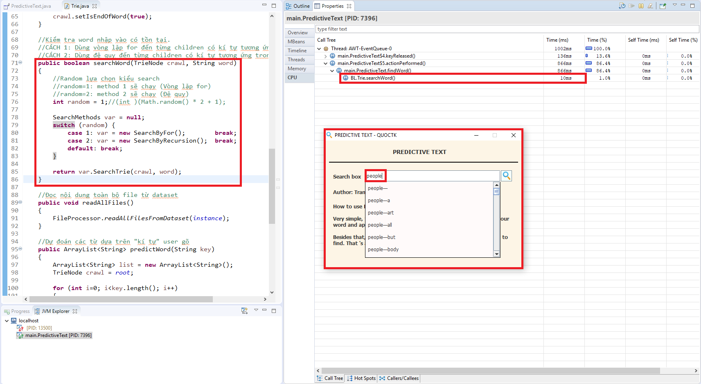
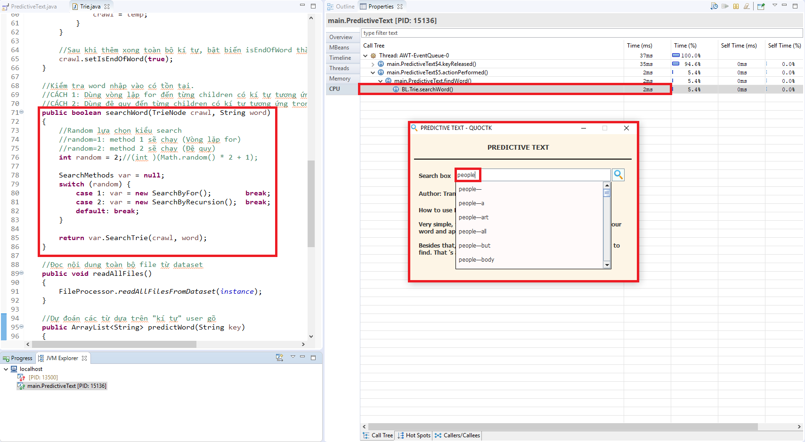
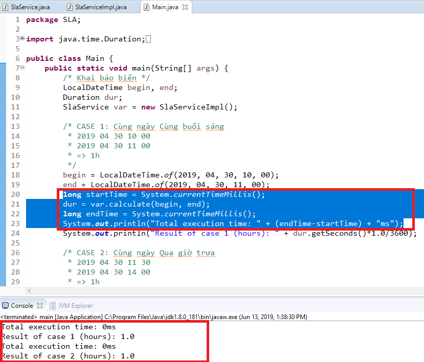

# DATA ALGO THINKING

## NGƯỜI THỰC HIỆN

* Họ tên: Trần Kiến Quốc (QuocTk)
* Vị trí: Software Development Fresher

<br/>

## BÀI TẬP 3-1

#### 1. MÔ TẢ BÀI TẬP
* Bài tập sử dụng IDE Eclipse và ngôn ngữ Java để thực hiện.
* Trên ứng dụng có một thanh search, khi user gõ kí tự nào thì ứng dụng sẽ liệt kê ra danh sách gợi ý các từ. Nếu user chọn từ và enter tìm kiếm, ứng dụng sẽ kiểm tra xem từ đó có tồn tại hay không và gửi trả thông báo cho user.
* Ứng dụng kiểm tra từ tồn tại bằng 2 phương pháp, vòng lặp For và Đệ quy. Đồng thời, ứng dụng kết hợp hàm random để ngẫu nhiên phương pháp nào sẽ chạy khi kiểm tra từ.
* Ứng dụng sử dụng 2 pattern chính yếu, đó là Singleton pattern và Strategy pattern.
    * Singleton được sử dụng nhằm mục đích, một chương trình xuyên suốt chỉ có duy nhất 1 thể hiện (1 biến cho tất cả).
    * Strategy được sử dụng nhằm mục đích, mở rộng các hàm tìm kiếm (nghĩa là viết nhiều cách tìm kiếm khác nhau). Tại đây có 2 hàm tìm kiếm implements lại interface SearchMethods.
* Ứng dụng lưu trữ cũng như xử lý dữ liệu theo phương pháp TrieNode, Trie.

#### 2. HƯỚNG DẪN
Tải project folder `PredictiveText` từ đường dẫn `/BT3-1/PredictiveText` về máy.

Sau đó, tải tập dữ liệu về máy tính theo các bước bên dưới

* Bước 1: Truy cập link [blogs.zip](http://u.cs.biu.ac.il/~koppel/BlogCorpus.htm) và tải tập dữ liệu về.
* Bước 2: Giải nén file và đổi tên folder thành `dataset`.
* Bước 3: Đưa folder `dataset` vào bên trong folder `src`. Đường dẫn là `/BT3-1/PredictiveText/src/dataset`.

Import project `PredictiveText` vào eclipse và bấm tổ hợp phím `Alt + Shift + X` rồi chọn `J (Run java application)` để chạy chương trình. Như vậy là xong.

***Lưu ý:***
* Sau khi chạy chương trình, tùy vào thông số máy tính mà thời gian ứng dụng hiển thị sẽ khác nhau. Với máy tính của mình, thời gian ứng dụng hiển thị là tầm 15 đến 20 phút. Vì sao lâu thế? Vì folder `dataset` quá nhiều file dữ liệu, đọc và xử lý chúng sẽ mất rất nhiều thời gian.
* Mình không tạo sẵn cho các bạn file `.exe` hay `.jar` được vì nó nặng quá. Xin lỗi các bạn nhiều!!!
* Bên trong các file source code mình đều có chú thích, giới thiệu từng hàm, bạn hãy mở ra để xem chi tiết.

#### 3. BENCHMARK HÀM KIỂM TRA TỪ TỒN TẠI
1. Công cụ dùng để đánh giá tốc độ CPU xử lý hàm
    * Ở IDE Eclipse này, mình sử dụng `JVM Monitor` để đánh giá SPEED của 2 hàm kiểm tra từ tồn tại. Nếu các bạn sử dụng IDE khác thì các bạn có thể sử dụng Plugin khác để đánh giá nhé.
    * Từ `people` sẽ được dùng để kiểm tra 2 hàm và có độ dài là 6 kí tự.

2. Kiểm tra từ tồn tại bằng vòng lặp For
    * Từ bức hình bên dưới, `random = 1` nên ứng dụng đang chạy thuật toán `SearchByFor`.
    * Thời gian kiểm tra từ tồn tại của hàm này là `10ms`.

    

3. Kiểm tra từ tồn tại bằng Đệ quy
    * Từ bức hình bên dưới, `random = 2` nên ứng dụng đang chạy thuật toán `SearchByRecursion`.
    * Thời gian kiểm tra từ tồn tại của hàm này là `2ms`.

    

4. Kết luận:
    * Như bạn đã thấy, thời gian kiểm tra từ tồn tại giữa hàm dùng For là 10ms và hàm dùng Đệ quy là 2ms. Thời gian mà hàm dùng Đệ quy kiếm được hoặc không kiếm được từ nhanh hơn rất nhiều so với hàm dùng vòng lặp For. Tuy nhiên, rõ ràng dùng Đệ quy sẽ tốn bộ nhớ Stack.
    * Từ `people` mà dùng trong mục đích so sánh này có độ dài vừa phải (6 kí tự) chứ không quá dài hoặc quá ngắn.

<br/>

## BÀI TẬP 3-2

#### 1. MÔ TẢ BÀI TẬP
* Bài tập được tham khảo nội từ [repo này](https://github.com/jamesroutley/write-a-hash-table).
* Bài tập được xây dựng thủ công hoàn toàn về Hash Table.
* Bài tập cho phép user sử dụng một trong 3 cách giải quyết đụng độ (Linear Probing, Quadratic Probing và Double Probing) ngay tại khởi tạo biến.
* 3 cách giải quyết đụng độ implements lại interface HashMethods.
* Kích cỡ của Hash Table luôn là số nguyên tố, kích cỡ nhỏ nhất là 5 phần tử. Dù user có khởi tạo Hash Table với kích cỡ tùy ý (kích cỡ đó không phải là số nguyên tố) thì kích cỡ thực sự của Hash Table sẽ là số nguyên tố gần nhất với số tùy ý của user.
* Một vài phương thức tiêu biểu của Hash Table tự cài đặt này:
    ```
    ===>HÀM PUBLIC<===
    new HashTable()
    new HashTable(int size)
    new HashTable(int size, double loadfactor)
    new HashTable(int size, HashMethods<K,V> hashmethod)
    new HashTable(int size, double loadfactor, HashMethods<K,V> hashmethod)
    ht_put(K key, V value)
    ht_get(K key)
    ht_delete(K key)
    ht_isEmpty()
    ht_size()
    ht_numElements()
    Object[] ht_keySet()

    ===>HÀM PRIVATE<===
    HashTable<K,V> ht_newSize(int basesize)
    ht_resizeTable(int basesize)
    ht_resizeUp()
    ht_resizeDown()
    ```
* Cách gọi 3 phương thức giải quyết đụng độ implements lại interface HashMethods:
    ```
    HashMethods<K,V> hm = new DoubleHashing<K,V>()
    HashMethods<K,V> hm = new LinearHashing<K,V>()
    HashMethods<K,V> hm = new QuadraticHashing<K,V>()
    ```

#### 2. HƯỚNG DẪN
Tải project folder `HashTable` từ đường dẫn `/BT3-2/HashTable` về máy.

Import project `HashTable` vào eclipse và bấm tổ hợp phím `Alt + Shift + X` rồi chọn `J (Run java application)` để chạy chương trình. Như vậy là xong.

***Lưu ý:***
* Bên trong các file source code mình đều có chú thích, giới thiệu từng hàm, bạn hãy mở ra để xem chi tiết.
* File `Main.java` trong đường dẫn `/BT3-2/HashTable/src/main/Main.java` đã được mình cài đặt và chạy thử thư viện HashTable với Key là kiểu (lớp) Account, Value là kiểu String. Bạn có thể thay đổi nội dung tùy thích để test HashTable.

<br/>

## BÀI TẬP 3-3

#### 1. MÔ TẢ BÀI TẬP
Bộ phần CS (Customer Service) sẽ nhận các khiếu nại từ người dùng và giải quyết chúng trong khoảng thời gian cho phép (tối đa là 8 tiếng theo giờ làm việc).

Giờ làm việc được tính từ `8h30` tới `12h` với buổi sáng và `13h30` đến `18h` với buổi chiều. CS sẽ làm nguyên ngày từ thứ 2 đến thứ 6, riêng thứ 7 sẽ chỉ làm buổi sáng.

**Mục tiêu:** Tính toán thời điểm bắt đầu giải quyết khiếu nại cho đến khi hoàn tất là trong khoảng bao lâu.

**Ý tưởng thuật toán:**

* B1: Kiểm tra ngày, tháng, năm "begin" và ngày, tháng, năm "end" có trùng nhau không và chia thành 2 trường hợp.
    * **`Trường hợp 1: [KHÔNG TRÙNG]`**
    * B1.1.1: Tính tổng số tiếng của ngày hiện tại của "begin".
    * B1.1.2: Tăng ngày của "begin" lên 1 và đặt lại giờ thành 8:30 (sáng).
    * B1.1.3: Quét vòng lặp từ ngày của "begin" cho đến ngày của "end". Nếu ngày, tháng, năm của "begin" và "end" trùng nhau thì thoát khỏi vòng lặp và tiến tới thực hiện `Trường hợp 2`.
    * B1.1.4: Trong quá trình quét vòng lặp thì cứ cộng dồn số tiếng của "begin". Nếu là thứ 7 thì cộng dồn 3.5 tiếng, các ngày còn lại thì cộng dồn 8 tiếng, chủ nhật không tính.
    * **`Trường hợp 2: [TRÙNG NHAU]`**
    * B1.2.1: Lúc này, ngày, tháng, năm của "begin" và "end" trùng nhau. Nếu giờ, phút của "begin" và "end" cùng <=12 hoặc cùng >12 thì ta chỉ cần lấy "end" trừ "begin". Ngược lại, "begin" <=12 trong khi "end" lại >12 thì ta lấy "end" trừ "begin" và trừ thêm 1.5h (Khoảng thời gian từ 12:00 - 13:30).
* B2: Chuyển kết quả đã sum (đơn vị là tiếng) thành đơn vị là phút. Sau đó, ép kiểu biến từ `double` về lại `int`. Cuối cùng là return kết quả theo hàm `Duration.ofMinutes`.

* Lưu ý: Toàn bộ số phút trong ý tưởng này đều được quy đổi thành số giờ. Ví dụ: 30 phút bằng 0.5h, 20 phút bằng 0.25h, 14:20 bằng 14.25.

#### 2. HƯỚNG DẪN
Tải project folder `TicketSLA` từ đường dẫn `/BT3-3/TicketSLA` về máy.

Import project `TicketSLA` vào eclipse và bấm tổ hợp phím `Alt + Shift + X` ở `Main.java` rồi chọn `J (Run java application)` để chạy chương trình. Như vậy là xong.

***Lưu ý:***
* File `Main.java` trong đường dẫn `/BT3-3/TicketSLA/src/SLA/Main.java` đã được mình cài đặt và chạy thử với 7 trường hợp khác nhau (có dữ liệu mẫu đi chung). Bạn có thể mở source code ra xem code, 7 trường hợp đó là gì và chạy thử kết quả cuối cùng có đúng như bản thân nghĩ.

#### 3. BENCHMARK HÀM CALCULATE
* Benchmark ở đây sẽ đánh giá trọng tâm duy nhất về `thời gian xử lý`.
* Ta chỉ cần thêm đoạn code bên dưới để đánh giá thời gian chạy.
    ```
    long startTime = System.currentTimeMillis();
        <Functions need to be evaluated will be put here>
    long endTime = System.currentTimeMillis();
    System.out.println("Total execution time: " + (endTime-startTime) + "ms"); 
    ```
* Thời gian xử lý dao động từ 0ms-40ms, nghĩa là tốc độ xử lý siêu nhanh, mang tính tức thời.
* Ngoài ra, vì xử lý quá nhanh mà không tốn nhiều Memory, CPU nên công cụ `JVM Monitor` khó dùng trong tình huống này, thậm chí không cần thiết dùng đến.

    

    *(Ảnh ví dụ)*

