# DATA ALGO THINKING

## NGƯỜI THỰC HIỆN

* Họ tên: Trần Kiến Quốc (QuocTk)
* Vị trí: Software Development Fresher

<br/>

## Mục lục

- [Cấu trúc dữ liệu](#A)
  - [Cấu trúc dữ liệu xác suất (Probabilistic Data Structures)](#A1)
    - [Tính chất của PDS](#A1.1)
    - [Bloom Filters](#A1.2)
    - [Cuckoo Filters](#A1.3)
    - [Count Min Sketch](#A1.4)
    - [HyperLogLog](#A1.5)
  - [Trie](#A2)
    - [Khái niệm](#A2.1)
    - [Cấu trúc](#A2.2)
    - [Ưu điểm](#A2.3)
    - [Ứng dụng](#A2.4)
- [Các mẫu thiết kế (Design Pattern)](#B)
  - [Mẫu Factory](#B1)
  - [Mẫu Singleton](#B2)
  - [Mẫu Composite](#B3)
  - [Mẫu Iterator](#B4)
  - [Mẫu Facade](#B5)
- [Nguyên tắc lập trình](#C)
  - [SOLID](#C1)
  - [DRY](#C2)
  - [KISS](#C3)
  - [YAGNI](#C4)
  - [Do the simplest thing that could possibly work](#C5)
  - [Clean code](#C6)
    - [Khái niệm](#C6.1)
    - [Ít nhất 5 cách trong clean code](#C6.2)
- [Nguồn tham khảo](#D)

<br/>

<span name="A"></span>

## CẤU TRÚC DỮ LIỆU

<span name="A1"></span>

1. Cấu trúc dữ liệu xác suất (Probabilistic Data Structures)

   <span name="A1.1"></span>

   * Tính chất của PDS: 
        * Là nhóm các cấu trúc dữ liệu cực kì hữu ích & phù hợp cho việc truyền tải dữ liệu và xử lý dữ liệu lớn.
        * Nhóm các cấu trúc này thường sử dụng hàm băm để thực hiện thêm, xóa, kiểm tra kết quả theo cách thức randomize các items.
        * Các loại cấu trúc trong nhóm này thường bỏ qua các trường hợp đụng độ, dẫn đến việc không thể đưa lại một giá trị chính xác, mà chỉ là ước tính.
        * Các thuật toán thuộc nhóm này sử dụng ít bộ nhớ, dễ dàng tính toán song song (các hàm hash độc lập nhau) và có thời gian truy vấn không đổi.
        * Một vài loại của PDS như: Membership, Cardinality, Frequency, Similarity.

   <span name="A1.2"></span>

   * Bloom Filters:
        * Bloom filter là 1 cấu trúc dữ liệu xác suất dùng để kiểm tra 1 phần tử có thuộc 1 tập dữ liệu hay không một cách nhanh chóng và tiết kiệm bộ nhớ. 
        * Hỗ trợ 2 phương thức tương tác là: Thêm phần tử vào tập và kiểm tra 1 phần tử có thuộc tập dữ liệu không. Nếu kết quả trả về là “không” thì kết quả này chính xác 100%. Tuy nhiên khi kết quả trả về là “có” thì xác suất kết quả này không chính xác (false positive) tùy thuộc vào các thông số thiết lập cho bloom filter và số lượng phần tử đã add vào bloom filter (số lượng càng lớn thì phần trăm kết quả sai càng cao).
        * Bản chất của bloom filter là một vector các bit. Một bloom filter rỗng là một vector các bit có giá trị là 0. Ngoài ra, bloom filter còn cần 1 số nhất định các hàm hash với chức năng map một cách ngẫu nhiên và đồng đều các giá trị được add vào bloom filter tới vị trí của 1 bit trong vector. Số lượng các hàm hash và độ dài của bit vector sẽ ảnh hưởng đến độ chính xác khi kết quả của bloom filter là “phần tử đã tồn tại trong tập hợp”. Thường thì số hàm hash (k) là 1 số cố định và nhỏ hơn rất nhiều so với độ dài của bit vector (m).
        * Khi add một phần tử vào bloom filter thì giá trị phần tử này sẽ được xử lý bởi k hàm hash. K kết quả trả về là vị trí của k bit trong vector, giá trị các bit vector này sẽ được chuyển sang 1.
        * Khi kiểm tra 1 phần tử có thuộc tập hợp đã được add vào bloom filter hay chưa thì giá trị của phần tử này cũng được xử lý bởi k hàm hash, trả về các vị trí bit. Nếu có bất kì bit nào có giá trị là 0 thì tức là phần tử này chắc chắn không thuộc tập hợp.  Còn nếu tất cả các bit đều bằng 1 thì phần tử này có thể thuộc tập hợp hoặc cũng có thể là false positive (do việc tất cả các bit bằng 1 có thể là kết quả của việc add các phần tử khác chứ không phải là phần tử đang được kiểm tra). Tỉ lệ false positive sẽ càng tăng khi có càng nhiều phần tử được add vào bloom filter. Chỉ riêng sử dụng bloom filter thì không thể phân biệt 2 trường hợp này mà cần đến các thuật toán và các cấu trúc dữ liệu khác.

            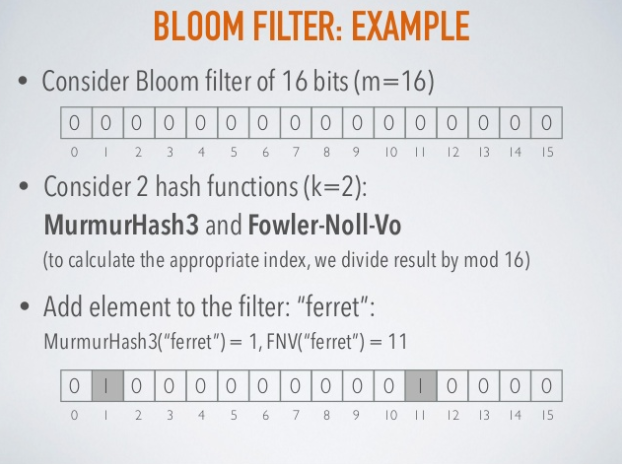

            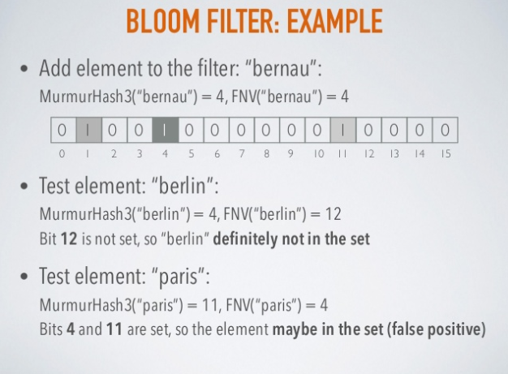
        
        * Để tính số lượng hàm hash nên sử dụng thì ta có công thức: `k* = (m/n)*ln(2)` với m là độ dài bit vector, n là số phần tử của tập hợp, k là số hàm hash.
        * Các hàm hash function sử dụng trong bloom filter nên là những hàm hash có tính độc lập và kết quả là một tập hợp được phân bố một cách đồng đều. Các hàm hash này cũng nên có thời gian xử lý nhanh và tốn ít tài nguyên (vì lí do này các hàm hash mang tính mật mã như sha1 thương ít được sử dụng). Các hàm hash thường được sử dụng có thể kể đến murmur, fnv, Jenkins hash, CityHash,...
        * Có 1 vấn đề đặt ra là giả sử ta có 1 bloom filter cần tới k hàm hash (các hàm hash phải khác nhau), vậy chẳng lẽ ta phải tìm k thuật toán hash khác nhau cho bloom filter này? Giải pháp cho vấn đề này là thuật toán Double Hashing. Chỉ với 2 hàm hash độc lập, sử dụng double hashing ta có thể tạo ra một hàm hash hoàn toàn mới.
        * Bloom filter được sử dụng phổ biến trong các hệ thống cache, cơ sở dữ liệu và những ứng dụng cần đến việc kiểm tra sự tồn tại của dữ liệu một cách nhanh chóng và tiết kiệm tài nguyên.
            * Google BigTable, Apache HBase and Apache Cassandra, and Postgresql sử dụng bloom filter để hạn chế việc phải tìm kiếm những phần tử không tồn tại trên ổ cứng.
            * Google Chrome sử dụng bloom filter để kiểm tra những URL độc hại.

   <span name="A1.3"></span>

   * Cuckoo Filters: 
        * Cải thiện bloom filter, cụ thể là có thể xóa, giới hạn đếm và giảm việc xuất hiện false positive, còn độ phức tạp không gian thì vẫn được duy trì tương tự bloom filter.
        * Cuckoo filters như là một bảng băm thu nhỏ, sử dụng hàm băm *cuckoo* để giải quyết các đụng độ. Nó giảm thiểu độ phức tạp không gian (space) của nó bằng cách chỉ lưu trữ `dấu vân tay của giá trị (fingerprint)` trong tập hợp. Giống như bloom filter sử dụng các `bit đơn` để lưu trữ dữ liệu.
        * Cuckoo filters có:
            * Một mảng với số n bucket.
            * Giá trị `load` thể hiện số % của mảng bucket đang lưu giữ giá trị. Giá trị `load` quan trọng trong việc tăng/giảm kích cỡ mảng bucket. 
            * Giá trị `b`: Số lượng `dấu vân tay` mà một bucket có thể lưu trữ.
            * f-bits fingerprint: Thể hiện giá trị của phần tử theo dạng f bits. Con số f-bits này tự chọn.
        * Gif bên dưới cho thấy việc thêm một phần tử tới 3 lần sẽ làm cho cuckoo filter nhét nó vào bucket thứ 2. 

            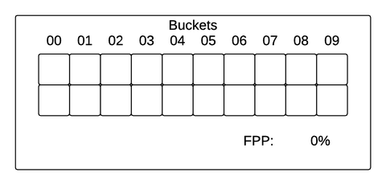
            
            *Chú thích: 10 bucket, mỗi một bucket có thể lưu trữ lên đến 2 fingerprint, mỗi fingerprint mang 7-bits*

        * Cuckoo nghĩa là chim cúc cu, chúng hay đẻ trứng vào các tổ chim khác. Khi những con chim cúc cu này nở ra, chúng sẽ cố gắng đẩy bất kỳ quả trứng hoặc chim khác ra khỏi tổ của nó => Đây là nguyên tắc cơ bản của hàm băm Cuckoo.
        * Trong hàm băm cuckoo, mỗi khóa được băm bởi hai hàm băm khác nhau, do đó giá trị (f-bits fingerprint) có thể được gán cho một trong hai bucket. Bucket đầu tiên được thử đầu tiên. Nếu không có gì ở đó thì giá trị được đặt trong bucket ấy. Nếu có thứ gì đó đã tồn tại, bucket 2 được thử nghiệm. Nếu bucket 2 chưa có giá trị, ta đặt giá trị mới vào đó. Ngược lại, bucket 2 đã có giá trị thì giá trị ở bucket 1 hoặc bucket 2 sẽ bị đào thải rồi quá trình được thực hiện lại, lưu giữ giá trị mới lên bucket vừa bị đào thải giá trị. Ta có thể sử dụng vòng lặp vô tận cho quá trình đào thải giá trị và đặt giá trị (khóa) mới. Tuy nhiên, ta cũng cần phải lưu tâm đến bảng băm (thay đổi kích cỡ nó lớn lên) hoặc kiểm tra lại ý tưởng hàm băm.
        
            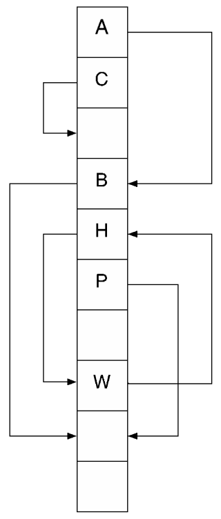
            
            *Chú thích: Mỗi một kí tự có 2 ô bucket*
        
            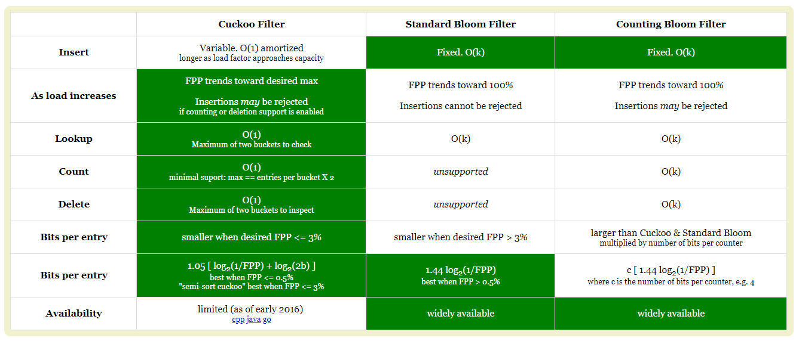
            
            *Chú thích: Bảng so sánh Cuckoo và Bloom. Xem thêm [tại đây](https://bdupras.github.io/filter-tutorial/).*

        * Thứ tự fingerprint trong một bucket không ảnh hưởng đến kết quả truy vấn. Dựa vào điều này, phát sinh ra một bước tối ưu hóa không kém phần quan trọng của cuckoo filters, đó là sử dụng `semi-sort`. Chúng ta có thể nén từng bucket bằng cách sắp xếp fingerprint của nó và sau đó mã hóa chuỗi fingerprint được sắp xếp. Tuy nhiên, phương pháp này chỉ ứng dụng cho trường hợp các bucket lưu trữ 4-bits fingerprint. Nếu fingerprint có số bit lớn hơn 4 thì chỉ có bốn bit quan trọng nhất của mỗi fingerprint được mã hóa, phần còn lại được lưu trữ trực tiếp và riêng biệt.

            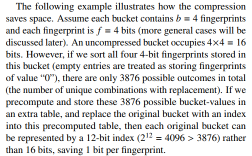

            *Chú thích: Hình trên giải thích vì sao Semi-sort tiết kiệm 1 bit mỗi fingerprint. Theo tiếng Việt, "unique combinations with replacement" nghĩa là Chỉnh hợp chập k=4 (f-bits = 4) của n=16 (4-bits x 4 fingerprints của mỗi bucket = 16). Xem thêm tại báo cáo nghiên cứu **Cuckoo Filter: Practically Better Than Bloom**.*

   <span name="A1.4"></span>

   * Count Min Sketch:
        * Một trong những phương pháp giải quyết vấn đề Ước lượng số lần xuất hiện của phần tử trong tập dữ liệu.
        * CM Sketch là cấu trúc dữ liệu không gian tuyến tính hỗ trợ việc thêm phần tử và đếm số lần phần tử đã được thêm vào.
        * CM Sketch được mô tả với 2 tham số: `m` (số lượng bucket) và `k` (số lượng hàm hash khác nhau). Yêu cầu vùng nhớ cố định có kích cỡ là `m*k`.
        * CM Sketch có bản chất là ma trận đếm với m cột và k dòng, mỗi dòng tượng trưng cho 1 hàm hash.
        * Phương pháp này thường đánh giá cao về số lần tần suất đúng đắn chứ không bao giờ đánh giá thấp kết quả.
        * Để đạt được xác suất lỗi mục tiêu, ta thường dùng công thức `k >= ln(1/delta)` với delta xoay quanh 1%, như vậy số lượng hàm hash k = 5 là đủ tốt.

            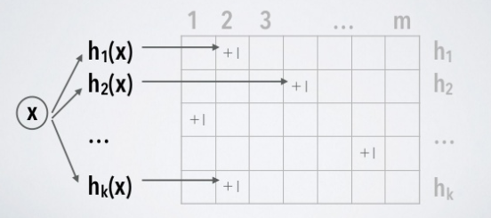

            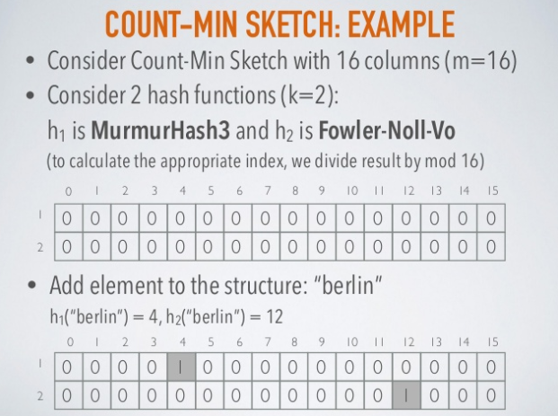

            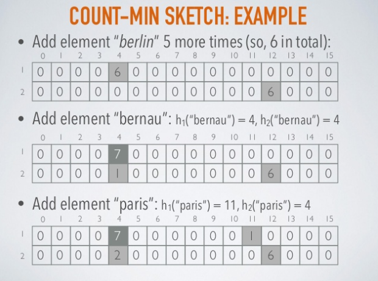

            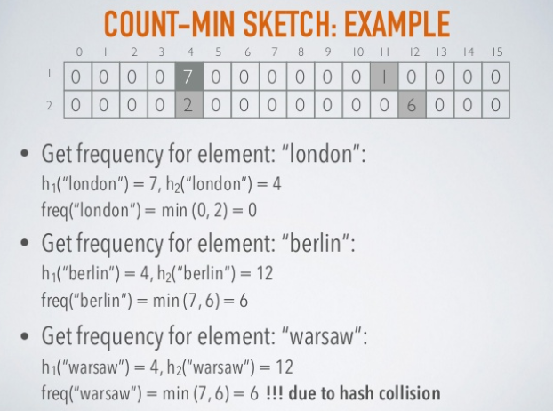

        * Một vài ứng dụng tiêu biểu của CM Sketch: 
            * Là một phần của thư viện Algebird của Twitter.
            * AT&T sử dụng CM Sketch trong các thiết bị chuyển mạch mạng để thực hiện phân tích lưu lượng mạng với bộ nhớ hạn chế.

   <span name="A1.5"></span>

   * HyperLogLog (HLL):
        * HLL là phần mở rộng của thuật toán Flajolet-Martin (1985).
        * Xác định chính xác số lượng phần tử duy nhất (cardinality) trong tập dữ liệu sẽ tốn kém nhiều chi phí xử lý và bộ nhớ. Do đó, ta có thể tính toán cardinality một cách tương đối bằng số lượng tối đa `số 0 đứng đầu (leading zero)` trong biểu diễn nhị phân của mỗi số. Nếu giá trị đó là **k** thì số phần tử riêng biệt trong tập hợp có thể gần đúng sẽ là **2<sup>k</sup>**.

            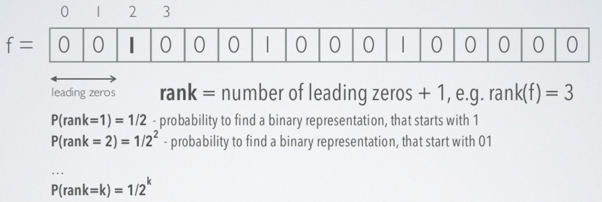

        * HLL được mô tả bằng 2 tham số:
            * **p**: Số bit nhằm xác định lượng bucket (**m=2<sup>p</sup>** thể hiện số bucket).
            * **h**: Hàm băm, tạo ra những giá trị có tính chất `uniform (phân phối đều)`.
        * Thuật toán HLL có thể ước tính số cardinality lên đến hơn 10<sup>9</sup> phần tử với tỉ lệ sai sót thấp ở mức cho phép là 2%, và sử dụng khoảng 1.5kB bộ nhớ.
        * Thuật toán HLL sử dụng tính `ngẫu nhiên hóa` để ước tính gần đúng số cardinality của bộ dữ liệu, và tính `ngẫu nhiên hóa` đạt được bằng cách sử dụng hằm băm **h**.
        
            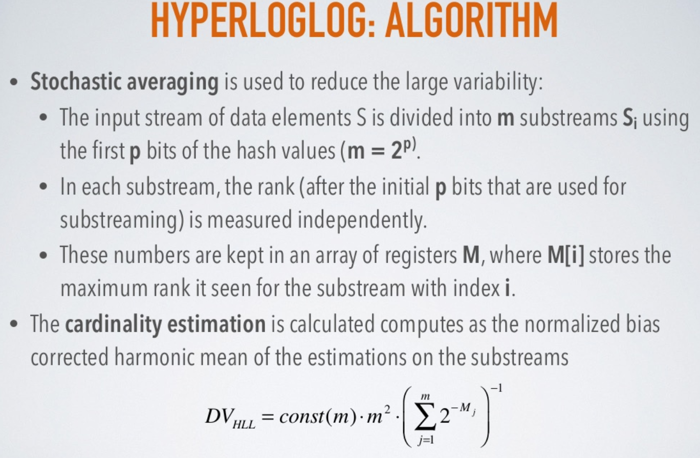

            *Chú thích: Các bước thuật toán và công thức tính **cardinality estimation***

            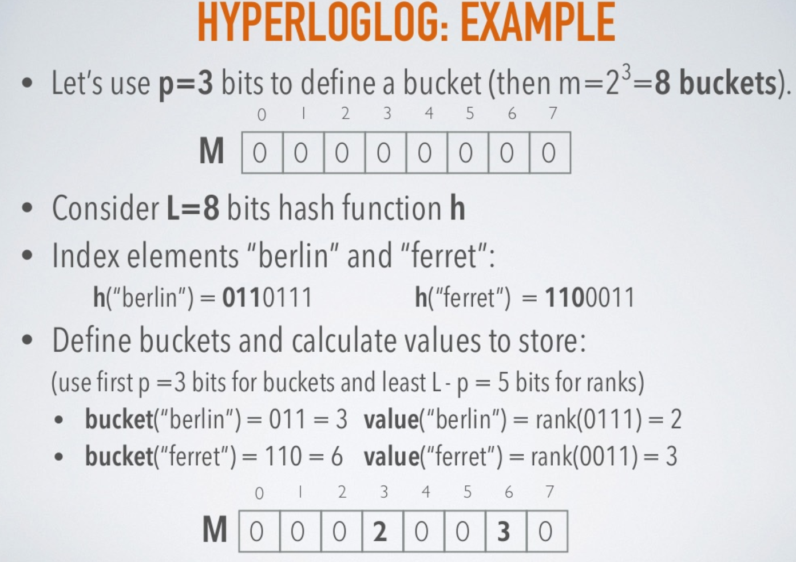

            *Ví dụ cho các bước của thuật toán HLL*

            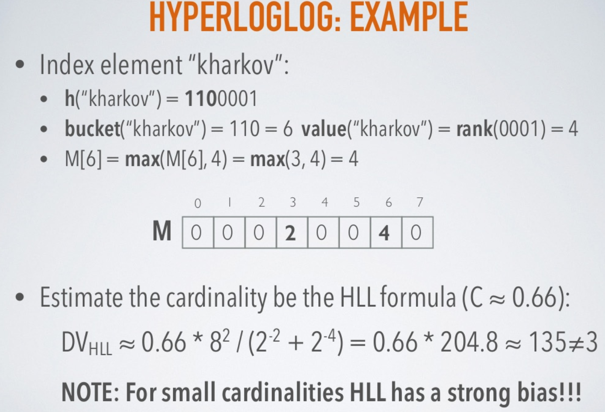

            *Ví dụ cho việc cập nhật max rank và tính toán **cardinality estimation**. Tuy nhiên, giá trị ở đây là 135 rất khác với giá trị là 3 (thực ra chỉ có 3 phần tử). Do đó, lượng phần tử duy nhất quá nhỏ thì kết quả sẽ  kém phần chính xác.*

        * Thuật toán HLL có vấn đề rất lớn đối với lượng cardinality nhỏ (Ví dụ trên bạn đã thấy rõ). Do đó, để đạt được sự ước tính tốt nhất ta có thể sử dụng thuật toán Linear Counting khi ngưỡng dưới **5m/2**.
        * Công thức tính `lỗi tiêu chuẩn (standard error)` có thể được ước tính theo công thức bên dưới:

            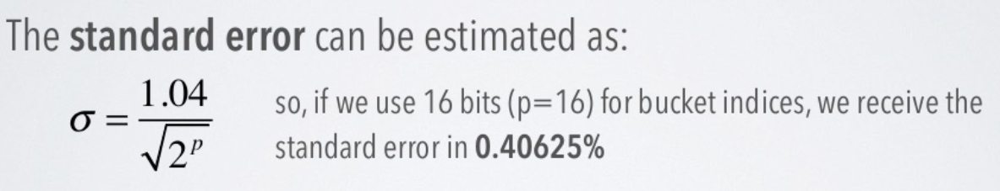

        * Bộ nhớ trong thuật toán HLL không có tăng tuyến tính như thuật toán MinCount hay Linear Counting. Hàm băm với **L** bits và **p** sẽ cần bộ nhớ theo công thức bên dưới.

            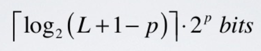

            *Chú thích: HLL "gốc gác" sử dụng 32 bits hash codes sẽ tiêu hao lượng bộ nhớ là **(5 x 2<sup>p</sup>) bits***

        * Chúng ta có thể sử dụng một trong các hàm băm sau cho HLL: MD5, Sha1, Sha256, Murmur3,... và không có căn cứ nào cho thấy là hàm băm này sẽ tốt hơn hàm băm kia trong HLL. Ngoài ra, khi thực hiện hàm băm, ta chỉ cần tính toán lượng **p** bits và lượng `số 0 đứng đầu (leading zero)` trong phần bits còn lại là được, chứ không cần tính hết nguyên dãy (tính hết cũng không xài đến mà còn tốn kém thời gian).
        * Ứng dụng nho nhỏ của HLL: Lệnh **PFCOUNT** trong **Redis** trả về lượng phần tử duy nhất gần đúng & dựa trên cấu trúc dữ liệu của HLL.

<span name="A2"></span>

2. Trie
    <span name="A2.1"></span>

    * Khái niệm: Thuật ngữ Trie xuất phát từ tiếng Anh `re`**`trie`**`ve`. Nó là một cấu trúc dữ liệu dùng để lưu trữ một mảng liên kết của các xâu ký tự. Trie cho phép:
        * Thêm một xâu vào tập hợp
        * Xóa một xâu khỏi tập hợp
        * Kiểm tra một xâu có tồn tại trong tập hợp hay không.
    
    <span name="A2.2"></span>

    * Cấu trúc: 
        * Trie gồm một gốc không chứa thông tin, trên mỗi cạnh lưu một ký tự, mỗi nút và đường đi từ gốc đến nút đó thể hiện 1 xâu, gồm các ký tự là các ký tự thuộc cạnh trên đường đi đó. 
        * Như hình vẽ bên dưới, nút 1 là nút gốc, nút 7 thể hiện có 1 xâu là "bg", nút 10 thể hiện có 1 xâu là "acd", nút 5 thể hiện là có 1 xâu là "ab". 
        * Tuy nhiên, đối với một số nút, chẳng hạn nút 4, ta không biết nó là thể hiện kết thúc 1 xâu hay chỉ là 1 phần của đường đi từ nút 1 đến nút 9. Vì vậy, khi cài đặt, tại nút X ta cần lưu thêm thông tin nút X có phải là kết thúc của 1 xâu hay không, hoặc nút X là kết thúc của bao nhiêu xâu, tuỳ theo yêu cầu bài toán mà ta cài đặt.

        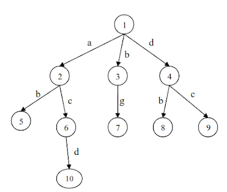
    
    <span name="A2.3"></span>

    * Ưu điểm:
        * Dễ dàng cài đặt, không mấy khó khăn.
        * Tiết kiệm bộ nhớ: Khi số lượng khóa lớn và các khóa có độ dài nhỏ, thông thường trie tiết kiệm bộ nhớ hơn do các phần đầu giống nhau của các khoá chỉ được lưu 1 lần. Ưu điểm này có ứng dụng rất lớn, chẳng hạn trong từ điển.
        * Thao tác tìm kiếm: O(m) với m là độ dài khóa. Ngoài ra, các thao tác trên trie rất đơn giản và thường chạy nhanh hơn so với thực tế.

   <span name="A2.4"></span>

    * Ứng dụng: Được sử dụng nhiều cho các bài toán về `Chuỗi từ`.
        * Điển hình như gợi ý từ điển, gợi ý số điện thoại, tự động hoàn tất từ đang kiếm, tìm kiếm tiền tố trùng hợp dài nhất, gợi ý lệnh (chẳng hạn các lệnh trong Terminal mà mình đã dùng), kiểm tra tính đúng đắn của từ (Spell Checker),... 
        * Ví dụ: ta gõ từ "tiny" sẽ nhận được các giá trị gần tương đồng như "tine", "tin", "tinny". Hoặc gõ "pe" trong từ điển, các từ gợi ý sẽ được hiển thị như "pepper", "pepsi", "people", "pen",...

<br/>

<span name="B"></span>

## DESIGN PATTERN

<span name="B1"></span>

1. **Factory (FP):**
   * **Khái niệm:**
        * Thuộc nhóm khởi tạo.
        * Nhiệm vụ: Quản lý và trả về các đối tượng theo yêu cầu, giúp cho việc khởi tạo đối tượng một cách linh hoạt hơn.
        * Ví dụ: Cần mua ô tô thì ta phải đến MỖI HÃNG để xem ô tô, dẫn đến mất đến thời gian. Nhằm tiết kiệm thời gian hơn, ta đến trung tâm đại lý ô tô, nơi "tổng hợp" các ô tô từ CÁC HÃNG mà ta tha hồ lựa chọn.

   * **Code minh họa:**
        ```
        public interface Car {
            void view();
        }
        
        public class Honda implements Car {
            @Override
            public void view() {
                System.out.printf("Honda view");
            }
        }

        public class Nexus implements Car {
            @Override
            public void view() {
                System.out.printf("Nexus view");
            }
        }

        public class Toyota implements Car {
            @Override
            public void view() {
                System.out.printf("Toyota view");
            }
        }

        public class CarFactory {
            public void viewCar(String carType) {
                Car car;
                if (carType.equalsIgnoreCase("HONDA"))
                {
                    car = new Honda();
                    car.view();
                }
                else
                    if (carType.equalsIgnoreCase("NEXUS"))
                    {
                        car = new Nexus();
                        car.view();
                    }
                    else
                        if (carType.equalsIgnoreCase("TOYOTA"))
                        {
                            car = new Toyota();
                            car.view();
                        }
            }
        }

        public class Boss {
            public void viewCar() {
                CarFactory carFactory = new CarFactory();
                carFactory.viewCar("HONDA");
                carFactory.viewCar("NEXUS");
                carFactory.viewCar("TOYOTA");
            }

        }
        ```

<span name="B2"></span>

2. **Singleton (SP):**
   * **Khái niệm:**
        * Thuộc nhóm khởi tạo.
        * Nhiệm vụ: Đảm bảo rằng một class chỉ có duy nhất một instance và cung cấp một cách "toàn cầu" để truy cấp tới instance đó.
        * Ví dụ: Tàu mẹ (mothership) vận chuyển nguyên vật liệu qua lại giữa Mặt trăng và Sao hỏa để các con robot trên Sao hỏa có thêm nguyên liệu để tiếp tục thực hiện "Địa khai phá". Chỉ duy nhất một tàu mẹ thực hiện xuyên suốt nhiệm vụ này.

   * **Code minh họa:**
        * `Khởi tạo sớm`: Đây là cách dễ nhất nhưng nó có một nhược điểm là mặc dù instance đã được khởi tạo nhưng có thể sẽ không dùng tới.
        ```
        public class EagerInitializedSingleton {
            private static final EagerInitializedSingleton instance = new EagerInitializedSingleton();

            //private constructor to avoid client applications to use constructor
            private EagerInitializedSingleton() {}

            public static EagerInitializedSingleton getInstance()
            {
                return instance;
            }
        }
        ```
        * `Khởi tạo trễ`: Cách này đã khắc phục được nhược điểm của cách 1 Eager initialization, chỉ khi nào getInstance được gọi thì instance mới được khởi tạo. Tuy nhiên cách này chỉ sử dụng tốt trong trường hợp đơn luồng, trường hợp nếu có 2 luồng cùng chạy và cùng gọi hàm getInstance tại cùng một thời điểm thì đương nhiên chúng ta có ít nhất 2 thể hiện của instance.
        ```
        public class LazyInitializedSingleton {
            private static LazyInitializedSingleton instance;

            private LazyInitializedSingleton() {}

            public static LazyInitializedSingleton getInstance()
            {
                if(instance == null)
                {
                    instance = new LazyInitializedSingleton();
                }
                return instance;
            }
        }
        ```
        * `Khởi tạo luồng an toàn`: Gọi phương thức synchronized cho một đoạn mã quan trọng.
        ```
        public class ThreadSafeSingleton {
            private static ThreadSafeSingleton instance;

            private ThreadSafeSingleton() {}

            public static ThreadSafeSingleton getInstance()
            {
                if (instance == null)
                {
                    synchronized(ThreadSafeSingleton.class)
                    {
                        if (instance == null)
                        {
                            instance = new Trie();
                        }
                    }
                }
                
                return instance;
            }
        }
        ```

<span name="B3"></span>

3. **Composite (CP):**
   * **Khái niệm:**
        * Thuộc nhóm cấu trúc.
        * Tổ chức các đối tượng theo cấu trúc phân cấp dạng cây. Tất cả các đối tượng trong cấu trúc được thao tác theo một cách thuần nhất như nhau.
        * Tạo quan hệ thứ bậc bao gộp giữa các đối tượng.
        * Client có thể xem đối tượng bao gộp và bị bao gộp như nhau, giúp tăng khả năng tổng quát hoá trong code cũng như dễ phát triển, nâng cấp, bảo trì code.
        * Ví dụ: Folder có thể chứa Folder và File, Folder bên trong Folder lại có thể chứa các Folder & File khác,...

        

   * **Code minh họa:**
        * `FileComponent.java`
        ```
        public interface FileComponent {
            void showProperty();
            long totalSize();
        }
        ```
        * `FileLeaf.java`
        ```
        public class FileLeaf implements FileComponent {
            private String name;
            private long size;
        
            public FileLeaf(String name, long size) {
                super();
                this.name = name;
                this.size = size;
            }
        
            @Override
            public long totalSize() {
                return size;
            }
        
            @Override
            public void showProperty() {
                System.out.println("FileLeaf [name=" + name + ", size=" + size + "]");
            }
        }
        ```
        * `FolderComposite.java`
        ```
        import java.util.ArrayList;
        import java.util.List;
        
        public class FolderComposite implements FileComponent {
            private List<FileComponent> files = new ArrayList<>();
        
            public FolderComposite(List<FileComponent> files) {
                this.files = files;
            }
        
            @Override
            public void showProperty() {
                for (FileComponent file : files) 
                {
                    file.showProperty();
                }
            }
        
            @Override
            public long totalSize() {
                long total = 0;
                for (FileComponent file : files) 
                {
                    total += file.totalSize();
                }
                return total;
            }
        }
        ```
        * `Client.java`
        ```
        import java.util.Arrays;
        import java.util.List;
        
        public class Client {
            public static void main(String[] args) {
                FileComponent file1 = new FileLeaf("file 1", 10);
                FileComponent file2 = new FileLeaf("file 2", 5);
                FileComponent file3 = new FileLeaf("file 3", 12);
        
                List<FileComponent> files = Arrays.asList(file1, file2, file3);
                FileComponent folder = new FolderComposite(files);
                folder.showProperty();
                System.out.println("Total Size: " + folder.totalSize());
            }
        }
        ```

<span name="B4"></span>

4. **Iterator (IP):**
   * **Khái niệm:**
        * Thuộc nhóm hành vi/tương tác.
        * Truy xuất các phần tử của đối tượng dạng tập hợp tuần tự (list, array,...) mà không phụ thuộc vào biểu diễn bên trong của các phần tử.
        * Client có thể sử dụng Iterator (cũng như các phương thức cơ bản của nó như: hasNext, next, remove,...) để làm cầu nối với tập hợp, như hình dưới:

        

   * **Code minh họa:**
        * `Item.java`
        ```
        public class Item {
            private String title;
            private String url;
        
            public Item(String title, String url)
            {
                super();
                this.title = title;
                this.url = url;
            }
        
            @Override
            public String toString()
            {
                return "Item [title=" + title + ", url=" + url + "]";
            }
        }
        ```
        * `ItemIterator.java`
        ```
        public interface ItemIterator<T>
        {
            boolean hasNext();
            T next();
        }
        ```
        * `Menu.java`
        ```
        import java.util.ArrayList;
        import java.util.List;
        
        public class Menu {
            private List<Item> menuItems = new ArrayList<>();
        
            public void addItem(Item item)
            {
                menuItems.add(item);
            }
        
            public ItemIterator<Item> iterator()
            {
                return new MenuItemIterator();
            }
        
            class MenuItemIterator implements ItemIterator<Item>
            {
                private int currentIndex = 0;
        
                @Override
                public boolean hasNext()
                {
                    return currentIndex < menuItems.size();
                }
        
                @Override
                public Item next()
                {
                    return menuItems.get(currentIndex++);
                }
            }
        }
        ```
        * `Client.java`
        ```
        public class Client {
            public static void main(String[] args) {
                Menu menu = new Menu();
                menu.addItem(new Item("Home", "/home"));
                menu.addItem(new Item("Java", "/java"));
                menu.addItem(new Item("Spring Boot", "/spring-boot"));
        
                ItemIterator<Item> iterator = menu.iterator();
                while (iterator.hasNext())
                {
                    Item item = iterator.next();
                    System.out.println(item);
                }
            }
        }
        ```

<span name="B5"></span>

5. **Facade (FP):**
   * **Khái niệm:**
        * Thuộc nhóm cấu trúc.
        * Nhiệm vụ: Cung cấp một giao diện chung đơn giản thay cho một nhóm các giao diện có trong một hệ thống con (subsystem). Từ đó, nó định nghĩa một giao diện ở một cấp độ cao hơn để giúp cho người dùng có thể dễ dàng sử dụng hệ thống con này.
        
        
        
   * **Code minh họa:**
        * `AccountService.java`
        ```
        public class AccountService {
            public void getAccount(String email)
            {
                System.out.println("Getting the account of " + email);
            }
        }
        ```
        * `PaymentService.java`
        ```
        public class PaymentService {
            public void paymentByPaypal()
            {
                System.out.println("Payment by Paypal");
            }
        
            public void paymentByCreditCard()
            {
                System.out.println("Payment by Credit Card");
            }
        
            public void paymentByEbankingAccount()
            {
                System.out.println("Payment by E-banking account");
            }
        
            public void paymentByCash()
            {
                System.out.println("Payment by cash");
            }
        }
        ```
        * `ShippingService.java`
        ```
        public class ShippingService {
            public void freeShipping()
            {
                System.out.println("Free Shipping");
            }
        
            public void standardShipping()
            {
                System.out.println("Standard Shipping");
            }
        
            public void expressShipping()
            {
                System.out.println("Express Shipping");
            }
        }
        ```
        * `EmailService.java`
        ```
        public class EmailService {
            public void sendMail(String mailTo)
            {
                System.out.println("Sending an email to " + mailTo);
            }
        }
        ```
        * `SmsService.java`
        ```
        public class SmsService {
            public void sendSMS(String mobilePhone)
            {
                System.out.println("Sending an mesage to " + mobilePhone);
            }
        }
        ```
        * `ShopFacade.java`
        ```
        public class ShopFacade {
            private static final ShopFacade INSTANCE = new ShopFacade();
        
            private AccountService accountService;
            private PaymentService paymentService;
            private ShippingService shippingService;
            private EmailService emailService;
            private SmsService smsService;
        
            private ShopFacade()
            {
                accountService = new AccountService();
                paymentService = new PaymentService();
                shippingService = new ShippingService();
                emailService = new EmailService();
                smsService = new SmsService();
            }
    
            public static ShopFacade getInstance()
            {
                return INSTANCE;
            }
        
            public void buyProductByCashWithFreeShipping(String email)
            {
                accountService.getAccount(email);
                paymentService.paymentByCash();
                shippingService.freeShipping();
                emailService.sendMail(email);
                System.out.println("Done\n");
            }
    
            public void buyProductByPaypalWithStandardShipping(String email, String mobilePhone)
            {
                accountService.getAccount(email);
                paymentService.paymentByPaypal();
                shippingService.standardShipping();
                emailService.sendMail(email);
                smsService.sendSMS(mobilePhone);
                System.out.println("Done\n");
            }
        }
        ```
        * `Client.java` (Kết hợp giữa `Facade` và `Singleton`)
        ```
        public class Client {
            public static void main(String[] args) {
                ShopFacade.getInstance().buyProductByCashWithFreeShipping("contact@gpcoder.com");
                ShopFacade.getInstance().buyProductByPaypalWithStandardShipping("gpcodervn@gmail.com", "0988.999.999");
            }
        }
        ```

<br/>

<span name="C"></span>

## NGUYÊN TẮC LẬP TRÌNH

<span name="C1"></span>

1. **SOLID**
   
   

   * **S:**
        * Một class chịu trách nhiệm 1 việc.
        * Ví dụ: Class Person chứa Họ tên, SĐT, Email, Cách chào hỏi và Hàm xác thực Email. Lúc này, "Hàm xác thực Email" trở nên không hợp lý khi nằm ở class Person này. Do vậy, ta tách thuộc tính Email và Hàm xác thực Email ra thành một class riêng biệt, tên là Email. Cuối cùng, class Person sử dụng Class Email như một thuộc tính và thỏa đặc tính **`S`** trong SOLID.
    
    * **O:**
        * Chỉ nên mở rộng một class bằng cách `kế thừa`. Tuyệt đối không mở rộng class bằng cách `sửa đổi` nó.
        * Điểm mấu chốt của nguyên tắc này là: **`Chỉ được THÊM mà không được SỬA`**.
        * Ví dụ: Có 2 class là Rectangle và Square, 1 hàm là computeArea. Nếu như bổ sung thêm class Circle thì ta phải sửa code ở hàm computeArea, dẫn đến vi phạm **`O`**. Do vậy, ta phải tạo 1 interface Shape chứa hàm ảo computeArea, các class hình học sẽ có thuộc tính riêng biệt nhưng bắt buộc implements lại hàm computeArea của Shape. Cuối cùng, ta "THÊM" class Circle mà không đụng chạm gì đến các class/hàm khác.

    * **L:**    
        * Trong một chương trình, các `object` của `class con` có thể thay thế `class cha` mà không làm thay đổi tính đúng đắn của chương trình.
        * Nguyên tắc này khuyến khích chúng ta sử dụng tính đa hình trong lập trình hướng đối tượng.

    * **I:**
        * Nên tách Interface lớn thành nhiều interface nhỏ với những mục đích riêng biệt.
        * Ví dụ: Sau khi tính diện tích xong thì mã hóa kết quả thành JSON rồi gửi trả client. Nếu như 1 interface Shape chứa hàm computeArea lẫn hàm serialize thì đã vi phạm **`I`**, vì có những trường hợp client chỉ cần kết quả diện tích mà không cần mã hóa JSON. Cuối cùng, ta phải tách interface Shape thành 2 interface khác nhau, 1 là interface computeArea và 1 là interface serialize. Client cần implements gì thì cài đặt interface đó là xong.

    * **D:**
        * Interface dường như là một yếu tố cơ bản nhất của mọi nguyên tắc trên, nên khi sử dụng, cần phải cẩn thận và tuân thủ các nguyên tắc.
        * Đồng thời, **`D`** là nguyên tắc quan trọng nhất trong nguyên lý SOLID và nằm ở cuối cùng, đó chính là **`tổng hợp 4 nguyên tắc trước`** (cho việc sử dụng interface).

    * Xem chi tiết source code cho SOLID [tại đây](https://topdev.vn/blog/nguyen-ly-solid-la-gi-nguyen-ly-solid-trong-node-js-voi-typescript/?fbclid=IwAR0JmVECIbywQ2Hj6DvpNL9EJYgX6FeXKOIPugx3Yc6keo8yMGb4PgWmdMg).

<span name="C2"></span>

2. **DRY**

   * Don't Repeat Yourself hay DRY là một nguyên lý cơ bản nhất của lập trình được đưa ra nhằm mục đích hạn chế tối thiểu việc viết các đoạn code lặp đi lặp lại nhiều lần chỉ để thực hiện các công việc giống nhau trong ứng dụng. Thay vào đó, hãy đóng gói nó thành phương thức riêng, đến khi cần thì chỉ cần gọi tên nó ra để sử dụng.

   * Ví dụ: Code hàm kiểm tra Email (tính năng đăng nhập) cho trang admin, vài tuần sau có thêm trang admin mới cần phải kiểm tra vụ đăng nhập, thế là bưng code cũ qua xài tiếp. Vài tháng kế tiếp lại có thêm trang admin mới, lúc này bưng code qua xài tiếp. Tuy nhiên, chỉ cần có 1 sự thay đổi nhỏ như là, ngoài việc kiểm tra Email đăng nhập có khớp với Email admin hay không, mà còn kiểm tra ngày khởi tạo tài khoản có hơn 1 tháng hay không, lúc này bạn sẽ phải sửa code không những ở trang admin này mà còn một đống trang admin phía sau, dẫn đến tốn thời gian. Thay vào đó nên viết một hàm/class xài chung & tổng quát hóa.

   * Tình huống ngoại lệ: Tình huống gấp rút, số lượng trang admin biết trước và ít ỏi thì ta có thể bỏ qua nguyên tắc DRY. Ngược lại, ta nên áp dụng DRY.

   * Xem thêm chi tiết [tại đây](https://www.codehub.vn/Nguyen-Ly-DRY-Dont-Repeat-Yourself).

<span name="C3"></span>

3. **KISS**

   * KISS (Keep It Simple, Stupid), tạm dịch là "giữ cho mọi thứ đơn giản đi, ngốc ạ”. Hoặc các biến thể khác như "Keep It Short and Simple", "Keep It Simple and Straightforward" và "Keep It Small and Simple".

   * Trong lập trình, KISS nghĩa là hãy làm cho mọi thứ (mã lệnh) trở nên đơn giản nhằm dễ nhìn và dễ đọc. Hãy chia nhỏ vấn đề và giải quyết từng cái. Đừng viết những lớp hay phương thức theo kiểu tổng hợp hay lẫn lộn (tất cả trong một). Đồng thời, hãy để số lượng dòng code của một lớp hay phương thức ở con số hàng chục, hạn chế lên hàng trăm, hàng nghìn.

<span name="C4"></span>

4. **YAGNI**

   * YAGNI (You Aren’t Gonna Need It), tạm dịch là "bạn sẽ không cần nó". Hãy xây dựng cái bạn cần khi mà bạn thực sự cần đến nó, hãy xông xáo tái cấu trúc nó khi cần thiết. Đừng dành quá nhiều thời gian để lên kế hoạch cho những thứ lớn lao, và những kịch bản tương lai không biết trước. Phần mềm tốt là cái mà có thể tiến hóa thành sản phẩm hoàn thiện theo thời gian.

   * Thực tế hơn, ta nên tập trung xây dựng chức năng giải quyết vấn đề ở thời điểm hiện tại, vấn đề mà khách hàng cần giải quyết, không cần lãng phí thời gian vào một chức năng "Có thể sử dụng đến" => Đừng tự vẽ vời thêm việc cho bản thân.

<span name="C5"></span>

5. **Do the simplest thing that could possibly work**

   * Tạm dịch là "làm các thứ đơn giản nhất mà nó chạy được".

   * Đối với các tester, điều đó có nghĩa là bắt đầu với một bài kiểm tra đơn vị đơn giản (simple unit test) và chỉ tăng dần độ phức tạp khi nó đã & vẫn đang hoạt động được.

   * Đối với designer, điều đó có nghĩa là bắt đầu với một cái gì đó thật đơn giản, và theo thời gian, tăng dần sự phức tạp, cầu kỳ nhưng phải có ý nghĩa (thêm thắt nhiều chi tiết mà làm tăng sự "rối mắt, nhức não" cho sản phẩm thì cũng vô nghĩa).

   * Có hai cách để thiết kế phần mềm: Một cách là làm cho nó đơn giản đến mức không còn thiếu sót, và cách khác là làm cho nó phức tạp đến mức thiếu sót khó mà thấy rõ. Phương pháp đầu tiên dẫu khó khăn nhưng cực kì có lợi, không những việc mở rộng phần mềm trở nên dễ dàng hơn mà còn là bảo trì, bàn giao sản phẩm,...

   * Xem thêm [tại đây](http://www.agilenutshell.com/simplest_thing).

<span name="C6"></span>

6. **Clean code**

   <span name="C6.1"></span>

   * **Khái niệm:**

        * Về hình thức:
            * Cách trình bày code: Căn lề, sử dụng tab, space,... sao cho dễ đọc, dễ nhìn.
            * Cách đặt tên biến, hàm, class có theo quy ước không.
            * Cách phân phối lượng code (số dòng code trong file, số dòng code trong 1 method,...) là bao nhiêu.
        * Về nội dung:
            * Cách đặt tên hàm, tên biến phải dễ hiểu.
            * Cách viết comment cho code, khi nào cần viết comment, khi nào không.
            * Thiết kế, xây dựng cấu trúc cho đối tượng, dữ liệu nhằm dễ sử dụng và mở rộng.
            * Cách xử lý ngoại lệ (Exception) có ổn không.
            * Khả năng bảo trì, mở rộng của code,...
        * Kết luận:
            * Bjnarne Stroustrup tác giả cuốn sách “The C++ Programming Language” đưa ra quan điểm của mình: Ông muốn code của mình phải hiệu quả và đẹp. Tất cả các hàm business logic phải rõ ràng và bugs dễ dàng tìm thấy. Code phải dễ dàng bảo trì, các ngoại lệ phải được bắt một cách rõ ràng. Phải tối ưu hóa các performance, tránh viết code quá phức tạp gây khó khăn cho người khác.
            * Grady Booch tách giả cuốn sách “Object oriented analysic and design with Applications” đưa ra quan điểm của mình: Viết code đơn giản, code phải dễ đọc và dễ hiểu cho người khác. Code phải có ý nghĩa và dễ quản lý.

   <span name="C6.2"></span>

   * **Ít nhất 5 cách để được clean code:**

        * General rules:
            * Tuân thủ quy ước chung mà team đặt ra.
            * Tuân thủ nguyên tắc KISS.
            * Tìm gốc gác của mọi vấn đề/lỗi (nếu có) thay vì "đối phó" nó.
        * Names rules:
            * Tên phân biệt cho mỗi tính năng/trường hợp, không trùng lắp.
            * Tên mô tả được bản chất của nó cũng như hàm một cách rõ ràng.
            * Tránh "mã hóa hoặc nối thêm tiền tố (Ví dụ: m_compute, _absolute).
            * Tên phát âm được (Ví dụ: DateTime, không được DatehhMMss).
        * Functions rules:
            * Hàm nhỏ, không quá nhiều dòng code.
            * Mỗi hàm chỉ làm `đúng` nghĩa vụ của nó.
            * Tên hàm mô tả được nghĩa vụ của nó.
            * Ít tham số truyền vào hàm.
        * Comments rules:
            * Giải thích những phần mà mình cho là khó hiểu, cần phải tường minh.
            * Không giải thích dư thừa: Viết quá nhiều từ, chữ hoặc chỗ nào cũng giải thích (kể cả chỗ dễ hiểu nhất).
            * Sử dụng cho trường hợp: Cảnh báo, giải thích ngữ nghĩa hàm/từ/ý tưởng,...
        * Tests:
            * Mỗi một kiểm tra đặt ở đâu là phải có "assert" chỗ đó.
            * Các bài kiểm tra phải độc lập nhau, hạn chế kiểm tra này phụ thuộc kiểm tra kia.
            * Kiểm tra lại theo khoảng thời gian nhất định và các kiểm tra đó người xem phải đọc/xem được. (Kiểm tra mà không xem/đọc được kết quả có đúng đắn hay không thì cũng vô nghĩa).
        
<br/>

<span name="D"></span>

## NGUỒN THAM KHẢO
1. <https://gpcoder.com/4164-gioi-thieu-design-patterns/>
2. <https://viblo.asia/p/design-pattern-factory-pattern-part-1-XqaGEmxZGWK>
3. <https://viblo.asia/p/hoc-singleton-pattern-trong-5-phut-4P856goOKY3>
4. <https://viblo.asia/p/design-pattern-composite-AeJ1vOzAGkby>
5. <https://gpcoder.com/4554-huong-dan-java-design-pattern-composite/>
6. <https://gpcoder.com/4724-huong-dan-java-design-pattern-iterator/>
7. <https://gpcoder.com/4604-huong-dan-java-design-pattern-facade/>
8. <https://stackjava.com/design-pattern/facade-pattern.html>
9. <https://topdev.vn/blog/nguyen-ly-solid-la-gi-nguyen-ly-solid-trong-node-js-voi-typescript/?fbclid=IwAR0JmVECIbywQ2Hj6DvpNL9EJYgX6FeXKOIPugx3Yc6keo8yMGb4PgWmdMg>
10. <https://www.codehub.vn/Nguyen-Ly-DRY-Dont-Repeat-Yourself>
11. <https://vinacode.net/2015/03/11/lap-trinh-vien-can-nho/>
12. <https://hanoiict.edu.vn/cac-nguyen-tac-solid-yagni-kiss-dry-trong-lap-trinh>
13. <http://www.agilenutshell.com/simplest_thing>
14. <https://stackjava.com/clean-code/clean-code-la-gi.html>
15. <https://techtalk.vn/clean-code-ma-sach-va-con-duong-tro-thanh-better-developer.html>
16. <https://techtalk.vn/clean-code-ma-sach-va-con-duong-tro-thanh-better-developer-p2.html>
17. <https://gist.github.com/wojteklu/73c6914cc446146b8b533c0988cf8d29>
18. <http://shhetri.github.io/clean-code/#/16>
19. <https://vnoi.info/wiki/algo/data-structures/trie>
20. <https://www.quora.com/What-is-a-trie-What-is-its-importance-and-how-it-is-implemented>
21. <https://www.quora.com/What-are-the-best-applications-for-Tries-the-data-structure>
22. <https://blog.vietnamlab.vn/2016/09/29/gioi-thieu-ve-bloom-filter/>
23. <https://brilliant.org/wiki/cuckoo-filter/>
24. <https://bdupras.github.io/filter-tutorial/>