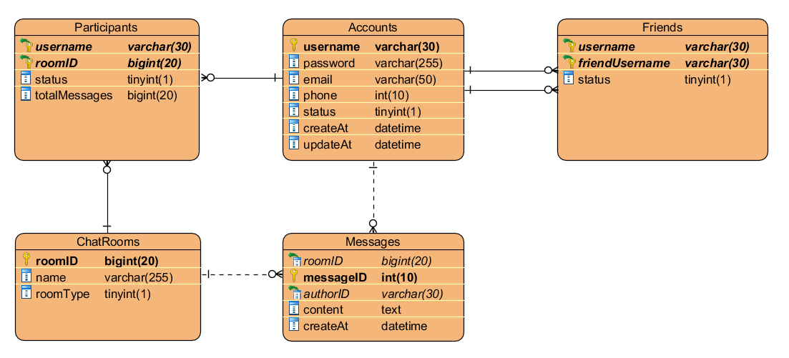
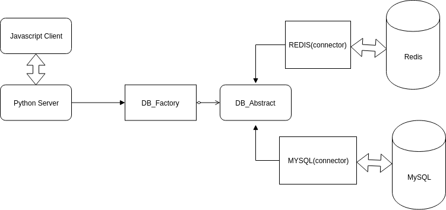
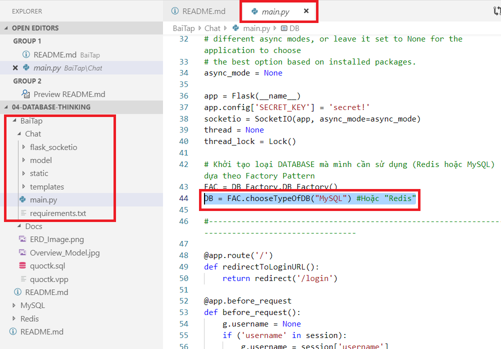

# CHAT EXERCISE

## NGƯỜI THỰC HIỆN

* Họ tên: Trần Kiến Quốc (QuocTk)
* Vị trí: Software Development Fresher

<br/>

## MÔ TẢ BÀI LÀM

* Một vài tính năng cơ bản của ứng dụng:
    * Tạo tài khoản.
    * Activate tài khoản (Nếu trước đó bản thân đã Deactivate tài khoản - ngưng hoạt động).
    * Đăng nhập, đăng xuất.
    * Chọn người trò chuyện và tán gẫu cùng nhau.
    * Tạo group chat.
    * Cho phép chat bạn với bạn hoặc chat theo group.
    * Thêm bạn vào group.
    * Đổi tên phòng chat/group.
    * Rời khỏi group chat.
    * Hiển thị lịch sử trò chuyện ở mỗi phòng chat/group.
    * Kết bạn, chấp nhận yêu cầu kết bạn.
    * Hiển thị trạng thái tin nhắn Seen/Unseen.
    * Hiển thị trạng thái Online/Offline của bạn cùng phòng chat (trừ group chat không có).
    * Xem profile cá nhân.
    * Đổi email/password/phone của cá nhân.

* Entity Relational Diagram của MySQL:

    

* Mô hình tổng quan việc kết nối giữa Server với Client và giữa các CSDL (MySQL và Redis)

    

    ***Chú thích 1:** Phía Python Server có thể sử dụng REDIS hoặc MYSQL đều được, dựa vào DB_Factory (Pattern).*

    ***Chú thích 2:** Phía Python Server mặc định khởi chạy MYSQL.*

* Đổi việc sử dụng MySQL ở Python Server thành Redis:

    

* Giới thiệu file `./Docs/quoctk.sql`: Đây là file tạo CSDL và các bảng mẫu cho MySQL

* Giới thiệu file `./Docs/quoctk.vpp`: Đây là file thiết kế của file ảnh **ERD_Image.png**, sử dụng phần mềm Visual Paradigm.

* Sơ lược folder source code `Chat`:
    * Nơi thực thi chương trình chat.
    * Gõ lệnh bên duối để chạy file `main.py`:
        ```
        FLASK_APP=main.py FLASK_DEBUG=1 flask run --no-reload

        + Chạy main.py với FLASK dưới trạng thái DEBUG
        + --no-reload: Tắt cơ chế tự động load lại mỗi khi có thay đổi lệnh code.
        ```
    * Mở các browser (tốt nhất nên là Google Chrome để giữ nguyên vẹn thiết kế FrontEnd)
    * Lưu ý: Cài đặt các thư viện, ngôn ngữ Python liên quan để chạy được chương trình.