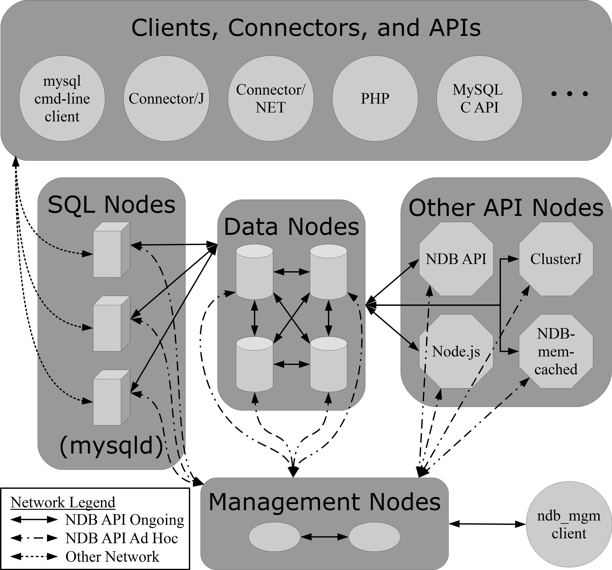
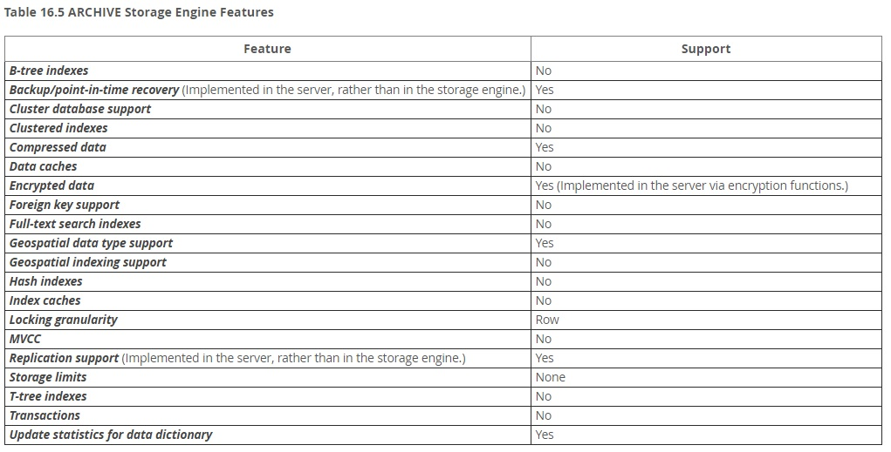
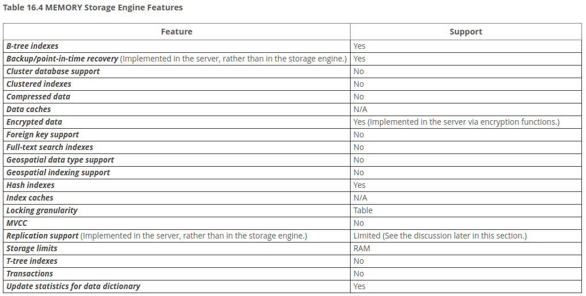
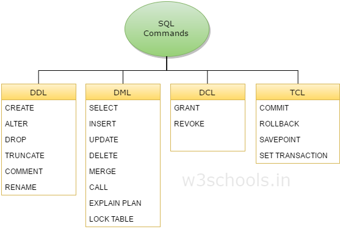

# MYSQL

## NGƯỜI THỰC HIỆN

* Họ tên: Trần Kiến Quốc (QuocTk)
* Vị trí: Software Development Fresher

<br/>

## MỤC LỤC

- [DATABASE (CƠ SỞ DỮ LIỆU)](#0)
- [STORAGE ENGINE (SE)](#A)
  - [Các loại storage engine cơ bản của MySQL](#A1)
  - [InnoDB](#A2)
  - [MyISAM](#A3)
  - [CSV](#A4)
  - [NDB (or NDBCLUSTER)](#A5)
  - [Federated](#A6)
  - [Example](#A7)
  - [Archive](#A8)
  - [Memory](#A9)
  - [Bảng tổng hợp tính năng của các Storage Engine](#A10)
- [INSTALLATION & MANIPULATION](#B)
  - [Giới thiệu sơ nét SQL Commands](#B1)
  - [Cách thức cài đặt MySQL server trên Linux](#B2)
  - [Cách tạo DB (database) và table](#B3)
  - [Thao tác với MySQL](#B4)
- [DATA TYPES](#C)
  - [Các kiểu dữ liệu cơ bản của MySQL](#C1)
  - [Các kiểu dữ liệu đặc biệt và cách xử lý](#C2)
- [DATA TYPES](#D)
  - [Transaction là gì](#D1)
  - [Tại sao phải dùng transaction](#D2)
  - [Cách sử dụng transaction](#D3)
  - [Xử lý khi gặp lỗi transaction](#D4)
  - [Khái niệm transaction trong hệ thống phân tán](#D5)
- [ISOLATION](#E)
  - [Isolation là gì](#E1)
  - [Isolation ở mức cơ bản](#E2)
  - [Xác định isolation level của MySQL để xử lý đồng thời (concurrency)](#E3)
- [CONNECTOR](#F)
  - [Một số cách kết nối với MySQL: jdbc, python driver,...](#F1)
- [Nguồn tham khảo](#G)

<br/>

<span name="0"></span>

## DATABASE (CƠ SỞ DỮ LIỆU)

* Một Database (Cơ sở dữ liệu) là một tập hợp dữ liệu đã được tổ chức sắp xếp. Mục đích chính của Database là để tổ chức một lượng lớn thông tin bằng việc lưu trữ, thu thập và quản lý.
*  Có nhiều loại Database có sẵn như MySQL, Sybase, Oracle, Mongo DB, SQL Server,...

    

    *Chú thích: RDBMS (Relational Database Management System - Hệ quản trị cơ sỡ dữ liệu **quan hệ**), DBMS (Database Management System - Hệ quản trị cơ sở dữ liệu)*

* Sau khi theo dõi các điểm khác nhau giữa DBMS và RDBMS, bạn có thể thấy rằng RDBMS là phần mở rộng của DBMS. Trên thị trường hiện nay, có nhiều sản phẩm phần mềm tương thích cả với DBMS và RDBMS. Nghĩa là, ngày nay một ứng dụng RDBMS là một ứng dụng DBMS và ngược lại.
* Giới thiệu sơ nét về MySQL:
  * MySQL là một SQL Database mã nguồn mở, được phát triển bởi Swedish. MySQL hỗ trợ nhiều nền tảng khác nhau, gồm Microsoft Windows, Linux, UNIX và Mac OS X.
  MySQL có các phiên bản miễn phí hay phải trả tiền, phụ thuộc vào sự sử dụng của nó (mang tính thương mại hay không thương mại) và các tính năng/đặc điểm mình cần. MySQL đi cùng với một SQL Database Server rất nhanh, đa luồng, đa người dùng và đầy sức mạnh.
  * Một vài đặc điểm của MySQL:
    * Hiệu suất cao.
    * Tính khả dụng cao.
    * Khả năng mở rộng và linh hoạt.
    * Hỗ trợ mạnh mẽ cho transaction.
    * Kho lưu web và dữ liệu mạnh.
    * Bảo vệ dữ liệu cao.
    * Phát triển ứng dụng toàn diện.
    * Quản lý dễ dàng.
    * Hỗ trợ 24/7 và mã nguồn mở.
    * Tổng chi phí sở hữu thấp nhất.
* Ngoài MySQL ra, còn có MS SQL Server, MS Access, SQL Server,... rất nhiều Hệ quản trị cơ sở dữ liệu mà bạn tha hồ chọn lựa.

<br/>

<span name="A"></span>

## STORAGE ENGINE (SE)

<span name="A1"></span>

1. Các loại storage engine cơ bản của MySQL: 
   * MySQL version 8.0 hỗ trợ các loại SE tiêu biểu như: InnoDB, MyISAM, Memory, Archive, CSV, Example, Blackhole, NDB, Merge, Federated. 
   * Ở đây, mình sẽ phân tích 8 engine ngoại trừ 2 engine (Merge, Blackhole). 
   * Mỗi engine có những đặc điểm và tình huống sử dụng riêng biệt, nhưng một vài engine thông dụng lại chứa luôn cả engine khác, nên ta cần phải cân nhắc chọn lựa hoặc kết hợp các loại SE khác nhau cho hệ thống của mình.

<span name="A2"></span>

2. InnoDB
   
   

   * Giới thiệu: InnoDB là một công cụ lưu trữ đa năng, cân bằng độ tin cậy cao và hiệu suất cao. Trong MySQL 8.0, InnoDB là công cụ lưu trữ mặc định của MySQL. Trừ khi ta đã cấu hình một công cụ lưu trữ mặc định khác, việc đưa ra câu lệnh CREATE TABLE mà không có mệnh đề `ENGINE=<TypeOfSE>` sẽ tạo bảng InnoDB.
   * Ưu điểm: 
     * Các hoạt động DML của nó tuân theo mô hình ACID với các giao dịch có tính năng cam kết, rollback và khôi phục sự cố để bảo vệ dữ liệu người dùng.
     * Có cơ chế row-level locking với 2 loại:
       * Shared locks: Cho phép giao dịch giữ khóa để đọc một hàng.
       * Exclusive locks: Cho phép giao dịch giữ khóa để cập nhật hoặc xóa một hàng.
     * Các bảng InnoDB sắp xếp dữ liệu trên đĩa để tối ưu hóa các truy vấn dựa trên các khóa chính. Mỗi bảng InnoDB có một chỉ mục khóa chính (còn được gọi là chỉ mục được clustered) nhằm tổ chức hóa dữ liệu để giảm thiểu I/O cho việc tra cứu khóa chính.
     * Để duy trì tính toàn vẹn dữ liệu, InnoDB hỗ trợ các ràng buộc FOREIGN KEY. Với các khóa ngoại, chèn, cập nhật và xóa được kiểm tra để đảm bảo chúng không dẫn đến sự không thống nhất giữa các bảng khác nhau.
   * Nhược điểm:
        ```
        CREATE TABLE employee ( 
            id smallint(5) unsigned NOT NULL, 
            firstname varchar(30), 
            lastname varchar(30), 
            PRIMARY KEY (id)
        ) ENGINE=InnoDB; 
        ```
     * Tăng độ phức tạp, chẳng hạn việc tạo bảng InnoDB sẽ phải khai báo nhiều thứ và cầu kì hơn MyISAM. Đồng thời, việc thiết kế & link các khóa ngoại với nhau cũng cần nhiều "công sức".
     * Không tim kiếm full-text: Các bảng InnoDB không hỗ trợ tìm kiếm toàn văn bản; không dễ để so khớp một hoặc nhiều từ khóa với nội dung nhiều cột.
     * Hiệu năng chậm hơn: Nếu ứng dụng của bạn chủ yếu select dữ liệu và hiệu suất là ưu tiên, các bảng MyISAM thường sẽ nhanh hơn và sử dụng ít tài nguyên hệ thống hơn. Ngược lại, InnoDB sẽ nhanh hơn MyISAM ở việc ghi dữ liệu. Xem thêm lí do [tại đây](https://hackernoon.com/dont-waste-your-time-with-mysql-full-text-search-61f644a54dfa).
   * Khi nào sử dụng InnoDB?
     * InnoDB là tùy chọn tốt nhất nếu bạn cần tạo một ứng dụng web dựa trên dữ liệu đáng tin cậy. Theo nhiều cách, InnoDB là một lựa chọn mặc định tốt hơn MyISAM.
     * Trừ khi ta có một hệ thống lớn hoặc được sử dụng với tần suất cao, sự khác biệt về tốc độ có thể không đáng kể thì InnoDB cũng là một ứng viên phù hợp.
     * InnoDB chắc chắn là sự lựa chọn tốt nhất cho các cửa hàng trực tuyến, ứng dụng tài chính hoặc bất kỳ dự án nào mà tính toàn vẹn dữ liệu là điều cần thiết. Việc xác định các bảng phức tạp hơn, nhưng ứng dụng của bạn sẽ mạnh mẽ hơn (với các thông tin về bảng & ràng buộc một cách rõ ràng) và có thể yêu cầu ít mã lệnh thực thi phía máy chủ hơn.
     * Có cách khác để tìm kiếm full-text mà thuật toán ấy tăng hiệu suất của InnoDB lên. Chẳng hạn như dùng Match Against kết hợp với Select. Xem t1hêm [tại đây](https://www.digitalocean.com/community/tutorials/how-to-improve-database-searches-with-full-text-search-in-mysql-5-6-on-ubuntu-16-04).
   * Giải thích ACID:
     * Tính nguyên tố (Atomicity): Một giao dịch có nhiều thao tác khác biệt, do đó toàn bộ các thao tác đều được hoàn thành hoặc là không một thao tác nào được hoàn thành. Chẳng hạn việc chuyển tiền có thể thành công hay trục trặc vì nhiều lý do nhưng tính nguyên tố bảo đảm rằng một tài khoản sẽ không bị trừ tiền nếu như tài khoản kia chưa được cộng số tiền tương ứng.
     * Tính nhất quán (Consistency): Một giao dịch sẽ phải tạo ra một trạng thái mới và hợp lệ cho dữ liệu, hoặc trong trường hợp có lỗi thì nó sẽ chuyển toàn bộ dữ liệu về trạng thái trước khi thực thi giao dịch. (Giống như rollback)
     * Tính độc lập (Isolation): Một giao dịch đang thực thi và chưa được xác nhận phải bảo đảm tách biệt khỏi các giao dịch khác.
     * Tính bền vững (Durability): Dữ liệu được xác nhận sẽ được hệ thống lưu lại sao cho ngay cả trong trường hợp hỏng hóc hoặc có lỗi hệ thống, dữ liệu vẫn đảm bảo trong trạng thái chuẩn xác.

<span name="A3"></span>

3. MyISAM
   
   

   * Giới thiệu: 
     * MyISAM dựa trên SE cũ kĩ mang tên **ISAM**, nhưng nó vẫn còn nhiều tính năng hữu ích nên giờ đây đã được nâng cấp và đổi tên thành MyISAM.
     * Mỗi bảng MyISAM được lưu trữ trên đĩa trong hai file. Các file có tên bắt đầu bằng tên bảng và có phần mở rộng để chỉ ra loại file. File dữ liệu có phần mở rộng .MYD (MYData). File chỉ mục có phần mở rộng .MYI (MY Index). Định nghĩa bảng được lưu trữ trong từ điển dữ liệu MySQL.
     * Cách tạo bảng với loại SE MyISAM:
        ```
        CREATE TABLE t (i INT) ENGINE = MYISAM;
        ```
   * Ưu điểm:
     * Đơn giản hóa: Bảng MyISAM rất đơn giản. Nếu bạn chưa quen với MySQL hoặc cơ sở dữ liệu nói chung, bạn có thể bắt đầu với các bảng MyISAM. Trong ví dụ sau, ta sẽ tạo một CSDL và bảng mới từ dấu nhắc lệnh `mysql>`. Đoạn code bên dưới tạo ra một CSDL mới tên mysqltest và một bảng mới có tên articles với các cột là ID (số được tạo tự động), title và body.
        ```
        CREATE DATABASE mysqltest;
        USE mysqltest;

        CREATE TABLE mysqltest.articles (
            id int UNSIGNED NOT NULL AUTO_INCREMENT,
            title TEXT NOT NULL,
            body MEDIUMTEXT,
            PRIMARY KEY (id)
        ) ENGINE = MyISAM;
        ```
     * Tốc độ: MySQL rất nhanh. Trong điều kiện bình thường, benchmark cho thấy các bảng MyISAM đánh bại nhiều CSDL dùng SE khác (mục đích vẫn giống nhau) và sử dụng ít tài nguyên hệ thống hơn.
     * Tìm kiếm Full-text: Một giải pháp dễ dàng là thêm một chỉ mục fulltext với đoạn code bên dưới. Từ đó, hiệu năng tìm kiếm sẽ được đẩy lên "một tầm cao mới".
        ```
        ALTER TABLE mysqltest.articles ADD FULLTEXT alltext (title, body);
        ```

        Bây giờ, ta có thể tìm thấy tất cả các article mà nó chứa từ "database" và/hoặc "article" bằng cách:
        ```
        SELECT * FROM mysqltest.articles
        WHERE MATCH(title, body) AGAINST ('database article');
        ```

        Thậm chí, ta có thể xếp thứ tự các articles dựa trên mức độ liên quan nhằm tăng hiệu quả search lên cao hơn nữa:
        ```
        SELECT *, MATCH(title, body) AGAINST ('database article') AS rel
        FROM mysqltest.articles
        ORDER BY rel DESC;
        ```
   * Nhược điểm:
     * Tính toàn vẹn dữ liệu kém: Các bảng MyISAM không hỗ trợ các giao dịch hoặc các ràng buộc khóa ngoại. Hãy xem xét một ứng dụng ngân hàng nơi bạn đang chuyển tiền. Điều này thường liên quan đến câu lệnh CẬP NHẬT DỮ LIỆU SQL, ghi nợ từ tài khoản này và tín dụng cho tài khoản khác. Nếu MySQL hoặc máy chủ không thành công ở một thời điểm sai nào đó, bạn có thể sẽ có tiền trong cả hai tài khoản hoặc không có tài khoản nào có tiền, dẫn đến hậu quả nghiêm trọng (kiện cáo, phàn nàn, thậm chí là ngân hàng bị giảm uy tín).
     * Phục hồi sự cố kém: MySQL là đáng tin cậy, nhưng các bảng sử dụng SE loại MyISAM này có thể bị hỏng sau khi gặp sự cố. Vấn đề này thường có thể được khắc phục bằng REPAIR TABLE nhưng chi phí quản trị bảng, CSDL sẽ tăng thêm.
     * Table-locking: 
       * MyISAM sử dụng table-locking. Khi một hàng được chèn hoặc cập nhật, tất cả các thay đổi khác đối với bảng đó sẽ được duy trì (nghĩa là bị khóa, bị ngưng hoạt động) cho đến khi yêu cầu thao tác với một hàng được hoàn thành. Rất bất tiện.
       * Nếu rất nhiều người đang thực hiện thêm, xóa, sửa thay vì select trên 1 bảng thì MyISAM không phải là loại kiểu bảng tốt nhất để chọn. 
     * Khi nào sử dụng MyISAM?
       * Là sự lựa chọn lý tưởng khi bạn bắt đầu làm quen với MySQL.
       * Làm cho việc lưu trữ trở nên đơn giản, nhanh gọn và dễ dàng sử dụng tìm kiếm Full-text.
       * Không nên sử dụng MyISAM cho bảng nếu tính toàn vẹn dữ liệu trong bài toán là ưu tiên hàng đầu.
       * Một vài ứng dụng có thể dùng MyISAM: Hệ thống quản lý nội dung, công cụ đánh dấu nội dung, công cụ tìm kiếm đơn giản,...

<span name="A4"></span>

4. CSV
   * Giới thiệu: 
     * Lưu trữ dữ liệu trong các file văn bản bằng định dạng giá trị được phân tách bằng dấu phẩy.
     * Công cụ lưu trữ CSV luôn được biên dịch vào máy chủ MySQL.
     * Khi bạn tạo bảng CSV, máy chủ sẽ tạo file dữ liệu văn bản thuần khiết có tên bắt đầu bằng tên bảng và có phần đuôi mở rộng `.CSV`. 
     * Tạo bảng CSV cũng tạo một siêu file (metafile) tương ứng lưu trữ *trạng thái* của bảng và *số lượng hàng tồn tại* trong bảng. Tên của file này giống với tên của bảng và có phần đuôi mở rộng là `.CSM`.
   * Ưu điểm:
     * Dễ dàng đọc được và chỉnh sửa thủ công.
     * Đơn giản để thực hiện và phân tích cú pháp.
     * Nhỏ gọn, xử lý tương đối nhanh, kích cỡ lưu trữ cũng không quá bự.
   * Nhược điểm:
     * Không hỗ trợ lập chỉ mục.
     * Không hỗ trợ phân vùng.
     * Tất cả các bảng bạn tạo bằng công cụ lưu trữ CSV phải có thuộc tính KHÔNG NULL trên tất cả các cột.
     * Không có sự phân biệt giữa kiểu văn bản và số.
   * Lưu ý: Ta nên lưu dữ liệu trong các bảng InnoDB trong quá trình hoạt động và chỉ sử dụng các bảng CSV khi cần import hoặc export.
  
<span name="A5"></span>

5. NDB (tên gọi khác: NDB CLUSTER)
   * Giới thiệu: 
      * Đặc biệt phù hợp với các ứng dụng đòi hỏi thời gian hoạt động và tính khả dụng cao nhất có thể, nhất là các ngành liên quan đến viễn thông.
      * NDB Cluster là một công nghệ cho phép phân cụm các CSDL trong bộ nhớ của một hệ thống không chia sẻ phần cứng. Kiến trúc không chia sẻ cho phép hệ thống hoạt động với phần cứng "rẻ hơn" và với các yêu cầu cụ thể tối thiểu đối với phần cứng hoặc phần mềm.
      * NDB Cluster được thiết kế để không có bất kỳ điểm thất bại nào. Trong một hệ thống không chia sẻ, mỗi thành phần dự kiến ​​sẽ có bộ nhớ, đĩa riêng và sử dụng các cơ chế lưu trữ được chia sẻ như chia sẻ mạng, hệ thống file mạng.
      * NDB là từ viết tắt của `Network DataBase`.
      * Một cụm MySQL bao gồm một hoặc nhiều nút quản lý (`ndb_mgmd`) lưu trữ cấu hình của cụm và kiểm soát các nút dữ liệu (`ndbd`). Sau khi giao tiếp với nút quản lý, máy khách (máy khách MySQL, máy chủ hoặc API gốc) kết nối trực tiếp với các nút dữ liệu này.

        

      * Giải thích sơ lược hình:
        * NDB Management Server (`ndb_mgmd`): Quản lý cấu hình, xử lý các kết nối mới, xử lý các trường hợp lỗi ở các nút và đồng bộ các Data Nodes với SQL Nodes. 
        * Data Nodes (`ndbd`): Nơi chứa dữ liệu. Có thể có lên đến 48 nodes. Các nút dữ liệu chia sẻ cùng một dữ liệu được cho là thuộc cùng một nhóm nút.
        * SQL Nodes (`mysqld`): Chạy service MySQL để nhận các query và xử lý.
      * Cách để thực hiện truy vấn trong MySQL NDB Cluster: Sử dụng MySQL command-line phía client, standard MySQL connector hoặc API để kết nối với một nút SQL, lần lượt gửi các yêu cầu dữ liệu đến các nút dữ liệu thông qua SQL Nodes.
      * Sử dụng các SQL Nodes là cách phổ biến nhất để thực hiện các truy vấn. Một nút SQL giống như một phiên bản của Máy chủ MySQL. Công cụ lưu trữ NDB cung cấp cầu nối từ Máy chủ MySQL đến các nút dữ liệu. Cầu nối này giúp việc thực hiện các truy vấn thông qua các nút SQL sẽ giúp ứng dụng trở nên trong suốt.
      * Việc phân phối dữ liệu cùng với sao chép dữ liệu ở Data Nodes có nghĩa là có thể có một nút ngoại tuyến trong khi nó vẫn cho phép dữ liệu được đọc từ các nút khác, góp phần tăng tính sẵn sàng.
   * Ưu điểm:
      * Tính sẵn sàng cao (Không chia sẻ gì, phân vùng tự động, chuyển đổi dự phòng tự động và tự phục hồi, lỗi nút được xử lý tự động,...).
      * Khả năng mở rộng và hiệu suất thời gian thực (Tự động tắt, tối ưu hóa trong bộ nhớ,...).
      * Kiến trúc phân tán linh hoạt, không có điểm thất bại duy nhất.
      * Thông lượng cao và độ trễ thấp.
      * NDBCluster tuân thủ ACID.
      * Các Data Nodes hỗ trợ truy xuất dữ liệu song song ngay cả đối với một truy vấn duy nhất.
   * Nhược điểm:
      * Không hỗ trợ khóa ngoại hay các ràng buộc đòi hỏi chặt chẽ.
      * Triển khai, quản lý, cấu hình phức tạp.
      * Sao lưu và phục hồi không thuận tiện.
      * Thời gian khởi động lại, nút dữ liệu sẽ tải dữ liệu vào bộ nhớ cần thiết sẽ tiêu tốn một thời gian dài.
      * Sử dụng dung lượng đĩa, bộ nhớ. Một thời điểm nào đó thì ta cần phải mở rộng cả 2.

<span name="A6"></span>

6. Federated (Liên kết)  
   
   

   *(Cấu trúc bảng FEDERATED)*

   * Giới thiệu:
    * Công cụ lưu trữ Federated cho phép bạn truy cập dữ liệu từ CSDL MySQL từ xa mà không cần sử dụng công nghệ sao chép hoặc phân cụm. Truy vấn bảng Federated từ máy chủ cục bộ sẽ tự động lấy dữ liệu từ các bảng ở máy chủ từ xa (2 bên đã được liên kết với nhau). Đặc biệt, không có dữ liệu được lưu trữ trên các bảng máy chủ cục bộ.
    * Khi bạn tạo bảng bằng một trong các công cụ lưu trữ tiêu chuẩn (như MyISAM, CSV hoặc InnoDB), bảng sẽ bao gồm định nghĩa bảng và dữ liệu liên quan. Khi bạn tạo một bảng Federated (phía máy chủ cục bộ), định nghĩa bảng sẽ là như nhau, nhưng việc lưu trữ dữ liệu vật lý sẽ được xử lý trên một máy chủ từ xa.
    * Federated gồm 2 yếu tố:
      * Một `máy chủ từ xa (remote server)` với bảng CSDL lần lượt bao gồm định nghĩa bảng (được lưu trữ trong từ điển dữ liệu MySQL) và các bảng liên quan. Loại bảng có thể là bất kỳ loại nào được hỗ trợ bởi máy chủ MySQL từ xa, như: MyISAM hoặc InnoDB.
      * Một `máy chủ cục bộ (local server)` với các bảng CSDL thì định nghĩa các bảng ở cục bộ này sẽ khớp với các bảng tương ứng trên máy chủ từ xa. Định nghĩa bảng được lưu trữ trong từ điển dữ liệu. Không có file dữ liệu trên máy chủ cục bộ. Thay vào đó, định nghĩa bảng bao gồm một chuỗi kết nối trỏ đến bảng từ xa.
    * Khi thực hiện các truy vấn và câu lệnh trên bảng Federated máy chủ cục bộ, các hoạt động thường chèn, cập nhật hoặc xóa thông tin từ file dữ liệu cục bộ sẽ được gửi đến máy chủ từ xa để nó thực thi hộ. Như vậy, máy chủ từ xa cập nhật thông tin hoặc trả về các hàng khớp đến máy chủ cục bộ.
    * Khi máy khách (clients) đưa ra một câu lệnh SQL đề cập đến bảng Federated, luồng thông tin giữa máy chủ cục bộ (nơi câu lệnh SQL được thực thi) và máy chủ từ xa (nơi dữ liệu được lưu trữ vật lý) sẽ được thực thi như sau:
      * Công cụ lưu trữ cục bộ xem qua từng cột mà bảng Federated có và xây dựng một câu lệnh SQL thích hợp đề gửi đến bảng từ xa.
      * Câu lệnh được gửi đến máy chủ từ xa bằng API máy khách MySQL.
      * Máy chủ từ xa xử lý câu lệnh và máy chủ cục bộ lấy bất kỳ kết quả nào mà câu lệnh tạo ra (số lượng hàng bị ảnh hưởng bởi câu lệnh hoặc tập kết quả).
      * Nếu câu lệnh tạo ra tập kết quả, mỗi cột được chuyển đổi sang định dạng công cụ lưu trữ nội bộ mà công cụ Federated mong đợi và có thể sử dụng tập kết quả đó để hiển thị kết quả cho máy khách (nơi đang truy vấn).
   * Ưu điểm:
      * Truy cập dữ liệu từ xa mà không cần sử dụng công nghệ sao chép hoặc phân cụm. 
      * Truy vấn bảng Federated cục bộ sẽ tự động lấy dữ liệu từ các bảng từ xa mà bản thân nó không cần phải lưu trữ nhiều dữ liệu.
   * Nhược điểm:
      * Bảng Federated không hỗ trợ các chỉ mục theo nghĩa thông thường, bởi vì quyền truy cập vào dữ liệu bảng từ xa bị giới hạn (mà bảng từ xa sử dụng các chỉ mục). Điều này có nghĩa là, đối với một truy vấn không thể sử dụng bất kỳ chỉ mục nào và do đó yêu cầu quét toàn bộ bảng từ xa, máy chủ cục bộ sẽ tìm nạp tất cả các hàng từ bảng từ xa và lọc chúng ở cục bộ. Điều này xảy ra bất kể WHERE hay LIMIT được sử dụng với câu lệnh SELECT, các mệnh đề này được áp dụng cục bộ khi cục bộ đã nhận được dữ liệu từ máy chủ từ xa. Do đó, các truy vấn không sử dụng chỉ mục có thể gây ra hiệu suất kém và quá tải mạng. Ngoài ra, do các hàng trả về phải được lưu trữ trong bộ nhớ, nên một truy vấn như vậy cũng có thể dẫn đến việc đổi máy chủ cục bộ hoặc thậm chí treo.
      * Công cụ lưu trữ Federated hỗ trợ SELECT, INSERT, UPDATE, DELETE, TRUNCATE TABLE. Nó không hỗ trợ ALTER TABLE hoặc bất kỳ câu lệnh *Ngôn ngữ định nghĩa dữ liệu (DDL)* nào ảnh hưởng trực tiếp đến cấu trúc của bảng, ngoại trừ DROP TABLE. 
      * Giao dịch (Transaction) không được hỗ trợ.
      * Federated thực hiện INSERT số lượng lớn sao cho nhiều hàng được gửi đến bảng từ xa giúp cải thiện hiệu suất. Ngoài ra, nếu bảng từ xa có giao dịch, nó sẽ cho phép công cụ lưu trữ từ xa thực hiện khôi phục câu lệnh một cách chính xác nếu xảy ra lỗi. Khả năng này có hạn chế sau: Kích thước của phần INSERT không thể vượt quá kích thước gói tối đa giữa các máy chủ. Nếu INSERT vượt quá kích thước này, nó được chia thành nhiều gói và sự cố rollback có thể xảy ra.
      * Tính toàn vẹn của dữ liệu trong bảng cục bộ có thể bị vi phạm nếu có bất kỳ thay đổi nào đối với cơ sở dữ liệu từ xa. Bởi vì không có cách nào để Federated biết bảng từ xa đã thay đổi. Lý do cho điều này là bảng này phải hoạt động giống như một file dữ liệu và sẽ không bao giờ được ghi vào bất kỳ thứ gì.
      * Phân vùng do người dùng tự định nghĩa không được hỗ trợ cho các bảng Federated.
   * Lưu ý:
      * Máy chủ từ xa phải là máy chủ MySQL.
      * Bảng từ xa mà bảng Federated trỏ đến phải tồn tại trước khi bạn cố gắng truy cập bảng từ xa thông qua bảng Federated trên cục bộ.
      * Có thể cho một bảng Federated trỏ đến một bảng khác, nhưng bạn phải cẩn thận nhằm không tạo vòng lặp, trỏ qua trỏ lại rồi dữ liệu bị lặp, dẫn đến không thể truy vấn ra được kết quả.
      * Khi sử dụng chuỗi CONNECTION, bạn không thể sử dụng ký tự '@' trong mật khẩu. Bạn có thể vượt qua giới hạn này bằng cách sử dụng câu lệnh CREATE SERVER để tạo kết nối máy chủ. 
      * Bất kỳ câu lệnh DROP TABLE nào được đưa ra đối với bảng Federated chỉ làm giảm bảng cục bộ, bảng từ xa không bị tác động.

<span name="A7"></span>

7. Example
   * Giới thiệu: 
      * Công cụ lưu trữ EXAMPLE là một công cụ còn sơ khai không làm gì cả. 
      * Mục đích của nó là dùng làm ví dụ trong mã nguồn MySQL, nhằm minh họa cách bắt đầu làm việc với các công cụ lưu trữ mới. 
      * Khi bạn tạo bảng EXAMPLE, không có file nào được tạo và cũng không có dữ liệu nào được lưu trữ vào bảng. Việc truy vấn là không thể và trả về một kết quả trống (chẳng có gì).
   * Ưu điểm:
      * Tiện lợi cho việc minh họa cách bắt đầu làm việc với công cụ lưu trữ mới, là sự chỉ dẫn bổ ích.
      * Dễ sử dụng, gọn nhẹ cho việc minh họa.
   * Nhược điểm:
      * Công cụ lưu trữ EXAMPLE không hỗ trợ lập chỉ mục, phân vùng.
      * Chỉ có điểm đặc biệt là minh họa cách sử dụng nên đây vừa là ưu vừa là nhược.

<span name="A8"></span>

8. Archive

   

   * Giới thiệu: Công cụ lưu trữ ARCHIVE tạo ra các bảng có mục đích đặc biệt là lưu trữ một lượng lớn dữ liệu chưa được chỉ mục hóa trong một dấu chân (footprint) rất nhỏ.
   * Ưu điểm:
      * Sử dụng row-level locking.
      * Sử dụng zlib lossless để nén dữ liệu mỗi khi một dòng được insert vào bảng.
      * Sao lưu hiệu quả hơn, nhanh hơn do kích thước tệp dữ liệu nhỏ vì đã được nén.
   * Nhược điểm:
      * Hỗ trợ Insert, Replace, Select, Order By, cột kiểu BLOBs/TEXT nhưng không hỗ trợ Delete, Update.
      * Không cho phép dùng các chỉ mục cột. Mỗi lần select thì yêu cầu quét toàn bộ bảng.
      * Không hỗ trợ dữ liệu không gian (spatial data).
   * Giải thích ngữ nghĩa:
      * BLOBs:
        * BLOBs là viết tắt của từ Binary Large Objects (BLOBs).
        * BLOBs là các đối tượng lớn dưới dạng nhị phân, có thể được lưu trữ trong CSDL.
        * BLOBs có thể được dùng để lưu trữ hình ảnh, bảng tính, video clips, các tập tin thi hành.
      * Spatial data:
        * Spatial data còn có tên gọi khác là geospatial data hoặc geographic information.
        * Spatial data có thể xem như là road map, một road map gồm 2 chiều chứa các thứ như: Điểm, đường vẽ và đa giác có thể đại diện cho các thành phố, đường và ranh giới chính trị như tiểu bang hoặc tỉnh. Một bản đồ đường là một hình ảnh của thông tin địa lý.
        * Spatial data thường được lưu trữ dưới dạng tọa độ, cấu trúc liên kết (topology) và dữ liệu có thể được ánh xạ.
      * Footprint: Dấu chân là lượng không gian (space) mà một đơn vị phần cứng hoặc phần mềm cụ thể đang chiếm giữ.

<span name="A9"></span>

9. Memory
   
   

   * Giới thiệu:
     * Công cụ lưu trữ MEMORY (trước đây gọi là HEAP) tạo các bảng mục đích đặc biệt với nội dung được lưu trữ trong bộ nhớ. Vì dữ liệu dễ bị hỏng, sự cố phần cứng hoặc mất điện, chỉ sử dụng các bảng này làm vùng làm việc tạm thời hoặc bộ đệm chỉ đọc cho dữ liệu được lấy từ các bảng khác.
     * Các trường hợp thường sử dụng:
       * Các hoạt động liên quan đến dữ liệu nhất thời, không quan trọng như quản lý phiên hoặc bộ đệm. Khi máy chủ MySQL tạm dừng hoặc khởi động lại, dữ liệu trong các bảng NHỚ sẽ bị mất.
       * Lưu trữ trong bộ nhớ để truy cập nhanh và độ trễ thấp. Khối lượng dữ liệu có thể vừa hoàn toàn trong bộ nhớ mà không khiến hệ điều hành hoán đổi các trang bộ nhớ ảo.
       * Mẫu truy cập dữ liệu chỉ đọc hoặc đọc chủ yếu (cập nhật bị hạn chế).
   * Ưu điểm:
     * Truy cập nhanh, độ trễ thấp, nhìn chung là hiệu suất cao. (Đọc và ghi dữ liệu hoàn toàn trong bộ nhớ nhanh hơn dữ liệu được lưu trữ trên đĩa hoặc trên ổ đĩa flash).
     * Phù hợp cho các trường hợp lưu trữ các bản ghi dữ liệu tạm thời.
   * Nhược điểm:
     * Khả năng mất dữ liệu và giới hạn về kích thước CSDL có thể xảy ra. Nếu ta ngừng duy trì CSDL thì ta sẽ mất tính bền vững (D) trong ACID, và đó là một trong những nhược điểm của Memory Table khi tỉ lệ ngừng hoạt động có thể xảy ra rất cao (Chẳng hạn máy chủ tạm dừng hoặc tắt hoặc khởi động lại). Đồng thời, dữ liệu nở ra thì bộ nhớ RAM cũng sẽ thu hẹp dần.
     * Không có hỗ trợ giao dịch và khóa ngoại, có nghĩa là bạn sẽ phải quản lý tính toàn vẹn của giao dịch và tính toàn vẹn tham chiếu một cách thủ công (điều này có thể kém hiệu quả hơn nhiều so với việc để CSDL tự làm điều này).
     * Table-level locking: Đây có thể là một rào cản đáng kể đối với khả năng mở rộng nếu ứng dụng của bạn cần nhiều trình ghi đồng thời vào cùng một tập hợp bảng hoặc trong trường hợp các thao tác đọc của bạn sử dụng khóa để đảm bảo đọc dữ liệu nhất quán.
     * Không thể chứa các cột kiểu BLOBs hoặc TEXT.

<span name="A10"></span>

10.  Bảng tổng hợp tính năng của các Storage Engine
    


CHÚ THÍCH:
* [1] InnoDB hỗ trợ cho việc Geospatial indexing từ MySQL 5.7.5 trở lên.
* [2] InnoDB sử dụng Hash index nội bộ cho tính năng Hash Index của nó.
* [3] InnoDB hỗ trợ FULLTEXT từ MySQL 5.6.4 và sau đó.
* [4] Các bảng InnoDB đã nén được yêu cầu định dạng file InnoDB Barracuda.
* [5] Các bảng MyISAM nén chỉ được hỗ trợ khi sử dụng định dạng dòng nén. Các bảng sử dụng định dạng nén với MyISAM chỉ được đọc (readonly).
* [6] Thực hiện trên server (thông qua chức năng mã hóa). Mã hóa dữ liệu có sẵn từ MySQL 5.7 trở lên.
* [7] Thực hiện trên server thay vì Storage Engine.
* [8] Hỗ trợ cho khóa ngoại (foreign key) có sẵn từ MySQL Cluster NDB 7.3 và sau đó.
* [9] Thực hiện trên server thay vì Storage Engine.

<br/>

<span name="B"></span>

## INSTALLATION & MANIPULATION

<span name="B1"></span>

1. Giới thiệu sơ nét SQL Commands
   
   
   * SQL (Structure Query Language): Một ngôn ngữ lập trình cấp cao, được gọi là Ngôn ngữ truy vấn cấu trúc, được thiết kế để tương tác với các cơ sở dữ liệu quan hệ. SQL gồm 4 bộ tập lệnh: DDL, DML, DCL và TCL. 
   * DML (Data Manipulation Language): Các câu lệnh SQL trong lớp DML này được dùng để lưu trữ, sửa đổi, truy vấn, cập nhật, thêm, xóa,... dữ liệu trong CSDL:
     * SELECT: Rút trích dữ liệu từ (các bảng trong) CSDL.
     * INSERT: Thêm dữ liệu vào bảng.
     * UPDATE: Cập nhật nội dung của dữ liệu đã tồn tại trong bảng.
     * DELETE: Xóa tất cả bản ghi (records) của bảng trong CSDL.
     * MERGE - UPSERT: Thêm hoặc cập nhật.
     * CALL: Gọi chương trình con của Java hoặc PL/SQL.
     * EXPLAIN PLAN: giải thích đường dẫn truy cập dữ liệu.
     * LOCK TABLE: Kiểm soát đồng thời.
   * DDL (Data Definition Language): Các câu lệnh SQL trong lớp DDL này được dùng để định nghĩa cấu trúc, hoặc khởi tạo CSDL, như: 
     * CREATE: Tạo CSDL & các đối tượng của nó như bảng, index, views, store procedure, function and trigger.
     * DROP: Xóa các objects trong CSDL (Chẳng hạn DROP khóa ngoại, bảng).
     * ALTER: Thay đổi cấu trúc của CSDL đang tồn tại.
     * TRUNCATE: Xóa tất cả bản ghi (records) của một bảng, bao gồm tất cả các không gian (space) được allocated cho các bản ghi được loại bỏ. 
       * Mức độ của TRUNCATE nguy hiểm hơn DELETE vì khi DELETE thì còn có transaction log để ghi lại những dữ liệu (theo từng dòng) đã được xóa, TRUNCATE thì không. 
       * Khi dùng DELETE mà ta thêm 1 record mới thì id sẽ tăng dần dựa theo giá trị id của record cuối cùng được tạo. TRUNCATE là xóa hết nguyên bảng chứ không thể dùng cho từng record, nên id sẽ bắt đầu lại từ đầu là 1.
       * TRUNCATE không thể chạy được khi bảng bạn định xóa có foreign_key trỏ đến bảng khác (nếu bảng đó có foreign_key trỏ đến chính nó thì bạn có thể xóa bình thường).
       * Dữ liệu bị xóa bởi DELETE có thể restored được còn TRUNCATE thì không.
       * TRUNCATE sẽ luôn nhanh hơn vì nó tiêu tốn ít bộ nhớ hơn, bạn có thể cân nhắc điều này khi cần xóa 1 bảng lớn có nhiều record.
     * COMMENT: Thêm bình luận vào từ điển dữ liệu.
     * RENAME: Đổi tên cho đối tượng
   * DCL (Data Control Language): Ngôn ngủ chủ yếu liên quan đến các quyền truy cập, những điều khiển khác của hệ thống CSDL.
     * GRANT: Cho phép người dùng truy cập đặc quyền vào CSDL.
     * REVOKE: Rút đặc quyền truy cập của người dùng đã được cung cấp bởi lệnh GRANT.
   * TCL (Transaction Control Language): Ngôn ngữ được sử dụng trong các trường hợp liên quan đến giao dịch trong CSDL.
     * COMMIT: Commits 1 giao dịch.
     * ROLLBACK: Phục hồi (rollback) 1 giao dịch trong trường hợp có lỗi xảy ra.
     * SAVEPOINT: Phục hồi (rollback) các điểm thực hiện giao dịch (transaction making points) trong các nhóm.
     * SET TRANSACTION: Chỉ định các tính chất, đặc điểm cho giao dịch.
   * Giải thích ngữ nghĩa:
     * Tuple: Một tuple là một nhóm các phần tử được sắp xếp, chẳng hạn (10, 25, 30).
     * Record: Một bản ghi thường là một nhóm các phần tử được đặt tên như {"x": 10, "y": 25, "z": 30}.
     * Rollback: Là thao tác lùi cơ sở dữ liệu về một trạng thái cũ. Các thao tác rollback có tầm quan trọng đối với tính `toàn vẹn dữ liệu` của CSDL. Chúng giúp khôi phục CSDL về một bản sạch sẽ sau một số thao tác bị lỗi; phục hồi các sự cố sập server CSDL trong việc hủy bất cứ giao dịch nào đang chạy tại thời điểm xảy ra sự cố.

<span name="B2"></span>

2. Cách thức cài đặt MySQL server trên Linux


<span name="B3"></span>

3. Cách tạo DB (database) và table
  * Đăng nhập user root MySQL để tạo CSDL:
    ```
    $ mysql -u root -p

    Kết quả nhận được: "mysql>"
    ```
  * Thêm CSDL "books" nếu nó chưa tồn tại:
    ```
    mysql> CREATE DATABASE IF NOT EXISTS books;
    ```
  * Sử dụng CSDL "books":
    ```
    mysql> USE books;
    ```
  * Tạo bảng tên "authors" với 3 cột (id, name, email):
    ```
    mysql> CREATE TABLE authors (id INT, name VARCHAR(20), email VARCHAR(20));
    ```
  * Hiển thị tên các bảng trong CSDL đang được sử dụng hiện tại:
    ```
    mysql> SHOW TABLES;

    Kết quả nhận được:
        +-----------------+
        | Tables_in_books |
        +-----------------+
        | authors         |
        +-----------------+
        1 row in set (0.00 sec)
    ```
  * Thay vì gõ từng dòng lệnh, bạn có thể sử dụng SQL script và khởi chạy file đó:
    ```
    + Tạo 1 file tên là "test.sql".
    + Lưu trữ file tại đường dẫn <path>.
    + Mở file và viết nội dung:
      CREATE DATABASE IF NOT EXISTS books;
      USE books;
      CREATE TABLE authors (id INT, name VARCHAR(20), email VARCHAR(20));
      SHOW TABLES;
    + Khởi chạy file trong terminal bằng lệnh:
      mysql> source <path>\test.sql
    ```

<span name="B4"></span>

4. Thao tác với MySQL
   * **Select:**
      ```
        [SYNTAX]
        SELECT column1, column2,... FROM tableName WHERE criteria
        SELECT * FROM tableName WHERE criteria

        [EXAMPLE]
        SELECT name, gpa FROM class101
        SELECT * FROM class101
        SELECT name FROM class101 WHERE name LIKE 'k%'
        SELECT name, gpa FROM class101 WHERE name = 'Tan Ah Teck'
        SELECT * FROM class101 WHERE gpa > 4 AND name LIKE 'k%' ORDER BY gpa DESC, name ASC
        SELECT name, gpa FROM class101 WHERE gpa >= 4.7

        [EXPLAIN]
        + Use AND, OR, NOT to combine simple conditions.
        + Order the results in DESC (descending) or ASC (Ascending)
        + Use "LIKE" for string pattern-matching, with:
           > wildcard % matches zero or more (any) characters.
           > wildcard _ matches one (any) character.
        + Full-match (= or !=) on string. Strings are enclosed in quotes.
        + The wildcard * denotes all the columns.
        + You can compare numbers (INT, FLOAT) using =, >, <, >=, <=, <> (!=)
      ```
   * **Insert:**
      ```
      [SYNTAX]
      + All columns: INSERT INTO tableName VALUES (firstColumnValue, ..., lastColumnValue)
      + Selected Columns: INSERT INTO tableName (column1, column2, ...) VALUES (value1, value2, ...)

      [EXAMPLE]
      INSERT INTO class101 VALUES (1001, 'Tan Ah Teck', 4.5)
      INSERT INTO class101 (name, gpa) VALUES ('Peter Jones', 4.55)

      [NOTICE]
      + Missing fields will be set to their default values or NULL.
      ```
   * **Update:**
      ```
      [SYNTAX]
      UPDATE tableName SET column = value WHERE criteria

      [EXAMPLE]
      + Affect to all rows: 
        UPDATE class101 SET gpa = 5.0
      + Affect to selected row: 
        UPDATE class101 SET gpa = gpa + 1.0 WHERE name = 'Tan Ah Teck'
      ```
   * **Delete:**
      ```
      [SYNTAX]
      DELETE FROM tableName WHERE criteria

      [EXAMPLE]
      DELETE FROM class101
      DELETE FROM class101 WHERE id = 33
      ```
   * **Alter:** 
      * Câu lệnh ALTER TABLE được sử dụng để thêm, xóa hoặc sửa đổi các cột trong bảng hiện có.
      * Nó còn được sử dụng để thêm và xóa các ràng buộc khác nhau trên một bảng hiện có.
      * `ADD Column`:
        ```
        [SYNTAX]
        ALTER TABLE table_name
        ADD column_name datatype;

        [EXAMPLE]
        + Adds an "Email" column to the "Customers" table:
          ALTER TABLE Customers
          ADD Email varchar(255);
        + Defining a FOREIGN KEY constraint on multiple columns:
          ALTER TABLE Orders
          ADD CONSTRAINT FK_PersonOrder
          FOREIGN KEY (PersonID) REFERENCES Persons(PersonID);
        ```
      * `DROP Column`:
        ```
        [SYNTAX]
        ALTER TABLE table_name
        DROP COLUMN column_name;

        [EXAMPLE]
        + Deletes the "Email" column from the "Customers" table:
          ALTER TABLE Customers
          DROP COLUMN Email;
        + MySQL - Drop a FOREIGN KEY constraint:
          ALTER TABLE Orders
          DROP FOREIGN KEY FK_PersonOrder;
        + SQL Server/Oracle/MS Access - Drop a FOREIGN KEY constraint:
          ALTER TABLE Orders
          DROP FOREIGN KEY FK_PersonOrder;
        ```
      * `ALTER/MODIFY Column`:
        ```
        [SYNTAX]
        + SQL Server/MS Access:
          ALTER TABLE table_name
          ALTER COLUMN column_name datatype;
        + My SQL / Oracle (prior version 10G):
          ALTER TABLE table_name
          MODIFY COLUMN column_name datatype;
        + Oracle 10G and later:
          ALTER TABLE table_name
          MODIFY column_name datatype;

        [EXAMPLE]
        + Change the data type of the column named "DateOfBirth" in the "Persons" table:
          ALTER TABLE Persons
          ALTER COLUMN DateOfBirth year;
        ```

<br/>

<span name="C"></span>

## DATA TYPES

<span name="C1"></span>

1. Các kiểu dữ liệu cơ bản của MySQL: Numberic, Date and Time, String, Spatial Data, JSON
    * NUMERIC: Gồm các loại Bit-Value, Integer, Fixed-Point, Floating-Point.
      * BIT(M): M cho biết số bit của mỗi giá trị, từ 1 đến 64 bit. Mặc định là 1 nếu M bị bỏ qua.
      * TINYINT(M): Một số nguyên **`rất nhỏ`**. Phạm vi giá trị của số có dấu là -128 đến 127. Phạm vi giá trị của số không dấu là 0 đến 255.      
      * SMALLINT(M): Một số nguyên **`nhỏ`**. Phạm vi giá trị của số có dấu là -32768 đến 32767. Phạm vi giá trị của số không dấu là 0 đến 65535.
      * MEDIUMINT(M): Một số nguyên có kích thước trung bình. Phạm vi giá trị của số có dấu là -8388608 đến 8388607. Phạm vi giá trị của số không dấu là 0 đến 16777215.
      * INT(M) hoặc INTEGER(M): Một số nguyên kích thước bình thường. Phạm vi giá trị của số có dấu là -2147483648 đến 2147483647. Phạm vi giá trị của số không dấu là 0 đến 4294967295.
      * BIGINT(M): Một số nguyên lớn. Phạm vi giá trị của số có dấu là -9223372036854775808 đến 9223372036854775807. Phạm vi giá trị của số không dấu là 0 đến 18446744073709551615.
      * SERIAL là bí danh (hoặc thay thế) cho BIGINT UNSIGNED NOT NULL AUTO_INCREMENT UNIQUE.
      * DECIMAL(M [,D]): 
        * Là số có lượng chữ số cố định.
        * M là tổng số chữ số trước dấu chấm (gọi là Precision) và D là tổng số chữ số sau dấu chấm thập phân (gọi là Scale).
        * Nếu D bằng 0, giá trị không có dấu chấm thập phân và các con số sau dấu chấm đó.
        * Số chữ số tối đa (M) cho DECIMAL là 65. Số thập phân được hỗ trợ tối đa (D) là 30. Nếu D bị bỏ qua, mặc định là 0. Nếu M bị bỏ qua, mặc định là 10.
        * Nếu sử dụng DECIMAL UNSIGNED, giá trị âm không được phép sử dụng.
      * FLOAT(M,D):
        * Là số có dấu phẩy động nhỏ.
        * Các giá trị cho phép là -3,402823466E + 38 đến -1.175494351E-38, 0 và 1.175494351E-38 đến 3.402823466E + 38 (dựa trên tiêu chuẩn IEEE). Phạm vi thực tế có thể nhỏ hơn một chút tùy thuộc vào phần cứng hoặc hệ điều hành của bạn.
        * M là tổng số chữ số trước dấu chấm và D là số chữ số theo sau dấu chấm thập phân. Nếu M và D bị bỏ qua, các giá trị được lưu trữ đến giới hạn cho phép của phần cứng.
        * Nếu sử dụng FLOAT UNSIGNED, giá trị âm không được phép sử dụng.
        * Số dấu phẩy động chính xác đến khoảng 7 chữ số thập phân.
      * DOUBLE(M,D):
        * Là số có dấu phẩy động kích thước trung bình.
        * Các giá trị cho phép là -1.7976931348623157E + 308 đến -2.2250738585072014E-308, 0 và 2.2250738585072014E-308 đến 1.7976931348623157E + 308 (dựa trên tiêu chuẩn IEEE). Phạm vi thực tế có thể nhỏ hơn một chút tùy thuộc vào phần cứng hoặc hệ điều hành của bạn.
        * Số dấu phẩy động chính xác đến khoảng 15 chữ số thập phân.
    * DATE AND TIME: Gồm các loại Date, DateTime, TimeStamp, Time, Year.
      * DATE: Được sử dụng cho các giá trị có phần ngày nhưng không có phần thời gian. MySQL truy xuất và hiển thị các giá trị DATE ở định dạng 'YYYY-MM-DD'. Phạm vi được hỗ trợ là '1000-01-01' đến '9999-12-31'.
      * DATETIME: Được sử dụng cho các giá trị chứa cả phần ngày và thời gian. MySQL truy xuất và hiển thị các giá trị DATETIME ở định dạng 'YYYY-MM-DD hh:mm:ss'. Phạm vi được hỗ trợ là '1000-01-01 00:00:00' đến '9999-12-31 23:59:59'.
      * TIMESTAMP: Được sử dụng cho các giá trị chứa cả phần ngày và thời gian. TIMESTAMP có phạm vi từ '1970-01-01 00:00:01' UTC đến '2038-01-19 03:14:07' UTC.
      * TIME: MySQL truy xuất và hiển thị các giá trị TIME theo định dạng 'hh:mm:ss' (hoặc 'hhh:mm:ss' cho các giá trị giờ lớn). Giá trị TIME có thể dao động từ '-838:59:59' đến '838:59:59'. Phần giờ có thể rất lớn vì loại TIME không chỉ được sử dụng để biểu thị thời gian trong ngày (phải dưới 24 giờ), mà còn thời gian trôi qua hoặc khoảng thời gian giữa hai sự kiện (có thể lớn hơn nhiều 24 giờ, hoặc thậm chí kết quả là âm).
      * YEAR: 
        * Là loại 1 byte được sử dụng để biểu thị các giá trị năm. Nó có thể được khai báo là YEAR ​​hoặc YEAR(4) (có chiều rộng hiển thị là bốn ký tự). 
        * MySQL hiển thị các giá trị YEAR ở định dạng YYYY, với phạm vi từ 1901 đến 2155 hoặc 0000.
        * Bạn có thể sử dụng NOW() để trả về năm hiện hành.
        * Nếu bạn muốn nhập giá trị là 0 và mong muốn nó tự động chuyển về năm thứ 2000, hãy xác định nó là `một chuỗi '0' hoặc '00'`.
      * **Lưu ý:**
        * Các kiểu dữ liệu TIMESTAMP và DATETIME cung cấp khởi tạo và cập nhật tự động đến ngày và giờ hiện tại.
        * MySQL chuyển đổi các giá trị TIMESTAMP từ múi giờ hiện tại sang UTC để lưu trữ và từ UTC trở thành múi giờ hiện tại khi truy xuất. (Điều này không xảy ra đối với các loại khác, chẳng hạn như DATETIME).
        * Nếu bạn lưu trữ giá trị TIMESTAMP, sau đó thay đổi múi giờ và truy xuất giá trị, giá trị được truy xuất sẽ khác với giá trị bạn đã lưu trữ. Điều này xảy ra vì bạn không thay đổi theo cùng múi giờ.
        * Các giá trị DATE, DATETIME hoặc TIMESTAMP không hợp lệ được chuyển đổi thành giá trị 0 ('0000-00-00' hoặc '0000-00-00 00:00:00').
        * Giá trị '10:11:12' giống như giá trị thời gian vì **`dấu :`**, nhưng được hiểu là năm '2010-11-12' nếu sử dụng DATE. Giá trị '10:45:15' được chuyển đổi thành '0000-00-00' vì '45' không phải là tháng hợp lệ. Giá trị ngày hay giờ mà nhập vào sai thì sẽ được mặc định chuyển về 0 hết.
        * Nếu bạn nhập số năm chỉ là 2 con số thay vì 4 con số thì MySQL sẽ hiểu như sau: 
          * Giá trị năm trong phạm vi 00-69 được chuyển đổi thành 2000-2069.
          * Giá trị năm trong phạm vi 70-99 được chuyển đổi thành 1970-1999.
        * Về kiểu TIME, nếu bạn `nhập '11:12' có nghĩa là '11:12:00'` chứ không phải là '00:11:12'. Nếu bạn `nhập '1112' có nghĩa là '00:11:12'`. Tương tự, `nhập '12' được hiểu là '00:00:12'`.
        * Về giá trị của kiểu TIME: Nếu nhập '-850:00:00' hay '850:00:00' thì chúng sẽ được chuyển về '-838:59:59' hay '838:59:59', nghĩa là giá trị tối đa của TIME. Giá trị nhập vào của kiểu TIME nếu không hợp lệ sẽ chuyển về '00:00:00'.
    * String: Gồm các loại Char-VarChar, Binary-VarBinary, Blob-Text, Enum, Set.
      * CHAR - VARCHAR: 
        * CHAR và VARCHAR tương tự nhau, nhưng khác nhau về cách chúng được lưu trữ và truy xuất. Chúng cũng khác nhau về chiều dài tối đa và các khoảng trống có được giữ lại hay không.
        * Độ dài CHAR có thể là bất kỳ giá trị nào từ 0 đến 255.
        * Khi các giá trị CHAR được lưu trữ, các khoảng trắng được thêm vào kí tự cuối đến đúng độ dài đã chỉ định. Khi các giá trị CHAR được truy xuất, các khoảng trắng dư thừa ấy sẽ bị xóa trừ khi chế độ SQL PAD_CHAR_TO_FULL_LENGTH được bật.
        * Độ dài VARCHAR có thể là bất kỳ giá trị nào từ 0 đến 65,535.
        * Các giá trị VARCHAR được lưu trữ dưới dạng tiền tố có độ dài 1 byte hoặc 2 byte cộng với dữ liệu. Tiền tố độ dài cho biết số lượng byte trong phần giá trị. Một cột sử dụng một byte độ dài nếu các giá trị yêu cầu không quá 255 byte, hai byte độ dài nếu các giá trị có thể yêu cầu nhiều hơn 255 byte.
        * Nhập quá độ dài chuỗi cho phép, lượng kí tự vượt quá độ dài sẽ bị loại bỏ tự động và có cảnh báo đính kèm. Nhưng nếu bật `strict SQL mode`, lỗi sẽ xuất hiện và bạn không thể chèn chuỗi có độ dài vượt quá giới hạn.

          

        * Ví dụ toán tử LIKE trong việc so sánh:

          

      * BINARY - VARBINARY:
        * Gần giống CHAR, VARCHAR. Thay vì chứa chuỗi ký tự thì kiểu dữ liệu này chứa chuỗi byte.
        * Độ dài của BINARY, VARBINARY tương tự CHAR, VARCHAR.
        * Ví dụ BINARY(3), 'a ' sẽ trở thành 'a \0' khi được thêm và 'a\0' sẽ trở thành 'a\0\0'. Cả hai giá trị được chèn vẫn không thay đổi khi được SELECT, mỗi byte đều có ý nghĩa chứ không bị bỏ sót.

          

      * BLOB - TEXT:
        * BLOB là một đối tượng nhị phân lớn (Binary Large OBject) có thể chứa một lượng lớn dữ liệu. Có bốn loại BLOB, TINYBLOB, BLOB, MEDIUMBLOB và LONGBLOB, nhưng chỉ khác nhau về độ dài tối đa của các giá trị mà chúng có thể giữ. 
        * Bốn loại TEXT là TINYTEXT, TEXT, MEDIUMTEXT và LONGTEXT. Chúng tương ứng với bốn loại BLOB, có độ dài tối đa và các yêu cầu lưu trữ tương tự BLOB.

          

        * Điểm khác nhau giữa BLOB và TEXT: Khi sắp xếp và so sánh dữ liệu đã lưu trữ thì với BLOB là phân biệt kiểu chữ hoa thường, còn với TEXT là không phân biệt kiểu chữ. Bạn không cần phải xác định độ dài với BLOB hoặc TEXT.
      * ENUM: 
        *  Khi định nghĩa một trường kiểu này, tức là, ta đã chỉ ra một danh sách các đối tượng mà trường phải nhận (có thể là NULL). Ví dụ, nếu ta muốn một trường nào đó chỉ nhận một trong các giá trị "A" hoặc "B" hoặc "C" thì ta phải định nghĩa kiểu ENUM cho nó như sau: ENUM ('A', 'B', 'C'). Và chỉ có các giá trị này (hoặc NULL) có thể xuất hiện trong trường đó.
        * Bạn có thể liệt kê tối đa 65535 giá trị trong danh sách ENUM.
        * Các giá trị được sắp xếp theo thứ tự bạn nhập vào.
      * SET: Tương tự như ENUM, trừ đặc điểm SET có thể chứa tối đa 64 list items và có thể lưu trữ nhiều hơn một lựa chọn.
    * Spatial Data: Đã được giải thích ở Storage Engine Archive.
    * JSON: 
      * MySQL cho phép Tạo giá trị JSON; Normalization, Merging, và Autowrapping của các giá trị JSON; Tìm kiếm và Sửa đổi giá trị JSON.
      * Một mảng JSON chứa một danh sách các giá trị cách nhau bởi dấu phẩy và đặt trong cặp ký tự [ và ]: `["abc", 10, null, true, false]`. Một đối tượng JSON chứa một bộ key/value được phân cách bởi dấu phẩy và đặt trong cặp ký tự { và }: `{ "K1": "value", "K2": 10}`.
      * Trong MySQL, giá trị JSON đều là các chuỗi.
      * MySQL xử lý chuỗi được sử dụng trong bối cảnh JSON bằng cách sử dụng charset utf8mb4 và collation utf8mb4_bin. Strings ở charset khác được chuyển đổi thành utf8mb4 khi cần thiết (Đối với các string ở charset ascii hoặc utf8, không cần thiết chuyển đổi vì ascii và utf8 là tập con của utf8mb4).
      * Bối cảnh JSON gồm: Thêm một giá trị vào một cột có kiểu dữ liệu JSON và truyền một tham số đến một function đang chờ đợi một giá trị JSON.
      * Giá trị JSON có thể được gán cho biến do người dùng định nghĩa: `mysql> SET @j = JSON_OBJECT('key', 'value');`. Biến @j này không có kiểu dữ liệu JSON mặc dù nhìn có vẻ như vậy. Thay vào đó, kết quả từ JSON_OBJECT() được chuyển thành một chuỗi khi gán cho biến.
      * Một vài chức năng của JSON bạn có thể sử dụng: JSON_TYPE, JSON_ARRAY, JSON_OBJECT, JSON_MERGE, JSON_VALID.
      * Xem thêm về JSON: [Tại đây](https://viblo.asia/p/json-trong-mysql-WrJeYXQaGVO)
      * Giải thích Collation: Là một bộ quy tắc được sử dụng để so sánh các ký tự trong một bộ ký tự (CharSet) cụ thể. Mỗi ký tự được đặt trong MySQL có thể có nhiều Collation và ít nhất có một Collation mặc định. Hai bộ ký tự (CharSet) không thể có cùng Collation.

        

<span name="C2"></span>

2. Các kiểu dữ liệu đặc biệt và cách xử lý (utf8mb4)
    * s

<br/>

<span name="D"></span>

## TRANSACTION

<span name="D1"></span>

1. Transaction là gì

<span name="D2"></span>

2. Tại sao phải dùng transaction

<span name="D3"></span>

3. Cách sử dụng transaction

<span name="D4"></span>

4. Xử lý khi gặp lỗi transaction

<span name="D5"></span>

5. Khái niệm transaction trong hệ thống phân tán

<br/>

<span name="E"></span>

## ISOLATION

<span name="E1"></span>

1. Isolation là gì

<span name="E2"></span>

2. Isolation ở mức cơ bản

<span name="E3"></span>

3. Xác định isolation level của MySQL để xử lý đồng thời (concurrency)

<br/>

<span name="F"></span>

## CONNECTOR

<span name="F1"></span>

1. Một số cách kết nối với MySQL: jdbc, python driver,...

<br/>

<span name="G"></span>

## NGUỒN THAM KHẢO
1. <https://vi.wikipedia.org/wiki/Rollback_(qu%E1%BA%A3n_l%C3%BD_d%E1%BB%AF_li%E1%BB%87u)>
2. <https://stackoverflow.com/questions/4212265/tuples-vs-records>
3. <https://viblo.asia/p/phan-biet-truncate-va-delete-trong-sql-bWrZn16mKxw>
4. <https://stackoverflow.com/questions/2578194/what-is-ddl-and-dml>
5. <https://vi.wikipedia.org/wiki/ACID>
6. <https://dev.mysql.com/doc/refman/8.0/en/innodb-storage-engine.html>
7. <https://www.sitepoint.com/mysql-innodb-table-pros-cons/>
8. <https://aaronjwood.com/articles/database-engines/>
9. <https://dev.mysql.com/doc/refman/8.0/en/myisam-storage-engine.html>
10. <https://www.sitepoint.com/mysql-myisam-table-pros-con/>
11. <https://www.quora.com/What-are-the-pros-and-cons-of-CSV-files>
12. <https://dev.mysql.com/doc/refman/8.0/en/memory-storage-engine.html>
13. <https://dba.stackexchange.com/questions/1811/what-are-reasons-not-to-use-the-memory-storage-engine-in-mysql>
14. <https://dev.mysql.com/doc/refman/8.0/en/storage-engines.html>
15. <https://stackoverflow.com/questions/612428/pros-and-cons-of-the-mysql-archive-storage-engine>
16. <https://dev.mysql.com/doc/refman/8.0/en/archive-storage-engine.html>
17. <https://dev.mysql.com/doc/refman/8.0/en/federated-description.html>
18. <https://dev.mysql.com/doc/refman/8.0/en/federated-usagenotes.html>
19. <https://www.programering.com/a/MTO2kzNwATU.html>
20. <https://www.codehub.vn/Lam-the-nao-de-tao-mot-cum-MySQL-da-nut-tren-Ubuntu-18-04>
21. <https://www.apress.com/us/blog/all-blog-posts/what-is-mysql-ndb-cluster/15454530>
22. <https://hoclaptrinh.vn/tutorial/hoc-sql-server/database-la-gi>
23. <https://www.w3schools.com/sql/sql_alter.asp>
24. <https://www.w3schools.com/sql/sql_foreignkey.asp>
25. <https://www.ntu.edu.sg/home/ehchua/programming/sql/mysql_howto.html>
26. <https://www.cyberciti.biz/faq/howto-linux-unix-creating-database-and-table/>
27. <https://o7planning.org/vi/10321/du-lieu-va-cau-truc-trong-mysql#a206070>
28. <https://dev.mysql.com/doc/refman/5.7/en/data-types.html>
29. <https://viblo.asia/p/json-trong-mysql-WrJeYXQaGVO>