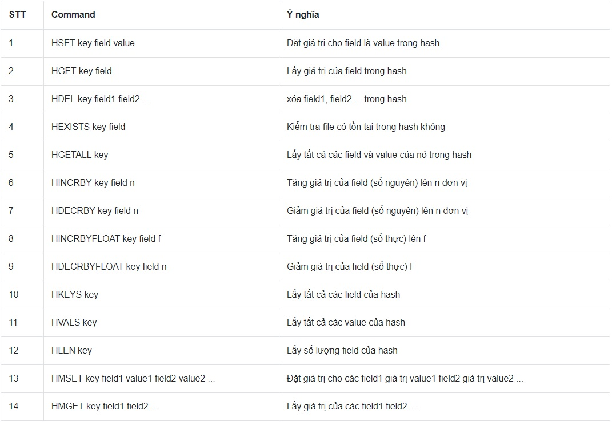

# REDIS

## NGƯỜI THỰC HIỆN

* Họ tên: Trần Kiến Quốc (QuocTk)
* Vị trí: Software Development Fresher

<br/>

## MỤC LỤC

- [INSTALLATION](#A)
  - [Các version ổn định](#A1)
  - [Cài đặt & cấu hình Redis server SINGLE](#A2)
  - [Cấu hình Redis server CLUSTER](#A3)
- [DATA TYPES](#B)
  - [Các kiểu dữ liệu của Redis](#B1)
  - [Các lệnh cơ bản trong Redis](#B2)
- [PUB/SUB (Cách sử dụng)](#C)
- [LOCK](#D)
  - [Khái niệm về Lock](#D1)
  - [Phân biệt Pessimistic locking và Optimistic locking](#D2)
  - [Khái niệm Distributed lock](#D3)
  - [Thuật toán Redlock của Redis](#D4)
- [NGUỒN THAM KHẢO](#E)

<br/>

<span name="A"></span>

## INSTALLATION

<span name="A1"></span>

1. Các version ổn định
    * Version ổn định mới nhất: Redis 5.0.5
    * Version ổn định cũ hơn: Redis 2.8.13, 3.0, 3.2,..., 4.8
    * Cách xác định một version Redis ổn định hay không: Redis sử dụng `major.minor.patchlevel` để xác định version của mình. Phiên bản ổn định sẽ có `minor` là số `chẵn` như 1.2, 2.0, 2.2, 2.4, 2.6. Trong khi phiên bản có `minor` là số `lẻ` thì đó là phiên bản không ổn định; chẳng hạn, phiên bản 2.9 là không ổn định và sẽ là tiền đề để phát triển bản 3.0 ổn định. Còn con số ở `patchlevel` thể hiện số thời điểm fix các lỗi từ phiên bản không ổn định. Khi `patchlevel` lên đến 101 thì `minor sẽ được +1` (Ví dụ: 2.7.101 = 2.8.1, 2.7.105 = 2.8.5).
    * Phiên bản không ổn định: Có thể chứa các lỗi nghiêm trọng, các tính năng không hoàn toàn sẵn sàng và có thể không ổn định suốt quá trình sử dụng. Tuy nhiên, Redis vẫn cố gắng hết sức để đảm bảo rằng ngay cả phiên bản không ổn định cũng có thể sử dụng được hầu hết thời gian trong môi trường phát triển mà không gặp vấn đề lớn (để phát triển cao hơn là phiên bản ổn định).

<span name="A2"></span>

2. Cài đặt & cấu hình Redis server `single`
     * Tải file, giải nén và cài đặt
        ```
        $ wget http://download.redis.io/releases/redis-5.0.5.tar.gz
        $ tar xzf redis-5.0.5.tar.gz
        $ cd redis-5.0.5
        $ make

        Nếu bạn không thể make, hãy cài đặt với lệnh bên dưới:
        $ sudo apt-get install build-essential
        ```
    * Di chuyển file redis-server và redis-cli đến thư mục */usr/local/bin* để bạn có thể xài ở bất kỳ vị trí hiện hành nào mà không cần phải vào thư mục **...../redis-5.0.5/src** để dùng **./redis-server**.
        ```
        sudo cp -b src/redis-server /usr/local/bin
        sudo cp -b src/redis-cli /usr/local/bin

        (-b nghĩa là tạo bản backup file đích ngay trên thư mục bin với tên và format file khác nếu đã có 1 file đích cùng tên đã nằm ở bin trước đó)
        ```
    * Kiểm tra version hiện tại của Redis
        ```
        redis-server -v
        redis-cli -v
        ```
    * Chạy Redis server
        ```
        $ redis-server
        ```
    * Tương tác với server thông qua Redis client
        ```
        $ redis-cli
        redis> set foo bar
        OK
        redis> get foo
        "bar"
        ```

<span name="A3"></span>

3. Cấu hình Redis server `cluster`
    * **CÁCH 1**
        * Sao chép thư mục redis-3-nodes vào thư mục redis-5.0.5. Trong thư mục redis-3-nodes chứa 6 thư mục và 6 file nodes.conf, với tên được đặt là số port từ 7001 đến 7006. Đặc biệt, nội dung trong nodes.conf đã được viết sẵn như bên dưới.
            ```
            VÍ DỤ FILE 7001.conf:
                port 7001
                cluster-enabled yes
                cluster-config-file 7001.conf
                cluster-node-timeout 15000
                appendonly yes
            ```

        * Mở 6 tab terminal và mỗi terminal sẽ chạy một nodes.conf 
            ```
            redis-server redis-3-nodes/7001/7001.conf
            redis-server redis-3-nodes/7002/7002.conf
            ...
            ...
            redis-server redis-3-nodes/7006/7006.conf
            ```

        * Mở một terminal mới (terminal thứ 7) và thực hiện lệnh tạo cluster
            ```
            redis-cli --cluster create 127.0.0.1:7001 127.0.0.1:7002 127.0.0.1:7003 127.0.0.1:7004 127.0.0.1:7005 127.0.0.1:7006 --cluster-replicas 1
            ```

        * Sau khi tạo cluster thành công, bạn sẽ nhận thông điệp ***[OK] All 16384 slots covered***

            

        * Mở một terminal mới (terminal thứ 8) để test cùng với terminal thứ 7
            ```
            TERMINAL THỨ 7:
                redis-cli -c -p 7001
                set foo bar
                set loop boost

            TERMINAL THỨ 8:
                redis-cli -c -p 7002
                get foo
                get loop
            ```
            
            

            *Ảnh ví dụ "set foo bar" và "get foo". Để thoát redis-cli, gõ "exit" và redis-server, ấn Ctrl+C.*

    * **CÁCH 2**
        * Dịch chuyển đến thư mục create-cluster của redis-5.0.5
            ```
            cd <redis-distribution-path>/utils/create-cluster/
            ```

        * Khởi chạy Redis bằng create-cluster với 6 nodes có port lần lượt 30001, 30002, 30003, 30004, 30005 và 30006 theo mặc định.
            ```
            ./create-cluster start
            ./create-cluster create
            ```
        * Dừng Redis:
            ```
            ./create-cluster stop
            ```
        * Khởi chạy Redis client theo port có sẵn:
            ```
            $ redis-cli -c -p 30001
            ```
    * Xem thêm hướng dẫn, các thông tin khác [tại đây](https://redis.io/topics/cluster-tutorial).

<br/>

<span name="B"></span>

## DATA TYPES

<span name="B1"></span>

1. Các kiểu dữ liệu của Redis: 
    * String, Hash, List, Set, Sorted Set và Hyperloglog. Xem thêm tính chất của mỗi cấu trúc [tại đây.](https://redis.io/topics/data-types-intro?fbclid=IwAR28yqWDZfw74DvAJ5ZIRQg2h-fD6SbiqGnv54Jn7F-bfAowx6CMY-Vtv10)
        
        

<span name="B2"></span>

2. Các lệnh cơ bản trong Redis
    * Redis Key
        ```
        COMMAND KEY_NAME [VALUE]
        ```

        

    * Redis String
        ```
        [EXAMPLE]
        
        redis 127.0.0.1:6379> SET test redis
        OK
        redis 127.0.0.1:6379> GET test
        "redis"
        ```

        

    * Redis Hash
        ```
        [EXAMPLE]

        HSET user:1 name "name 1"
        (integer) 1
        HGET user:1 name
        "name 1"
        ```

        

<br/>

<span name="C"></span>

## PUB/SUB (Cách sử dụng)

* PUB: PUBLISH (Đẩy dữ liệu vào 1 kênh).
* SUB: SUBSCRIBE (Đăng kí vào 1 kênh).
* Ta thực hiện việc đặt người dùng (SUB) vào 1 kênh (ở đây kênh này là số bản tin mới). Khi có một bản tin được thêm vào hệ thống, Redis sẽ tự động phát sinh sự kiện (PUB), sự kiện (PUB) này chúng ta có thể bắt được nhờ vào Redis cung cấp, ta thực hiện xử lý số liệu để cập nhật cho người dùng.

    

    *Ảnh minh họa mô hình Pub/Sub.*

    [](https://www.youtube.com/watch?time_continue=13&v=GkbOxyFwVps)

    *Video minh họa cách sử dụng Pub/Sub.*

* Một vài lệnh tiêu biểu:
    ```
    SUBSCRIBE channel01 channel02 [more channel...]
    UNSUBSCRIBE channel01 channel02 [more channel...]

    PSUBSCRIBE channel* [pattern...]
    PUNSUBSCRIBE channel* [pattern...]

    PUBLISH channel message
    ```    

<br/>

<span name="D"></span>

## LOCK

<span name="D1"></span>

1. Khái niệm về Lock (Khóa)
    * Trong khoa học máy tính, khóa hoặc Mutex là một cơ chế đồng bộ hóa để thực thi các giới hạn truy cập vào tài nguyên đồng thời trong môi trường có nhiều luồng thực thi. 
    * Mỗi luồng phải lấy khóa thành công rồi mới truy cập vào dữ liệu tương ứng.
    * Loại khóa đơn giản nhất chính là semaphore nhị phân (Semaphore s = 1, gần giống Mutex). Nó cung cấp quyền truy cập duy nhất cho mỗi luồng tại mỗi thời điểm nhất định.
    * Có 3 hiện tượng về khóa:
        * Lock overhead: Tài nguyên được bổ sung cho việc sử dụng khóa, như không gian bộ nhớ được phân bổ cho khóa, thời gian CPU để khởi tạo và phá hủy khóa, thời gian để lấy hoặc giải phóng khóa. Chương trình sử dụng càng nhiều khóa, càng nhiều chi phí được sử dụng.
        * Lock contention: Điều này xảy ra bất cứ khi nào một tiến trình hoặc luồng cố gắng có được khóa được giữ bởi tiến trình hoặc luồng khác. Các khóa có sẵn có độ hẹp nhỏ thì càng ít khả năng một tiến trình/luồng yêu cầu khóa được giữ bởi thằng khác. Ví dụ: Khóa một hàng thay vì toàn bộ bảng hoặc khóa một ô chứ không phải toàn bộ hàng.
        * Deadlock: Ít nhất hai nhiệm vụ đang chờ khóa mà nhiệm vụ này lại giữ khóa nhiệm vụ kia và ngược lại. Trừ khi một nhiệm vụ nào đó được thực hiện, nếu không hai nhiệm vụ sẽ chờ đợi truy xuất tài nguyên mãi mãi.
    
<span name="D2"></span>

2. Phân biệt Pessimistic locking và Optimistic locking
    * Ngắn gọn về 2 khóa: Quản lý hành động của nhiều người dùng đồng thời trên cơ sở dữ liệu. Mục đích là để ngăn chặn các cập nhật bị mất và đọc bẩn (Dirty reads).
    * Pessimistic Locking:
        * Một người dùng đọc bản ghi với ý định cập nhật nó sẽ đặt một khóa độc quyền vào bản ghi để ngăn người dùng khác thao tác nó. Điều này có nghĩa là không ai khác có thể thao tác bản ghi đó cho đến khi người dùng hiện tại giải phóng khóa. 
        * Nhược điểm: Những người dùng khác có thể bị khóa trong một thời gian rất dài. Do đó, phương pháp này làm chậm phản ứng tổng thể của hệ thống và gây ra sự thất vọng.
        * Chủ yếu được sử dụng trong môi trường có rất rất nhiều sự tranh chấp tài nguyên đồng thời xảy ra. Chi phí cho việc bảo vệ dữ liệu này (giữ khóa) sẽ ít hơn việc rollback các transaction nếu xung đột đồng thời xảy ra.
        * Phương pháp đòi hỏi một kết nối liên tục đến cơ sở dữ liệu và các bản ghi có thể bị khóa trong khoảng thời gian tương đối lớn. Nó không thích hợp để sử dụng trong phát triển ứng dụng Web khi có nhiều lượt truy cập tài nguyên liên tục và đồng thời, cũng như kết nối khó giữ nguyên liên tục.
        * Nếu như thời gian giữ khóa ít thì phương pháp này sẽ tốt hơn nhiều.
    * Optimistic Locking:
        * Đảm bảo nhiều giao dịch có thể hoàn thành mà không ảnh hưởng tới nhau, các transaction tiến hành mà không cần khóa các tài nguyên lại.
        * Thay vì khóa một row ngay khi nó được thay đổi, OL sẽ đợi đến khi row đó được commit thì mới bắt đầu khóa và cập nhật dữ liệu.
        * Trước khi commit, mỗi transaction sẽ kiểm tra lại xem dữ liệu của nó có bị transaction khác đã làm thay đổi không, nếu có thì sẽ quay trở lại trạng thái lúc đầu (rollback).
        * OL cải thiện hiệu suất cơ sở dữ liệu bằng cách giảm số lượng khóa cần thiết, do đó giảm tải cho máy chủ cơ sở dữ liệu.
        * OL hoạt động hiệu quả với các bảng yêu cầu cập nhật hạn chế do không có người dùng nào bị khóa. Tuy nhiên, một số cập nhật có thể thất bại. 
        * Nhược điểm: Lỗi cập nhật liên tục nếu khối lượng yêu cầu cập nhật lớn từ nhiều người dùng đồng thời.
        * Phương pháp phù hợp trong các môi trường có sự tranh chấp dữ liệu thấp hoặc khi cần truy cập chỉ đọc vào dữ liệu.
        * Phương pháp được sử dụng rộng rãi trong .NET để giải quyết các nhu cầu của ứng dụng di động và ngắt kết nối, mà việc khóa các hàng dữ liệu trong thời gian dài cần kết nối liên tục sẽ không thể thực hiện được nếu giữa chừng kết nối bị ngắt. 

<span name="D3"></span>

3. Khái niệm Distributed lock
    * Distributed lock được sử dụng để hoạt động với các tài nguyên chia sẻ theo cách loại trừ lẫn nhau (Mutual Exclusion). Tức là tại một thời điểm, chỉ có một đối tượng kiểm soát được tài nguyên.
    * Thay vì có một khóa chỉ được biết bởi các luồng trong cùng một tiến trình, hoặc các tiến trình trên cùng một máy thì DL sử dụng khóa mà các máy client Redis khác nhau đang chạy trên các máy vật lý khác nhau có thể acquire và release. 

<span name="D4"></span>

4. Thuật toán Redlock của Redis
    * Redlock là thuật toán thích hợp để cài đặt Distributed Lock Manager. Các loại cài đặt thuật toán này cùng với ngôn ngữ lập trình tương ứng:
        * Redlock-rb (Ruby implementation).
        * Redlock-py (Python implementation).
        * Aioredlock (Asyncio Python implementation).
        * Redlock-php (PHP implementation).
        * PHPRedisMutex (further PHP implementation)
        * Cheprasov/php-redis-lock (PHP library for locks).
        * Redsync.go (Go implementation).
        * Redisson (Java implementation).
        * Redis::DistLock (Perl implementation).
        * Redlock-cpp (Cpp implementation).
        * Redlock-cs (C#/.NET implementation).
        * RedLock.net (C#/.NET implementation).
        * ScarletLock (C# .NET implementation with configurable datastore)
        * Node-redlock (NodeJS implementation).
    * Ta sẽ lock trên tất cả các master đang giữ tài nguyên (Giả sử có N=5 instance):
        * Lấy thời gian hiện tại T0 theo miliseconds.
        * Thử lock tuần tự trên tất cả các instance với cùng giá trị key và random_value. Trong suốt quá trình này, client sử dụng time-out để tránh liên lạc quá lâu với những node không hoạt động và chuyển sang node tiếp theo.
        * Client tính thời gian trôi qua để thu giữ lock bằng cách trừ thời gian hiện tại với thời gian T0 ở bước 1. Chỉ khi client có khả năng lock phần lớn các instance (ít nhất 3 - theo công thức (N/2+1)) và tổng thời gian trôi qua để thu giữ lock nhỏ hơn thời gian lock có hiệu lực thì lock đó coi như đã được giữ.
        * Nếu client thất bại khi thu giữ lock, nó unlock trên tất cả các instance (ngay cả những instance mà nó vẫn chưa tạo được lock).

<br/>

<span name="E"></span>

## NGUỒN THAM KHẢO
1. <https://redis.io/documentation>
2. <https://redis.io/download>
3. <https://redis.io/topics/quickstart>
4. <https://redis.io/topics/cluster-tutorial>
5. <https://redis.io/topics/data-types-intro>
6. <https://try.redis.io/>
7. <https://redis.io/topics/pubsub>
8. <https://en.wikipedia.org/wiki/Lock_(computer_science)>
9. <https://redis.io/topics/distlock>
10. <https://blog.duyet.net/2015/06/cac-lenh-co-ban-va-quan-ly-du-lieu-trong-redis.html#.XR7HiOgzaUk>
11. <https://www.rubysg.com/2015/12/03/co-che-pubsub-tren-redis-va-cach-su-dung/>
12. <https://redislabs.com/ebook/part-2-core-concepts/chapter-6-application-components-in-redis/6-2-distributed-locking/>
13. <https://dotrungduchd.wordpress.com/2017/10/07/redis-introduction/>
14. <https://dodangquan.blogspot.com/2018/07/su-dung-lock-trong-he-thong-phan-tan-voi-redis.html>