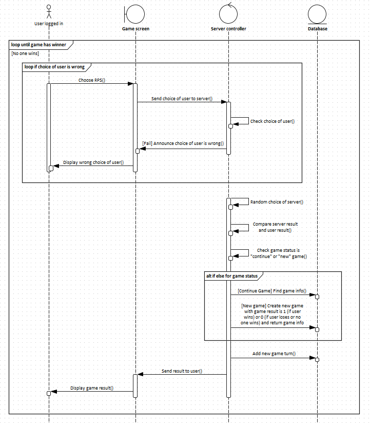

# BÀI TẬP - OẲN TÙ TÌ

## NGƯỜI THỰC HIỆN

* Họ tên: Trần Kiến Quốc (QuocTk)
* Vị trí: Software Development Fresher

 

## THỰC HIỆN ĐỀ BÀI

### DATA MODEL

Có 3 bảng: Accounts, Games và gameTurns (Bảng chi tiết về lượt chơi)

Một tài khoản (user) chỉ cần thông tin là username và password để đăng nhập và chơi, không cần thêm bất kì thông tin khác. 

Mỗi người như vậy sẽ có lịch sử Games và gameTurns mà họ đã từng chơi. Khi họ bắt đầu chơi Games, 1 dòng dữ liệu mới sẽ được thêm vào bảng Games với gameResult mặc định là 0 (0 nghĩa là thua). Nếu user chơi thắng thì gameResult sẽ được cập nhật lại thành 1. Trường hợp hòa không được xét đến ở đây bởi vì oẳn tù tì bắt buộc luôn có 1 người thắng, 1 người thua. 

Bên cạnh bảng Games lưu trữ thông tin về game đó, ngày đó mà user đã chơi, mà còn có bảng gameTurns thể hiện các thông tin chi tiết về lượt chơi của user. Giải thích một vài trường thông tin của bảng gameTurns:
* userResult: Kết quả chơi của user (0: Kéo, 1: Búa, 2: Bao)
* machineResult: Kết quả chơi của máy, thực hiện theo hình thức random (0: Kéo, 1: Búa, 2: Bao)
* turnType: Kiểu lượt chơi (0: Là lượt chơi tranh đấu theo kết quả thắng hoặc thua, 1: Là lượt chơi bổ sung khi trường hợp hòa xảy ra)
* turnDate: Thời điểm user thực hiện lượt chơi của mình

### ARCHITECTURE

Client gửi/nhận thông tin thông qua giao thức HTTP (dữ liệu được xác định bởi dạng JSON) hoặc gRPC (dữ liệu được xác định bởi dạng Protocol Buffers). Phía Server nhận được hoặc gửi thông tin đến Client thông qua Controller của nó. Nếu cần truy cập dữ liệu từ CSDL (MySQL), Controller truy cập đến Model để yêu cầu/nhận dữ liệu từ nó. Về phía Model, nó là nơi trực tiếp truy cập vào CSDL để thao tác, truy vấn dữ liệu.

### SEQUENCE DIAGRAM

`SYSTEM USECASE OF RPS`

`LOGIN SEQUENCE DIAGRAM OF RPS`

`REGISTER SEQUENCE DIAGRAM OF RPS`

`PLAY GAME SEQUENCE DIAGRAM OF RPS`

`SEE TOP PLAYERS SEQUENCE DIAGRAM OF RPS`

`SEE GAME HISTORY SEQUENCE DIAGRAM OF RPS`

### DỮ LIỆU CỦA BÀI TẬP

* Thư mục `./design` gồm:
    * architecture_quoctk.pptx: File thiết kế hình ảnh Architecture của RPS.
    * datamodel_quoctk.vpp: File thiết kế data model của RPS.
    * rps_quoctk.sql: File định nghĩa cấu trúc lưu trữ CSDL của RPS.
    * sequence_diagram_quoctk.EAP: File thiết kế các sơ đồ sequence cho các mục tính năng của RPS.
* Thư mục `./RockPaperScissor` chứa source code của chương trình.

### CÔNG CỤ

* Chương trình RPS sử dụng Eclipse IDE để thực thi và cài đặt.
* Sử dụng JMeter để thực hiện performance test.
* Sử dụng Postman để test các API triển khai theo HTTP và BloomRPC để test các API triển khai theo gRPC.
* Unit test với Line coverage trên 80% thông qua plugin ElcEmma của Eclipse hỗ trợ & kết hợp tự code, chạy thử nghiệm.

### KẾT QUẢ UNIT TEST 

Kết quả unit test với line coverage đạt được 92.9% cho folder `src/main/java` (Nơi chứa toàn bộ code vận hành chương trình RPS).

### PERFORMANCE TEST

### DEFECT/DISADVANTAGE/FAIL

* *Kết quả bài tập không có cài đặt JWT cho gRPC.*
