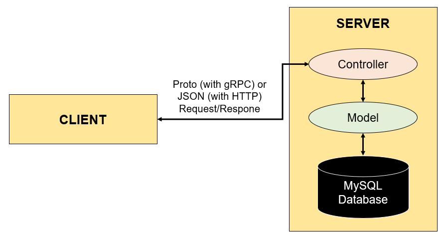

# BÀI TẬP - OẲN TÙ TÌ

## NGƯỜI THỰC HIỆN

* Họ tên: Trần Kiến Quốc (QuocTk)
* Vị trí: Software Development Fresher

 

## THỰC HIỆN ĐỀ BÀI

### DATA MODEL

Có 3 bảng: Accounts, Games và gameTurns (Bảng chi tiết về lượt chơi)

Một tài khoản (user) chỉ cần thông tin là username và password để đăng nhập và chơi, không cần thêm bất kì thông tin khác. 

Mỗi người như vậy sẽ có lịch sử Games và gameTurns mà họ đã từng chơi. Khi họ bắt đầu chơi Games, 1 dòng dữ liệu mới sẽ được thêm vào bảng Games với gameResult mặc định là 0 (0 nghĩa là thua). Nếu user chơi thắng thì gameResult sẽ được cập nhật lại thành 1. Trường hợp hòa không được xét đến ở đây bởi vì oẳn tù tì bắt buộc luôn có 1 người thắng, 1 người thua. 

Bên cạnh bảng Games lưu trữ thông tin về game đó, ngày đó mà user đã chơi, mà còn có bảng gameTurns thể hiện các thông tin chi tiết về lượt chơi của user. Giải thích một vài trường thông tin của bảng gameTurns:
* userResult: Kết quả chơi của user (0: Kéo, 1: Búa, 2: Bao)
* machineResult: Kết quả chơi của máy, thực hiện theo hình thức random (0: Kéo, 1: Búa, 2: Bao)
* turnType: Kiểu lượt chơi (0: Là lượt chơi tranh đấu theo số lượt chơi đã đề ra hồi ban đầu, 1: Là lượt chơi bổ sung khi trường hợp hòa xảy ra)
* turnDate: Thời điểm user và server hiển thị ra kết quả chơi.

### ARCHITECTURE

Bất kì thao tác nào của Client (Gửi/Nhận thông tin) đều thông qua Controller nội tại của nó. Phía Server nhận được hoặc gửi thông tin đến Client sẽ thông qua Controller của nó. Sau đó, Controller truy cập đến Model để yêu cầu/nhận dữ liệu từ nó. Model sẽ là nơi trực tiếp truy cập vào Database để thao tác Database.

### SEQUENCE DIAGRAM

