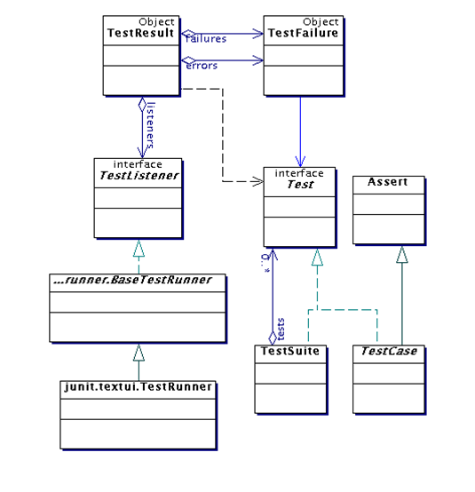
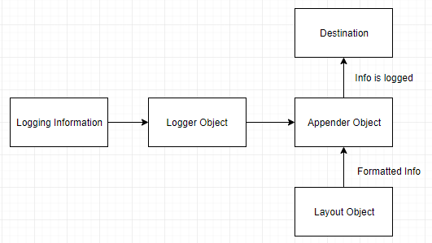
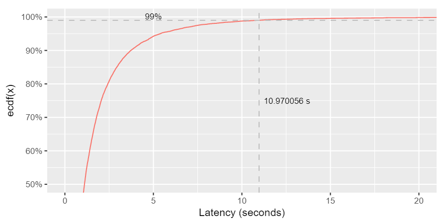
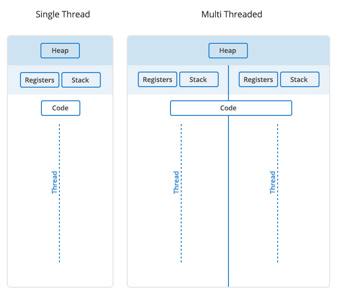
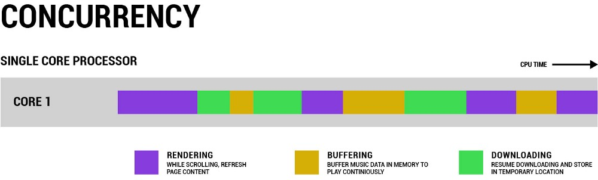
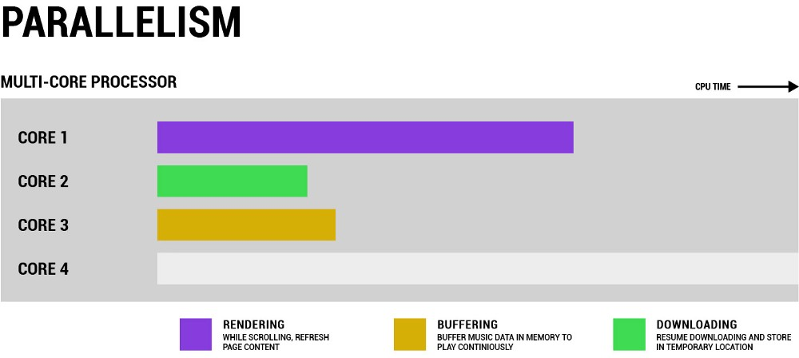

# LÝ THUYẾ

## NGƯỜI THỰC HIỆN

* Họ tên: Trần Kiến Quốc (QuocTk)
* Vị trí: Software Development Fresher

<br/>

## MỤC LỤC

- [Unit Test/Logging/Performance](#A)
  - [Unit test](#A1)
  - [Logging](#A2)
  - [Throughput, latency, P99](#A3)
- [Threading](#B)
  - [Thread](#B1)
  - [Multithreading](#B2)
  - [Concurrency & Parallelism](#B3)
  - [Thread-safety trong java? Làm sao để đạt được?](#B4)
  - [Thread pool](#B5)
  - [Executors](#B6)
- [Networking](#C)
  - [Connection pooling](#C1)
  - [Caching? (Caching với guava, redis)](#C2)
  - [Protocol (HTTP, Websocket, gRPC)](#C3)
  - [SSL/TLS](#C4)
  - [RESTful API](#C5)
- [Benchmark](#D)
  - [Khái niệm](#D1)
  - [Tool hỗ trợ benchmark, so sánh ưu và nhược](#D2)
- [JVM](#E)
  - [Khái niệm JVM & cách hoạt động](#E1)
  - [Khái niệm JRE & JDK](#E2)
- [NGUỒN THAM KHẢO](#F)

<br/>

<span name="A"></span>

## Unit Test/Logging/Performance

<span name="A1"></span>

1. Unit test

    * Đoạn mã được lập trình cần phải được kiểm tra để xác định hành vi, trạng thái, kết quả, các ràng buộc của đối tượng của nó có như mong muốn của mình.
    * Tỷ lệ phần trăm đoạn mã được kiểm tra được gọi là **test coverage**.
    * Đoạn mã được kiểm tra thường là: method, class, function,...
    * Vòng đời Unit Test: Fail (Lỗi), Ignore (Tạm ngưng thực hiện), Pass (Trạng thái làm việc, thành công).
    * Hiệu quả khi: Vận hành đoạn mã được lặp lại nhiều lần, tự động hoàn toàn, độc lập với các UT khác.
    * Lợi ích:
        * Kiểm tra bất kỳ đoạn code nào, thăm dò để phát hiện lỗi, khắc phục lỗi.
        * Phát hiện các thuật toán thực thi không hiệu quả, các thủ tục chạy vượt quá giới hạn thời gian.
        * Phát hiện các vấn đề về thiết kế, xử lý hệ thống, thậm chí các mô hình thiết kế.
        * Tăng sự tự tin khi hoàn thành một công việc. Chúng ta thường có cảm giác không chắc chắn về các đoạn mã của mình như liệu các lỗi có quay lại không, hoạt động của module hiện hành có bị tác động không, hoặc liệu công việc hiệu chỉnh mã có gây hư hỏng đâu đó,...
    * Lưu ý: Phân tích các tình huống có thể xảy ra đối với mã. Đừng bỏ qua các tình huống tồi tệ nhất có thể xảy ra, thí dụ dữ liệu nhập làm một kết nối cơ sở dữ liệu thất bại, ứng dụng bị treo vì một phép toán chia cho không, các thủ tục đưa ra lỗi ngoại lệ sai có thể phá hỏng ứng dụng một cách bí ẩn. Do đó, cần phải có Unit Test kết hợp sự phân tích kỹ lưỡng.
    * Một vài từ khóa cần lưu ý:
        * Assertion: Gồm một vài lệnh như AreEqual(), IsTrue(), IsNotNull(),... Là thứ kiểm tra dữ liệu đầu ra, tính chính xác của các lỗi ngoại lệ ra và các vấn đề phức tạp khác như: Sự tồn tại của một đối tượng; Các giá trị có vượt ra ngoài giới hạn hay không; Thứ tự thực hiện của các luồng dữ liệu,...
        * Test Point: Là một đơn vị kiểm tra nhỏ nhất, chỉ chứa đơn giản một assertion nhằm khẳng định tính đúng đắn của một chi tiết mã nào đó
        * Test Case: Là một tập hợp các test point nhằm kiểm tra một đặc điểm chức năng cụ thể, chẳng hạn: Toàn bộ giai đoạn người dùng nhập dữ liệu cho đến khi thông tin được chuyển vào cơ sở dữ liệu, tất cả các bước nhỏ bên trong đều cần được thiết lập nhiều kiểm tra (nhiều test point).
        * Test Suite: Là một tập hợp các test case định nghĩa cho từng module hoặc hệ thống con.
        * Regression Testing (hoặc Automated Testing): Là phương pháp kiểm nghiệm tự động bằng việc sử dụng một phần mềm đặc biệt.
    * JUnit: 
        * Là một framework đơn giản dùng cho việc tạo các unit testing tự động, và chạy các test có thể lặp đi lặp lại. 
        *  JUnit là một chuẩn trên thực tế cho unit testing trong Java. 
        * JUnit về nguồn gốc được viết bởi 2 tác giả Erich Gamma và Kent Beck.
        * TestRunner sẽ chạy các test và trả về kết quả là các Test Results.
        * Test case: Định nghĩa môi trường mà nó có thể sử dụng để chạy nhiều test khác nhau.
        * TestSuite: Là chạy một tập các test case và nó cũng có thể bao gồm nhiều test suite khác, test suite chính là tổ hợp các test.
        
        
        *(Kiến trúc tổng quan)*
    * Cách viết một test case:
        ```
        --------------------------
        ===>>> CLASS PERSON <<<===
        --------------------------

        public class Person {  
            private String firstName;  
            private String lastName;  
            public Person(String firstName, String lastName) {  
                if (firstName == null && lastName == null) {  
                    throw new IllegalArgumentException("Both names cannot be null");  
                }  
                this.firstName = firstName;  
                this.lastName = lastName;  
            }  
            public String getFullName() {  
                String first = (this.firstName != null) ? this.firstName : "?";
                String last = (this.lastName != null) ? this.lastName : "?";  
                return first + last;  
            }  
            public String getFirstName() {  
                return this.firstName;  
            }  
            public String getLastName() {  
                return this.lastName;  
            }  
        }  

        ------------------------------------
        ===>>> MỘT TEST CASE ĐƠN GIẢN <<<===
        ------------------------------------

        import junit.framework.TestCase;  
        public class TestPerson extends TestCase {  
            public TestPerson(String name) {  
                super(name);  
            }  
            /** 
                * Xac nhan rang name duoc the hien dung dinh dang 
            */  
            public void testGetFullName() {  
                Person p = new Person("Aidan", "Burke");  
                assertEquals("Aidan Burke", p.getFullName());  
            }  
            /** 
            * Xac nhan rang nulls da duoc xu ly chinh xac 
            */  
            public void testNullsInName() {  
                Person p = new Person(null, "Burke");  
                assertEquals("? Burke", p.getFullName());  
                p = new Person("Tanner", null);  
                assertEquals("Tanner ?", p.getFullName());  
            }  
        }

        -------------------
        ===>>> LƯU Ý <<<===
        -------------------

        Mỗi unit test là một phương thức public và không có tham số, được bắt đầu bằng tiếp đầu ngữ test. Nếu bạn không tuân theo quy tắc đặt tên này thì JUnit sẽ không xác định được các phương thức test một các tự động.
        
        -----------------------------------------------
        ===>>> KHỞI CHẠY TEST CASE BẰNG HÀM MAIN <<<===
        -----------------------------------------------

        public class TestPerson extends TestCase {  
            ...Method/Function/...

            public static void main(String [args) {  
                junit.textui.TestRunner.run(new TestSuite(TestPerson.class))  
            }  
        }
        ```
    * Các phương thức Assert:
        * Các phương thức assertXXX() được dùng để kiểm tra các điều kiện khác nhau.
        * junit.framework.TestCase, lớp cha cho tất cả các test case, thừa kế từ lớp junit.framework.Assert
        * Các phương thức assertXXX() khác nhau có trong lớp junit.framework.Assert:
            * assertEquals(): So sánh 2 giá trị để kiểm tra bằng nhau. Test sẽ được chấp nhận nếu các giá trị bằng nhau.
            * assertFalse(): Đánh giá biểu thức luận lý. Test sẽ được chấp nhận nếu biểu thức sai.
            * assertTrue(): Đánh giá một biểu thức luận lý. Test sẽ được chấp nhận nếu biểu thức đúng.
            * assertNotNull(): So sánh tham chiếu của một đối tượng với null. Test sẽ được chấp nhận nếu tham chiếu đối tượng khác null.
            * assertNull(): So sánh tham chiếu của một đối tượng với giá trị null. Test sẽ được chấp nhận nếu tham chiếu là null.
            * assertNotSame(): So sánh địa chỉ vùng nhớ của 2 tham chiếu đối tượng bằng cách sử dụng toán tử ==. Test sẽ được chấp nhận nếu cả 2 đều tham chiếu đến các đối tượng khác nhau.
            * assertSame(): So sánh địa chỉ vùng nhớ của 2 tham chiếu đối tượng bằng cách sử dụng toán tử ==. Test sẽ được chấp nhận nếu cả 2 đều tham chiếu đến cùng một đối tượng.
        * Ví dụ:
            ```
            assertEquals(employeeA, employeeB);  
            
            assertEquals(“Employees should be equal after the clone() operation.”, employeeA, employeeB);
            ```
        * Lưu ý: Mỗi phương thức assertXXX() nên kiểm tra một chức năng riêng biệt, hạn chế gộp chung. Vì nếu phương thức assertXXX() thất bại, phần còn lại của test sẽ không được thi hành. Nếu bạn cần kiểm tra một dãy các điều kiện và các test theo sau sẽ luôn thất bại nếu có một test đầu tiên thất bại, khi đó bạn có thể kết hợp nhiều phương thức assert vào trong một test. Còn không có sự nối tiếp kết quả với nhau thì mỗi test là phải riêng biệt. Ví dụ:
            ```
            -------------------------------------
            ===>>> KHÔNG TỐT KHI GỘP CHUNG <<<===
            -------------------------------------

            public void testGame() throws BadGameException {  
                Game game = new Game();  

                Ship fighter = game.createFighter(“001”);  

                assertEquals("Fighter did not have the correct identifier", "001", this.fighter.getId());  

                Ship fighter2 = this.game.createFighter("001");  

                assertSame("createFighter with same id should return same object", fighter, fighter2);  

                assertTrue("A new game should not be started yet", !this.game.isPlaying());  
            }  

            --------------------------------------
            ===>>> NÊN TÁCH RA THÀNH ĐƠN LẺ <<<===
            --------------------------------------

            public void testCreateFighter() {  
                System.out.println("Begin testCreateFigher()"); 

                assertEquals("Fighter did not have the correct identifier", "001", this.fighter.getId());  

                System.out.println("End testCreateFighter()");  
            }  

            public void testSameFighters() {  
                System.out.println("Begin testSameFighters()");  

                Ship fighter2 = this.game.createFighter("001"); 

                assertSame("createFighter with same id should return same object", this.fighter, fighter2);  

                System.out.println("End testSameFighters()");  
            }  

            public void testGameInitialState() {  
                System.out.println("Begin testGameInitialState()"); 

                assertTrue("A new game should not be started yet", !this.game.isPlaying());  

                System.out.println("End testGameInitialState()");  
            }
            ```

<span name="A2"></span>

2. Logging
    * Trong ứng dụng Java của bạn, bạn muốn viết code để ghi ra thông điệp của ứng dụng trong quá trình làm việc của nó? Bạn có thể sử dụng một trong 3 thư viện Logger sau: `Log4J Logger`, `Jdk14 Logger`, `Simple Logger`.
    
    * Log là một quá trình ghi lại những thông tin được thông báo, lưu lại trong quá trình hoạt động của một ứng dụng ở một nơi tập trung. Mục đích chính là để có thể xem lại các thông tin hoạt động của ứng dụng trong quá khứ như debug khi có lỗi xảy ra, check health, xem info, error, warning,...
    * Phân loại log (Log level):
        * All: đây là cấp độ thấp nhất, Logger và Appender được định nghĩa với cấp độ này, mọi thông tin cần log sẽ được log.
        * Debug: các thông tin dùng để debug, chúng ta có thể bật/tắt log này dựa vào mode của application.
        * Info: các thông tin mà bạn muốn ghi nhận thêm trong quá trình hoạt động của hệ thống. Ví dụ: log số lượng request, status, duration,... để biết traffic của hệ thống thế nào.
        * Warning: log các thông tin cảnh báo của chương trình.
        * Error: các lỗi khi chạy chương trình sẽ được log. Cố gắng log toàn bộ thông tin liên quan nhiều nhất có thể để có thể reproduce lại được mà ít tốn thời gian nhất.
        * Fatal: log các lỗi nghiêm trọng xảy ra trong chương trình, có thể làm cho chương trình không sử dụng được nữa.
        * Off: đây là cấp độ cao nhất, được sử dụng khi chúng ta không muốn log bất kỳ thông tin nào nữa.
    * Độ ưu tiên của các cấp độ log từ thấp đến cao như sau: `ALL < DEBUG < INFO < WARN < ERROR < FATAL < OFF`
    * Log rotate: Là việc cắt nhỏ log ra và lưu trữ trên nhiều file thay vì một file. Một số chiến lược cho Log rotate:
        * Lưu file log riêng theo từng ngày, tuần hoặc tháng.
        * File log sẽ chia theo loại log (file info, file error, file fatal,...)
        * File log sẽ cắt theo dung lượng file. Ví dụ: mỗi file tối đa 100 MB.
        * Một số chiến lược khác tùy theo yêu cầu của ứng dụng (Tùy sự định nghĩa/mong muốn của mình)
    * Giới thiệu sơ lược Apache Log4j:
        * `Apache Log4j` hay ngắn gọn là `Log4j` là một thư viện được cung cấp bởi Apache hỗ trợ ghi log được viết bằng ngôn ngữ Java.
        * Các thành phần chính:
            * **Logger:** Chịu trách nhiệm thu thập thông tin log.
            * **Appender:** Chịu trách nhiệm ghi log tới các vị trí đã được cấu hình (file, console). Các loại Appender: SyslogAppendersends, SMTPAppender, JDBCAppender, FileAppender, SocketHubAppender, SocketAppender, TelnetAppender, ConsoleAppender, JMSAppender,...
            * **Layout:** Chịu trách nhiệm định dạng (format) kết quả log. Các loại Layout: PatternLayout, SimpleLayout, XMLLayout, HTMLLayout.
            
        * Tính năng cơ bản: Thread safe; Tối ưu cho tốc độ; Hỗ trợ nhiều output (file + console); Hỗ trợ nhiều level log: ALL, TRACE, INFO, WARNING, ERROR, FATAL.
        * Cấu hình và cách sử dụng Log4j trong Java: Xem chi tiết [tại đây](https://gpcoder.com/5500-gioi-thieu-java-logging/)

<span name="A3"></span>

3. Throughput, latency, P99
    * Throughput (Thông lượng): Số lượng dữ liệu được gửi hoặc nhận trong một đơn vị thời gian.
    * Latency (Độ trễ): Thời gian dành cho một gói được truyền qua mạng. Bạn có thể đo điều này như một chiều đến đích hoặc ngược lại.
    * Ví dụ:
        * Lượng nước chảy qua các ống có đường kính khác nhau gọi là Thông lượng.
        * Khoảng thời gian cần thiết để lượng nước từ đầu này sang đầu kia hoàn tất gọi là Độ trễ.
        
    * Vị dụ 2: Trong 1 siêu thị, nếu như các thu ngân (ổ cứng) phục vụ cho các khách hàng (I/O) với thời gian latency là 10ms. Vậy nôm na, có thể hiểu rằng thu ngân này phục vụ 100 khách/1 giây (lần lượt từng khách hàng). Tuy nhiên, nếu có thời điểm 100 khách này tới cùng 1 lúc trong vòng 10ms thì sao? Có nhiều khách hàng sẽ phải đứng đợi, và cũng tuỳ từng nhu cầu khách hàng (size I/O) mà latency có thể khác nhau, 15ms hoặc thậm chí 20 ms.
    * P99: Phân vị 99 (99th percentile). Điều đó có nghĩa là 99% yêu cầu phải nhanh hơn độ trễ cho trước. Nói cách khác, chỉ có 1% yêu cầu được phép chậm hơn.
    

<br/>

<span name="B"></span>

## Threading

<span name="B1"></span>

1. Thread: Là luồng thực thi công việc trong một tiến trình. Một tiến trình có thể có nhiều luồng thực thi. Ngoài ra, một luồng sẽ duy trì một danh sách thông tin liên quan đến việc thực thi của nó bao gồm lịch chạy, trình xử lý ngoại lệ, các thanh ghi CPU, trạng thái stack trong không gian địa chỉ của tiến trình đang nắm giữ.

<span name="B2"></span>

2. Multithreading: 
    * Chia một tiến trình thành nhiều luồng thực thi công việc. Các luồng ấy sẽ hoạt động một cách độc lập nhưng lại sử dụng cùng tài nguyên hệ thống.
    * Ví dụ: Trong một trang web, một thread sẽ đảm nhiệm việc chạy hình ảnh và bài viết, một thread khác cùng lúc sẽ có nhiệm vụ nhận thêm các dữ liệu vào web.
    

<span name="B3"></span>

3. Concurrency & Parallelism: 
    * **Concurrency:** Là khả năng xử lí nhiều tác vụ cùng 1 lúc, nhưng CPU không xử lí hết 1 tác vụ rồi mới đến tác vụ khác, mà sẽ dành 1 lúc cho tác vụ này, 1 lúc cho tác vụ kia. Do vậy, chúng ta có cảm giác máy tính thực hiện nhiều tác vụ cùng 1 lúc, nhưng thực chất chỉ có 1 tác vụ được xử lí tại 1 thời điểm.
    * Ảnh ví dụ bên dưới cho Concurrency: Chúng ta có thể thấy rằng, CPU 1 nhân phân chia thời gian làm việc dựa trên độ ưu tiên của cùng tác vụ. Ví dụ, khi đang scroll trang, việc nghe nhạc sẽ có độ ưu tiên thấp hơn, nên có thể nhạc của bạn sẽ bị dừng do đường truyền kém, nhưng bạn vẫn có thể kéo trang lên xuống.
    * **Parallelism:** Khi CPU có nhiều nhân, chúng ta có thể sử dụng nhiều nhân để xử lí nhiều thứ 1 lúc.

        

        

<span name="B4"></span>

4. Thread-safety trong java? Làm sao để đạt được?
    * Trong 1 phần mềm có multithreading, dù có truy cập từ nhiều thread thì chương trình cũng vẫn chạy bình thường mà không gặp vấn đề gì. Lấy ví dụ trong công việc của con người, “thread safe” nghĩa là kể cả khi nhận được yêu cầu công việc từ nhiều người nhưng người đó vẫn có thể nắm chính xác được từng việc một, và đạt được kết quả tốt.
    * Như vậy, điều này có nghĩa là các luồng khác nhau có thể truy cập vào cùng một tài nguyên mà không để lộ hành vi sai lầm hoặc tạo ra kết quả không thể đoán trước.
    * Một vài cách `thread-safe`:
        * Cài đặt với giá trị input cố định: Giá trị (input) khi new của BigInteger là 1 và giá trị (output) khi in ra luôn luôn giống nhau.
        ```
        public class MathUtils {
            public static BigInteger factorial(int number) {
                BigInteger f = new BigInteger("1");
                for (int i = 2; i <= number; i++) {
                    f = f.multiply(BigInteger.valueOf(i));
                }
                return f;
            }
        }
        ```
        * Cài đặt không thay đổi: Đặt hàm với trường `private` và `final`, lúc này giá trị của `message` sẽ cố định, không thể thay đổi về sau.
        ```
        public class MessageService {
            private final String message;
        
            public MessageService(String message) {
                this.message = message;
            }
            
            // standard getter
            
        }
        ```
        * Tạo các class `thread-safe` mà không chia sẻ trạng thái giữa các luồng bằng cách tạo các trường của chúng thành luồng cục bộ. Như đoạn code bên dưới, ta xác định class ThreadA là một loại class thread lưu trữ mảng int, chứa private và final.
        ```
        public class ThreadA extends Thread {
            private final List<Integer> numbers = Arrays.asList(1, 2, 3, 4, 5, 6);
            
            @Override
            public void run() {
                numbers.forEach(System.out::println);
            }
        }
        ```
        * Synchronized Methods: Mỗi lần chỉ có một luồng có thể truy cập một phương thức đã được đồng bộ hóa, các luồng khác sẽ bị chặn cho đến khi luồng đầu tiên kết thúc hoặc đưa ra ngoại lệ (throws an exception)
        ```
        public synchronized void incrementCounter() {
            counter += 1;
        }
        ```
        * Synchronized Statements: Đồng bộ hóa sẽ tốn kém khi làm các luồng khác phải đợi, thay vì đồng bộ hóa cả một phương thức, ta chỉ đồng bộ hóa các phần nhỏ có liên quan đến một phương thức mà nó hay xảy ra vấn đề.
        ```
        public void incrementCounter() {
            // additional unsynced operations
            synchronized(this) {
                counter += 1; 
            }
        }
        ```
        * Read/Write Locks: Khóa ReadWriteLock sử dụng một cặp khóa liên quan đến Read và Write, một khóa cho các hoạt động chỉ đọc và một khóa cho các hoạt động chỉ ghi. Kết quả là, nó có thể có nhiều luồng đọc một tài nguyên, miễn là không có luồng nào cần thay đổi tài nguyên đó. Ngoài ra, việc một luồng thay đổi tài nguyên sẽ ngăn chặn các luồng khác đọc nó.
        ```
        public class ReentrantReadWriteLockCounter {
            private int counter;
            private final ReentrantReadWriteLock rwLock = new ReentrantReadWriteLock();
            private final Lock readLock = rwLock.readLock();
            private final Lock writeLock = rwLock.writeLock();
            
            public void incrementCounter() {
                writeLock.lock();
                try {
                    counter += 1;
                } finally {
                    writeLock.unlock();
                }
            }
            
            public int getCounter() {
                readLock.lock();
                try {
                    return counter;
                } finally {
                    readLock.unlock();
                }
            }

            // standard constructors
        }
        ```
        * Ngoài ra, còn có các phương pháp khác như: Synchronized Collections, Concurrent Collections, Atomic Objects, Volatile Fields, Extrinsic Locking, Reentrant Locks,...

<span name="B5"></span>

5. Thread pool
    * Ví dụ: Bạn có 100 tập tin cần tải về từ trên mạng, mỗi tệp tin bạn cần 1 thread để download, như vậy sẽ có 100 thread hoạt động cùng 1 thời điểm trong ứng dụng của bạn, sẽ gây ra 1 vấn đề nghiêm trọng về bộ nhớ và hiệu suất và có thể dẫn đến gây lỗi (crash) chương trình.
    * Thay vì phải tạo mới thread cho mỗi task (nhiệm vụ) được thực hiện đồng thời, các nhiệm vụ cần đưa vào 1 thread pool (hồ bơi dành cho luồng). Và ngay sau khi trong hồ bơi có bất kì luồng nào đang nhàn rỗi (no task) các nhiệm vụ sẽ được gán vào 1 trong số chúng và được thực thi.
    * Bên trong ThreadPool các nhiệm vụ được chèn vào một Task Queue (hàng đợi các task) nơi mà các Thread sẽ lấy chúng ra và thực thi lần lượt. Mỗi khi có 1 task mới được thêm vào Queue, sau đó chỉ có 1 thread nhàn rỗi sẽ vào queue và lấy chúng ra, các thread nhàn rỗi còn lại phải chờ sau khi thread trước đó lấy nhiệm vụ ra thành công.
    
    * Một vài loại ThreadPool:
        * Cached thread pool: giữ một số luồng còn sống (alive) và tạo ra các luồng mới nếu cần.
        * Fixed thread pool: giới hạn số lượng tối đa của các Thread được tạo ra để thực thi các task (nhiệm vụ). Các task khác đang chờ trong hàng đợi (TaskQueue).
        * Single-threaded pool: chỉ giữ một Thread thực thi một nhiệm vụ một lúc.
        * Fork/Join pool: một Thread đặc biệt sử dụng Fork/Join Framework để tận dụng lợi thế của nhiều bộ vi xử lý để thực hiện công việc lớn nhanh hơn bằng cách chia nhỏ công việc thành các phần nhỏ hơn để xử lý đệ quy.

<span name="B6"></span>

6. Executors
    * Executors: Lớp trợ giúp này chứa một vài phương thức để tạo ra các thể hiện (instance) thread pool đã được cấu hình sẵn. Những lớp này đã được định hình sẵn, ta không cần phải có quá nhiều tinh chỉnh cấu hình nào.
    * Chúng có thể tạo một Executor bằng cách sử dụng một trong các phương thức được cung cấp bởi lớp tiện ích `Executors` như sau:
        * **newSingleThreadExecutor():** Trong ThreadPool chỉ có 1 Thread và các task (nhiệm vụ) sẽ được xử lý một cách tuần tự.
        * **newCachedThreadPool():** Trong ThreadPool sẽ có nhiều Thread và các nhiệm vụ sẽ được xử lý một cách song song. Các Thread cũ sau khi xử lý xong sẽ được sử dụng lại cho nhiệm vụ mới. Mặc định nếu một Thread không được sử dụng trong vòng 60 giây thì Thread đó sẽ bị tắt.
        * **newFixedThreadPool(int n):** Trong ThreadPool sẽ được cố định các Thread. Nếu một nhiệm vụ mới được đưa vào mà các Thread đều đang “bận rộn” thì nhiệm vụ đó sẽ được gửi vào Task Queue và sau đó nếu có một Thread đã thực thi xong nhiệm vụ của nó thì nhiệm vụ đang ở trong Queue đó sẽ được push ra khỏi Queue và được Thread đó xử lý tiếp.
        * **newScheduledThreadPool(int corePoolSize):** Tương tự như newCachedThreadPool() nhưng sẽ có thời gian delay giữa các Thread.
        * **newSingleThreadScheduledExecutor():** Tương tự như newSingleThreadExecutor() nhưng sẽ có khoảng thời gian delay giữa các Thread.
    ```
    ExecutorService executorService = Executors.newFixedThreadPool(10);

    executorService.execute(new Runnable() {
        public void run() {
            System.out.println("Asynchronous task");
        }
    });

    executorService.shutdown();

    -----------------------
    ===>>> CHÚ THÍCH <<<===
    -----------------------

    newFixedThreadPool(10): Tạo ra 1 thread pool với 10 thread dành cho việc thực thi các nhiệm vụ.

    Triển khai interface Runnable và đưa vào phương thức execute() như 1 nhiệm vụ. Điều này làm cho Runnable được thực thi bởi một trong các thread có trong ExcutorService.

    shutdown(): Executor sẽ được tắt. Tuy nhiên, tất cả các task được thêm vào trước khi gọi shutdown() đều sẽ được thực thi trước khi Executor tắt.
    ```

<br/>

<span name="C"></span>

## Networking

<span name="C1"></span>

1. Connection pooling


<span name="C2"></span>

2. Caching? (Caching với guava, redis)


<span name="C3"></span>

3. Protocol (HTTP, Websocket, gRPC)


<span name="C4"></span>

4. SSL/TLS


<span name="C5"></span>

5. RESTful API


<br/>

<span name="D"></span>

## Benchmark

<span name="D1"></span>

1. Khái niệm


<span name="D2"></span>

2. Tool hỗ trợ benchmark, so sánh ưu và nhược


<br/>

<span name="E"></span>

## JVM

<span name="E1"></span>

1. Khái niệm JVM & cách hoạt động


<span name="E2"></span>

2. Khái niệm JRE & JDK


<br/>

<span name="F"></span>

## NGUỒN THAM KHẢO
1. <https://viblo.asia/p/unit-test-la-gi-maGK7m3Llj2>
2. <https://viblo.asia/p/testing-with-junit-in-java-dWrvwWODvw38>
3. <https://gpcoder.com/5500-gioi-thieu-java-logging/>
4. <https://www.ntccloud.vn/khai-niem-latency-thong-so-quan-trong-nhat-trong-he-thong-luu-tru-p2705.html>
5. <https://stackoverflow.com/questions/12808934/what-is-p99-latency>
6. <https://blog.bramp.net/post/2018/01/16/measuring-percentile-latency/>
7. <https://stream-hub.com/thread-la-gi>
8. <https://techmaster.vn/posts/35021/1542501886113>
9. <https://www.baeldung.com/java-thread-safety>
10. <https://www.baeldung.com/thread-pool-java-and-guava>
11. <https://viblo.asia/p/thread-pools-trong-java-ZK1ov1DxG5b9>
12. <https://stackjava.com/java/code-vi-du-callable-future-executors-trong-java.html>
13. <https://gpcoder.com/3548-huong-dan-tao-va-su-dung-threadpool-trong-java/>


