# LÝ THUYẾ

## NGƯỜI THỰC HIỆN

* Họ tên: Trần Kiến Quốc (QuocTk)
* Vị trí: Software Development Fresher

<br/>

## MỤC LỤC

- [Unit Test/Logging/Performance](#A)
  - [Unit test](#A1)
  - [Logging](#A2)
  - [Throughput, latency, P99](#A3)
- [Threading](#B)
  - [Thread](#B1)
  - [Multithreading](#B2)
  - [Concurrency & Parallelism](#B3)
  - [Thread-safety trong java? Làm sao để đạt được?](#B4)
  - [Thread pool](#B5)
  - [Executors](#B6)
- [Networking](#C)
  - [Connection pooling](#C1)
  - [Caching? (Caching với guava, redis)](#C2)
  - [Protocol (HTTP, Websocket, gRPC)](#C3)
  - [SSL/TLS](#C4)
  - [RESTful API](#C5)
- [Benchmark](#D)
  - [Khái niệm](#D1)
  - [Jmeter](#D2)
  - [Locust](#D3)
  - [Tool hỗ trợ benchmark, so sánh ưu và nhược](#D4)
- [JVM](#E)
  - [Khái niệm JVM & cách hoạt động](#E1)
  - [Khái niệm JRE & JDK](#E2)
- [NGUỒN THAM KHẢO](#F)

<br/>

<span name="A"></span>

## Unit Test/Logging/Performance

<span name="A1"></span>

1. Unit test

    * Đoạn mã được lập trình cần phải được kiểm tra để xác định hành vi, trạng thái, kết quả, các ràng buộc của đối tượng của nó có như mong muốn của mình.
    * Tỷ lệ phần trăm đoạn mã được kiểm tra được gọi là **test coverage**.
    * Đoạn mã được kiểm tra thường là: method, class, function,...
    * Vòng đời Unit Test: Fail (Lỗi), Ignore (Tạm ngưng thực hiện), Pass (Trạng thái làm việc, thành công).
    * Hiệu quả khi: Vận hành đoạn mã được lặp lại nhiều lần, tự động hoàn toàn, độc lập với các UT khác.
    * Lợi ích:
        * Kiểm tra bất kỳ đoạn code nào, thăm dò để phát hiện lỗi, khắc phục lỗi.
        * Phát hiện các thuật toán thực thi không hiệu quả, các thủ tục chạy vượt quá giới hạn thời gian.
        * Phát hiện các vấn đề về thiết kế, xử lý hệ thống, thậm chí các mô hình thiết kế.
        * Tăng sự tự tin khi hoàn thành một công việc. Chúng ta thường có cảm giác không chắc chắn về các đoạn mã của mình như liệu các lỗi có quay lại không, hoạt động của module hiện hành có bị tác động không, hoặc liệu công việc hiệu chỉnh mã có gây hư hỏng đâu đó,...
    * Lưu ý: Phân tích các tình huống có thể xảy ra đối với mã. Đừng bỏ qua các tình huống tồi tệ nhất có thể xảy ra, thí dụ dữ liệu nhập làm một kết nối cơ sở dữ liệu thất bại, ứng dụng bị treo vì một phép toán chia cho không, các thủ tục đưa ra lỗi ngoại lệ sai có thể phá hỏng ứng dụng một cách bí ẩn. Do đó, cần phải có Unit Test kết hợp sự phân tích kỹ lưỡng.
    * Một vài từ khóa cần lưu ý:
        * Assertion: Gồm một vài lệnh như AreEqual(), IsTrue(), IsNotNull(),... Là thứ kiểm tra dữ liệu đầu ra, tính chính xác của các lỗi ngoại lệ ra và các vấn đề phức tạp khác như: Sự tồn tại của một đối tượng; Các giá trị có vượt ra ngoài giới hạn hay không; Thứ tự thực hiện của các luồng dữ liệu,...
        * Test Point: Là một đơn vị kiểm tra nhỏ nhất, chỉ chứa đơn giản một assertion nhằm khẳng định tính đúng đắn của một chi tiết mã nào đó
        * Test Case: Là một tập hợp các test point nhằm kiểm tra một đặc điểm chức năng cụ thể, chẳng hạn: Toàn bộ giai đoạn người dùng nhập dữ liệu cho đến khi thông tin được chuyển vào cơ sở dữ liệu, tất cả các bước nhỏ bên trong đều cần được thiết lập nhiều kiểm tra (nhiều test point).
        * Test Suite: Là một tập hợp các test case định nghĩa cho từng module hoặc hệ thống con.
        * Regression Testing (hoặc Automated Testing): Là phương pháp kiểm nghiệm tự động bằng việc sử dụng một phần mềm đặc biệt.
    * JUnit: 
        * Là một framework đơn giản dùng cho việc tạo các unit testing tự động, và chạy các test có thể lặp đi lặp lại. 
        *  JUnit là một chuẩn trên thực tế cho unit testing trong Java. 
        * JUnit về nguồn gốc được viết bởi 2 tác giả Erich Gamma và Kent Beck.
        * TestRunner sẽ chạy các test và trả về kết quả là các Test Results.
        * Test case: Định nghĩa môi trường mà nó có thể sử dụng để chạy nhiều test khác nhau.
        * TestSuite: Là chạy một tập các test case và nó cũng có thể bao gồm nhiều test suite khác, test suite chính là tổ hợp các test.
            
            
        
            *(Kiến trúc tổng quan)*

    * Cách viết một test case:
        ```
        --------------------------
        ===>>> CLASS PERSON <<<===
        --------------------------

        public class Person {  
            private String firstName;  
            private String lastName;  
            public Person(String firstName, String lastName) {  
                if (firstName == null && lastName == null) {  
                    throw new IllegalArgumentException("Both names cannot be null");  
                }  
                this.firstName = firstName;  
                this.lastName = lastName;  
            }  
            public String getFullName() {  
                String first = (this.firstName != null) ? this.firstName : "?";
                String last = (this.lastName != null) ? this.lastName : "?";  
                return first + last;  
            }  
            public String getFirstName() {  
                return this.firstName;  
            }  
            public String getLastName() {  
                return this.lastName;  
            }  
        }  

        ------------------------------------
        ===>>> MỘT TEST CASE ĐƠN GIẢN <<<===
        ------------------------------------

        import junit.framework.TestCase;  
        public class TestPerson extends TestCase {  
            public TestPerson(String name) {  
                super(name);  
            }  
            /** 
                * Xac nhan rang name duoc the hien dung dinh dang 
            */  
            public void testGetFullName() {  
                Person p = new Person("Aidan", "Burke");  
                assertEquals("Aidan Burke", p.getFullName());  
            }  
            /** 
            * Xac nhan rang nulls da duoc xu ly chinh xac 
            */  
            public void testNullsInName() {  
                Person p = new Person(null, "Burke");  
                assertEquals("? Burke", p.getFullName());  
                p = new Person("Tanner", null);  
                assertEquals("Tanner ?", p.getFullName());  
            }  
        }

        -------------------
        ===>>> LƯU Ý <<<===
        -------------------

        Mỗi unit test là một phương thức public và không có tham số, được bắt đầu bằng tiếp đầu ngữ test. Nếu bạn không tuân theo quy tắc đặt tên này thì JUnit sẽ không xác định được các phương thức test một các tự động.
        
        -----------------------------------------------
        ===>>> KHỞI CHẠY TEST CASE BẰNG HÀM MAIN <<<===
        -----------------------------------------------

        public class TestPerson extends TestCase {  
            ...Method/Function/...

            public static void main(String [args) {  
                junit.textui.TestRunner.run(new TestSuite(TestPerson.class))  
            }  
        }
        ```
    * Các phương thức Assert:
        * Các phương thức assertXXX() được dùng để kiểm tra các điều kiện khác nhau.
        * junit.framework.TestCase, lớp cha cho tất cả các test case, thừa kế từ lớp junit.framework.Assert
        * Các phương thức assertXXX() khác nhau có trong lớp junit.framework.Assert:
            * assertEquals(): So sánh 2 giá trị để kiểm tra bằng nhau. Test sẽ được chấp nhận nếu các giá trị bằng nhau.
            * assertFalse(): Đánh giá biểu thức luận lý. Test sẽ được chấp nhận nếu biểu thức sai.
            * assertTrue(): Đánh giá một biểu thức luận lý. Test sẽ được chấp nhận nếu biểu thức đúng.
            * assertNotNull(): So sánh tham chiếu của một đối tượng với null. Test sẽ được chấp nhận nếu tham chiếu đối tượng khác null.
            * assertNull(): So sánh tham chiếu của một đối tượng với giá trị null. Test sẽ được chấp nhận nếu tham chiếu là null.
            * assertNotSame(): So sánh địa chỉ vùng nhớ của 2 tham chiếu đối tượng bằng cách sử dụng toán tử ==. Test sẽ được chấp nhận nếu cả 2 đều tham chiếu đến các đối tượng khác nhau.
            * assertSame(): So sánh địa chỉ vùng nhớ của 2 tham chiếu đối tượng bằng cách sử dụng toán tử ==. Test sẽ được chấp nhận nếu cả 2 đều tham chiếu đến cùng một đối tượng.
        * Ví dụ:
            ```
            assertEquals(employeeA, employeeB);  
            
            assertEquals(“Employees should be equal after the clone() operation.”, employeeA, employeeB);
            ```
        * Lưu ý: Mỗi phương thức assertXXX() nên kiểm tra một chức năng riêng biệt, hạn chế gộp chung. Vì nếu phương thức assertXXX() thất bại, phần còn lại của test sẽ không được thi hành. Nếu bạn cần kiểm tra một dãy các điều kiện và các test theo sau sẽ luôn thất bại nếu có một test đầu tiên thất bại, khi đó bạn có thể kết hợp nhiều phương thức assert vào trong một test. Còn không có sự nối tiếp kết quả với nhau thì mỗi test là phải riêng biệt. Ví dụ:
            ```
            -------------------------------------
            ===>>> KHÔNG TỐT KHI GỘP CHUNG <<<===
            -------------------------------------

            public void testGame() throws BadGameException {  
                Game game = new Game();  

                Ship fighter = game.createFighter(“001”);  

                assertEquals("Fighter did not have the correct identifier", "001", this.fighter.getId());  

                Ship fighter2 = this.game.createFighter("001");  

                assertSame("createFighter with same id should return same object", fighter, fighter2);  

                assertTrue("A new game should not be started yet", !this.game.isPlaying());  
            }  

            --------------------------------------
            ===>>> NÊN TÁCH RA THÀNH ĐƠN LẺ <<<===
            --------------------------------------

            public void testCreateFighter() {  
                System.out.println("Begin testCreateFigher()"); 

                assertEquals("Fighter did not have the correct identifier", "001", this.fighter.getId());  

                System.out.println("End testCreateFighter()");  
            }  

            public void testSameFighters() {  
                System.out.println("Begin testSameFighters()");  

                Ship fighter2 = this.game.createFighter("001"); 

                assertSame("createFighter with same id should return same object", this.fighter, fighter2);  

                System.out.println("End testSameFighters()");  
            }  

            public void testGameInitialState() {  
                System.out.println("Begin testGameInitialState()"); 

                assertTrue("A new game should not be started yet", !this.game.isPlaying());  

                System.out.println("End testGameInitialState()");  
            }
            ```

<span name="A2"></span>

2. Logging
    * Trong ứng dụng Java của bạn, bạn muốn viết code để ghi ra thông điệp của ứng dụng trong quá trình làm việc của nó? Bạn có thể sử dụng một trong 3 thư viện Logger sau: `Log4J Logger`, `Jdk14 Logger`, `Simple Logger`.

        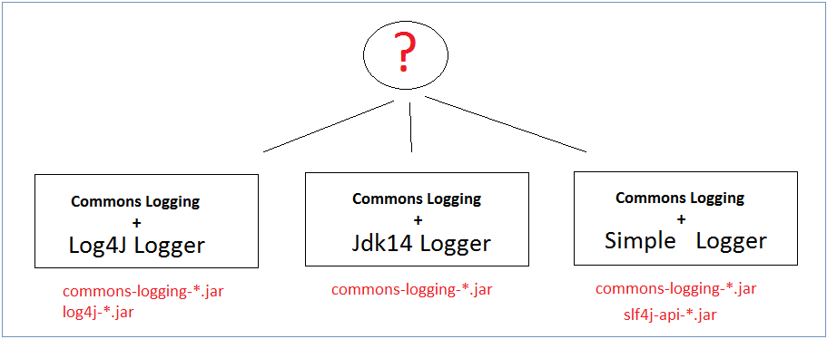

    * Log là một quá trình ghi lại những thông tin được thông báo, lưu lại trong quá trình hoạt động của một ứng dụng ở một nơi tập trung. Mục đích chính là để có thể xem lại các thông tin hoạt động của ứng dụng trong quá khứ như debug khi có lỗi xảy ra, check health, xem info, error, warning,...
    * Phân loại log (Log level):
        * All: đây là cấp độ thấp nhất, Logger và Appender được định nghĩa với cấp độ này, mọi thông tin cần log sẽ được log.
        * Debug: các thông tin dùng để debug, chúng ta có thể bật/tắt log này dựa vào mode của application.
        * Info: các thông tin mà bạn muốn ghi nhận thêm trong quá trình hoạt động của hệ thống. Ví dụ: log số lượng request, status, duration,... để biết traffic của hệ thống thế nào.
        * Warning: log các thông tin cảnh báo của chương trình.
        * Error: các lỗi khi chạy chương trình sẽ được log. Cố gắng log toàn bộ thông tin liên quan nhiều nhất có thể để có thể reproduce lại được mà ít tốn thời gian nhất.
        * Fatal: log các lỗi nghiêm trọng xảy ra trong chương trình, có thể làm cho chương trình không sử dụng được nữa.
        * Off: đây là cấp độ cao nhất, được sử dụng khi chúng ta không muốn log bất kỳ thông tin nào nữa.
    * Độ ưu tiên của các cấp độ log từ thấp đến cao như sau: `ALL < DEBUG < INFO < WARN < ERROR < FATAL < OFF`
    * Log rotate: Là việc cắt nhỏ log ra và lưu trữ trên nhiều file thay vì một file. Một số chiến lược cho Log rotate:
        * Lưu file log riêng theo từng ngày, tuần hoặc tháng.
        * File log sẽ chia theo loại log (file info, file error, file fatal,...)
        * File log sẽ cắt theo dung lượng file. Ví dụ: mỗi file tối đa 100 MB.
        * Một số chiến lược khác tùy theo yêu cầu của ứng dụng (Tùy sự định nghĩa/mong muốn của mình)
    * Giới thiệu sơ lược Apache Log4j:
        * `Apache Log4j` hay ngắn gọn là `Log4j` là một thư viện được cung cấp bởi Apache hỗ trợ ghi log được viết bằng ngôn ngữ Java.
        * Các thành phần chính:
            * **Logger:** Chịu trách nhiệm thu thập thông tin log.
            * **Appender:** Chịu trách nhiệm ghi log tới các vị trí đã được cấu hình (file, console). Các loại Appender: SyslogAppendersends, SMTPAppender, JDBCAppender, FileAppender, SocketHubAppender, SocketAppender, TelnetAppender, ConsoleAppender, JMSAppender,...
            * **Layout:** Chịu trách nhiệm định dạng (format) kết quả log. Các loại Layout: PatternLayout, SimpleLayout, XMLLayout, HTMLLayout.

                

        * Tính năng cơ bản: Thread safe; Tối ưu cho tốc độ; Hỗ trợ nhiều output (file + console); Hỗ trợ nhiều level log: ALL, TRACE, INFO, WARNING, ERROR, FATAL.
        * Cấu hình và cách sử dụng Log4j trong Java: Xem chi tiết [tại đây](https://gpcoder.com/5500-gioi-thieu-java-logging/)

<span name="A3"></span>

3. Throughput, latency, P99
    * Throughput (Thông lượng): Số lượng dữ liệu được gửi hoặc nhận trong một đơn vị thời gian.
    * Latency (Độ trễ): Thời gian dành cho một gói được truyền qua mạng. Bạn có thể đo điều này như một chiều đến đích hoặc ngược lại.
    * Ví dụ:
        * Lượng nước chảy qua các ống có đường kính khác nhau gọi là Thông lượng.
        * Khoảng thời gian cần thiết để lượng nước từ đầu này sang đầu kia hoàn tất gọi là Độ trễ.

            

    * Vị dụ 2: Trong 1 siêu thị, nếu như các thu ngân (ổ cứng) phục vụ cho các khách hàng (I/O) với thời gian latency là 10ms. Vậy nôm na, có thể hiểu rằng thu ngân này phục vụ 100 khách/1 giây (lần lượt từng khách hàng). Tuy nhiên, nếu có thời điểm 100 khách này tới cùng 1 lúc trong vòng 10ms thì sao? Có nhiều khách hàng sẽ phải đứng đợi, và cũng tuỳ từng nhu cầu khách hàng (size I/O) mà latency có thể khác nhau, 15ms hoặc thậm chí 20 ms.
    * P99: Phân vị 99 (99th percentile). Điều đó có nghĩa là 99% yêu cầu phải nhanh hơn độ trễ cho trước. Nói cách khác, chỉ có 1% yêu cầu được phép chậm hơn.

        

<br/>

<span name="B"></span>

## Threading

<span name="B1"></span>

1. Thread: Là luồng thực thi công việc trong một tiến trình. Một tiến trình có thể có nhiều luồng thực thi. Ngoài ra, một luồng sẽ duy trì một danh sách thông tin liên quan đến việc thực thi của nó bao gồm lịch chạy, trình xử lý ngoại lệ, các thanh ghi CPU, trạng thái stack trong không gian địa chỉ của tiến trình đang nắm giữ.

<span name="B2"></span>

2. Multithreading: 
    * Chia một tiến trình thành nhiều luồng thực thi công việc. Các luồng ấy sẽ hoạt động một cách độc lập nhưng lại sử dụng cùng tài nguyên hệ thống.
    * Ví dụ: Trong một trang web, một thread sẽ đảm nhiệm việc chạy hình ảnh và bài viết, một thread khác cùng lúc sẽ có nhiệm vụ nhận thêm các dữ liệu vào web.

        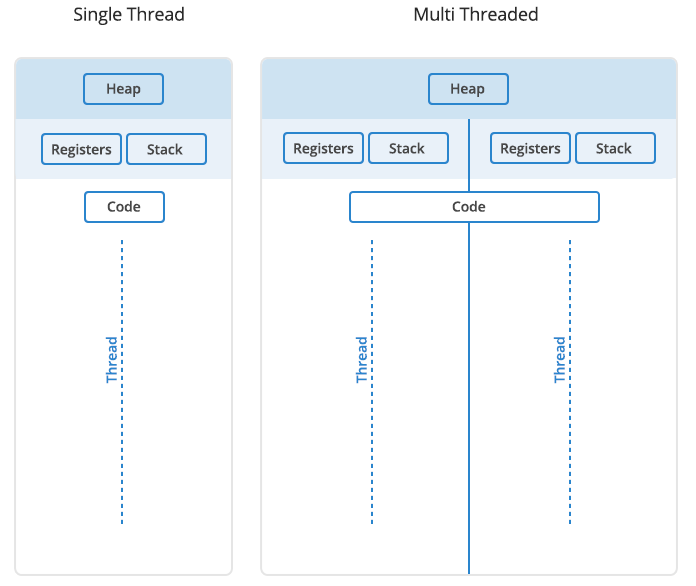

<span name="B3"></span>

3. Concurrency & Parallelism: 
    * **Concurrency:** Là khả năng xử lí nhiều tác vụ cùng 1 lúc, nhưng CPU không xử lí hết 1 tác vụ rồi mới đến tác vụ khác, mà sẽ dành 1 lúc cho tác vụ này, 1 lúc cho tác vụ kia. Do vậy, chúng ta có cảm giác máy tính thực hiện nhiều tác vụ cùng 1 lúc, nhưng thực chất chỉ có 1 tác vụ được xử lí tại 1 thời điểm.
    * Ảnh ví dụ bên dưới cho Concurrency: Chúng ta có thể thấy rằng, CPU 1 nhân phân chia thời gian làm việc dựa trên độ ưu tiên của cùng tác vụ. Ví dụ, khi đang scroll trang, việc nghe nhạc sẽ có độ ưu tiên thấp hơn, nên có thể nhạc của bạn sẽ bị dừng do đường truyền kém, nhưng bạn vẫn có thể kéo trang lên xuống.
    * **Parallelism:** Khi CPU có nhiều nhân, chúng ta có thể sử dụng nhiều nhân để xử lí nhiều thứ 1 lúc.

        

        

<span name="B4"></span>

4. Thread-safety trong java? Làm sao để đạt được?
    * Trong 1 phần mềm có multithreading, dù có truy cập từ nhiều thread thì chương trình cũng vẫn chạy bình thường mà không gặp vấn đề gì. Lấy ví dụ trong công việc của con người, “thread safe” nghĩa là kể cả khi nhận được yêu cầu công việc từ nhiều người nhưng người đó vẫn có thể nắm chính xác được từng việc một, và đạt được kết quả tốt.
    * Như vậy, điều này có nghĩa là các luồng khác nhau có thể truy cập vào cùng một tài nguyên mà không để lộ hành vi sai lầm hoặc tạo ra kết quả không thể đoán trước.
    * Một vài cách `thread-safe`:
        * Cài đặt với giá trị input cố định: Giá trị (input) khi new của BigInteger là 1 và giá trị (output) khi in ra luôn luôn giống nhau.
        ```
        public class MathUtils {
            public static BigInteger factorial(int number) {
                BigInteger f = new BigInteger("1");
                for (int i = 2; i <= number; i++) {
                    f = f.multiply(BigInteger.valueOf(i));
                }
                return f;
            }
        }
        ```
        * Cài đặt không thay đổi: Đặt hàm với trường `private` và `final`, lúc này giá trị của `message` sẽ cố định, không thể thay đổi về sau.
        ```
        public class MessageService {
            private final String message;
        
            public MessageService(String message) {
                this.message = message;
            }
            
            // standard getter
            
        }
        ```
        * Tạo các class `thread-safe` mà không chia sẻ trạng thái giữa các luồng bằng cách tạo các trường của chúng thành luồng cục bộ. Như đoạn code bên dưới, ta xác định class ThreadA là một loại class thread lưu trữ mảng int, chứa private và final.
        ```
        public class ThreadA extends Thread {
            private final List<Integer> numbers = Arrays.asList(1, 2, 3, 4, 5, 6);
            
            @Override
            public void run() {
                numbers.forEach(System.out::println);
            }
        }
        ```
        * Synchronized Methods: Mỗi lần chỉ có một luồng có thể truy cập một phương thức đã được đồng bộ hóa, các luồng khác sẽ bị chặn cho đến khi luồng đầu tiên kết thúc hoặc đưa ra ngoại lệ (throws an exception)
        ```
        public synchronized void incrementCounter() {
            counter += 1;
        }
        ```
        * Synchronized Statements: Đồng bộ hóa sẽ tốn kém khi làm các luồng khác phải đợi, thay vì đồng bộ hóa cả một phương thức, ta chỉ đồng bộ hóa các phần nhỏ có liên quan đến một phương thức mà nó hay xảy ra vấn đề.
        ```
        public void incrementCounter() {
            // additional unsynced operations
            synchronized(this) {
                counter += 1; 
            }
        }
        ```
        * Read/Write Locks: Khóa ReadWriteLock sử dụng một cặp khóa liên quan đến Read và Write, một khóa cho các hoạt động chỉ đọc và một khóa cho các hoạt động chỉ ghi. Kết quả là, nó có thể có nhiều luồng đọc một tài nguyên, miễn là không có luồng nào cần thay đổi tài nguyên đó. Ngoài ra, việc một luồng thay đổi tài nguyên sẽ ngăn chặn các luồng khác đọc nó.
        ```
        public class ReentrantReadWriteLockCounter {
            private int counter;
            private final ReentrantReadWriteLock rwLock = new ReentrantReadWriteLock();
            private final Lock readLock = rwLock.readLock();
            private final Lock writeLock = rwLock.writeLock();
            
            public void incrementCounter() {
                writeLock.lock();
                try {
                    counter += 1;
                } finally {
                    writeLock.unlock();
                }
            }
            
            public int getCounter() {
                readLock.lock();
                try {
                    return counter;
                } finally {
                    readLock.unlock();
                }
            }

            // standard constructors
        }
        ```
        * Ngoài ra, còn có các phương pháp khác như: Synchronized Collections, Concurrent Collections, Atomic Objects, Volatile Fields, Extrinsic Locking, Reentrant Locks,...

<span name="B5"></span>

5. Thread pool
    * Ví dụ: Bạn có 100 tập tin cần tải về từ trên mạng, mỗi tệp tin bạn cần 1 thread để download, như vậy sẽ có 100 thread hoạt động cùng 1 thời điểm trong ứng dụng của bạn, sẽ gây ra 1 vấn đề nghiêm trọng về bộ nhớ và hiệu suất và có thể dẫn đến gây lỗi (crash) chương trình.
    * Thay vì phải tạo mới thread cho mỗi task (nhiệm vụ) được thực hiện đồng thời, các nhiệm vụ cần đưa vào 1 thread pool (hồ bơi dành cho luồng). Và ngay sau khi trong hồ bơi có bất kì luồng nào đang nhàn rỗi (no task) các nhiệm vụ sẽ được gán vào 1 trong số chúng và được thực thi.
    * Bên trong ThreadPool các nhiệm vụ được chèn vào một Task Queue (hàng đợi các task) nơi mà các Thread sẽ lấy chúng ra và thực thi lần lượt. Mỗi khi có 1 task mới được thêm vào Queue, sau đó chỉ có 1 thread nhàn rỗi sẽ vào queue và lấy chúng ra, các thread nhàn rỗi còn lại phải chờ sau khi thread trước đó lấy nhiệm vụ ra thành công.

        

    * Một vài loại ThreadPool:
        * Cached thread pool: giữ một số luồng còn sống (alive) và tạo ra các luồng mới nếu cần.
        * Fixed thread pool: giới hạn số lượng tối đa của các Thread được tạo ra để thực thi các task (nhiệm vụ). Các task khác đang chờ trong hàng đợi (TaskQueue).
        * Single-threaded pool: chỉ giữ một Thread thực thi một nhiệm vụ một lúc.
        * Fork/Join pool: một Thread đặc biệt sử dụng Fork/Join Framework để tận dụng lợi thế của nhiều bộ vi xử lý để thực hiện công việc lớn nhanh hơn bằng cách chia nhỏ công việc thành các phần nhỏ hơn để xử lý đệ quy.

<span name="B6"></span>

6. Executors
    * Executors: Lớp trợ giúp này chứa một vài phương thức để tạo ra các thể hiện (instance) thread pool đã được cấu hình sẵn. Những lớp này đã được định hình sẵn, ta không cần phải có quá nhiều tinh chỉnh cấu hình nào.
    * Chúng có thể tạo một Executor bằng cách sử dụng một trong các phương thức được cung cấp bởi lớp tiện ích `Executors` như sau:
        * **newSingleThreadExecutor():** Trong ThreadPool chỉ có 1 Thread và các task (nhiệm vụ) sẽ được xử lý một cách tuần tự.
        * **newCachedThreadPool():** Trong ThreadPool sẽ có nhiều Thread và các nhiệm vụ sẽ được xử lý một cách song song. Các Thread cũ sau khi xử lý xong sẽ được sử dụng lại cho nhiệm vụ mới. Mặc định nếu một Thread không được sử dụng trong vòng 60 giây thì Thread đó sẽ bị tắt.
        * **newFixedThreadPool(int n):** Trong ThreadPool sẽ được cố định các Thread. Nếu một nhiệm vụ mới được đưa vào mà các Thread đều đang “bận rộn” thì nhiệm vụ đó sẽ được gửi vào Task Queue và sau đó nếu có một Thread đã thực thi xong nhiệm vụ của nó thì nhiệm vụ đang ở trong Queue đó sẽ được push ra khỏi Queue và được Thread đó xử lý tiếp.
        * **newScheduledThreadPool(int corePoolSize):** Tương tự như newCachedThreadPool() nhưng sẽ có thời gian delay giữa các Thread.
        * **newSingleThreadScheduledExecutor():** Tương tự như newSingleThreadExecutor() nhưng sẽ có khoảng thời gian delay giữa các Thread.
    ```
    ExecutorService executorService = Executors.newFixedThreadPool(10);

    executorService.execute(new Runnable() {
        public void run() {
            System.out.println("Asynchronous task");
        }
    });

    executorService.shutdown();

    -----------------------
    ===>>> CHÚ THÍCH <<<===
    -----------------------

    newFixedThreadPool(10): Tạo ra 1 thread pool với 10 thread dành cho việc thực thi các nhiệm vụ.

    Triển khai interface Runnable và đưa vào phương thức execute() như 1 nhiệm vụ. Điều này làm cho Runnable được thực thi bởi một trong các thread có trong ExcutorService.

    shutdown(): Executor sẽ được tắt. Tuy nhiên, tất cả các task được thêm vào trước khi gọi shutdown() đều sẽ được thực thi trước khi Executor tắt.
    ```

<br/>

<span name="C"></span>

## Networking

<span name="C1"></span>

1. Connection pooling (CP)
    * Vấn đề: Mỗi client request sẽ mở 1 kết nối tới database server và rồi lại đóng lại. Việc tạo và hủy các kết nối tới DB sẽ ảnh hưởng rất nhiều tới hiệu năng của ứng dụng bởi chúng cần thực hiện tiến trình quản lý tài nguyên cơ sở dữ liệu. Điển hình là database server sẽ mất từ 1 đến 3s để thiết lập kết nối tới DB, bao gồm giao tiếp với server, chứng thực, và còn cả tá tác vụ khác.
    * Công dụng CP: Là kỹ thuật cho phép tạo và duy trì 1 tập các kết nối dùng chung (có thể được sử dụng lại khi có yêu cầu tương tác với CSDL) nhằm tăng hiệu suất cho các ứng dụng cũng như việc thực thi các lệnh trên CSDL.
    * Ví dụ: 
        * Max pool size = 10 (số lượng tối đa connection trong pool là 10).
        * Trường hợp tất cả các kết nối đang bận (số lượng connection trong connection pool = 10) thì người dùng thứ 11 trở về sau phải đợi cho đến khi các user trước đó dùng xong để đến lượt mình dùng.
        * Trường hợp chưa có kết nối nào trong connection pool hoặc lượng kết nối đang được sử dụng dưới 10 thì một connection mới được tạo ra, kết nối tới CSDL và được đưa vào connection pool. Sau khi kết nối ấy được sử dụng xong, nó sẽ không đóng lại mà sẽ duy trì trong connection pool để dùng lại cho lần sau và chỉ thực sự bị đóng khi hết thời gian timeout (lâu quá không dùng đến nữa).

            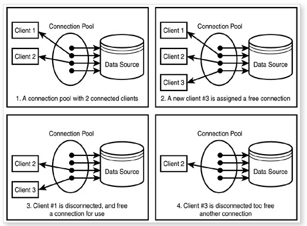

    * Tùy thuộc vào ứng dụng mà bạn có thể có nhiều hơn một connection pool. Một vài thông tin cơ bản trong việc cấu hình connection pool:
        * Connection pool name: Xác định tên connection pool và đăng ký với datasource.
        * Initial number of connections: Số connection được khởi tạo ban đầu và đưa vào connection pool khi ứng dụng được start.
        * Maximum and minimum pool size: Số connection tối đa và tối thiểu trong connection pool.
        * JDBC URL: chỉ rõ vị trí database, database name, port, hostname
        * JDBC driver class name.

<span name="C2"></span>

2. Caching? (Caching với guava, redis)
    * **Khái niệm Caching:** Kích thước lưu trữ be bé, thường dùng để lưu trữ những dữ liệu phổ biến được truy xuất nhiều. Từ đó, bộ điều phối sẽ truy cập vào cache đầu tiên để kiểm tra dữ liệu có tồn tại hay không và lấy ra từ nó (Nếu có), chứ không cần phải vào/ra CSDL quá nhiều. Suy ra, cache giúp cải thiện thời gian tải trang, thời gian thực thi, giảm thiểu việc tương tác với CSDL của server và giảm việc mất cân bằng phân phối khi những dữ liệu phổ biến nằm lệch về 1 bên CSDL tại server.
    * **CACHING VỚI GUAVA**
        * Ta dùng CacheLoader (được sử dụng để tính giá trị được lưu trong bộ đệm), và CacheBuilder (xây dựng bộ đệm).
        * Cho ví dụ bên dưới, khóa "hello" không có trong cache:
            ```
            @Test
            public void whenCacheMiss_thenValueIsComputed() {
                CacheLoader<String, String> loader;
                loader = new CacheLoader<String, String>() {
                    @Override
                    public String load(String key) {
                        return key.toUpperCase();
                    }
                };
            
                LoadingCache<String, String> cache;
                cache = CacheBuilder.newBuilder().build(loader);
            
                assertEquals(0, cache.size());
                assertEquals("HELLO", cache.getUnchecked("hello"));
                assertEquals(1, cache.size());
            }
            ```
        * Giới hạn kích cỡ cache bằng `maximumSize()`, cái cũ nhất sẽ bị xóa nếu cái mới được thêm vào và kích cỡ cache đã đạt ngưỡng tối đa.
            ```
            @Test
            public void whenCacheReachMaxSize_thenEviction() {
                CacheLoader<String, String> loader;
                loader = new CacheLoader<String, String>() {
                    @Override
                    public String load(String key) {
                        return key.toUpperCase();
                    }
                };
                LoadingCache<String, String> cache;
                cache = CacheBuilder.newBuilder().maximumSize(3).build(loader);
            
                cache.getUnchecked("first");
                cache.getUnchecked("second");
                cache.getUnchecked("third");
                cache.getUnchecked("forth");
                assertEquals(3, cache.size());
                assertNull(cache.getIfPresent("first"));
                assertEquals("FORTH", cache.getIfPresent("forth"));
            }
            ```
        * Giới hạn kích cỡ cache bằng `maximumWeight()` dựa trên `length`. Bất kì khóa nào có độ dài dài hơn 16 kí tự đều sẽ bị xóa.
            ```
            @Test
            public void whenCacheReachMaxWeight_thenEviction() {
                CacheLoader<String, String> loader;
                loader = new CacheLoader<String, String>() {
                    @Override
                    public String load(String key) {
                        return key.toUpperCase();
                    }
                };
            
                Weigher<String, String> weighByLength;
                weighByLength = new Weigher<String, String>() {
                    @Override
                    public int weigh(String key, String value) {
                        return value.length();
                    }
                };
            
                LoadingCache<String, String> cache;
                cache = CacheBuilder.newBuilder()
                .maximumWeight(16)
                .weigher(weighByLength)
                .build(loader);
            
                cache.getUnchecked("first");
                cache.getUnchecked("second");
                cache.getUnchecked("third");
                cache.getUnchecked("last");
                assertEquals(3, cache.size());
                assertNull(cache.getIfPresent("first"));
                assertEquals("LAST", cache.getIfPresent("last"));
            }
            ```
        * Giới hạn kích cỡ dựa trên xóa các thông tin theo thời gian.
            ```
            --------------------------------------------------
            ===>>> XÓA TRÊN CÁC BẢN GHI KHÔNG HOẠT ĐỘNG <<<===
            --------------------------------------------------

            @Test
            public void whenEntryIdle_thenEviction()
            throws InterruptedException {
                CacheLoader<String, String> loader;
                loader = new CacheLoader<String, String>() {
                    @Override
                    public String load(String key) {
                        return key.toUpperCase();
                    }
                };
            
                LoadingCache<String, String> cache;
                cache = CacheBuilder.newBuilder()
                .expireAfterAccess(2,TimeUnit.MILLISECONDS)
                .build(loader);
            
                cache.getUnchecked("hello");
                assertEquals(1, cache.size());
            
                cache.getUnchecked("hello");
                Thread.sleep(300);
            
                cache.getUnchecked("test");
                assertEquals(1, cache.size());
                assertNull(cache.getIfPresent("hello"));
            }

            -------------------------------------
            ===>>> XÓA TRÊN THỜI GIAN SỐNG <<<===
            -------------------------------------

            @Test
            public void whenEntryLiveTimeExpire_thenEviction()
            throws InterruptedException {
                CacheLoader<String, String> loader;
                loader = new CacheLoader<String, String>() {
                    @Override
                    public String load(String key) {
                        return key.toUpperCase();
                    }
                };
            
                LoadingCache<String, String> cache;
                cache = CacheBuilder.newBuilder()
                .expireAfterWrite(2,TimeUnit.MILLISECONDS)
                .build(loader);
            
                cache.getUnchecked("hello");
                assertEquals(1, cache.size());
                Thread.sleep(300);
                cache.getUnchecked("test");
                assertEquals(1, cache.size());
                assertNull(cache.getIfPresent("hello"));
            }
            ```
        * Tải trước (Preload) cache bằng cách dùng `putAll()`.
            ```
            @Test
            public void whenPreloadCache_thenUsePutAll() {
                CacheLoader<String, String> loader;
                loader = new CacheLoader<String, String>() {
                    @Override
                    public String load(String key) {
                        return key.toUpperCase();
                    }
                };
            
                LoadingCache<String, String> cache;
                cache = CacheBuilder.newBuilder().build(loader);
            
                Map<String, String> map = new HashMap<String, String>();
                map.put("first", "FIRST");
                map.put("second", "SECOND");
                cache.putAll(map);
            
                assertEquals(2, cache.size());
            }
            ```
        * Bắt tin nhắn về việc "xóa cache" để thực hiện thêm một vài thao tác, dựa trên `getCause()`.
            ```
            @Test
            public void whenEntryRemovedFromCache_thenNotify() {
                CacheLoader<String, String> loader;
                loader = new CacheLoader<String, String>() {
                    @Override
                    public String load(final String key) {
                        return key.toUpperCase();
                    }
                };
            
                RemovalListener<String, String> listener;
                listener = new RemovalListener<String, String>() {
                    @Override
                    public void onRemoval(RemovalNotification<String, String> n){
                        if (n.wasEvicted()) {
                            String cause = n.getCause().name();
                            assertEquals(RemovalCause.SIZE.toString(),cause);
                        }
                    }
                };
            
                LoadingCache<String, String> cache;
                cache = CacheBuilder.newBuilder()
                .maximumSize(3)
                .removalListener(listener)
                .build(loader);
            
                cache.getUnchecked("first");
                cache.getUnchecked("second");
                cache.getUnchecked("third");
                cache.getUnchecked("last");
                assertEquals(3, cache.size());
            }
            ```
        * Lưu ý: Bạn có thể thêm giá trị vào cache bằng `put(key, value)` và đo lường/thống kê hiệu suất của cache dựa trên `CacheStats (hitRate(), missRate(),...)`.
    * **CACHING VỚI REDIS**
        * Lưu trữ cấu trúc dữ liệu trong bộ nhớ, được sử dụng để làm CSDL, bộ nhớ đệm (cache) và message broker.
        * Xem thêm Redis: [tại đây](https://github.com/1653072/ZalopayFresher/blob/master/04-database-thinking/Redis/README.md)

<span name="C3"></span>

3. Protocol (HTTP, Websocket, gRPC)
    * HTTP:
        * HTTP (HyperText Transfer Protocol) là giao thức truyền tải siêu văn bản được sử dụng trong www dùng để truyền tải dữ liệu giữa Web server đến các trình duyệt Web và ngược lại. Giao thức này sử dụng cổng 80 (port 80) là chủ yếu.
        * Cách hiểu khác: Bạn có thể hiểu khi bạn gõ vào 1 địa chỉ vào trình duyệt Web, lúc này trình duyệt Web sẽ gửi 1 yêu cầu qua giao thức HTTP đến Web server. Web server và sẽ nhận yêu cầu này và trả lại kết quả cho trình duyệt Web.
        * Mở rộng (`HTTPS`): HTTPS (HyperText Transfer Protocol Secure) là giao thức HTTP có sử dụng thêm SSL (Secure Sockets Layer) để mã hóa dữ liệu trong lúc truyền tải dữ liệu nhầm gia tăng thêm tính an toàn cho việc truyền dữ liệu giữa Web server và trình duyệt Web. Giao thức HTTPS sử dụng cổng 433 để truyền dữ liệu.
        * Cách dùng Java để code: [Tại đây](https://www.baeldung.com/java-http-request)
        * `HTTP REQUEST METHOD`:
            * **Request-line = Phương thức + URI–Request + Phiên bản HTTP**
            * Cấu trúc của một HTTP Request:

                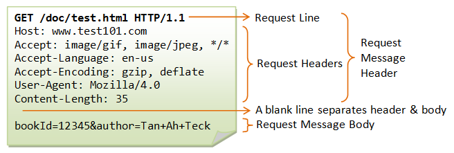

            * Một số Request Method thường dùng:

                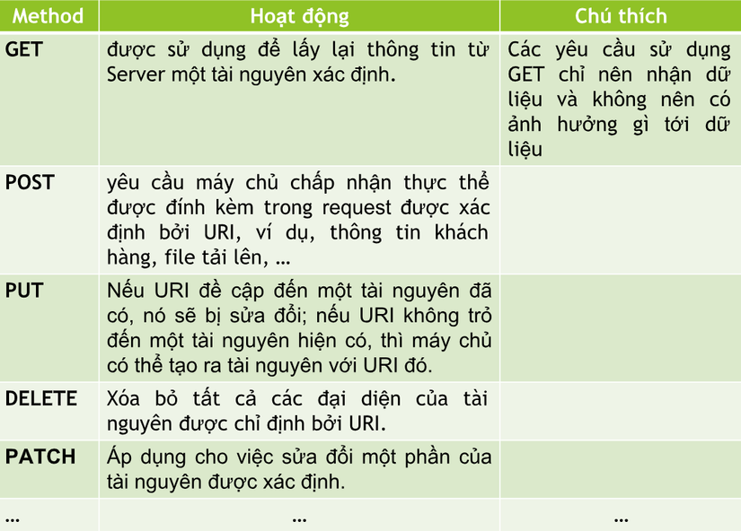

        * `HTTP RESPONSE METHOD`:
            * **Status-line = Phiên bản HTTP + Mã trạng thái + Trạng thái**
            * Cấu trúc của một HTTP Response:

                

            * Các kiểu mã trạng thái thường gặp:
                * 1xx (Thông tin 100->101): 100 (Continue),...
                * 2xx (Thành công 200->206): 200 (OK), 201 (CREATED),...
                * 3xx (Điều hướng lại 300->307): 305 (USE PROXY),...
                * 4xx (Lỗi phía Client 400->417): 403 (FORBIDDEN), 404 (NOT FOUND),...
                * 5xx (Lỗi phía Server 500->505): 500 (INTERNAL SERVER ERROR),...
    * Websocket:
        * Websocket là giao thức chuẩn cho trao đổi dữ liệu hai chiều giữa client và server. Giao thức WebSocket không chạy trên HTTP, thay vào đó nó thực hiện trên giao thức TCP.
        * Người ta thường dùng Websocket thay vì HTTP cho những trường hợp yêu cầu real time (thời gian thực). Ví dụ bạn muốn hiện thị biểu đồ, chỉ số chứng khoán, web chat,... thì không thể gửi lệnh AJAX liên tiếp tới server để lấy dữ liệu mới rồi cập nhật lên màn hình, như thế sẽ tốn nhiều tài nguyên, traffic.
        * Gói tin của WebSockets nhẹ hơn HTTP rất nhiều, giảm độ trễ của network lên đến 3 lần, không cần phải gửi request liên tiếp như HTTP.

            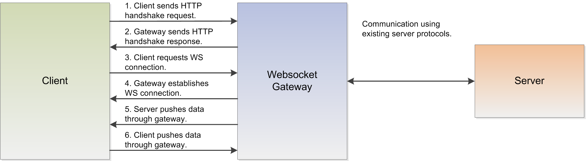

    * gRPC:
        * Tên gọi: gRPC Remote Procedure Call.
        * RPC có thể được xem là một giao thức request & respone thông thường. Tuy nhiên, nó được dùng cho việc giao tiếp giữa các server với nhau (server-server) nhiều hơn là client-server.
        * Trong các hệ thống phân tán (distributed system), application code ở nhiều server hơn là một server. Ví dụ thường thấy nhất chính là kiến trúc Microservice. Một request từ phía client có thể cần nhiều service, chạy trên nhiều server, tổng hợp thông tin rồi sau đó mới response cho client. Sự liên lạc giữa các service trên các server lúc này sẽ là vấn đề, mà trước đó tất cả service chạy trên cùng một server thì khoẻ re, vì local call nên chẳng ngần ngại gì. Chính xác là khi đó, một server muốn “nói chuyện” với server khác sẽ cần phải encode data (JSON, XML,...), phía nhận cũng phải làm công việc ngược lại, là decode data mới hiểu thằng kia nói gì với mình, rồi lại phải encode tiếp để chuyển tiếp/yêu cầu thêm thông tin. Việc này tiêu tốn khá nhiều tài nguyên xử lý (CPU) mà lẽ ra chỉ cần làm ở bước đầu và cuối (đầu nhận và trả về cuối cùng).
        * gRPC sử dụng protobuf (protocol buffers) kết hợp giao thức HTTP/2 để truyền nhận dữ liệu, thay vì phải encode chúng thành các ngôn ngữ trung gian như JSON, XML,... Việc này rõ ràng làm tăng tốc độ giao tiếp giữa các server lên rất nhiều, đồng thời giảm overhead cho CPUs. Protobuf do Google tự phát triển & đây là ngôn ngữ mà gRPC dùng như một default serialization format.

            

        * So sánh Protobuf, JSON, XML:

            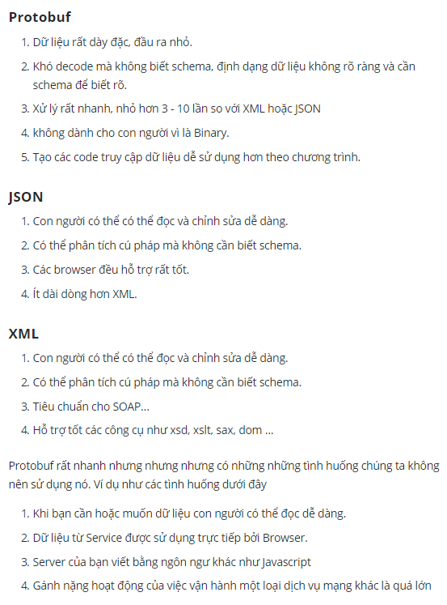

<span name="C4"></span>

4. SSL/TLS
    * `SSL`（Secure Sockets Layer)/`TLS`（Transport Layer Security）là kỹ thuật mã hóa truyền tin trên internet. Sử dụng SSL/TLS để mã hóa data truyền tin giữa máy tính và server thì có thể phòng tránh bên thứ ba nghe trộm hoặc giả mạo data.
    * SSL và TLS là cùng chức năng, nó chỉ khác nhau về ký hiệu. Cái tên SSL dường như được biết đến rộng rãi hơn.
    * Cơ chế kỹ thuật hoạt động (Chú ý đến certificate, chứng chỉ không được các tổ chức đáng tin cậy chứng nhận thì Browser không thể xác minh bằng root certificate ở bước 2).

        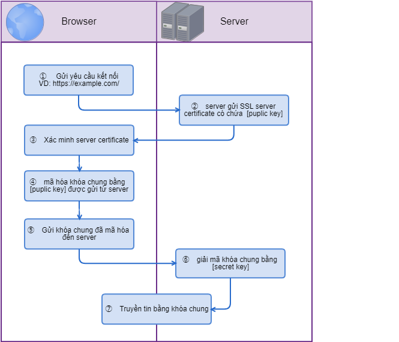

    * Phân loại SSL/TLS: Theo cấp độ tăng dần (từ trái qua phải) thì mức độ tin cậy càng tăng, chi phí đắt đỏ dần.

        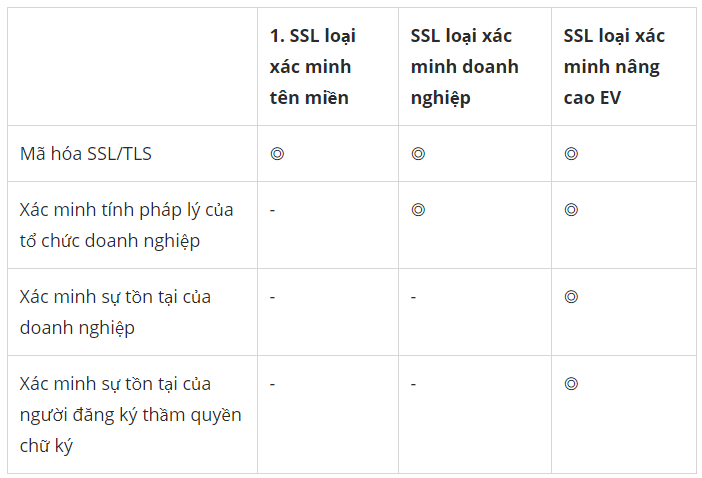 

<span name="C5"></span>

5. RESTful API
    * API (Application Programming Interface) là một tập các quy tắc và cơ chế mà theo đó, một ứng dụng hay một thành phần sẽ tương tác với một ứng dụng hay thành phần khác. API có thể trả về dữ liệu mà bạn cần cho ứng dụng của mình ở những kiểu dữ liệu phổ biến như JSON hay XML.
    * REST (REpresentational State Transfer) là một dạng chuyển đổi cấu trúc dữ liệu, một kiểu kiến trúc để viết API. Nó sử dụng phương thức HTTP đơn giản để tạo cho giao tiếp giữa các máy. Vì vậy, thay vì sử dụng một URL cho việc xử lý một số thông tin người dùng, REST gửi một yêu cầu HTTP như GET, POST, DELETE,... đến một URL để xử lý dữ liệu.
    * RESTful API là một tiêu chuẩn dùng trong việc thiết kế các API cho các ứng dụng web để quản lý các resource. RESTful là một trong những kiểu thiết kế API được sử dụng phổ biến ngày nay để cho các ứng dụng (web, mobile…) khác nhau giao tiếp với nhau.
    * RESTful không quy định logic code ứng dụng và không giới hạn bởi ngôn ngữ lập trình ứng dụng, bất kỳ ngôn ngữ hoặc framework nào cũng có thể sử dụng để thiết kế một RESTful API.
    * Cách hoạt động của RESTful:
        * REST hoạt động chủ yếu dựa vào giao thức HTTP. Các hoạt động cơ bản nêu trên sẽ sử dụng những phương thức HTTP riêng.
            * GET (SELECT): Trả về một Resource hoặc một danh sách Resource.
            * POST (CREATE): Tạo mới một Resource.
            * PUT (UPDATE): Cập nhật thông tin cho Resource.
            * DELETE (DELETE): Xoá một Resource.
        * JSON/XML thường là format chính thức cho việc xử lý/thao tác/truyền nhận dữ liệu
        
            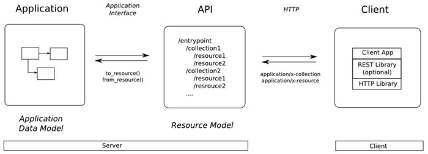 

    * Chi tiết về cách thiết kế RESTful API, xem chi tiết [tại đây](https://techtalk.vn/thiet-ke-restful-apis.html).

<br/>

<span name="D"></span>

## Benchmark

<span name="D1"></span>

1. Khái niệm
    * Thông qua việc khởi chạy một chương trình hay nhiều chương trình máy tính cùng một lúc, các tác vụ khác nhau mà Benchmark có thể *đánh giá sức mạnh tốc độ của thiết bị phần cứng hoặc phần mềm*.
    * 2 dạng Benchmark:
        * Tiêu chí về phần cứng ta có đo điểm Benchmark của CPU, GPU, RAM, HDD/SSD.
        * Tiêu chí về phần mềm ta có đo điểm Benchmark về game, về thiết kế, về công nghệ,...

<span name="D2"></span>

2. Jmeter
    * Cung cấp lợi ích: 
        * Có thể sử dụng các tài nguyên tĩnh như JavaScript và HTML, các tài nguyên động như JSP, Servlets và AJAX.
        * Có thể phát hiện số lượng người dùng tối đa cùng lúc mà web có thể xử lý.
        * Cung cấp phân tích đồ họa về báo cáo hiệu suất.
    * Test performance trên JMeter:    
        * Load testing: Mô phỏng nhiều người dùng truy cập dịch vụ Web cùng lúc
        * Stress testing: Mỗi máy chủ web có giới hạn tải tối đa. Khi vượt quá giới hạn, máy chủ sẽ phản hồi chậm và tạo ra bug. Mục đích của Stress test là tìm mức tải tối đa mà máy chủ web có thể xử lý.

            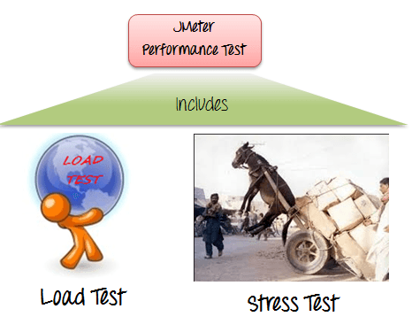

            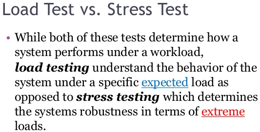 

    * Các thành phần cơ bản của JMeter:
        * Thread Group
        * Controller (Sampler và Logic Cotroller)
        * Configuration Element
        * Listener
        * Timer
        * ...

         

<span name="D3"></span>

3. Locust
    * Là công cụ hỗ trợ thực hiện load test hệ thống, tìm hiểu có bao nhiêu người dùng đồng thời mà một hệ thống có thể xử lý.
    * Tóm lại, về Locust: 
        * Hoạt động theo mô hình client - server.
        * Cho phép tự định nghĩa hành vi/viễn cảnh sử dụng hệ thống của người dùng (để tiến hành test).
        * Hỗ trợ chạy load test (mà các load test này được phân phối trên nhiều máy và tất cả tác động đến hệ thống của bạn). Do đó, locust có thể được sử dụng để mô phỏng hàng triệu người dùng đồng thời.
        * Có UI để hiển thị quy trình, kết quả test theo real-time.
    * Cài đặt Locust theo hướng dẫn [tại đây](https://docs.locust.io/en/stable/)
        
<span name="D4"></span>

4. Tool hỗ trợ benchmark, so sánh ưu và nhược
    * JMeter:
        * Ưu:
            * Mã nguồn mở.
            * Dễ sử dụng, như một ứng dụng Java thuần túy.
            * Nền tảng độc lập, Java - ngôn ngữ lập trình phổ biến và chạy trên được mọi HĐH hiện nay.
            * Giao diện đơn giản, trực quan.
            * Hỗ trợ đa giao thức (HTTP, FTP, SOAP, JDBC, JMS và LDAP). Nó cũng có thể được sử dụng để kiểm thử hiệu suất của cơ sở dữ liệu của bạn.
            * Linh hoạt, có thể tùy chỉnh theo yêu cầu/mong muốn của cá nhân.
        * Nhược:
            * Tiêu thụ một lượng lớn bộ nhớ nếu mô phỏng tải nặng, trực quan hóa báo cáo lớn.
            * Thường ứng dụng cho web.
    * Locust:
        * Ưu:
            * Giao diện trên nền web đẹp.
            * Khả năng tự định nghĩa các viễn cảnh/hành vi các bài test.
            * Có khả năng mở rộng lượng test lớn dần.
            * Dễ sử dụng.
        * Nhược: 
            * Thường ứng dụng cho web.
    * Gatling:
        * Ưu:
            * Là một DSL (Digital Subscriber Line) đơn giản, khá mạnh mẽ.
            * Có khả năng mở rộng các bài test.
            * Vừa hỗ trợ mã nguồn mở vừa doanh nghiệp.
            * Sử dụng ngôn ngữ lập trình Scala và tạo ra các báo cáo với UI đẹp.
        * Nhược: Hiện chưa có

<br/>

<span name="E"></span>

## JVM

<span name="E1"></span>

1. Khái niệm JVM & cách hoạt động
    * JVM (Java Virtual Machine) là 1 máy ảo java - trình thông dịch của Java. Nó cung cấp môi trường để code java có thể được thực thi. Chương trình Java khi biên dịch sẽ tạo ra các file *.class chứa byte code, các file *.class này sẽ được JVM thực hiện chuyển byte code thành mã máy tương ứng với từng hệ điều hành và phần cứng khác nhau thực thi.

        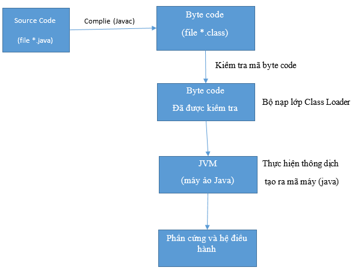 

    * Nhờ có JVM mà Java có thể chạy trên nhiều Platform khác nhau. Với mỗi Platform ta sẽ có một JVM tương ứng, ví dụ như Ubuntu thì sẽ có bản JVM cho Ubuntu, Windows thì có JVM cho Windows. Cơ chế hoạt động của JVM ở mọi nền tảng là hoàn toàn như nhau cho nên ứng dụng Java viết trên Window chạy được trên JVM của Window, khi đem ứng dụng đó qua Ubuntu thì chỉ cần cài JVM lên Ubuntu là ứng dụng sẽ chạy được.

         

    * Các thành phần chính của JVM:
        * (1) Class Loader: Là một hệ thống con của JVM, làm nhiệm vụ tải các lớp được định nghĩa.
        * (2) Class Area: Lưu trữ cấu trúc của các lớp, thuộc tính, phương thức của lớp và code của các phương thức.
        * (3) Heap: Là vùng nhớ lưu trữ các đối tượng động được khởi tạo trong quá trình thực thi.
        * (4) Stack: Chứa các frame. Mỗi frame chứa các biến cục bộ và thực thi một hàm gọi và trả kết quả về. Mỗi tiến trình có một Stack riêng, được khởi tạo cùng lúc với tiến trình. Mỗi frame sẽ được tạo khi một hàm được gọi và hủy khi việc gọi hàm kết thúc.
        * (5) Programming Counter Register: Chứa địa chỉ của máy chủ ảo đang thực thi.
        * (6) Native Method Stack: Chứa các hàm của hệ thống được sử dụng trong chương trình.
        * (7) Execution Engine: Là một hệ thống bao gồm bộ xử lý ảo; Trình thông dịch (đọc Java Bytecode) và thực thi các chỉ thị; JIT compiler (Just-In-Time Compiler) biên dịch các phần của Bytecode mà có cùng tính năng tại cùng một thời điểm và vì thế giảm lượng thời gian cần thiết để biên dịch.
        * (8) Native Method Interface: Là khung lập trình, cho phép các code Java đang chạy trong JVM gọi đến các thư việc hoặc ứng dụng gốc.
        * (9) Native Method Libraries: Là tập hợp các thư viện gốc (C, C++) mà những thư viện này sẽ được sử dụng trong Execution Engine (7).

             

    * Các nhiệm vụ chính của JVM:
        * Tải code
        * Kiểm tra code
        * Thực thi code
        * Cung cấp môi trường runtime

<span name="E2"></span>

2. Khái niệm JRE & JDK
    * JRE
        * Là viết tắt của Java Runtime Environment, được sử dụng để cung cấp môi trường runtime.
        * Là trình triển khai của JVM.
        * Bao gồm tập hợp các thư viện và các file khác mà JVM sử dụng tại môi trường runtime. 
        * *Môi trường runtime:* Là môi trường thực thi được cung cấp cho một ứng dụng hoặc phần mềm bởi hệ điều hành. Trong môi trường runtime, ứng dụng có thể gửi hướng dẫn hoặc lệnh (command) tới bộ xử lý và truy cập các tài nguyên hệ thống khác như RAM.

            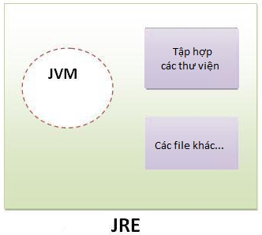 

    * JDK
        * Là viết tắt của Java Development Kit, bao gồm JRE và các Development Tool (Javac, java,...).

            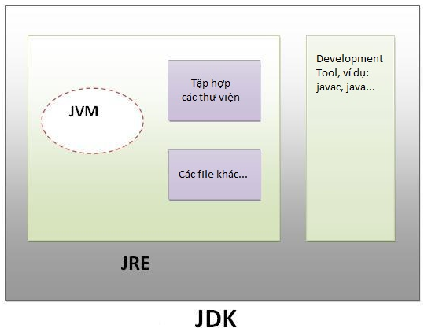 

    * **Tóm lại ngắn gọn:**
        * JVM: Là trái tim của ngôn ngữ của Java và được cung cấp tùy thuộc vào nền tảng/hệ điều hành mà ta dùng.
        * JRE: Cho phép (tạo ra môi trường runtime) chạy chương trình Java.
        * JDK: Phục vụ mục đích phát triển (lập trình, debug). Nếu chỉ cần chạy chương trình Java thì ko nhất thiết phải cài JDK mà chỉ cần cài JRE.

<br/>

<span name="F"></span>

## NGUỒN THAM KHẢO
1. <https://viblo.asia/p/unit-test-la-gi-maGK7m3Llj2>
2. <https://viblo.asia/p/testing-with-junit-in-java-dWrvwWODvw38>
3. <https://gpcoder.com/5500-gioi-thieu-java-logging/>
4. <https://www.ntccloud.vn/khai-niem-latency-thong-so-quan-trong-nhat-trong-he-thong-luu-tru-p2705.html>
5. <https://stackoverflow.com/questions/12808934/what-is-p99-latency>
6. <https://blog.bramp.net/post/2018/01/16/measuring-percentile-latency/>
7. <https://stream-hub.com/thread-la-gi>
8. <https://techmaster.vn/posts/35021/1542501886113>
9. <https://www.baeldung.com/java-thread-safety>
10. <https://www.baeldung.com/thread-pool-java-and-guava>
11. <https://viblo.asia/p/thread-pools-trong-java-ZK1ov1DxG5b9>
12. <https://stackjava.com/java/code-vi-du-callable-future-executors-trong-java.html>
13. <https://gpcoder.com/3548-huong-dan-tao-va-su-dung-threadpool-trong-java/>
14. <https://stackjava.com/faq/connection-pool-la-gi-khai-niem-connection-pool-trong-database.html>
15. <https://www.baeldung.com/guava-cache>
16. <https://www.digistar.vn/http-la-gi-tim-hieu-ve-giao-thuc-http-va-https/>
17. <https://viblo.asia/p/tim-hieu-ve-http-hypertext-transfer-protocol-bJzKmgewl9N>
18. <https://stackjava.com/websocket/websocket-la-gi-huong-dan-java-websocket-code-vi-du.html>
19. <https://viblo.asia/p/protocol-buffers-la-gi-va-nhung-dieu-can-ban-can-biet-ve-no-maGK7D99Zj2>
20. <https://viblo.asia/p/ssltls-la-gi-Do754wnBlM6>
21. <https://topdev.vn/blog/restful-api-la-gi/>
22. <https://lazi.vn/qa/d/benchmark-la-gi>
23. <https://viblo.asia/p/cach-su-dung-jmeter-cho-performance-va-load-testing-1VgZvpx95Aw>
24. <https://cuongquach.com/top-10-cong-cu-ma-nguon-mo-kiem-tra-tai-website-phan-1.html>
25. <https://viblo.asia/p/jmeter-la-gi-tai-sao-lai-su-dung-jmeter-nhung-uu-diem-va-nhuoc-diem-cua-no-3P0lPe2m5ox>
26. <https://www.topitworks.com/blogs/nhung-dieu-can-biet-ve-java-virtual-machine/>
27. <https://www.guru99.com/java-virtual-machine-jvm.html>
28. <https://viettuts.vn/java/su-khac-nhau-giua-jdk-jre-va-jvm>
29. <https://www.techopedia.com/definition/5466/runtime-environment-rte>