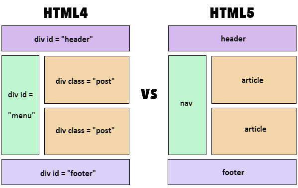
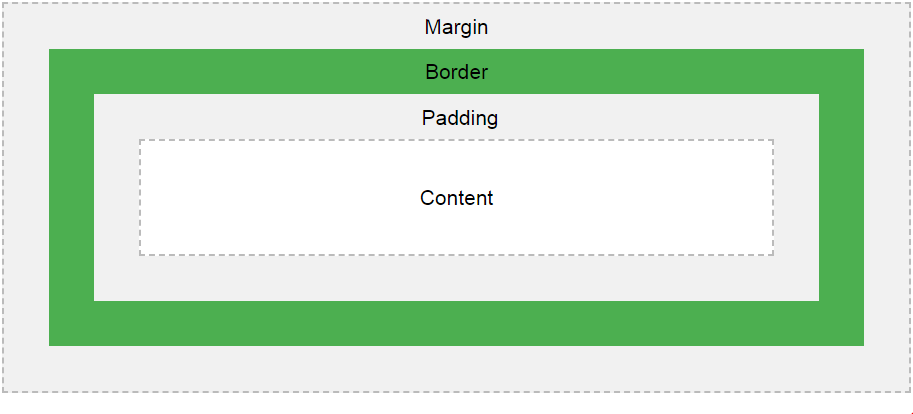
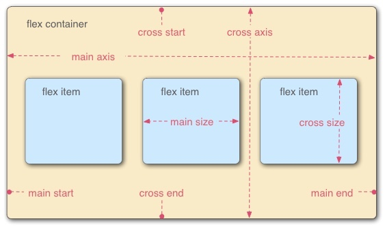
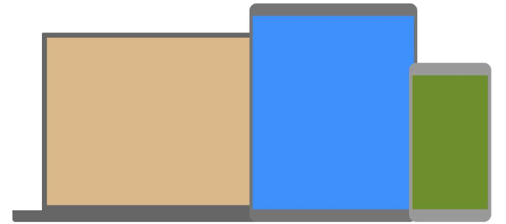
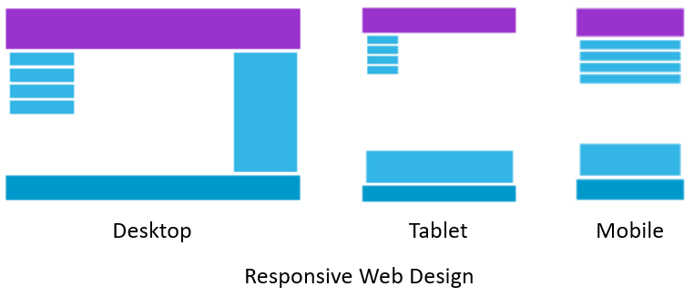
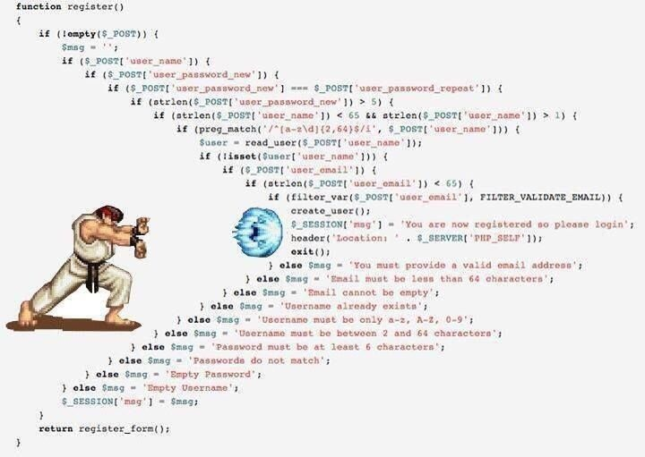

# 01 BASIC WEB DEVELOPMENT

## NGƯỜI THỰC HIỆN

* Họ tên: Trần Kiến Quốc (QuocTk)
* Vị trí: Software Development Fresher

<br/>

## MỤC LỤC

- [Frontend basic](#0)
    - [HTML5](#A0)
    - [CSS3](#B0)
        - [Box Model](#B0.1)
        - [Flexbox](#B0.2)
        - [Media Queries](#B0.3)
    - [Responsive Web Design](#C0)
    - [Màu sắc trong thiết kế Web](#D0)
    - [CSS Framework](#E0)
        - [Bootstrap](#E0.1)
        - [Semantic UI](#E0.2)
- [Javascript](#1)
    - [JavaScript Syntax](#A1)
    - [Async trong JavaScript](#B1)
        - [Callback](#B1.1)
        - [Promise](#B1.2)
        - [Async/Await](#B1.3)
        - [Callback hell](#B1.4)
    - [Closure](#C1)
    - [OOP trong JavaScript](#D1)
        - [Prototype](#D1.1)
        - [Class](#D1.2)
    - [Thư viện JavaScript](#E1)
        - [Lodash](#E1.1)
        - [Moment](#E1.2)
- [NGUỒN THAM KHẢO](#2)

<br/>

<span name="0"></span>

## FRONTEND BASIC

<span name="A0"></span>

1. HTML5
    * Mục tiêu cốt lõi khi thiết kế web bằng ngôn ngữ HTML5 là cải thiện khả năng hỗ trợ cho đa phương tiện mới nhất trong khi vẫn giữ được khả năng dễ đọc và luôn hiểu được bởi các thiết bị, các chương trình máy tính như trình duyệt web, phân tích cú pháp,...
    * Thuận lợi lớn nhất của ngôn ngữ HTML5 khiến nó vượt hơn các phiên bản không tên khác là có audio phiên bản nâng cấp và hỗ trợ video, vốn không có ở các phiên bản HTML trước mà muốn sử dụng thì phải cài thêm các plugin/addons khác,...
    * Lợi ích cơ bản phía Lập trình viên:
        * Không cần phải tạo cookies: Trong các phiên bản trước HTML5, nếu lập trình viên muốn lưu bất kỳ thông tin nào, họ phải tạo cookies. Tuy nhiên với phiên bản HTML5, quy trình này có thể được loại bỏ và thay thế.
        * Có thể tùy chỉnh Data Attributes (article, header, footer,...): Với ngôn ngữ HTML5, custom data có thể được thêm vào, nó cũng giúp lập trình viên tăng cơ hội tạo một trang web tương tác tốt và hiệu quả cao mà không cần phải tìm hiểu về server hoặc Ajax.
        * Menu Element: Element mới thêm là `<menu>` và `<menuitem>` là thành phần tương tác chuyên dùng, có thể được dùng để đảm bảo khả năng tương tác của web.
        * Tiện lợi khi thiết kế web mobile: Khi xây dựng hay thiết kế các giao diện web mobile, các lập trình viên sẽ dễ dàng thao tác hơn với HTML5. Có thể nói, HTML5 hỗ trợ rất nhiều cho các thiết bị di động.
        * Tăng thích tương thích cho ứng dụng web: Một trong số các mục đích chính của HTML5 là cho phép trình duyệt xử lý như là một nền tảng ứng dụng và cho phép lập trình viên tăng quyền quản trị của hiệu năng website.
    * Lợi ích phía người dùng web:
        * Trải nghiệm web trên thiết bị di dộng tốt hơn.
        * Việc loại bỏ Adobe Flash giúp cho lập trình viên cung cấp trải nghiệm tốt hơn cho người dùng.
        * Khả năng hỗ trợ audio và video element gốc. Người dùng không phải tải plugin đi kèm để xem multimedia trên website. Việc hỗ trợ media khiến HTML5 được dùng nhiều hơn HTML trong thời buổi hiện nay.

    

    *Vị trí các thẻ tag (sơ nét) giữa HTML4 & HTML5*

    

    *Thẻ tag trong HTML5*

<span name="B0"></span>

2. CSS3

    <span name="B0.1"></span>

    * Box Model:

        

    <span name="B0.2"></span>

    * Flexbox:
        * Flexbox là một kiểu dàn trang (layout mode) mà nó sẽ tự cân đối kích thước của các phần tử bên trong để hiển thị trên mọi thiết bị. Nói theo cách khác, bạn không cần thiết lập kích thước của phần tử, không cần cho nó float, chỉ cần thiết lập nó hiển thị chiều ngang hay chiều dọc, lúc đó các phần tử bên trong có thể hiển thị theo ý muốn.
        * Hiện nay, theo lời khuyên từ Mozilla thì chúng ta sử dụng Flexbox để thiết lập bố cục trong phạm vi nhỏ (ví dụ như những khung trong website) và khi thiết lập bố cục ở phạm vi lớn hơn (như chia cột website) thì vẫn nên sử dụng kiểu thông thường là dàn trang theo dạng lưới (grid layout).

            
            *Tham khảo cách sử dụng flexbox với css [tại đây](https://css-tricks.com/snippets/css/a-guide-to-flexbox/).*

    <span name="B0.3"></span>

    * Media Queries: 
        * Media Query có thể giúp ta nhận biết được thiết bị truy cập thông qua những thuộc tính của nó. Media Query giúp chúng ta áp dụng những CSS rules khác nhau cho những thiết bị có kích cỡ màn hình khác nhau.
        * Ví dụ đơn giản: Chúng ta có thể thay đổi màu nền cho các thiết bị khác nhau.

            

            ```
            @media screen and (max-width: 600px) {
                body {
                    background-color: olive;
                }
            }

            @media screen and (max-width: 600px) {
                .topnav a {
                    float: none;
                    width: 100%;
                }
            }
            ```

<span name="C0"></span>

3. Responsive Web Design
    * Responsive Web Design là làm cho trang web của bạn có thể xem tốt trên tất cả các thiết bị. Responsive Web Design chỉ sử dụng HTML và CSS. Responsive Web Design không phải là một chương trình hoặc đoạn mã JavaScript.
    * Dù trang web có thay đổi kích thước, ẩn, co lại, phóng to hoặc di chuyển nội dung thì RWD sẽ giúp cho bố cục trang web trở nên tương thích ở bất kỳ màn hình nào.
    * Quy tắc cơ bản:
        * Không sử dụng các HTML element có chiều rộng cố định quá lớn (Ví dụ: Một hình ảnh có chiều rộng quá lớn so với chiều rộng của các thiết bị nhỏ thì khi hiển thị trên các thiết bị này hình ảnh sẽ bị tràn ra ngoài và cần phải cuộn ngang để xem được toàn bộ ảnh).
        * Sử dụng CSS media queries để style cho từng thiết bị có chiều rộng khác nhau.
        * Sử dụng icon SVG thay cho icon hỉnh ảnh thông thường (JPG, PNG,...). Các icon, hình ảnh dạng SVG sẽ không bị mờ khi thu phóng ở bất kỳ kích thước nào

        

<span name="D0"></span>

4. Màu sắc trong thiết kế Web
    * Cơ bản về việc kết hợp các màu sắc trong thiết kế website: [Tại đây](https://viblo.asia/p/co-ban-ve-ket-hop-mau-sac-trong-thiet-ke-website-yMnKMq0rK7P).

<span name="E0"></span>

5. CSS Framework

    <span name="E0.1"></span>

    * Bootstrap:
        * Là 1 framework frontend miễn phí giúp việc thiết kế web trở nên nhanh chóng và đơn giản hơn.
        * Gồm các mẫu thiết kế dựa trên HTML, CSS cho kiểu chữ, biểu mẫu, nút, bảng, điều hướng, phương thức, băng chuyền hình ảnh và nhiều mẫu khác, cũng như các plugin JavaScript tùy chọn.
        * Bootstrap cũng cung cấp cho bạn khả năng dễ dàng tạo ra các thiết kế có RWD.
        * Có độ tương thích tốt với nhiều trình duyệt web: Chrome, Firefox, Safari, Edge, Opera,...
        * Xem thêm nhiều thông tin [tại đây](https://www.w3schools.com/bootstrap4/bootstrap_get_started.asp).

    <span name="E0.2"></span>

    * Semantic UI
        * Semantic-UI là một frontend css framework cho phép designer và developer có thể chia sẻ UI thông qua một ngôn ngữ chung. Semantic-UI cung cấp các UI dựng sẵn với thiết kế phẳng và kiểu dáng đẹp, là một trong top những framework front-end tốt nhất hiện nay.
        * Semantic UI được dựng trên LESS và jQuery.
        * Bootstrap & Semantic UI???
            * Bootstrap chỉ cung cấp 1 giao diện cơ bản, Semantic UI chứa hơn 20 theme trong gói cơ bản.
            * Bootstrap & Semantic UI đều có chứa tập tin CSS, JavaScript và font (hoặc tập icon).
            * CSS trong Semantic UI thân thiện hơn so với Bootstrap, trong khi đó, JavaScript trong Bootstrap lại dễ viết và không cần nhiều kiến thức về JavaScript như Semantic UI.
            * Bootstrap phù hợp với người mới bắt đầu, dễ học, dễ code; còn Semantic UI phù hợp với người muốn tìm kiếm giao diện đẹp, nhiều sự lựa chọn về giao diện và có chút ít khả năng lập trình về JavaScript, ngôn ngữ CSS thân thiện. Lựa chọn framework nào để phát triển cho các ứng dụng giao diện web tùy thuộc vào bản thân cá nhân/đội ngũ thống nhất.

<br/>

<span name="1"></span>

## JAVASCRIPT

<span name="A1"></span>

1. JavaScript Syntax
    * Xem syntax của JS tại w3schools, rất chi tiết: [Xem JS Syntax](https://www.w3schools.com/js/js_syntax.asp)

<span name="B1"></span>

2. Async trong JavaScript

    <span name="B1.1"></span>

    * Callback
        * "A callback is a piece of executable code that is passed as  an argument to other code, which is expected to call back (execute) the argument at some convenient time."
        * Callback tức là ta truyền một đoạn code (Hàm A) này vào một đoạn code khác (Hàm B). Tới một thời điểm nào đó, Hàm A sẽ được hàm B gọi lại (callback).

    <span name="B1.2"></span>

    * Promise: Các khái niệm cơ bản, cách sử dụng về Promise:
        * [Kipalog](https://kipalog.com/posts/Promise-la-khi-gi-)
        * [Developer mozilla](https://developer.mozilla.org/vi/docs/Web/JavaScript/Guide/Using_promises)

    <span name="B1.3"></span>

    * Async/Await
        * Giải thích chi tiết về Async/Await: [Xem tại đây](https://viblo.asia/p/giai-thich-ve-asyncawait-javascript-trong-10-phut-1VgZvBn7ZAw)

    <span name="B1.4"></span>

    * Callback hell
        * Xem thông tin chi tiết & một vài cách giải quyết tình trạng này [tại đây](https://viblo.asia/p/callback-hell-trong-javascript-la-gi-va-cach-phong-trach-NbmvbaYKkYO)

        

        *Ảnh minh họa cho Callback Hell, lồng lồng nhau, rất khó chịu*

<span name="C1"></span>

3. Closure
    * Giải thích sơ nét về Closure [developer mozilla](https://developer.mozilla.org/vi/docs/Web/JavaScript/Closures) và [w3schools](https://www.w3schools.com/js/js_function_closures.asp)

<span name="D1"></span>

4. OOP trong JavaScript

    <span name="D1.1"></span>

    * Prototype
        * Prototype là khái niệm cốt lõi trong JavaScript và là cơ chế quan trọng trong việc thực thi mô hình OOP trong JavaScript (nhưng không thực sự hoàn chỉnh như trong các ngôn ngữ class-based khác), vì như đã biết, trong JavaScript, không có khái niệm class như các ngôn ngữ hướng đối tượng khác như Java hay C#.
        * Xem chi tiết [tại đây](https://kipalog.com/posts/Prototype-trong-JavaScript)

    <span name="D1.2"></span>

    * Class
        * Giải thích chi tiết tại [developer mozilla](https://developer.mozilla.org/vi/docs/Web/JavaScript/Reference/Classes)

<span name="E1"></span>

5. Thư viện JavaScript

    <span name="E1.1"></span>

    * Lodash
        * Là một thư viện javascript cũng khá nổi tiếng, nhiều hàm, chức năng tiện ích & mạnh mẽ.
        * Xem chi tiết tại [toidicodedao](https://toidicodedao.com/2015/04/16/tang-suc-manh-cho-javascript-voi-lodash/) và [lodash docs](https://lodash.com/docs/4.17.15).

    <span name="E1.2"></span>

    * Moment
        * Là một thư viện javascript rất mạnh và hiệu quả trong việc phân tích, xác nhận, thao tác và hiển thị dates và times.
        * Xem chi tiết tại [viblo asia](https://viblo.asia/p/thao-tac-voi-dates-va-times-su-dung-momentjs-OeVKBY6y5kW) và [momentjs docs](https://momentjs.com/docs/)

<br/>

## NGUỒN THAM KHẢO

1. <https://www.hostinger.vn/huong-dan/khac-biet-giua-html-va-html5/>
2. <https://viblo.asia/p/tim-hieu-ve-media-query-3ZabG9oRzY6E>
3. <https://www.w3schools.com/css/css3_mediaqueries_ex.asp>
4. <https://viblo.asia/p/tu-can-ban-den-nang-cao-ve-responsive-web-design-rwd-phan-1-Eb85oJ8Ol2G>
5. <https://www.w3schools.com/bootstrap4/bootstrap_get_started.asp>
6. <https://www.dammio.com/2018/04/10/so-sanh-giua-bootstrap-va-semantic-ui>
7. <https://toidicodedao.com/2015/02/05/callback-trong-javascript/>


