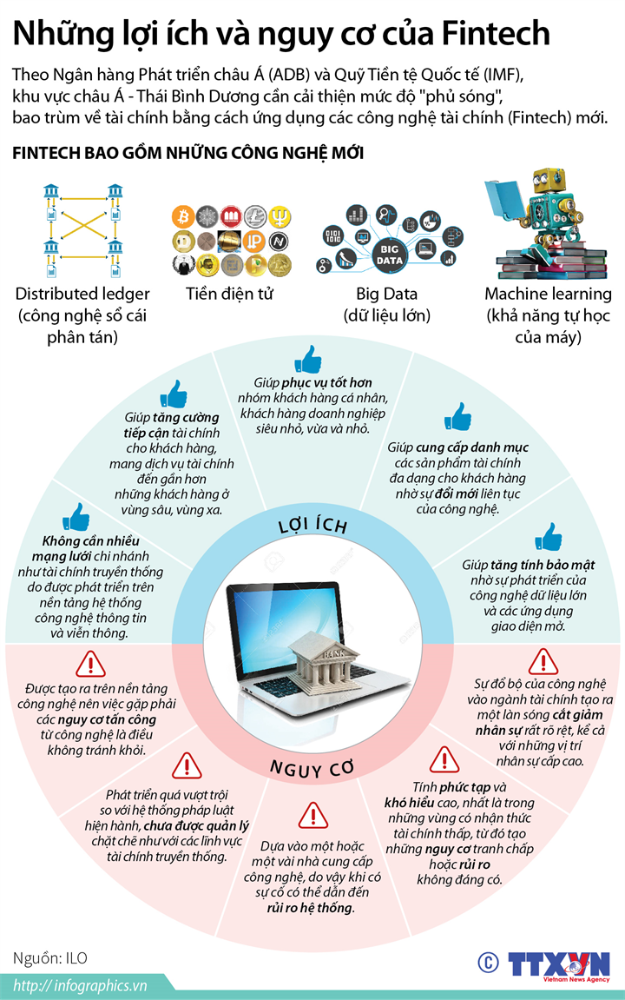

# 02 INTRODUCTION TO FINTECH

## NGƯỜI THỰC HIỆN

Trần Kiến Quốc (quoctk) - Software Development Fresher

## BÁO CÁO

Sau hàng thế kỷ bút mực, giấy tờ và tiền giấy thống trị các giao dịch ngân hàng, công nghệ số giờ đây đang mang một cấp độ mới về phân tích, kết nối và trao quyền lực giao dịch đến tận tay khách hàng. Khái niệm Fintech ra đời và được xem là *một làn sóng mới làm thay đổi toàn bộ cách thức cung ứng và vận hành các dịch vụ tài chính cũng như mô hình tổ chức đã có trước đây*.

***Fintech là gì?***

Đó là từ viết tắt của `Financial Technology (Công nghệ tài chính)`. Fintech được sử dụng chung cho tất cả các công ty sử dụng Internet, công nghệ điện toán đám mây, điện thoại di động, các phần mềm mã nguồn mở hay tiền mã hóa. Suy cho cùng, *Fintech giúp cải thiện hiệu suất và độ tin cậy của hoạt động ngân hàng và đầu tư*.

Xuyên suốt quá trình phát triển của Fintech, từ cơ bản nhất là các ứng dụng tài chính được khởi chạy và thực thi trên các trang web cho đến sự ứng dụng của các công nghệ, kỹ thuật tân tiến như AI, Machine Learning, Deep Learning, Blockchain, IoT đã đẩy nền công nghiệp Fintech lên một tầm cao mới.

Đơn cử là `Blockchain`, một công nghệ có rất nhiều tính năng quan trọng và cũng có tầm ảnh hưởng không nhỏ đến sự phát triển của Fintech. Blockchain mang tính năng của một cơ sở dữ liệu khi các nút (node) trong hệ thống có thể lưu trữ thông tin giao dịch ở dạng các khối (block), được phân cấp và lưu trữ để quản lý. Nó như là cuốn sổ cái chứa các thông tin cần thiết để xây dựng các báo cáo tài chính cũng như các thông tin kê khai về tình hình tài sản, chi phí, nợ doanh thu,... của doanh nghiệp. Cuối cùng, blockchain còn là kỹ thuật chính để tạo ra các đồng tiền kỹ thuật số, chẳng hạn Bitcoin - một loại đồng tiền số nổi tiếng và bùng nổ thương hiệu rộng rãi đến mọi người trên toàn thế giới từ khoảng 2017 đến nay: Hấp dẫn việc đầu tư, chứa đựng giá trị (sức mua hàng hóa, trao đổi) lớn, độ tin cậy và bảo mật cao,...

Khi từ Fintech trở nên phổ biến rộng rãi cũng như giá trị mà nó mang đến là vô cùng to lớn cho các tổ chức tài chính, ngân hàng; nhiều doanh nghiệp đã thay "máu" một cách nhanh chóng để tạo nên sự đột phá siêu lợi nhuận cho chính doanh nghiệp của mình. Họ đã nhìn nhận, phân tích kỹ lưỡng về quy trình xử lý nghiệp vụ, cách mà công ty đang vận hành, công nghệ tân tiến của thế kỷ 21 và sức mạnh của Fintech. Để rồi họ chấp nhận mạo hiểm và xúc tiến đầu tư cho công nghệ, sẵn sàng đổi mới quy trình và tối ưu hóa toàn diện nhằm tăng cường lợi nhuận, giảm thiểu chi phí vận hành, mang lại nhiều ích lợi hơn cho khách hàng.

Chẳng hạn `Robot cố vấn WealthNavi` (Navi: Chỉ dẫn đến, Wealth: Sự giàu có), đây là một dịch vụ quản lý tài sản đầu tư tự động dựa trên các thuật toán khách quan và minh bạch cao nhằm tạo ra một danh mục đầu tư tối ưu, hỗ trợ việc thiết lập mục tiêu, đề xuất phân bổ tài sản và quản lý tài sản cho những người mới bắt đầu đầu tư, thậm chí là tối ưu hóa về thuế. Sự ra đời của WealthNavi cho phép bất kỳ ai cũng có thể sử dụng dịch vụ quản lý tài sản thường chỉ được cung cấp cho giới giàu có, có thể xem ứng dụng này như là một toa thuốc cho sự bất bình đẳng xã hội, đáp ứng nhu cầu của thời đại.

Trong `lĩnh vực tư vấn, chăm sóc khách hàng, gợi ý kết quả cho yêu cầu của khách hàng,...` thì việc ứng dụng trí tuệ nhân tạo (AI) vào dịch vụ hỏi đáp FAQ (Frequently Asked Questions) này lại vô cùng tiện lợi và tiết kiệm một khoảng chi phí là rất lớn. Không những vậy, FAQ hầu như xuất hiện ở mọi dịch vụ, mọi doanh nghiệp và mọi lĩnh vực, trong đó có lĩnh vực tài chính, ngân hàng. Dựa trên các thuật toán xử lý ngôn ngữ tự nhiên, học sâu để phân tích các câu hỏi và nội dung trả lời, rồi lặp đi lặp lại quá trình học tự động, nhờ đó mà hệ thống FAQ trở nên "thông minh hóa", giúp các thông tin phản hồi với khách hàng dần chính xác hơn, chuyên nghiệp hơn. Nhờ đó mà phía doanh nghiệp có thể tiết kiệm chi phí thuê nhân công, tăng cường sự tương tác ngay lập tức và đúng với yêu cầu của khách hàng của mình.

Một lĩnh vực khác cũng không kém phần hấp dẫn, đó chính là `kinh doanh bảo hiểm`. Thông qua việc quản lý sức khỏe và cải thiện lối sống cho người dùng bởi ứng dụng thông minh đo lường tự động, phía doanh nghiệp sẽ có lượng dữ liệu lớn về tình trạng sức khỏe (BMI, huyết áp, nhịp tim,...) và nhật kí hoạt động ấy. Từ đó, doanh nghiệp tiến hành nghiên cứu sự liên quan giữa các dữ liệu sức khỏe với các dữ liệu y tế (tỷ lệ tử vong, tỷ lệ bệnh tật, chi phí y tế đối với từng căn bệnh,...), để đề xuất các gói sản phẩm bảo hiểm y tế trọn đời một cách có chọn lọc cho chính người sử dụng thông qua ứng dụng theo dõi sức khỏe. Như vậy, ứng dụng không chỉ giúp cho doanh nghiệp tăng cường doanh thu và lợi nhuận thông qua việc giới thiệu bảo hiểm đến đúng các đối tượng cụ thể mà còn giúp họ hiểu rõ hơn về sức khỏe của chính bản thân họ, và bản thân họ nên có sự lựa chọn bảo hiểm nào sao cho đúng nhất.

Trí tưởng tượng và khả năng sáng tạo của con người không bao giờ có giới hạn. Từ việc thanh toán các dịch vụ, sản phẩm qua Internet, website hay trên điện thoại, giờ đây các doanh nghiệp `ứng dụng sinh trắc học` vào việc thanh toán mà khách hàng không cần phải nhập mật khẩu một cách thủ công, kì cực. Họ chỉ cần sử dụng mống mắt hoặc dấu vân tay, thậm chí là nhận diện gương mặt là có thể thanh toán một cách nhanh chóng, hiệu quả, mà những sinh trắc học này là duy nhất trên mỗi người, không ai trùng ai. Chẳng hạn, việc thanh toán ở các quầy nghỉ mát ven biển. Hầu hết mọi người đến bãi biển đều giữ ví tiền trong tủ khóa, giữ chìa khóa tủ bên người trong lúc tắm biển và phải đi đến tủ khóa để lấy ví tiền khi mua thức ăn, đồ uống tại các cửa hàng. Việc phải đi lấy ví thật phiền phức, nên đôi khi mọi người bỏ luôn ý định mua hàng mà về thẳng phòng của mình. Trong khi đó, khách sạn, quầy hàng cho phép người dùng chỉ việc đăng ký số điện thoại và sinh trắc học đặc trưng của họ (vân tay hoặc mống mắt hoặc gương mặt) là có thể tay không ăn uống thoải mái, thanh toán nhanh chóng, không cần đem theo bất cứ chìa khóa tủ bên người khi đi tắm biển. Tương tự cho việc một đoàn khách lớn check-in và thanh toán phòng tại các khách sạn thuộc một tỉnh, thành phố, quốc gia đó, giảm thiểu việc xếp hàng chờ đợi, tốn thời gian của khách hàng.

***Còn Fintech ở Việt Nam thì như thế nào?***

Lĩnh vực Fintech ở Việt Nam còn khá *mới mẻ* và có rất nhiều công ty hoạt động trong các lĩnh vực khác nhau, trong đó phần lớn tập trung vào *mảng thanh toán*. Một vài công cụ thanh toán trực tuyến như Onepay, 123Pay, ZaloPay, MoMo, Moca; Dịch vụ cho vay trực tuyến như Tima, Trust Circle; Ngân hàng kỹ thuật số Tima; So sánh dịch vụ tài chính như BankGo,... Xu hướng phát triển mạnh mẽ của Fintech tại Việt Nam đang gia tăng tầm ảnh hưởng trên thị trường tài chính – ngân hàng trong nước. Đây được cho là thách thức lớn với các ngân hàng, nhưng ở một khía cạnh khác cũng chính là cơ hội cho những tổ chức tín dụng biết nắm bắt thời cơ đầu tư mạnh mẽ vào lĩnh vực công nghệ thông tin để thu hút nhiều khách hàng hơn, hoặc là hợp tác với các công ty Fintech để mở rộng doanh nghiệp theo con đường số hóa của mình. Không những vậy, sự tiến bộ vượt trội hiện nay của các công nghệ tân tiến như trí tuệ nhân tạo, xử lý ngôn ngữ tự nhiên, học máy, thống kê phân tích, sinh trắc học còn giúp cho các sản phẩm công nghệ tài chính trở nên bảo mật, mạnh mẽ và dễ dàng mở rộng phát triển hơn nữa.

Ở một khía cạnh khác, sự phát triển của các doanh nghiệp Fintech sẽ giúp một bộ phận người dân, đặc biệt là tại các vùng sâu vùng xa, được tiếp cận với các dịch vụ tài chính hiện đại nhưng gần gũi, thông qua các thiết bị công nghệ thông minh mà hiện nay rất rất nhiều người đang sở hữu. Đây chính là một “bước đệm” quan trọng, trang bị những kỹ năng cơ bản khi sử dụng dịch vụ tài chính cho bộ phận khách hàng chưa từng sử dụng dịch vụ ngân hàng. Những khách hàng này sẽ không còn bỡ ngỡ và được kỳ vọng sẽ chủ động hơn trong việc tiếp cận các dịch vụ chuyên nghiệp của ngân hàng trong tương lai.

Bên cạnh những lợi ích mà Fintech đem lại, các hoạt động của Fintech có thể ẩn chứa những tác động bất lợi đến hệ thống tài chính. Đầu tiên là *nguy cơ bị tấn công bởi chính công nghệ*. Các sản phẩm Fintech được tạo ra trên nền tảng công nghệ nên việc gặp phải các nguy cơ tấn công từ công nghệ là điều không tránh khỏi. Hai là, Fintech phát triển quá vượt trội so với hệ thống pháp luật hiện hành. Sản phẩm Fintech là dựa trên những đổi mới và sáng tạo liên tục của công nghệ, do đó, nhiều trường hợp các *quy định của pháp luật hiện hành chưa theo kịp*. Ngoài ra, hầu hết các lĩnh vực Fintech chưa được quản lý chặt chẽ bởi các cơ quản quản lý nhà nước như với các lĩnh vực tài chính truyền thống. Ba là, *rủi ro hệ thống*. Các sản phẩm Fintech thường dựa vào một hoặc một vài nhà cung cấp công nghệ do vậy khi có sự cố có thể dẫn đến rủi ro hệ thống. Không những thế, tính ổn định trong Fintech không cao do khách hàng có thể dễ dàng chuyển đổi nhà cung cấp dịch vụ Fintech. Bốn là, *tỷ lệ thất nghiệp trong ngành tài chính gia tăng*. Với những đổ bộ của công nghệ vào ngành tài chính đã tạo ra một làn sóng cắt giảm nhân sự rất rõ rệt, đặc biệt với những thành tựu của trí tuệ nhân tạo đã làm cho làn sóng này không chỉ diễn ra với những vị trí nhân sự cấp thấp như giao dịch viên mà những vị trí nhân sự cấp cao như kinh doanh ngoại tệ. Thách thức tiếp theo đến từ *nhận thức và niềm tin của khách hàng với các sản phẩm Fintech*, đặc biệt khi các sản phẩm Fintech chưa xây dựng được thương hiệu mạnh cũng cản trở không nhỏ tới sự kích thích sử dụng của khách hàng. Và yếu tố thách thức cuối cùng là sự *chưa hoàn thiện của cơ sở hạ tầng thị trường tài chính tại Việt Nam*.

 

***Những chia sẻ khác?***

Các công ty Fintech mặc dù có ưu thế về công nghệ, mô hình kinh doanh sáng tạo nhưng lại ít kinh nghiệm trong hoạt động tài chính-ngân hàng, hệ thống kiểm soát, mạng lưới tiếp cận khách hàng còn nhiều hạn chế. Các ngân hàng truyền thống lại có lợi thế về sự am hiểu vận hành và hoạt động của hệ thống tài chính, về dữ liệu khách hàng, bộ máy kiểm soát tuân thủ pháp lý chắc chắn. Bằng cách hợp tác, cả Fintech và ngân hàng sẽ cùng có lợi. Điều đó tạo ra sức mạnh tổng hợp cho thị trường dịch vụ ngân hàng, nâng cao khả năng cạnh tranh và góp phần thúc đẩy phát triển kinh tế.

Chính phủ cũng cần công bố rộng rãi thông tin trên các phương tiện thông tin đại chúng chính thống giúp người dân có nhận thức nhất định về Fintech, về cách thức bảo mật thông tin cá nhân, thường xuyên cập nhật các sản phẩm dịch vụ và doanh nghiệp Fintech mới được cấp phép,... để vừa hạn chế việc tội phạm lợi dụng sự thiếu hiểu biết của dân chúng, vừa tạo điều kiện cho Fintech phát triển.

Tóm lại, “Ngân hàng không giấy”, “tổ chức tài chính không giấy” là xu hướng phát triển tất yếu của ngành tài chính ngân hàng trong cuộc cách mạng 4.0. Fintech đã đem đến một hình thức mới trong dịch vụ tài chính, làm thay đổi trải nghiệm của khách hàng trong các giao dịch liên quan đến tài chính bởi sự tiện dụng về không gian, thời gian và cả chi phí. Tuy nhiên, vẫn còn khá nhiều thách thức phía trước như hành lang pháp lý, sản phẩm, vốn đầu tư, thị trường, cách tiếp cận khách hàng mà các doanh nghiệp Fintech Việt Nam cần vượt qua để phát triển và tạo nên một thị trường tài chính phát triển lành mạnh, an toàn và hiệu quả trong cuộc cách mạng 4.0.

## NGUỒN THAM KHẢO

* Quyển sách "Fintech 4.0" - tác giả Kitao Yoshitaka.
* [Fintech cafe.vn](http://cafef.vn/dung-chi-nhin-thay-co-hoi-ma-quen-di-nhung-rui-ro-va-thach-thuc-cua-fintech-20180403000909478.chn)
* "XU HƯỚNG PHÁT TRIỂN FINTECH TRÊN THẾ GIỚI, NHỮNG CƠ HỘI, THÁCH THỨC ĐẶT RA VỚI NGÀNH NGÂN HÀNG VÀ THỰC TIỄN TẠI VIỆT NAM" - TS. Nguyễn Thị Hiền và ThS. Nguyễn Thị Minh Ngọc.
* "TÁC ĐỘNG CỦA FINTECH ĐỐI VỚI HOẠT ĐỘNG NGÂN HÀNG VÀ MỘT SỐ ĐỀ XUẤT ĐỂ NGÂN HÀNG - FINTECH CÙNG PHÁT TRIỂN TẠI VIỆT NAM" - TS. Lê Huyền Ngọc.