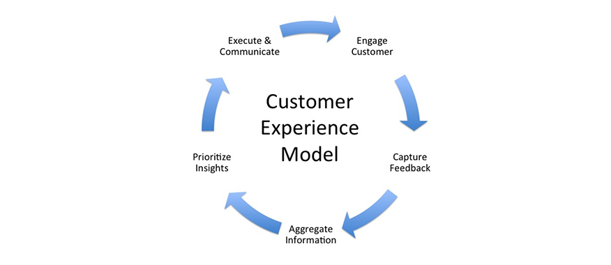
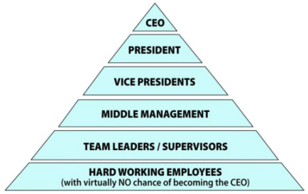
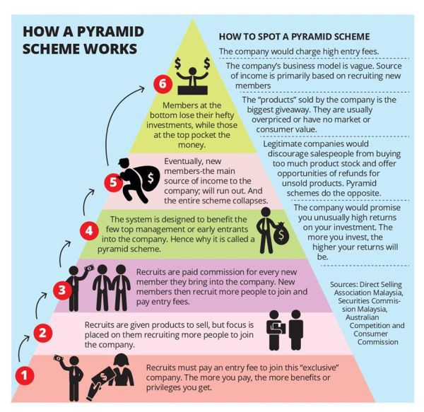
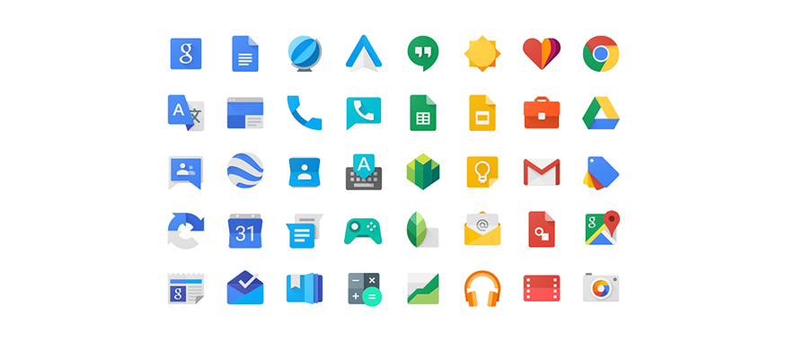
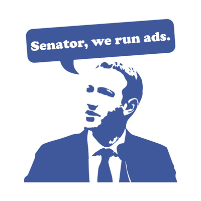
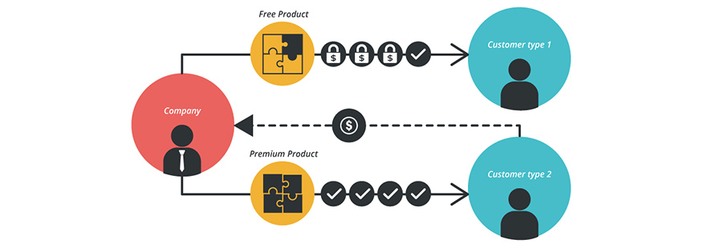

# 03 WORKSHOP BUSINESS MODEL

## NGƯỜI THỰC HIỆN

* Trần Kiến Quốc (quoctk) - Software Development Fresher
* Nguyễn Đỗ Cát Trân (tranndc) - Software Development Fresher

## BÁO CÁO

### PHẦN I - LÝ THUYẾT

**Business model canvas**

* `Mục tiêu của mô hình:` 
    * Thiết kế, mô tả các thông tin quan trọng nhất về một tổ chức trong quá trình thành lập một doanh nghiệp mới.
    * Là cơ sở cần thiết để đánh giá, phân tích tình hình kinh doanh hiện tại của một công ty.
* `Các thành phần trụ cột:`
    * *Phân khúc khách hàng (Customer Segments):*
        * *Mục tiêu:* Xác định thành một hoặc nhiều nhóm người, tổ chức để doanh nghiệp đưa sản phẩm của mình tiếp cận đến họ một cách dễ dàng, hiệu quả, vì ***"biết người, biết ta, trăm trận trăm thắng***.
        * *Một vài phân khúc nổi bật:*
            * Đại chúng (Mass market): Không phân biệt loại khách hàng (sinh viên, giáo viên, người đã đi làm, mẹ bầu,...), đòi hỏi đặc tính sản phẩm phải chung nhất và thỏa mãn được những yêu cầu cơ bản nhất của khách hàng. Ví dụ: Các nhu yếu phẩm, lương thực.
            * Ngách (Niche market): Một phân đoạn nhỏ của thị trường hay một khoảng trống thị trường với một nhóm khách hàng riêng biệt (thị phần nhỏ). Ví dụ: Rolls Royce là hãng ô tô chỉ cung cấp sản phẩm một cách tập trung vào những doanh nhân giàu sụ, thích sự đẳng cấp.
            * Thị trường phân khúc (Segmented): Chia nhỏ một thị trường lớn thành các phân khúc nhỏ hơn, đòi hỏi sản phẩm được phân loại nhằm đáp ứng nhu cầu và sở thích của từng nhóm khách hàng. Ví dụ: Thị trường ô tô có khúc đẳng cấp nhất (Rolls Royce), khúc cao cấp (Lamborghini, Mercesdes), khúc trung-cao (Toyota), khúc thấp (Kia Motors).
            * Thị trường đa dạng (Diversified): Phục vụ 2 hoặc nhiều phân khúc khách hàng không liên quan nhau với những nhu cầu và vấn đề khác nhau. Ví dụ: Điện thoại Samsung phục vụ các khách hàng tầm trung-thấp (học sinh, sinh viên) và cao cấp (doanh nhân, người đã đi làm có điều kiện).
            * Hỗn hợp (Multi-sided platforms | Two-sided market): Phục vụ ít nhất 2 nhóm người dùng đặc trưng khác nhau & các nhóm này phải tương tác với nhau. Ví dụ: Facebook là mạng xã hội có lượng lớn "người chơi" truy cập miễn phí, do đó Facebook thu phí từ các nhà quảng cáo với mong muốn quảng bá sản phẩm của mình và cho những "người chơi" (miễn phí) xem quảng cáo.
    * *Giải pháp giá trị (Value Propositions):*
        * *Mục tiêu:* Cung cấp giá trị nhất định cho khách hàng từ việc sử dụng sản phẩm, dựa theo quy tắc cơ bản ***"sản phẩm của chúng ta mang lại cho khách hàng điều gì/Giải quyết vấn đề gì cho khách hàng"***.
        * *Các yếu tố của giá trị sản phẩm mang lại:*
            * Đáp ứng được yêu cầu.
            * Thiết kế, mẫu mã.
            * Thương hiệu.
            * Giá cả.
            * Độ bền, rủi ro của sản phẩm.
            * Khả năng tiếp cận.
            * Tiện lợi, dễ dàng sử dụng.
    * *Kênh phân phối (Channel):*
        * *Mục tiêu:* Mô tả cách thức công ty tiếp cận và phân phối sản phẩm đến phân khúc khách hàng của mình.
        * *Các loại kênh phân phối:* Trực tiếp, gián tiếp.
        * *5 giai đoạn cơ bản của phân phối:* 
            * **Nhận thức** của khách hàng về giá trị, tính chất sản phẩm, thông tin công ty.
            * Khách hàng **đánh giá** giá trị sản phẩm của công ty mang lại cho họ.
            * Cách thức khách hàng **mua** sản phẩm.
            * **Chuyển vận** sản phẩm đến khách hàng.
            * Dịch vụ **hậu mãi** đi cùng sản phẩm.
    * *Quan hệ khách hàng (Customer Relationships):*
        * *Mục tiêu:* Mô tả các mối quan hệ mà công ty thiết lập với từng phân đoạn khách hàng cụ thể.
        * *Lợi ích khi công ty giữ quan hệ với khách hàng của mình:* Duy trì công ty, sản phẩm; Mở rộng thị trường; Tăng doanh số.
        * *Cách thức giữ quan hệ:*
            * Hỗ trợ cá nhân.
            * Hỗ trợ cá nhân chuyên biệt (Chẳng hạn khách hàng VIP, DIAMOND,...).
            * Tự phục vụ.
            * Dịch vụ tự động (thông minh).
            * Cộng đồng.
            * Đồng sáng tạo.
    * *Dòng doanh thu (Revenue Streams):*
        * *Mục tiêu:* Là số tiền mà một công ty tạo ra được từ mỗi phân khúc khách hàng.
        * *Cơ chế giá cả bán:* Giá cố định/niêm yết, giá linh hoạt/thương lượng.
        * *Nguồn doanh thu:*
            * Bán sản phẩm.
            * Phí sử dụng dịch vụ.
            * Phí thuê.
            * Phí bản quyền theo thời kì.
            * Phí hoa hồng (Môi giới).
            * Phí dịch vụ quảng cáo.
            * Phí thường niên (hội viên/đăng ký).
    * *Nguồn lực chính (Key Resources):*
        * *Mục tiêu:* Là các tài nguyên đầu vào có tầm quan trọng lớn, nhằm phục vụ các hoạt động kinh doanh của một doanh nghiệp mà sinh lãi hay tạo nên lợi ích cho các bên (doanh nghiệp - khách hàng, cung cấp - thu mua, doanh nghiệp - xã hội,...)
        * *Các loại nguồn lực gần gũi nhất:*
            * Con người.
            * Tài nguyên vật lý: Máy móc, thiết bị, công xưởng, điểm bán hàng, kho bãi,...
            * Tài nguyên tri thức: Bản quyền, thương hiệu (sản phẩm/công ty), bằng sáng chế, quan hệ đối tác, dữ liệu khách hàng,...
            * Tài chính: Nguồn vốn cơ bản, khả năng kêu gọi vốn đầu tư,...
    * *Các hoạt động chính (Key activities):*
        * *Mục tiêu:* Mô tả những việc quan trọng nhất mà một công ty phải làm để vận hành mô hình kinh doanh của mình (Duy trì công việc kinh doanh).
        * *Các hoạt động cơ bản:*
            * Sản xuất.
            * Giải quyết vấn đề trong sản xuất, tối ưu sản xuất, tạo ra giải pháp mới,...
            * Mở rộng nền tảng, mạng lưới kinh doanh, quan hệ đối tác.
    * *Các đối tác chính (Key Partnerships):*
        * *Mục tiêu:* Là mạng lưới các nhà cung cấp và đối tác giúp mô hình kinh doanh hoạt động và mở rộng phát triển.
        * *4 loại quan hệ đối tác:*
            * Strategic alliances: Liên minh chiến lược giữa các đối tác không cạnh tranh.
            * Co-opetition: Đối tác chiến lược giữa các đối thủ cạnh tranh.
            * Joint-Ventures: Liên doanh phát triển doanh nghiệp mới.
            * Buyer-Supplier Relationships: Mối quan hệ giữa người mua và nhà cung cấp để đảm bảo nguồn cung cấp đáng tin cậy.
        * *3 động lực để quan hệ đối tác:*
            * Optimization and economy of scale: Giảm thiểu chi phí trong quy trình sản xuất, nguồn lực, hỗ trợ chia sẻ cơ sở hạ tầng.
            * Reduction of risk and uncertainty: Giảm thiểu rủi ro kinh doanh và những mối quan hệ cung cấp không đảm bảo/cam kết.
            * Acquisition of particular resources and activities: Công ty tập trung vào chuyên môn của mình và dựa vào các công ty khác trong việc tiến hành một số hoạt động nhất định.
    * *Cơ cấu chi phí (Cost structure):*
        * *Mục tiêu:* Mô tả tất cả các chi phí phát sinh trong việc vận hành mô hình kinh doanh. Các chi phí này có thể được tính toán tương đối dễ dàng sau khi xác định các nguồn lực chính, các hoạt động chính và các đối tác chính.
        * *Đặc trưng cơ cấu chi phí:* Chi phí cố định (tiền thuê kho xưởng, máy móc), chi phí thay đổi (Chi phí vận chuyển, nguyên vật liệu)
* `Ảnh minh họa:`

    

    *Chú thích: Facebook-Business-Model-Canvas*

    

    *Chú thích: Airbnb-Business-Model-Canvas*

    

    *Chú thích: Những câu hỏi quan trọng trong việc xác định Business Model Canvas*

**SWOT**

* `Mục tiêu:` 
    * Là mô hình rất nổi tiếng trong phân tích kinh doanh và định hướng marketing cho doanh nghiệp. 
    * Giúp doanh nghiệp nhìn rõ mục tiêu của mình, các yếu tố trong và ngoài tổ chức nhằm cải thiện chất lượng, quy trình, kế hoạch trong thời gian gần.
* `Các thành phần quan trọng:`
    * *Strengths (Điểm mạnh, ưu thế)*
    * *Weaknesses (Điểm yếu)*
    * *Opportunities (Cơ hội, thời cơ)*
    * *Threats (Thách thức, mối đe dọa)*
* `Ảnh minh họa:`

    

    *Chú thích: Những câu hỏi quan trọng trong việc xác định SWOT của doanh nghiệp/sản phẩm*

    

    *Chú thích: Sau khi xác định các thông tin cơ bản nhất, quan trọng nhất của doanh nghiệp/sản phẩm, thì phải phát huy những điểm mạnh, nắm bắt cơ hội, khắc phục điểm yếu và đề xuất các lối hậu cho hiểm nguy kinh doanh*

    

    *Chú thích: Ví dụ SWOT nhà hàng*

**Mô hình kinh doanh**

* `Tham khảo:` [Tại đây (uplevo.com)](http://www.uplevo.com/blog/khoi-nghiep/10-mo-hinh-kinh-doanh-cho-dan-khoi-nghiep/)
* `Khái niệm:` Là bản kế hoạch kiếm tiền, phát triển doanh nghiệp. Nó chính xác là hướng đi mà chủ doanh nghiệp vạch ra để bám theo loại hình kinh doanh nhất định. Từ đó, mọi thành viên trong công ty sẽ chung một suy nghĩ, mục đích và hành động.
* `Các loại mô hình kinh doanh cơ bản:`
    * *Mô hình trải nghiệm (The Experience Model)* 

        

    * *Mô hình Kim tự tháp (The Pyramid)*

        

        

    * *Hệ sinh thái (The Ecosystem)*

        

    * *Mô hình kinh doanh miễn phí (Free Model)*

        

    * *Miễn phí kết hợp cao cấp (The Freemium Model)*

        

**Chiến lược kinh doanh**

* `Giải thích:` Chiến lược là chương trình, kế hoạch hành động được thiết kế để đạt được một mục tiêu cụ thể. Như vậy một chiến lược phải giải quyết tổng hợp các vấn đề sau:
    * Xác định chính xác mục tiêu cần đạt.
    * Xác định con đường, hay phương thức để đạt mục tiêu.
    * Định hướng phân bổ nguồn lực để đạt được mục tiêu lựa chọn.
* `Các loại chiến lược:`
    * *Chiến lược mở (Open strategy):*
        * Là cách tiếp cận để lập kế hoạch chiến lược, nơi mà nhân viên từ tất cả các phòng ban và đơn vị kinh doanh có cơ hội đóng góp cho chiến lược tổ chức. Trong một số trường hợp, khách hàng và đối tác cũng được mời tham gia.
        * Chiến lược mở không làm giảm sự quản lý của bộ máy quản lý cấp cao đối với việc phát triển và thực hiện chiến lược. Nó chỉ là quá trình liên quan đến nhiều người và năng động hơn so với những việc họ đã làm trong quá khứ.
        * Lợi ích: Cải thiện kế hoạch chiến lược, phương thức triển khai, đảm bảo/tận dụng quyền tham gia & đóng góp của nhân viên.
    * *Chiến lược thích ứng (Adaptive Strategy):*
        * Là chiến lược nhằm phát triển, cải tiến liên tục, phản ứng nhanh và thay đổi linh hoạt để tăng tính tương quan giữa tính chất kinh tế và đặc tính xã hội. Việc xây dựng, thực hiện và cải tiến chiến lược không phải là các giai đoạn tuần tự riêng biệt mà đi đôi với nhau.
        * Dựa trên triết lý và khái niệm về phát triển phần mềm nhanh nhẹn (Agile Software Development).
        * Là chiến lược luôn nhấn mạnh việc thử nghiệm liên tục và điều chỉnh theo thời gian thực (hơn là phân tích và lập kế hoạch dài hạn).

### PHẦN II - TỔ CHỨC KINH DOANH

* Nội dung trình bày: [Tại đây](https://drive.google.com/open?id=1ofba0lhE1rOIpnYvsCyjwE6U7IHs3APjqVl_PWZxwpc)
