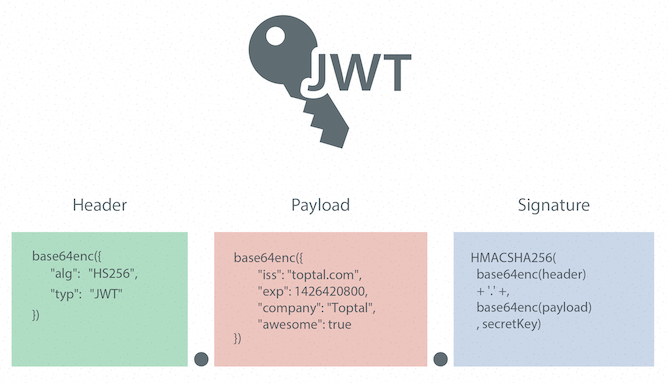
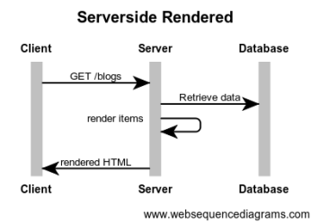
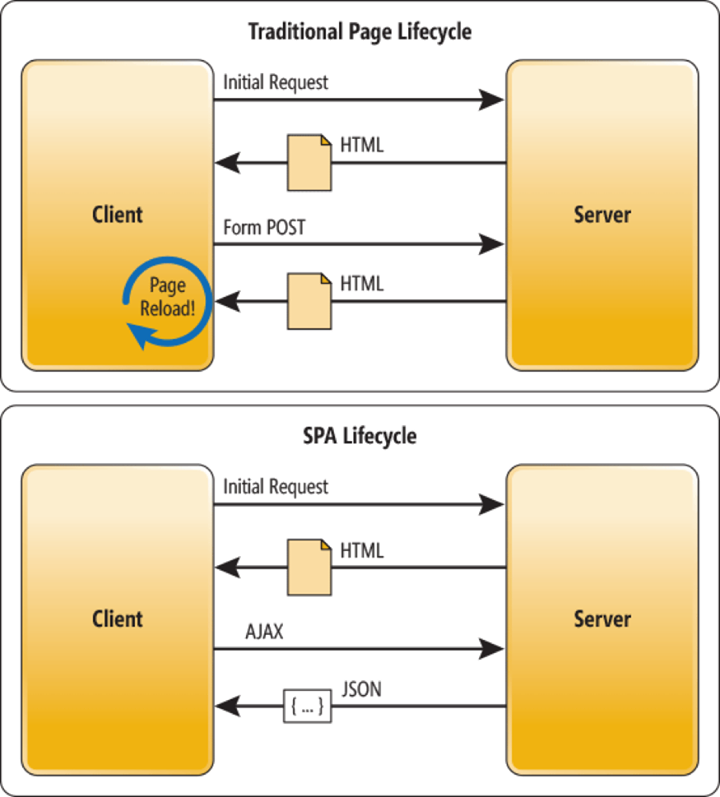
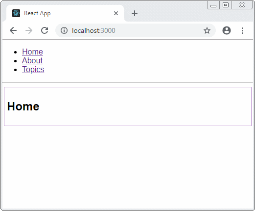
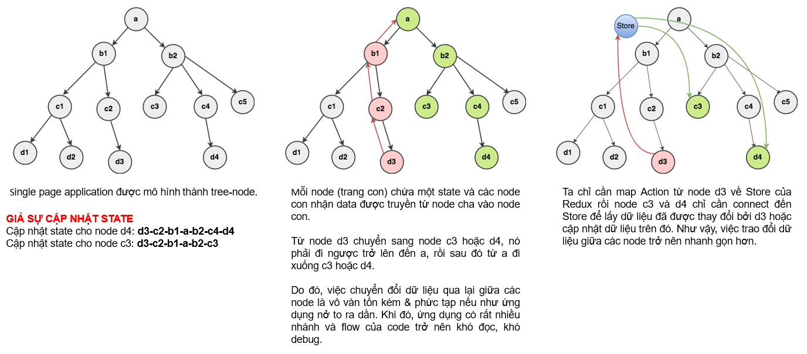
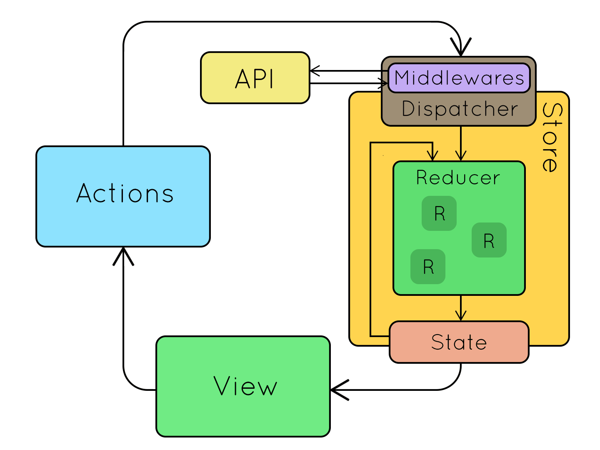

# 02 ADVANCE WEB DEVELOPMENT

## NGƯỜI THỰC HIỆN

* Họ tên: Trần Kiến Quốc (QuocTk)
* Vị trí: Software Development Fresher

<br/>

## MỤC LỤC

- [HTTP và Restful API](#A)
    - [HTTP Method](#A1)
    - [CORS](#A2)
    - [Session, Cookie, JWT](#A3)
    - [Khái niệm Restful API & cách thiết kế](#A4)
    - [Server Render & Single Page App](#A5)
    - [Công cụ hỗ trợ thiết kế Restful API (Swagger, Postman)](#A6)
- [ReactJS](#B)
    - [ReactJS](#B1)
    - [Create-react-app & NextJS](#B2)
    - [React Router](#B3)
    - [State Management](#B4)
        - [Redux](#B4.1)
        - [MobX](#B4.2)
        - [Khi nào cần dùng một State Management?](#B4.3)
    - [React Framework](#B5)
        - [Ant.design](#B5.1)
        - [React Bootstrap](#B5.2)
        - [RechartsJS](#B5.3)
- [NGUỒN THAM KHẢO](#C)

<br/>

<span name="A"></span>

## HTTP và Restful API

<span name="A1"></span>

1. HTTP Method
    * GET:
        * Mục tiêu: READ, được sử dụng để lấy thông tin từ sever theo URL đã cung cấp.
        * Nếu dùng get để truyền dữ liệu lên server (thay vì dùng post), tất cả các paramater đều bị hiển thị trên url của request, xét về khía cạnh bảo mật thì điều này rất tệ. Còn dùng phương thức post thì các parameters sẽ nằm trong body và được mã hóa, nhằm ngăn cản các phần tử trung gian ăn cắp nội dung. Nhưng post chỉ có tính an toàn đối với client, còn với sever thì lại khác. Các method như post, put, delete bị coi là unsafe và not idempotent cho server.
        ```
        HTTP GET http://www.appdomain.com/users
        HTTP GET http://www.appdomain.com/users?size=20&page=5
        HTTP GET http://www.appdomain.com/users/123
        HTTP GET http://www.appdomain.com/users/123/address
        ```
    * POST:
        * Mục tiêu: CREATE, gửi thông tin tới sever để tạo ra tài nguyên/dữ liệu mới.
        ```
        HTTP POST http://www.appdomain.com/users
        HTTP POST http://www.appdomain.com/users/123/accounts
        ```
    * PUT:
        * Mục tiêu: UPDATE/REPLACE, cập nhật dữ liệu/tài nguyên đã tồn tại. Nếu tài nguyên không tồn tại thì API có thể quyết định tạo tài nguyên mới hay không.
        * Sự khác biệt giữa API POST và PUT có thể được quan sát trong các URL yêu cầu. Các yêu cầu POST được thực hiện trên các tập dữ liệu/tài nguyên trong khi các yêu cầu PUT được thực hiện trên một dữ liệu/tài nguyên riêng lẻ.
        ```
        HTTP PUT http://www.appdomain.com/users/123
        HTTP PUT http://www.appdomain.com/users/123/accounts/456
        ```
    * DELETE:
        * Mục tiêu: DELETE, xóa tài nguyên trên server.
        ```
        HTTP DELETE http://www.appdomain.com/users/123
        HTTP DELETE http://www.appdomain.com/users/123/accounts/456
        ```
    * **SAFE**: Một method được coi là safe khi nó không làm thay đổi trạng thái/dữ liệu của server (đặc biệt là các phương thức chỉ đọc). GET được xem là method safe. PUT, DELETE, POST được xem là unsafe.
    * **IDEMPOTENT**: 
        * Các method được coi là idempotent khi nó có thể thực hiên n + 1 lần mà vẫn trả lại 1 kết quả như ban đầu. Vì điều này nên các method safe đều là idempotent. Nhưng unsafe chưa chắc đã idempotent.
    * **LƯU Ý**:
        * Header dài tối đa 8kb và cũng phụ thuộc cả vào trình duyệt.
        * Body thì limit của nó tùy trình duyệt.
        * URL không dài quá 2 nghìn kí tự và cũng tùy thuộc vào trình duyệt.

<span name="A2"></span>

2. CORS
    * CORS (hay nói một cách giông dài là Cross-Origin Resource Sharing) là một kĩ thuật được sinh ra để làm cho việc tương tác giữa client và server được dễ dàng hơn, nó cho phép JavaScript ở một trang web có thể tạo request lên một REST API được host ở một domain khác. (Ví dụ client là *portal.codeaholicguy.com* và server là *api.codeaholicguy.com*, hai domain này chắc chắn không cùng origin)
    * Cơ chế hoạt động: 
        * Request từ phía client (GET, POST, PUT, DELETE,...) sẽ được đính kèm một header tên là Origin để chỉ định origin của client code (giá trị của header này chính là domain của trang web).
        * Server sẽ xem xét Origin để biết được nguồn này có phải là nguồn hợp lệ hay không. Nếu hợp lệ, server sẽ trả về response kèm với header Access-Control-Allow-Origin. Header này sẽ cho biết client có phải là nguồn hợp lệ để browser tiếp tục thực hiện quá trình request hay không. Trong trường hợp thông thường, Access-Control-Allow-Origin sẽ có giá trị giống như Origin. Nếu không có header Access-Control-Allow-Origin hoặc giá trị của nó không hợp lệ thì server sẽ từ chối request của chúng ta và browser hiện thông báo việc request thất bại.
        * **Lưu ý**: Khi thực hiện những request ảnh hưởng tới data như POST, PUT, DELETE,... thì browser sẽ tự động thực hiện một request gọi là `preflight request` trước khi thực sự thực hiện request để kiểm tra xem phía server đã thực hiện CORS hay chưa. Preflight request được gửi lên server với dạng là OPTIONS (đây là lý do tại sao khi debug thì ở client thường thấy có hai request giống nhau nhưng khác request method, một cái là OPTIONS một cái là method thật sự muốn gửi). Nếu ở request medthod OPTIONS đầu tiên được server cho phép, nó sẽ gửi về response đính kèm những header như Access-Control-Allow-Origin, Access-Control-Allow-Methods, Access-Control-Max-Age,... Ngược lại, server từ chối, browser hiện thông báo request thất bại.
            * Access-Control-Allow-Methods: Mô tả những method nào client có thể gửi đi.
            * Access-Control-Max-Age: Mô tả thời gian hợp lệ của preflight request, nếu quá hạn, browser sẽ tự tạo một preflight request mới.

<span name="A3"></span>

3. Session, Cookie, JWT
    
    

    * Cookie:
        * Cookie là một phần dữ liệu được lưu trên máy khách. Mỗi khi máy khách gửi một yêu cầu tới máy chủ nào đó, thì nó sẽ gửi phần dữ liệu được lưu trong cookie tương ứng với máy chủ đó.
        * Trong Cookie có một số thông số sau:
            * Địa chỉ URL mà trình duyệt sẽ gửi cookie tới.
            * Thời gian hết hạn của cookie.
            * Các cặp biến - giá trị được lưu trữ liên tục.
        *  Cookie có thể bị thay đổi giá trị. Cookie sẽ bị vô hiệu hoá nếu cửa sổ trình duyệt điều khiển cookie đóng lại và cookie hết thời gian có hiệu lực.
    * Session:
        * Session là phiên làm việc. Nó là cách đơn giản để lưu trữ 1 biến và khiến biến đó có thể tồn tại từ trang này sang trang khác.
        * Một trong các ứng dụng điển hình là việc quản lý Đăng nhập, Đăng xuất của thành viên mà hầu hết các trang Web nào cũng phải có. Với mỗi session được tạo ra bên máy chủ, chúng sẽ tạo ra một tệp tin cookie lưu trên trình duyệt của máy khách ứng với session đó. Như vậy, chỉ cần so sánh tệp tin cookie bên phía client được gửi lên sever và tệp session được lưu trên server là ra ngay thông tin session mà server đã lưu trữ.
        * Session thường được ưa chuộng sử dụng hơn Cookie:
            * Nếu browser được thiết lập để không chấp nhận cookie, thì session vẫn có thể được sử dụng bằng cách truyền session ID giữa các trang web qua URL.
            * Lượng data truyền tải giữa browser và server: Chỉ mỗi session ID được truyền giữa browser và server, data thực sự được website lưu trữ trên server.
            * Bảo mật: Càng ít thông tin được truyền tải qua lại giữa browser và client càng tốt, và càng ít thông tin được lưu trữ tại client càng tốt.
    * JWT:
        * JSON Web Token (JWT) là 1 tiêu chuẩn mở (RFC 7519) định nghĩa cách thức truyền tin an toàn giữa các thành viên bằng 1 đối tượng JSON. Thông tin này có thể được xác thực và đánh dấu tin cậy nhờ vào "chữ ký" của nó. Phần chữ ký của JWT sẽ được mã hóa lại bằng HMAC hoặc RSA.

            

        * Đặc điểm nổi bật: 
            * Kích thước nhỏ: JWT có thể được truyền thông qua URL, hoặc qua giao thức POST, hay nhét vào bên trong phần HTTP Header. Kích thước nhỏ hơn ứng với công việc truyền tải sẽ nhanh hơn. Dưới đây là cách thức truyền token vào trong HTTP Header sử dụng Bearer Schema: **Authorization: Bearer `<token>`**
            * Khép kín: Phần Payload (hiểu nôm na là khối hàng) chứa toàn bộ những thông tin mà chúng ta cần tới, ví dụ như thông tin của người dùng (thay vì phải truy vấn cơ sở dữ liệu nhiều lần).
        * Khi nào dùng JWT?: Authentication và Trao đổi thông tin.
        * Xem chi tiết JWT [tại đây](https://techmaster.vn/posts/33959/khai-niem-ve-json-web-token).

<span name="A4"></span>

4. Khái niệm Restful API & cách thiết kế
    * Khái niệm Restful API:
        * API (Application Programming Interface) là một tập các quy tắc và cơ chế mà theo đó, một ứng dụng hay một thành phần sẽ tương tác với một ứng dụng hay thành phần khác. API có thể trả về dữ liệu mà bạn cần cho ứng dụng của mình ở những kiểu dữ liệu phổ biến như JSON hay XML.
        * REST (REpresentational State Transfer) là một kiểu kiến trúc lập trình, định nghĩa các quy tắc để thiết kế web service.
        * Sử dụng giao thức HTTP, cung cấp các chế độ *cơ bản nhất* truy cập đến nguồn tài nguyên của ứng dụng: Create – Read – Update – Delete (CRUD).
        * RESTful không quy định logic code ứng dụng và không giới hạn bởi ngôn ngữ lập trình ứng dụng, bất kỳ ngôn ngữ hoặc framework nào cũng có thể sử dụng để thiết kế một RESTful API.
    * Ưu điểm khi sử dụng Restful API:
        * Sử dụng các phương thức HTTP một cách rõ ràng.
        * REST URL đại diện cho tài nguyên chứ không phải hành động.
        * Dữ liệu được trả về với nhiều định dạng khác nhau như: xml, html, rss, json,...
        * Stateless (phi trạng thái): Server và client không lưu trạng thái của nhau, cho nên mỗi request đến server thì client phải đóng gói thông tin đầy đủ để server có thể hiểu được.
    * Cách thiết kế Restful API:
    
        

<span name="A5"></span>

5. Server Render & Single Page App
    * Server render:
        * Gọi là server-side rendering vì phần lớn logic sẽ được xử lý ở server:
            * Khi người dùng vào một trang web, trình duyệt sẽ gửi GET request tới web server.
            * Web server sẽ nhận request, đọc dữ liệu từ database.
            * Web server sẽ render HTML, trả về cho browser để hiển thị cho người dùng.

                
                
        * Một số tính chất của cơ chế server side rendering:
            * Logic từ đơn giản (validation, đọc dữ liệu) cho đến phức tạp (phân quyền, thanh toán) đều nằm ở phía server.
            * Logic để routing – chuyển trang nằm ở server.
            * Logic để render – hiển thị trang web cũng nằm ở server nốt.
        * Ưu điểm nổi bật:
            * Initial load nhanh, dễ otpimize, vì toàn bộ dữ liệu đã được xử lý ở server. Client chỉ việc hiển thị.
            * Các web framework từ xưa đến nay đều hỗ trợ cơ chế này.
            * Dễ hiểu và dễ code hơn. Developer chỉ cần code 1 project web là được, không cần phải tách ra front-end và back-end.
        * Nhược điểm:
            * Mỗi lần người dùng chuyển trang là site phải load lại nhiều lần, gây khó chịu.
            * Nặng server vì server phải xử lý nhiều logic và dữ liệu. Có thể sử dụng caching để giảm tải.
            * Tốn băng thông vì server phải gửi nhiều dữ liệu thừa và trùng  (HTML, header, footer). Có thể sử dụng CDN để giảm tải.
            * Tương tác không tốt như Client Side rendering vì trang phải refresh, load lại nhiều lần.
    * Single page app:
        * Single page app, viết tắt là SPA. SPA giúp cho ứng dụng nằm trong 1 page duy nhất và chính Client Side Rendering sử dụng cách thức SPA này.
        * Toàn bộ resource của web bao gồm các file CSS, Javascript, master layout hay cấu trúc web page sẽ được load lần đầu tiên khi chúng ta bắt đầu duyệt một website A nào đó. Ở những lần sau, khi chuyển trang khác, client sẽ gửi những ajax request để get dữ liệu cần thiết (thường là phần nội dung). Việc này mang đến trải nghiệm cho người dùng web tốt hơn, giảm thời gian phải load lại toàn bộ trang web cồng kềnh, tiết kiệm băng thông cũng như thời gian chờ đợi. Việc này là trái ngược hoàn toàn với trang web truyền thống khi toàn bộ trang web phải load lại mỗi khi chuyển trang.
        * Ưu điểm nổi bật:
            * Page chỉ cần load một lần duy nhất. Khi user chuyển trang hoặc thêm dữ liệu, JavaScript sẽ lấy và gửi dữ liệu từ server qua AJAX. User có thể thấy dữ liệu mới mà không cần chuyển trang.
            * Chuyển logic sang client nên giảm tải được một phần cho server.
            * Giảm được băng thông do chỉ cần lấy JSON và dữ liệu cần thiết, thay vì phải lấy toàn bộ trang.
            * Với các ứng dụng cần tương tác nhiều, SPA hoạt động mượt mà hơn vì code chạy trên browser, không cần load đi loại lại nhiều.
        * Nhược điểm:
            * Initial load sẽ chậm hơn nếu không biết optimize. Lý do là browser phải tải toàn bộ JavaScript về (khá nặng), parse và chạy JS, gọi API để lấy dữ liệu từ server (chậm), sau đó render dữ liệu.
            * Nếu client sử dụng mobile, device yếu thì khi load sẽ bị chậm.

            
        
<span name="A6"></span>

6. Công cụ hỗ trợ thiết kế Restful API (Swagger, Postman)
    * Swagger:
        * OpenAPI Specification là một định dạng mô tả API dành cho REST APIs. Một file OpenAPI cho phép bạn mô tả toàn bộ API bao gồm cả:
            * Cho phép những endpoints (/users) và cách thức hoạt động của mỗi endpoint (GET /users, POST /users).
            * Các tham số đầu vào & đầu ra của từng hoạt động.
            * Phương thức xác thực.
            * Thông tin liên lạc, chứng chỉ, điều khoản sử dụng và những thông tin khác.
        * Swagger là một bộ công cụ mã nguồn mở để xây dựng OpenAPI specifications giúp bạn có thể thiết kế, xây dựng tài liệu và sử dụng REST APIs
        * Xem chi tiết hướng dẫn tại [viblo asia](https://viblo.asia/p/tim-hieu-ve-swagger-de-viet-api-XL6lAwbAKek) và code mẫu tại [editor swagger io](https://editor.swagger.io/).
    * Postman: Postman là một App Extensions, cho phép làm việc với các API, nhất là REST, giúp ích rất nhiều cho việc testing. Hỗ trợ tất cả các phương thức HTTP (GET, POST, PUT, DELETE, OPTIONS, HEAD,...) Postman cho phép lưu lại các lần sử dụng. Sử dụng cho cá nhân hoặc team lớn.

<br/>

<span name="B"></span>

## ReactJS

<span name="B1"></span>

1. ReactJS
    * Khái niệm: ReactJS là một thư viện JavaScript hiệu quả, linh hoạt trong việc xây dựng giao diện người dùng. Nó cho phép bạn soạn những UIs phức tạp từ những mảnh nhỏ và bị cô lập mã được gọi là “components".
    * Principles:


    * Component: 
        * Các thành phần cho phép bạn chia UI thành các phần độc lập, có thể tái sử dụng và suy nghĩ về từng phần riêng lẻ. 
        * Function and Class Components:
            ```
            function Welcome(props) {
                return <h1>Hello, {props.name}</h1>;
            }

            class Welcome extends React.Component {
                render() {
                    return <h1>Hello, {this.props.name}</h1>;
                }
            }

            ===>>> RENDER <<<===
            function Welcome(props) {
                return <h1>Hello, {props.name}</h1>;
            }

            const element = <Welcome name="Sara" />;
            ReactDOM.render(element, document.getElementById('root'));
            ```
        * Composing Components: Ta có thể tạo ra `App` component mà nó render `Welcome` component nhiều lần
            ```
            function Welcome(props) {
                return <h1>Hello, {props.name}</h1>;
            }

            function App() {
                return (
                    <div>
                    <Welcome name="Sara" />
                    <Welcome name="Cahal" />
                    <Welcome name="Edite" />
                    </div>
                );
            }

            ReactDOM.render(<App />, document.getElementById('root'));
            ```
        * Extracting Components: ReactJS cho phép tách 1 component to đùng thành các component đơn nhỏ lẻ, rõ ràng & sạch sẽ hơn.
            ```
            function Avatar(props) {
                return (
                    
                );
            }

            function UserInfo(props) {
                return (
                    <div className="UserInfo">
                    <Avatar user={props.user} />
                    <div className="UserInfo-name">
                        {props.user.name}
                    </div>
                    </div>
                );
            }

            function Comment(props) {
                return (
                    <div className="Comment">
                    <UserInfo user={props.author} />
                    <div className="Comment-text">
                        {props.text}
                    </div>
                    <div className="Comment-date">
                        {formatDate(props.date)}
                    </div>
                    </div>
                );
            }
            ```
        * Lưu ý: Dù bạn khai báo một component là function hoặc class, nó không bao giờ phải sửa đổi các props (properties - tính chất) của nó. Từ đó, tất cả các component trong React phải hoạt động như là PURE FUNCTION.
            ```
            ===>>> PURE FUNCTION <<<===
            (Chức năng không thay đổi giá trị đầu vào của chính nó)
            function sum(a, b) {
                return a + b;
            }

            ===>>> IMPURE FUNCTION <<<===
            (Chức năng này không tinh khiết vì nó thay đổi giá trị đầu vào của chính nó)
            function withdraw(account, amount) {
                account.total -= amount;
            }
            ```
    * State, Props và Life Cycle:
        * State: Thể hiện trạng thái của ứng dụng, khi state thay đổi thì component đồng thời render lại để cập nhật UI.
        * Props (properties): Giúp các component tương tác với nhau, component nhận input gọi là props, và trả thuộc tính mô tả những gì component con sẽ render.
        * Life Cycle:
            * Initialization: Đây là giai đoạn mà các component được xây dựng với các Props và state mặc định đã cho. Điều này được thực hiện trong constructor của Component Class.
            * Mounting: Gắn kết là giai đoạn render JSX được trả về bởi chính phương thức render của nó.
            * Updating: Cập nhật là giai đoạn khi trạng thái của một thành phần được cập nhật và ứng dụng được "làm tươi" lại.
            * Unmounting: Như tên cho thấy Unmounting là bước cuối cùng của vòng đời thành phần nơi thành phần được xóa khỏi trang.

                

        * Xem chi tiết thông tin về lifecycle tại [geeksforgeeks](https://www.geeksforgeeks.org/reactjs-lifecycle-components/) và [reactjs.org](https://reactjs.org/docs/state-and-lifecycle.html)/
    * JSX:
        * JSX là một dạng ngôn ngữ cho phép viết các mã HTML trong Javascript. 
        * Faster: Nhanh hơn. JSX thực hiện tối ưu hóa trong quá trình biên dịch sang mã Javacsript. Các mã này cho thời gian thực hiện nhanh hơn nhiều so với một mã tương đương viết trực tiếp bằng Javascript. 
        * Safer: An toàn hơn. Ngược với Javascript, JSX là kiểu statically-typed, nghĩa là nó được biên dịch trước khi chạy, giống như Java, C++. Vì thế các lỗi sẽ được phát hiện ngay trong quá trình biên dịch. Ngoài ra, nó cũng cung cấp tính năng gỡ lỗi trong khi biên dịch.
        * Easier: Dễ dàng hơn. JSX kế thừa dựa trên Javascript, vì vậy rất dễ dàng để cho các lập trình viên Javascript có thể sử dụng.
        ```
        ===>>> SIMPLE EXPRESSION <<<===
        const element = <h1>Hello, world!</h1>;

        ===>>> EMBEDDING EXPRESSION <<<===
        function formatName(user) {
            return user.firstName + ' ' + user.lastName;
        }

        const user = {
            firstName: 'Harper',
            lastName: 'Perez'
        };

        const element = (<h1>Hello, {formatName(user)}!</h1>);

        ReactDOM.render(
            element,
            document.getElementById('root')
        );

        ===>>> JSX REPRESENTS OBJECT <<<===
        const element = React.createElement(
            'h1',
            {className: 'greeting'},
            'Hello, world!'
        );

        [OR]

        const element = {
            type: 'h1',
            props: {
                className: 'greeting',
                children: 'Hello, world!'
            }
        };
        ```

<span name="B2"></span>

2. Create-react-app & NextJS
    * Create-react-app: [Link](https://github.com/facebook/create-react-app)
    * NextJS: 
        * NextJs là một framework nhỏ gọn giúp bạn có thể xây dựng ứng dụng Single Page App - Server Side Rendering với ReactJs một cách dễ dàng.
        * Xem thêm sơ nét đôi điều về NextJS [tại đây](https://viblo.asia/p/nextjs-RnB5pGgGlPG).
        * Một vài vấn đề với NextJS và giải quyết [tại đây](https://viblo.asia/p/mot-so-van-de-voi-nextjs-oOVlYqGvl8W)

<span name="B3"></span>

3. React Router
    * React Router là một thư viện định tuyến (routing) tiêu chuẩn trong React. Nó giữ cho giao diện của ứng dụng đồng bộ với URL trên trình duyệt. React Router cho phép bạn định tuyến "luồng dữ liệu"(data flow) trong ứng dụng của bạn một cách rõ ràng.
    * Ý tưởng của Router (bộ định tuyến) thực sự rất hữu ích vì bản chất bạn đang làm việc với React, một thư viện Javascript để lập trình các ứng dụng một trang (Single Page Application). Để phát triển ứng dụng React bạn phải viết rất nhiều Component nhưng lại chỉ cần một tập tin duy nhất để phục vụ người dùng, đó là index.html.
    * React Router giúp bạn định nghĩa ra các URL động, và lựa chọn Component phù hợp để hiển thị trên trình duyệt người dùng ứng với từng URL.
    * React Router cung cấp 2 thành phần là `BrowserRouter` và `HashRouter`. Hai thành phần này khác nhau ở kiểu URL mà chúng sẽ tạo ra và đồng bộ:
        * BrowserRouter được sử dụng phổ biến hơn, nó sử dụng History API có trong HTML5 để theo dõi lịch sử bộ định tuyến của bạn. 
        * HashRouter sử dụng hash của URL (window.location.hash) để ghi nhớ mọi thứ (hash: thiết lập hoặc lấy phần nội dung sau dấu # của URL).
        * Nếu bạn có ý định hỗ trợ các trình duyệt cũ, bạn nên gắn bó với HashRouter, hoặc bạn muốn tạo một ứng dụng React sử dụng Router ở phía client thì HashRouter là lựa chọn hợp lý.
    * Xem chi tiết cách cài đặt, sử dụng [tại đây](https://o7planning.org/vi/12139/tim-hieu-ve-react-router-voi-mot-vi-du-co-ban)

        

        


<span name="B4"></span>

4. State Management

    <span name="B4.1"></span>

    * Redux:
        * Redux là một `predictable state management tool` cho các ứng dụng JS. Nó giúp bạn viết các ứng dụng hoạt động một cách nhất quán, chạy trong các môi trường khác nhau (client, server và native) và dễ dàng để test. Với Redux, state của ứng dụng được giữ trong một nơi gọi là store và mỗi component đều có thể access bất kỳ state nào mà chúng muốn từ chúng store này.

            

        * Redux state là `immutable`. Thay vì thay đổi state, bạn luôn trả về một state mới. Bạn không bao giờ trực tiếp thay đổi object state hay phụ thuộc vào tham chiếu đến object.
            ```
            // Đừng làm thế này trong Redux vì nó trực tiếp thay đổi array
            function addAuthor(state, action) {
                return state.authors.push(action.author);
            }

            // Luôn giữ state immutable và trả về object mới
            function addAuthor(state, action) {
                return [ ...state.authors, action.author ];
            }
            ```
        * Nguyên tắc:
            * Single source of truth: State của toàn bộ ứng dụng được lưu trong 1 store duy nhất là 1 Object mô hình tree.
            * State is read-only: Chỉ có 1 cách duy nhất để thay đổi state đó là tạo ra một action (là 1 object mô tả những gì xảy ra).
            * Changes are made with pure functions: Để chỉ rõ state tree được thay đổi bởi 1 action bạn phải viết pure reducers.
        * Nguyên lý vận hành: 

            
        
        * Chú thích:
            * Actions: Trong Redux action là 1 pure object định nghĩa 2 thuộc tính là **type** (kiểu mô tả action) và **payload** (giá trị tham số truyền lên). 
                ```
                const setLoginStatus = (name, password) => {
                    return {
                        type: "LOGIN",
                        payload: {
                            username: "foo",
                            password: "bar"
                        }
                    }
                }
                ```
            * Reducers: Action có nhiệm vụ mô tả những gì xảy ra nhưng lại không chỉ rõ phần state nào của response thay đổi. Từ đó, Reducer nhận 2 tham số vào là *state cũ* và *action* được gửi lên. Sau đó, nó trả về một state mới mà không làm thay đổi state cũ.
                ```
                (previousState, action) => newState
                ```
            * Store: Là 1 object lưu trữ state của toàn bộ ứng dụng có 3 phương thức sau:
                * getState(): Giúp lấy ra state hiện tại.
                * dispatch(action): Thực hiện gọi 1 action
                * subscrible(listener): Nó có vai trò cực quan trọng, luôn luôn lắng nghe xem có thay đổi gì không rồi ngay lập tức cập nhật ra View.
        * Xem chi tiết [nguyên lý cơ bản của Redux](https://insights.innovatube.com/redux-th%E1%BA%ADt-l%C3%A0-%C4%91%C6%A1n-gi%E1%BA%A3n-ph%E1%BA%A7n-1-76a3fa2c31ab).

    <span name="B4.2"></span>

    * MobX: 
        * Về lí do ra đời thì cũng gần tương tự như Redux, là một công cụ hỗ trợ quản lí state trong các ứng dụng Javascript.
        * MobX đóng gói state thành những observable. Dữ liệu có thể chỉ cần có setter và getter, nhưng observable làm cho chúng ta có khả năng nhận update khi dữ liệu thay đổi.
        * State là `mutable`. Nghĩa là bạn thay đổi state trực tiếp:
            ```
            function addAuthor(author) {
                this.authors.push(author);
            }
            ```
        * Trong Redux bạn giữ mọi state trong một global store/global state. State object này là nguồn dữ liệu duy nhất của bạn. Mặt khác, chúng ta sử dụng nhiều reducer để thay đổi state này. Trái lại, MobX lại dùng nhiều store.
        * Trong Redux, state là read-only. Bạn chỉ có thể thay đổi state bằng các action rõ ràng. Ngược lại, state trong MobX lại có thể vừa read vừa write. Bạn có thể thay đổi state trực tiếp mà không cần dùng action.
        * Xem thêm [tại đây](https://viblo.asia/p/redux-hay-mobx-ly-giai-su-nham-lan-ByEZkpOxlQ0)

    <span name="B4.3"></span>

    * Khi nào cần dùng một State Management?: Ta cần dùng đến các State Management Tool khi:
        * Luồng dữ liệu pass data down, pass event up làm cho data và function phải được truyền qua props khá nhiều. Khi app phức tạp dần lên thì rất khó quản lý (Vấn đề quản lý dữ liệu giữa component cha - con).
        * Truyền qua props thì các component không cùng cây thư mục rất khó giao tiếp (Vấn đề giao tiếp giữa các component).
        * Vấn đề đồng bộ dữ liệu giữa các component khi 1 thông tin chung thay đổi.

<span name="B5"></span>

5. React Framework

    <span name="B5.1"></span>

    * Ant.design:
        * Có thể coi Ant Design cho React là tập hợp của hầu hết các thư viện về React. Nó đáp ứng được hầu hết các yêu cầu của project của bạn mà ban không phải cài thêm bất cứ thư viện nào nữa.
        * Danh sách các component mà nó cung cấp:
            * General: Button, Icon
            * Layout: Grid, Layout
            * Navigation: Affix, Breadcrumb, Dropdown, Menu, Pagination, Steps
            * Data Entry: AutoComplete, Checkbox, Cascader, DatePicker, Form, InputNumber, Input, Mention, Rate, Radio, Switch, Slider, Select, TreeSelect, Transfer, TimePicker, Upload
            * Data Display: Avatar, Badge, Collapse, Carousel, Card, Calendar, List, Popover, Tree, Tooltip, Timeline, Tag, Tabs, Table
            * Feedback: Alert, Drawer, Modal, Message, Notification, Progress, Popconfirm, Spin, Skeleton
            * Other: Anchor, BackTop, Divider, LocaleProvider
        * Xem thêm [tại đây](https://viblo.asia/p/gioi-thieu-ant-design-L4x5xwzblBM)

    <span name="B5.2"></span>

    * React Bootstrap:
        * React-Bootstrap cung cấp sẵn một bộ các React component với look-and-feel của Twitter Bootstrap component. Từ đó, nó giúp việc tạo dựng UI cho React app dễ dàng hơn bao giờ hết.
        * Các component của Bootstrap đã được đơn giản hóa thành những component của React. Đồng thời nó cũng hạn chế những rắc rối từ những thư viện can thiệp vào DOM thật như jQuery (jQuery thực hiện các phép tính toán làm thay đổi DOM thực. Trong khi đó, React không tương tác trực tiếp với DOM thực mà gián tiếp thông qua DOM ảo. Khi chúng ta bất cẩn để jQuery thay đổi DOM thực, React không hề biết đến sự thay đổi đó dẫn đến việc DOM ảo và DOM thực mất tính đồng bộ và phát sinh lỗi conflict).

    <span name="B5.3"></span>

    * RechartsJS:
        * Là bộ thư viện biểu đồ Redefined được xây dựng với React và D3.
        * Mục đích chính của thư viện này là giúp bạn viết biểu đồ trong các ứng dụng React mà không có bất kỳ khó khăn nào. Nguyên tắc chính của Recharts là:
            * *Simply deploy with React components.*
            * *Native SVG support, lightweight depending only on some D3 submodules.*
            * *Declarative components, components of charts are purely presentational.*
        * Xem thêm tại [Gihub recharts](https://github.com/recharts/recharts) hoặc [recharts org](http://recharts.org/en-US/)

<br/>

<span name="C"></span>

## NGUỒN THAM KHẢO

1. <https://viblo.asia/p/cung-tim-hieu-ve-http-request-methods-djeZ1xBoKWz>
2. <https://restfulapi.net/http-methods/>
3. <https://codeaholicguy.com/2018/05/07/cors-la-gi/>
4. <https://auth0.com/blog/cors-tutorial-a-guide-to-cross-origin-resource-sharing/>
5. <https://techtalk.vn/session-va-cookies.html>
6. <https://techmaster.vn/posts/33959/khai-niem-ve-json-web-token>
7. <https://toidicodedao.com/2018/09/11/su-khac-biet-giua-server-side-rendering-va-client-side-rendering/>
8. <https://viblo.asia/p/single-page-application-concept-LzD5dDvo5jY>
9. <https://viblo.asia/p/mot-so-cach-de-su-dung-postman-hieu-qua-hon-PwRkgmbAGEd>
10. <https://reactjs.org/docs/introducing-jsx.html>
11. <https://reactjs.org/docs/components-and-props.html>
12. <https://viblo.asia/p/gioi-thieu-ve-reactjs-phan-i-cac-khai-niem-co-ban-V3m5WzjblO7>
13. <https://reactjs.org/docs/state-and-lifecycle.html>
14. <https://www.geeksforgeeks.org/reactjs-lifecycle-components/>
15. <https://techblog.vn/gioi-thieu-ant-design>